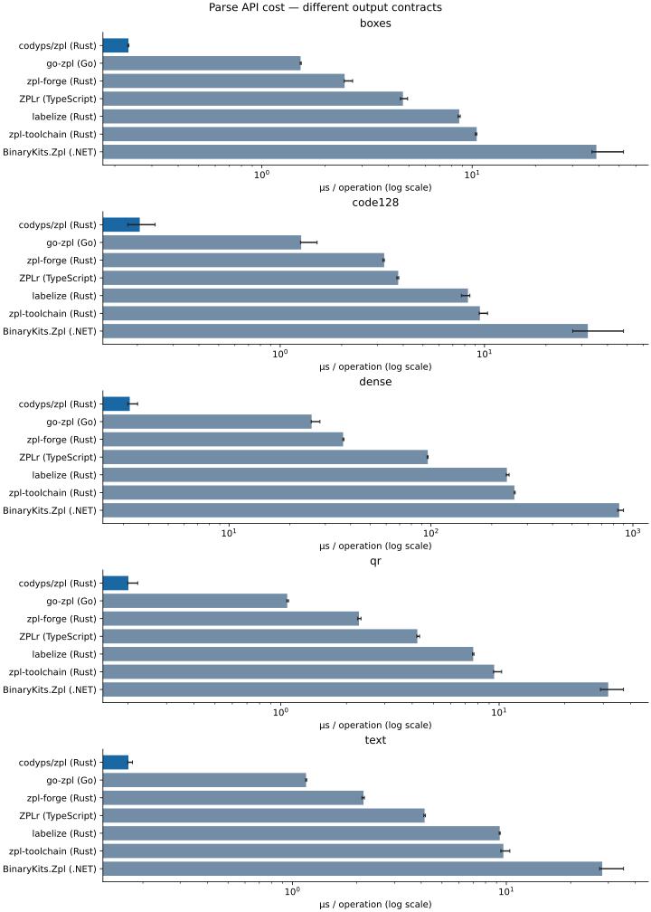
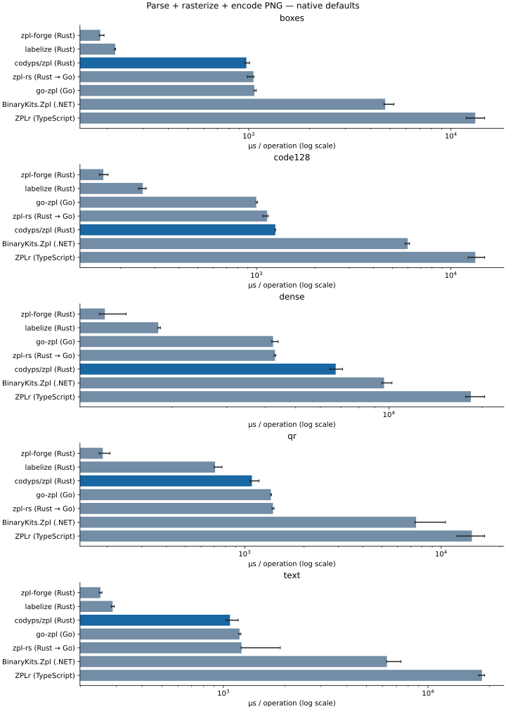
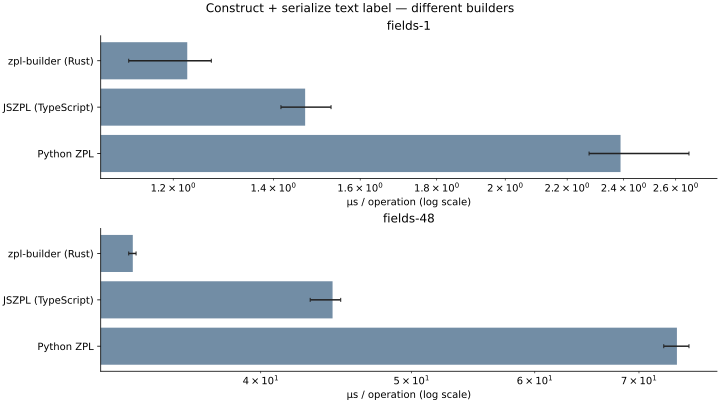
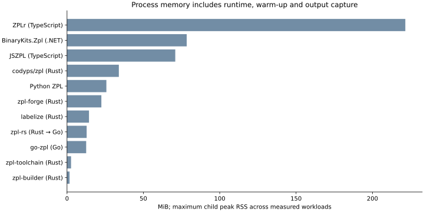
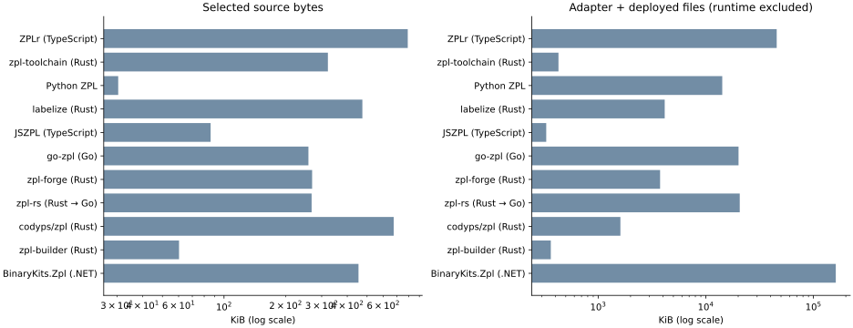

# ZPL library benchmark

Generated by [`benchmarks/report.py`](../../benchmarks/report.py). [Methodology and reproduction](../../benchmarks/README.md) · [Capabilities and selection](capabilities.md) · [Commands and arguments](command-support.md) · [Compare printer and library images](accuracy/comparisons/README.md) · [Raw measurements](results.json).

Measured **2026-09-20T17:55:39Z**, `macOS-26.6.2-x86_64-i386-64bit-Mach-O`, `x86_64`. codyps/zpl revision `0687b981f20b9ca9ac0f25885c6679613b83902f`; working tree dirty: `True`. 5 fresh processes per cell, ≥250 ms and ≥3 warm-up operations per process; calibrated batches target 0.2 s.

These are API costs on synthetic labels, **not a universal speed ranking or printer-fidelity certification**. Streaming framing, AST parsing and scene construction perform different work. PNG encoders, fonts, antialiasing and compression use library defaults. Builders construct labels and cannot substitute for a renderer. No network/printer calls are timed.

## Findings from this run

- `parse` / `text`: codyps/zpl (Rust) has the lowest measured median (0.22 µs); the range across successful adapters is 139.2×. This comparison is limited by the contracts above.

- `png` / `text`: zpl-forge (Rust) has the lowest measured median (310.47 µs); the range across successful adapters is 63.9×. This comparison is limited by the contracts above.

- `generate` / `fields-48`: zpl-builder (Rust) has the lowest measured median (28.26 µs); the range across successful adapters is 3.5×. This comparison is limited by the contracts above.

- 76 successful cells; 0 failed cells. Failed cells are excluded from timing plots and retained below.

codyps/zpl versus the lowest-latency other PNG adapter for each fixture (ratio below 1 means codyps/zpl was faster):

| Fixture | codyps/zpl µs | Lowest other median | Other µs | This / other |
| --- | --- | --- | --- | --- |
| boxes | 1265.4 | labelize (Rust) | 203.9 | 6.21× |
| code128 | 1372.1 | zpl-forge (Rust) | 235.5 | 5.83× |
| dense | 7223.4 | zpl-forge (Rust) | 1620.4 | 4.46× |
| qr | 1460.3 | zpl-forge (Rust) | 264.1 | 5.53× |
| text | 1533.6 | zpl-forge (Rust) | 310.5 | 4.94× |

The parser result and PNG result should be read separately: a cheap command framer does not imply a cheap rasterizer or PNG encoder. For identical geometry, the boxes row is the strongest correctness-controlled comparison here; text and barcode renderings can differ.

## Capabilities exercised

PNG checks require a decodable 400×300 image with both light and dark pixels. Only `boxes` has an exact geometric oracle; text/barcode checks establish nonblank output, **not correct content or decodability**. Inspect the captured PNGs before choosing a renderer. A successful parse means the API completed, not that it recognized or preserved every command.

| Library | boxes | text | code128 | qr | dense |
| --- | --- | --- | --- | --- | --- |
| codyps/zpl (Rust) | [0 pixel differences](samples/codyps-zpl-png-boxes.png) | [PNG/nonblank](samples/codyps-zpl-png-text.png) | [PNG/nonblank](samples/codyps-zpl-png-code128.png) | [PNG/nonblank](samples/codyps-zpl-png-qr.png) | [PNG/nonblank](samples/codyps-zpl-png-dense.png) |
| zpl-forge (Rust) | [0 pixel differences](samples/forge-png-boxes.png) | [PNG/nonblank](samples/forge-png-text.png) | [PNG/nonblank](samples/forge-png-code128.png) | [PNG/nonblank](samples/forge-png-qr.png) | [PNG/nonblank](samples/forge-png-dense.png) |
| labelize (Rust) | [0 pixel differences](samples/labelize-png-boxes.png) | [PNG/nonblank](samples/labelize-png-text.png) | [PNG/nonblank](samples/labelize-png-code128.png) | [PNG/nonblank](samples/labelize-png-qr.png) | [PNG/nonblank](samples/labelize-png-dense.png) |
| zpl-rs (Rust → Go) | [0 pixel differences](samples/ffi-png-boxes.png) | [PNG/nonblank](samples/ffi-png-text.png) | [PNG/nonblank](samples/ffi-png-code128.png) | [PNG/nonblank](samples/ffi-png-qr.png) | [PNG/nonblank](samples/ffi-png-dense.png) |
| go-zpl (Go) | [0 pixel differences](samples/go-png-boxes.png) | [PNG/nonblank](samples/go-png-text.png) | [PNG/nonblank](samples/go-png-code128.png) | [PNG/nonblank](samples/go-png-qr.png) | [PNG/nonblank](samples/go-png-dense.png) |
| BinaryKits.Zpl (.NET) | [0 pixel differences](samples/binarykits-png-boxes.png) | [PNG/nonblank](samples/binarykits-png-text.png) | [PNG/nonblank](samples/binarykits-png-code128.png) | [PNG/nonblank](samples/binarykits-png-qr.png) | [PNG/nonblank](samples/binarykits-png-dense.png) |
| ZPLr (TypeScript) | [0 pixel differences](samples/zplr-png-boxes.png) | [PNG/nonblank](samples/zplr-png-text.png) | [PNG/nonblank](samples/zplr-png-code128.png) | [PNG/nonblank](samples/zplr-png-qr.png) | [PNG/nonblank](samples/zplr-png-dense.png) |

## PARSE measurements

| Library | Fixture | Median µs | Min–max µs | Peak RSS MiB | Batch iterations |
| --- | --- | --- | --- | --- | --- |
| codyps/zpl (Rust) | boxes | 0.291 | 0.282–0.305 | 0.95 | 520833 |
| go-zpl (Go) | boxes | 1.597 | 1.587–1.600 | 10.41 | 127877 |
| zpl-forge (Rust) | boxes | 3.378 | 3.355–3.462 | 1.48 | 56465 |
| ZPLr (TypeScript) | boxes | 5.862 | 5.561–6.103 | 85.26 | 11015 |
| labelize (Rust) | boxes | 5.947 | 5.707–6.398 | 3.03 | 35945 |
| zpl-toolchain (Rust) | boxes | 8.242 | 8.219–8.644 | 1.43 | 24873 |
| BinaryKits.Zpl (.NET) | boxes | 41.342 | 41.165–44.918 | 48.13 | 4728 |
| codyps/zpl (Rust) | code128 | 0.246 | 0.237–0.258 | 0.98 | 531915 |
| go-zpl (Go) | code128 | 1.409 | 1.398–1.527 | 10.28 | 138985 |
| zpl-forge (Rust) | code128 | 3.644 | 3.570–3.734 | 1.50 | 53490 |
| labelize (Rust) | code128 | 5.321 | 5.252–5.630 | 2.92 | 37857 |
| ZPLr (TypeScript) | code128 | 5.337 | 5.245–5.427 | 83.84 | 12838 |
| zpl-toolchain (Rust) | code128 | 7.030 | 6.984–7.223 | 1.39 | 27598 |
| BinaryKits.Zpl (.NET) | code128 | 39.007 | 36.979–39.617 | 47.93 | 3407 |
| codyps/zpl (Rust) | dense | 4.494 | 4.460–4.608 | 0.93 | 44474 |
| go-zpl (Go) | dense | 32.530 | 31.360–36.194 | 10.16 | 6862 |
| zpl-forge (Rust) | dense | 36.737 | 35.595–39.558 | 2.39 | 5806 |
| ZPLr (TypeScript) | dense | 122.235 | 107.938–134.966 | 93.50 | 1861 |
| zpl-toolchain (Rust) | dense | 150.912 | 149.883–156.784 | 2.63 | 1325 |
| labelize (Rust) | dense | 199.927 | 197.902–200.325 | 3.70 | 1039 |
| BinaryKits.Zpl (.NET) | dense | 1163.911 | 1025.925–2135.689 | 51.21 | 191 |
| codyps/zpl (Rust) | qr | 0.217 | 0.216–0.308 | 0.94 | 668896 |
| go-zpl (Go) | qr | 1.646 | 1.432–1.691 | 10.46 | 116822 |
| zpl-forge (Rust) | qr | 2.809 | 2.768–2.833 | 1.53 | 64412 |
| labelize (Rust) | qr | 4.823 | 4.807–4.950 | 2.96 | 43450 |
| ZPLr (TypeScript) | qr | 4.960 | 4.878–5.074 | 84.45 | 12767 |
| zpl-toolchain (Rust) | qr | 10.320 | 9.472–11.298 | 1.41 | 16507 |
| BinaryKits.Zpl (.NET) | qr | 35.517 | 33.207–36.246 | 48.47 | 5618 |
| codyps/zpl (Rust) | text | 0.223 | 0.222–0.234 | 0.91 | 636943 |
| go-zpl (Go) | text | 1.521 | 1.481–1.863 | 10.93 | 131320 |
| zpl-forge (Rust) | text | 2.700 | 2.655–2.743 | 1.50 | 73584 |
| ZPLr (TypeScript) | text | 4.977 | 4.805–5.260 | 84.90 | 6194 |
| zpl-toolchain (Rust) | text | 6.124 | 6.079–6.180 | 1.41 | 33223 |
| labelize (Rust) | text | 6.255 | 6.225–6.397 | 2.96 | 31476 |
| BinaryKits.Zpl (.NET) | text | 31.020 | 30.668–32.372 | 47.93 | 5797 |

## PNG measurements

| Library | Fixture | Median µs | Min–max µs | Peak RSS MiB | Batch iterations |
| --- | --- | --- | --- | --- | --- |
| labelize (Rust) | boxes | 203.906 | 200.344–206.638 | 11.71 | 528 |
| zpl-forge (Rust) | boxes | 276.906 | 251.687–301.689 | 22.49 | 813 |
| go-zpl (Go) | boxes | 1158.499 | 1142.725–1167.552 | 12.41 | 163 |
| codyps/zpl (Rust) | boxes | 1265.399 | 1236.791–1317.562 | 10.52 | 165 |
| zpl-rs (Rust → Go) | boxes | 1409.248 | 1340.851–1713.878 | 12.78 | 146 |
| BinaryKits.Zpl (.NET) | boxes | 7467.841 | 7127.637–7974.426 | 73.67 | 27 |
| ZPLr (TypeScript) | boxes | 15579.598 | 15062.856–16450.865 | 203.29 | 12 |
| zpl-forge (Rust) | code128 | 235.518 | 222.813–247.127 | 21.01 | 978 |
| labelize (Rust) | code128 | 305.752 | 295.399–310.189 | 14.38 | 703 |
| zpl-rs (Rust → Go) | code128 | 1212.791 | 1178.111–1264.415 | 12.76 | 177 |
| go-zpl (Go) | code128 | 1300.608 | 1297.752–1368.388 | 11.94 | 174 |
| codyps/zpl (Rust) | code128 | 1372.055 | 1362.729–1380.963 | 11.99 | 150 |
| BinaryKits.Zpl (.NET) | code128 | 8745.526 | 8433.083–10320.852 | 75.32 | 23 |
| ZPLr (TypeScript) | code128 | 21365.901 | 19286.024–21507.235 | 201.73 | 10 |
| zpl-forge (Rust) | dense | 1620.373 | 1596.570–1651.021 | 17.29 | 114 |
| labelize (Rust) | dense | 2286.275 | 2233.769–2512.601 | 12.94 | 93 |
| zpl-rs (Rust → Go) | dense | 4734.242 | 4656.741–4839.200 | 12.60 | 38 |
| go-zpl (Go) | dense | 4835.326 | 4643.171–5079.272 | 12.08 | 42 |
| codyps/zpl (Rust) | dense | 7223.431 | 6852.412–8119.115 | 33.94 | 14 |
| BinaryKits.Zpl (.NET) | dense | 14334.207 | 14191.313–15518.973 | 71.91 | 15 |
| ZPLr (TypeScript) | dense | 49754.052 | 44311.425–57757.952 | 187.97 | 4 |
| zpl-forge (Rust) | qr | 264.132 | 256.702–313.379 | 21.41 | 640 |
| labelize (Rust) | qr | 688.099 | 662.421–704.799 | 11.42 | 293 |
| codyps/zpl (Rust) | qr | 1460.254 | 1457.214–1485.263 | 12.25 | 142 |
| go-zpl (Go) | qr | 1672.481 | 1630.889–1781.502 | 12.54 | 129 |
| zpl-rs (Rust → Go) | qr | 1860.683 | 1789.649–1938.929 | 12.85 | 117 |
| BinaryKits.Zpl (.NET) | qr | 10517.455 | 9570.532–15609.064 | 78.38 | 22 |
| ZPLr (TypeScript) | qr | 17801.866 | 17005.595–19017.421 | 201.55 | 11 |
| zpl-forge (Rust) | text | 310.472 | 292.142–334.020 | 21.65 | 591 |
| labelize (Rust) | text | 374.330 | 353.455–430.328 | 13.48 | 338 |
| codyps/zpl (Rust) | text | 1533.598 | 1523.379–1569.397 | 24.83 | 133 |
| go-zpl (Go) | text | 1846.048 | 1824.027–2500.835 | 11.97 | 69 |
| zpl-rs (Rust → Go) | text | 2114.416 | 1903.878–2673.416 | 12.49 | 151 |
| BinaryKits.Zpl (.NET) | text | 7364.078 | 7184.119–7388.181 | 75.23 | 27 |
| ZPLr (TypeScript) | text | 19848.558 | 17856.103–21029.791 | 221.54 | 7 |

## GENERATE measurements

| Library | Fixture | Median µs | Min–max µs | Peak RSS MiB | Batch iterations |
| --- | --- | --- | --- | --- | --- |
| zpl-builder (Rust) | fields-1 | 0.963 | 0.943–1.486 | 1.11 | 199005 |
| JSZPL (TypeScript) | fields-1 | 1.662 | 1.591–1.763 | 66.60 | 12538 |
| Python ZPL | fields-1 | 3.123 | 3.084–3.353 | 25.77 | 23335 |
| zpl-builder (Rust) | fields-48 | 28.259 | 27.380–28.337 | 1.66 | 7495 |
| JSZPL (TypeScript) | fields-48 | 58.519 | 55.238–61.262 | 70.89 | 2070 |
| Python ZPL | fields-48 | 97.868 | 96.167–98.988 | 25.01 | 1960 |

## Memory and code size

RSS is the maximum for each fresh child, including managed runtimes, native libraries, warm-up, and one output write. It is not allocation volume or retained library heap. Source counts are physical lines/bytes in selected implementation trees; Rust tests inside src, comments and generated tables are included. External dependencies and font assets are excluded from source counts. Artifact size includes the adapter and its deployed dependency files; shared system runtimes are excluded. See the methodology for source roots and language-specific accounting; neither column measures equivalent functionality.

| Library | Source files | Physical lines | Source KiB | Artifact KiB |
| --- | --- | --- | --- | --- |
| codyps/zpl (Rust) | 83 | 16928 | 674.5 | 1609.2 |
| zpl-toolchain (Rust) | 28 | 9035 | 321.7 | 427.7 |
| zpl-forge (Rust) | 19 | 7947 | 269.4 | 3761.5 |
| labelize (Rust) | 79 | 13666 | 474.1 | 4152.6 |
| zpl-builder (Rust) | 4 | 1991 | 60.3 | 363.0 |
| zpl-rs (Rust → Go) | 35 | 9592 | 267.9 | 20680.3 |
| go-zpl (Go) | 34 | 9237 | 258.4 | 20151.5 |
| BinaryKits.Zpl (.NET) | 180 | 12594 | 453.9 | 161436.0 |
| Python ZPL | 4 | 881 | 30.4 | 14222.6 |
| JSZPL (TypeScript) | 36 | 2206 | 86.0 | 329.2 |
| ZPLr (TypeScript) | 46 | 19220 | 790.0 | 45601.6 |

## Environment and provenance

| Property | Value |
| --- | --- |
| platform | macOS-26.6.2-x86_64-i386-64bit-Mach-O |
| machine | x86_64 |
| cpu | Command '['sysctl', '-n', 'machdep.cpu.brand_string']' returned non-zero exit status 1. |
| logical_cpus | 16 |
| rust | rustc 1.99.0-beta.4 (948ec4e1e 2026-09-04) |
| go | go version go1.26.5 darwin/amd64 |
| node | v24.21.0 |
| python | 3.14.4 |
| dotnet | Command '['/Volumes/dev/p/zpl-comparison/benchmarks/_work/dotnet-runtime/dotnet', '--version']' returned non-zero exit status 145. |

All package lock hashes, source revisions, fixture hashes, raw batch timings, and output hashes are saved in [results.json](results.json). Run the same locked suite on the same idle machine to compare revisions. GitHub-hosted runner measurements should be treated as trends, not stable performance gates.
