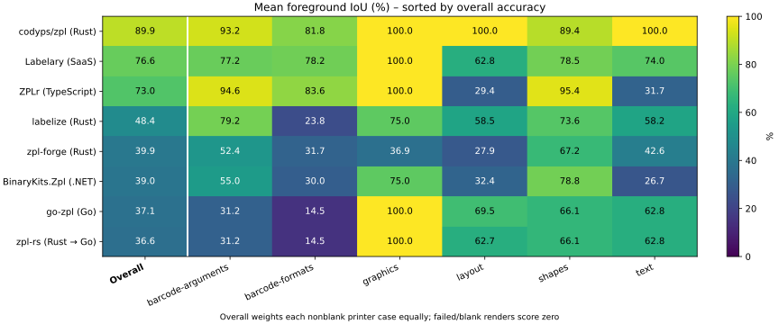

# Accuracy against a real Zebra printer

This overview includes every printer IoU comparison and image difference across all accuracy corpora. Each tested case has a page in [comparisons/cases](comparisons/cases/) with printer, renderer, and difference images or explicit failure/unscored evidence.

## Measurement inventory

Counts include failed, blank, excluded, and unavailable-reference cases. Scored attempts include failures scored zero; image differences count actual image comparisons, including blank-reference comparisons whose IoU is excluded from scored means. Labelary is a renderer against the same printer baseline, not an additional accuracy corpus.

| Corpus | Cases | Categories | Attempts | Scored attempts | Image differences | Measured UTC |
| --- | --- | --- | --- | --- | --- | --- |
| [Argument and archived barcode accuracy](#argument-and-archived-barcode-details) | 133 | 6 | 1064 | 1064 | 1052 | 2026-09-21T15:39:32Z |
| [Feature conformance](comparisons/features/README.md) | 598 | 38 | 4784 | 4512 | 4484 | 2026-09-21T15:50:59Z |
| [External examples](comparisons/external/README.md) | 8 | 8 | 64 | 48 | 47 | 2026-09-21T15:35:11Z |
| [Font-free layout](comparisons/layout/README.md) | 20 | 1 | 140 | 140 | 140 | 2026-09-21T15:36:38Z |

## Browse by library

| Library | Argument and archived barcode accuracy | Feature conformance | External examples | Font-free layout |
| --- | --- | --- | --- | --- |
| binarykits | [Compare images](comparisons/libraries/binarykits.md) | [Compare images](comparisons/features/libraries/binarykits.md) | [Compare images](comparisons/external/libraries/binarykits.md) | [Compare images](comparisons/layout/libraries/binarykits.md) |
| codyps-zpl | [Compare images](comparisons/libraries/codyps-zpl.md) | [Compare images](comparisons/features/libraries/codyps-zpl.md) | [Compare images](comparisons/external/libraries/codyps-zpl.md) | [Compare images](comparisons/layout/libraries/codyps-zpl.md) |
| ffi | [Compare images](comparisons/libraries/ffi.md) | [Compare images](comparisons/features/libraries/ffi.md) | [Compare images](comparisons/external/libraries/ffi.md) | [Compare images](comparisons/layout/libraries/ffi.md) |
| forge | [Compare images](comparisons/libraries/forge.md) | [Compare images](comparisons/features/libraries/forge.md) | [Compare images](comparisons/external/libraries/forge.md) | [Compare images](comparisons/layout/libraries/forge.md) |
| go | [Compare images](comparisons/libraries/go.md) | [Compare images](comparisons/features/libraries/go.md) | [Compare images](comparisons/external/libraries/go.md) | [Compare images](comparisons/layout/libraries/go.md) |
| labelary | [Compare images](comparisons/libraries/labelary.md) | [Compare images](comparisons/features/libraries/labelary.md) | [Compare images](comparisons/external/libraries/labelary.md) | N/A |
| labelize | [Compare images](comparisons/libraries/labelize.md) | [Compare images](comparisons/features/libraries/labelize.md) | [Compare images](comparisons/external/libraries/labelize.md) | [Compare images](comparisons/layout/libraries/labelize.md) |
| zplr | [Compare images](comparisons/libraries/zplr.md) | [Compare images](comparisons/features/libraries/zplr.md) | [Compare images](comparisons/external/libraries/zplr.md) | [Compare images](comparisons/layout/libraries/zplr.md) |

## Every category: mean foreground IoU

Each cell shows mean IoU and its scored denominator in parentheses. Corpora remain separate because their sampling overlaps. N/A means the renderer was not tested in that corpus; unscored means no nonblank printer baseline. The original heatmap and Overall metric below cover only the argument/barcode corpus, not all corpora.

| Corpus | Category | Cases | binarykits | codyps-zpl | ffi | forge | go | labelary | labelize | zplr |
| --- | --- | --- | --- | --- | --- | --- | --- | --- | --- | --- |
| Argument and archived barcode accuracy | barcode-arguments | 25 | 55.04% (25) | 93.25% (25) | 31.16% (25) | 52.35% (25) | 31.16% (25) | 77.18% (25) | 79.15% (25) | 94.60% (25) |
| Argument and archived barcode accuracy | barcode-formats | 60 | 28.71% (60) | 99.62% (60) | 14.36% (60) | 31.53% (60) | 14.36% (60) | 76.90% (60) | 23.47% (60) | 83.84% (60) |
| Argument and archived barcode accuracy | graphics | 4 | 75.00% (4) | 100.00% (4) | 100.00% (4) | 36.86% (4) | 100.00% (4) | 100.00% (4) | 75.00% (4) | 100.00% (4) |
| Argument and archived barcode accuracy | layout | 11 | 31.49% (11) | 100.00% (11) | 62.65% (11) | 27.92% (11) | 69.52% (11) | 62.76% (11) | 58.49% (11) | 29.41% (11) |
| Argument and archived barcode accuracy | shapes | 9 | 78.78% (9) | 100.00% (9) | 66.09% (9) | 67.23% (9) | 66.09% (9) | 78.54% (9) | 73.57% (9) | 95.38% (9) |
| Argument and archived barcode accuracy | text | 24 | 24.37% (24) | 100.00% (24) | 62.75% (24) | 42.60% (24) | 62.75% (24) | 73.99% (24) | 58.21% (24) | 31.67% (24) |
| Feature conformance | barcode-arguments | 70 | 72.05% (66) | 95.82% (66) | 31.81% (66) | 61.51% (66) | 31.81% (66) | 82.03% (66) | 80.55% (66) | 84.99% (66) |
| Feature conformance | barcode-families | 60 | 11.86% (60) | 33.65% (60) | 8.68% (60) | 16.16% (60) | 8.68% (60) | 28.06% (60) | 10.61% (60) | 31.94% (60) |
| Feature conformance | baseline-barcode-arguments | 25 | 55.04% (25) | 56.21% (25) | 31.16% (25) | 52.35% (25) | 31.16% (25) | 55.88% (25) | 55.00% (25) | 55.90% (25) |
| Feature conformance | baseline-graphics | 4 | 75.00% (4) | 100.00% (4) | 100.00% (4) | 36.86% (4) | 100.00% (4) | 100.00% (4) | 75.00% (4) | 100.00% (4) |
| Feature conformance | baseline-layout | 11 | 31.49% (11) | 100.00% (11) | 62.65% (11) | 27.92% (11) | 69.52% (11) | 62.76% (11) | 58.49% (11) | 29.41% (11) |
| Feature conformance | baseline-shapes | 9 | 78.78% (9) | 100.00% (9) | 66.09% (9) | 67.23% (9) | 66.09% (9) | 78.54% (9) | 73.57% (9) | 95.38% (9) |
| Feature conformance | baseline-text | 24 | 24.37% (24) | 100.00% (24) | 62.75% (24) | 42.60% (24) | 62.75% (24) | 73.99% (24) | 58.21% (24) | 31.67% (24) |
| Feature conformance | clipping | 5 | 100.00% (3) | 100.00% (3) | 100.00% (3) | 100.00% (3) | 100.00% (3) | 100.00% (3) | 100.00% (3) | 100.00% (3) |
| Feature conformance | compact-barcodes | 7 | 64.34% (7) | 75.02% (7) | 38.24% (7) | 52.17% (7) | 38.24% (7) | 84.91% (7) | 69.86% (7) | 85.15% (7) |
| Feature conformance | compact-compositing | 2 | 97.15% (2) | 100.00% (2) | 97.61% (2) | 97.31% (2) | 97.61% (2) | 98.05% (2) | 96.45% (2) | 97.88% (2) |
| Feature conformance | compact-fonts | 5 | 29.76% (5) | 100.00% (5) | 29.37% (5) | 32.80% (5) | 29.37% (5) | 60.93% (5) | 28.95% (5) | 35.51% (5) |
| Feature conformance | compact-layout | 4 | 18.97% (4) | 100.00% (4) | 34.42% (4) | 36.54% (4) | 34.42% (4) | 47.25% (4) | 41.71% (4) | 36.77% (4) |
| Feature conformance | compact-shapes | 6 | 79.35% (6) | 100.00% (6) | 77.57% (6) | 75.26% (6) | 77.57% (6) | 79.06% (6) | 63.94% (6) | 89.48% (6) |
| Feature conformance | compositing | 5 | 94.98% (5) | 100.00% (5) | 98.94% (5) | 98.09% (5) | 98.94% (5) | 98.38% (5) | 97.84% (5) | 95.91% (5) |
| Feature conformance | encoding | 28 | 18.73% (25) | 76.00% (25) | 48.28% (25) | 27.50% (25) | 48.28% (25) | 70.22% (25) | 48.85% (25) | 23.69% (25) |
| Feature conformance | fonts | 78 | 16.16% (78) | 99.99% (78) | 32.98% (78) | 29.00% (78) | 32.98% (78) | 60.86% (78) | 32.58% (78) | 23.65% (78) |
| Feature conformance | graphics | 14 | 93.75% (12) | 100.00% (12) | 100.00% (12) | 78.57% (12) | 100.00% (12) | 100.00% (12) | 85.42% (12) | 100.00% (12) |
| Feature conformance | lexical | 3 | 25.74% (3) | 33.33% (3) | 45.81% (3) | 39.82% (3) | 45.81% (3) | 84.61% (3) | 40.22% (3) | 23.23% (3) |
| Feature conformance | metamorphic | 5 | 53.65% (5) | 100.00% (5) | 57.87% (5) | 42.70% (5) | 77.60% (5) | 82.15% (5) | 73.90% (5) | 67.17% (5) |
| Feature conformance | negative | 14 | unscored (0) | unscored (0) | unscored (0) | unscored (0) | unscored (0) | unscored (0) | unscored (0) | unscored (0) |
| Feature conformance | position | 29 | 28.95% (29) | 100.00% (29) | 48.20% (29) | 8.21% (29) | 51.42% (29) | 73.05% (29) | 46.08% (29) | 36.06% (29) |
| Feature conformance | printer-barcode-defaults | 20 | 58.17% (20) | 100.00% (20) | 28.73% (20) | 100.00% (20) | 28.73% (20) | 100.00% (20) | 100.00% (20) | 100.00% (20) |
| Feature conformance | printer-box-minimum | 3 | 98.50% (3) | 100.00% (3) | 40.84% (3) | 0.00% (3) | 40.84% (3) | 98.69% (3) | 97.33% (3) | 58.45% (3) |
| Feature conformance | printer-character-remap | 3 | 65.68% (3) | 0.00% (3) | 53.45% (3) | 0.00% (3) | 53.45% (3) | 87.71% (3) | 80.38% (3) | 61.99% (3) |
| Feature conformance | printer-code93-controls | 3 | 48.08% (3) | 0.00% (3) | 10.02% (3) | 48.20% (3) | 10.02% (3) | 86.83% (3) | 0.67% (3) | 77.47% (3) |
| Feature conformance | printer-databar-retail | 15 | 5.51% (10) | 100.00% (10) | 8.78% (10) | 8.40% (10) | 8.78% (10) | 60.00% (10) | 7.99% (10) | 100.00% (10) |
| Feature conformance | printer-field-block-rounding | 6 | 21.40% (6) | 100.00% (6) | 27.89% (6) | 37.78% (6) | 27.89% (6) | 65.66% (6) | 36.11% (6) | 25.27% (6) |
| Feature conformance | printer-qr-module-state | 3 | 29.75% (3) | 33.91% (3) | 29.43% (3) | 29.77% (3) | 29.43% (3) | 93.89% (3) | 34.48% (3) | 33.81% (3) |
| Feature conformance | printer-retail-caption-edges | 5 | 70.35% (5) | 79.18% (5) | 9.24% (5) | 41.09% (5) | 9.24% (5) | 84.71% (5) | 73.26% (5) | 70.34% (5) |
| Feature conformance | printer-retail-data | 9 | 15.35% (9) | 100.00% (9) | 10.27% (9) | 0.00% (9) | 10.27% (9) | 75.80% (9) | 0.00% (9) | 53.82% (9) |
| Feature conformance | serialization | 4 | 6.33% (4) | 100.00% (4) | 20.27% (4) | 9.64% (4) | 20.27% (4) | 61.57% (4) | 15.02% (4) | 25.78% (4) |
| Feature conformance | shapes | 46 | 74.39% (46) | 100.00% (46) | 52.12% (46) | 52.70% (46) | 52.12% (46) | 80.23% (46) | 61.77% (46) | 64.68% (46) |
| Feature conformance | state | 6 | 45.40% (6) | 100.00% (6) | 73.57% (6) | 60.58% (6) | 73.57% (6) | 87.46% (6) | 62.85% (6) | 54.01% (6) |
| Feature conformance | stress | 4 | 12.52% (4) | 100.00% (4) | 57.23% (4) | 50.70% (4) | 57.23% (4) | 56.22% (4) | 48.34% (4) | 49.01% (4) |
| Feature conformance | text-data | 10 | 17.08% (9) | 100.00% (9) | 52.88% (9) | 30.31% (9) | 52.88% (9) | 59.77% (9) | 26.15% (9) | 29.55% (9) |
| Feature conformance | text-layout | 45 | 11.71% (42) | 99.86% (42) | 26.42% (42) | 25.51% (42) | 26.42% (42) | 50.51% (42) | 19.84% (42) | 31.00% (42) |
| Feature conformance | torture | 4 | 72.21% (4) | 97.68% (4) | 64.11% (4) | 65.24% (4) | 64.11% (4) | 84.31% (4) | 66.97% (4) | 77.63% (4) |
| Feature conformance | transforms | 4 | 68.51% (4) | 100.00% (4) | 91.40% (4) | 82.67% (4) | 91.40% (4) | 21.78% (4) | 42.54% (4) | 18.91% (4) |
| External examples | asset | 1 | 67.90% (1) | 82.12% (1) | 72.82% (1) | 43.01% (1) | 72.82% (1) | 75.83% (1) | 71.67% (1) | 71.38% (1) |
| External examples | compliance | 1 | 30.03% (1) | 34.24% (1) | 26.35% (1) | 30.25% (1) | 26.35% (1) | 34.51% (1) | 34.32% (1) | 34.85% (1) |
| External examples | printer-configuration | 1 | unscored (0) | unscored (0) | unscored (0) | unscored (0) | unscored (0) | unscored (0) | unscored (0) | unscored (0) |
| External examples | product | 1 | 23.40% (1) | 29.34% (1) | 20.23% (1) | 23.26% (1) | 20.23% (1) | 30.27% (1) | 29.82% (1) | 28.70% (1) |
| External examples | retail | 1 | 27.35% (1) | 0.00% (1) | 13.79% (1) | 28.09% (1) | 13.79% (1) | 27.90% (1) | 28.34% (1) | 28.08% (1) |
| External examples | shipping | 1 | 25.92% (1) | 31.70% (1) | 25.77% (1) | 27.76% (1) | 25.77% (1) | 32.48% (1) | 32.25% (1) | 21.01% (1) |
| External examples | stateful | 1 | unscored (0) | unscored (0) | unscored (0) | unscored (0) | unscored (0) | unscored (0) | unscored (0) | unscored (0) |
| External examples | warehouse | 1 | 35.73% (1) | 45.07% (1) | 30.07% (1) | 37.76% (1) | 30.07% (1) | 45.36% (1) | 43.57% (1) | 38.10% (1) |
| Font-free layout | font-free-layout | 20 | 79.44% (20) | 100.00% (20) | 69.32% (20) | 69.32% (20) | 75.20% (20) | N/A | 77.13% (20) | 70.98% (20) |

<!-- argument-barcode-detail-start -->

## Argument and archived barcode details

Each case below links to its printer preview, library renders and difference images. [Feature fixtures and differences](comparisons/features/README.md) use the same metric and a separate aggregate.

Reference: **ZTC ZD621-203dpi ZPL, firmware V93.21.33Z**, 203 dpi. Fresh captures: 2026-09-18T23:34:22Z. Library comparisons: 2026-09-21T15:39:32Z.

Local renders are cached per case and library; the comparison date is the latest execution in this snapshot. Per-result `observed_utc` values retain execution/capture dates.

[Command/argument support](../command-support.md) · [Run/reproduce](../../../benchmarks/accuracy/README.md) · [Raw measurements](results.json).

**This measures fidelity to the printer’s HTTP preview raster, not physical printed/scanned labels.** Every renderer receives the exact same captured ZPL. No scaling, alignment search, cropping, or replacement by another renderer’s output. Different canvas sizes are placed at the same origin on a white union canvas, with the size mismatch reported separately.

133 cases, 133 with nonblank printer references, 8 renderer adapters. The repeated first/last capture matched exactly. Parser-only zpl-toolchain and the three builders (Rust zpl-builder, Python ZPL, JSZPL) cannot render incoming ZPL: **N/A**, not an accuracy score of zero.

## How to read the score

**Foreground IoU = matching black pixels / pixels black in either image.** It avoids making an empty label look accurate because most pixels are white. The fixed threshold is gray <128 after compositing transparency onto white. Missing and extra pixels, precision, recall and full-canvas mismatch are retained per cell in JSON. Errors and blank library output score zero for a nonblank printer reference; blank printer references are quarantined from scores. “Ink exact” permits only all-white canvas margins to differ; “strict exact” additionally requires identical dimensions.

The all-case mean weights each nonblank case equally, including unsupported cases. Shared-case mean uses the **117 cases** for which all 8 adapters returned nonblank rasters; it isolates a smaller common subset and is subject to selection bias. The corpus is broad but not representative of every deployment.

The chart’s Overall column is the mean over all nonblank printer cases, not an equal-weight mean of the group columns. Rows are sorted highest to lowest by Overall.

| Library | Nonblank / 133 | Ink exact | Strict exact | Errors | Blank | All-case mean IoU | Fresh argument IoU | Archived barcode IoU | Shared-case mean IoU |
| --- | --- | --- | --- | --- | --- | --- | --- | --- | --- |
| codyps/zpl (Rust) | 133 | 127 | 127 | 0 | 0 | 98.56% | 97.69% | 99.62% | 98.72% |
| Labelary (SaaS) | 131 | 56 | 56 | 0 | 2 | 76.06% | 75.37% | 76.90% | 80.83% |
| ZPLr (TypeScript) | 133 | 61 | 61 | 0 | 0 | 73.21% | 64.48% | 83.84% | 73.83% |
| labelize (Rust) | 128 | 24 | 24 | 5 | 0 | 48.04% | 68.24% | 23.47% | 49.98% |
| zpl-forge (Rust) | 124 | 22 | 22 | 7 | 2 | 39.72% | 46.45% | 31.53% | 44.68% |
| BinaryKits.Zpl (.NET) | 133 | 26 | 26 | 0 | 0 | 37.89% | 45.43% | 28.71% | 38.84% |
| go-zpl (Go) | 133 | 16 | 16 | 0 | 0 | 36.89% | 55.41% | 14.36% | 37.07% |
| zpl-rs (Rust → Go) | 133 | 16 | 16 | 0 | 0 | 36.32% | 54.37% | 14.36% | 36.42% |

Inspect the difference images to distinguish placement, font metrics, omitted fields and symbol-pattern differences. IoU compares the original coordinates without aligning away placement errors.

## Limits and provenance

The 60 archived barcode cases were used during development of this repository, so they are **not an independent holdout**. Fresh probes cover multiple font sizes (including codyps/zpl’s native 32-dot strike), other resident fonts, rotations, positioning, block alignment/indentation, colors, graphic encodings and barcode arguments. Argument combinations, payloads and sizes are finite samples, not proofs of full support. Different valid barcode encodings/masks may scan identically yet differ in pixels; this score measures visual agreement, not barcode validity. Captured fonts and preview behavior are specific to this device/firmware. No persistent device configuration, flash/font downloads, RFID operations or physical print jobs are exercised.

ZPLr and BinaryKits may use host font fallback; installed font availability can affect other hosts. The Go and Rust-FFI rows share the same renderer, so they are not independent implementations. A successful process or a recognized command is not evidence that its arguments were honored. Inspect the exact inputs and difference images.

Labelary is an eighth renderer replayed from hash-verified public-service PNG responses. The printer remains the baseline. [Capture timestamps and HTTP metadata](../labelary/README.md) identify the service snapshot; API v1 and nginx versions are not renderer versions.

## Per-case accuracy and argument comparison

Click any result to compare the printer preview, library render and difference together, or inspect a render error. Difference colors: black=agreement, magenta=printer only, cyan=library only. Input links show the exact argument values.

### barcode-arguments

| Case | Command | Argument values | codyps/zpl (Rust) | labelize (Rust) | zpl-forge (Rust) | go-zpl (Go) | zpl-rs (Rust → Go) | BinaryKits.Zpl (.NET) | ZPLr (TypeScript) | Labelary (SaaS) |
| --- | --- | --- | --- | --- | --- | --- | --- | --- | --- | --- |
| [code39-ratio-2](../../../benchmarks/accuracy/reference/code39-ratio-2.zpl) · [printer](../../../benchmarks/accuracy/reference/code39-ratio-2.png) | ^BY | w=2,ratio=2,height=60 | [100.0%](comparisons/cases/argument-code39-ratio-2.md#codyps-zpl) | [100.0%](comparisons/cases/argument-code39-ratio-2.md#labelize) | [100.0%](comparisons/cases/argument-code39-ratio-2.md#forge) | [9.0%](comparisons/cases/argument-code39-ratio-2.md#go) | [9.0%](comparisons/cases/argument-code39-ratio-2.md#ffi) | [100.0%](comparisons/cases/argument-code39-ratio-2.md#binarykits) | [100.0%](comparisons/cases/argument-code39-ratio-2.md#zplr) | [100.0%](comparisons/cases/argument-code39-ratio-2.md#labelary) |
| [code39-ratio-3](../../../benchmarks/accuracy/reference/code39-ratio-3.zpl) · [printer](../../../benchmarks/accuracy/reference/code39-ratio-3.png) | ^BY | w=2,ratio=3,height=60 | [100.0%](comparisons/cases/argument-code39-ratio-3.md#codyps-zpl) | [100.0%](comparisons/cases/argument-code39-ratio-3.md#labelize) | [100.0%](comparisons/cases/argument-code39-ratio-3.md#forge) | [7.8%](comparisons/cases/argument-code39-ratio-3.md#go) | [7.8%](comparisons/cases/argument-code39-ratio-3.md#ffi) | [100.0%](comparisons/cases/argument-code39-ratio-3.md#binarykits) | [100.0%](comparisons/cases/argument-code39-ratio-3.md#zplr) | [100.0%](comparisons/cases/argument-code39-ratio-3.md#labelary) |
| [code39-check-N](../../../benchmarks/accuracy/reference/code39-check-N.zpl) · [printer](../../../benchmarks/accuracy/reference/code39-check-N.png) | ^B3 | o=N,check=N,h=60,readable=N | [100.0%](comparisons/cases/argument-code39-check-N.md#codyps-zpl) | [100.0%](comparisons/cases/argument-code39-check-N.md#labelize) | [100.0%](comparisons/cases/argument-code39-check-N.md#forge) | [7.8%](comparisons/cases/argument-code39-check-N.md#go) | [7.8%](comparisons/cases/argument-code39-check-N.md#ffi) | [100.0%](comparisons/cases/argument-code39-check-N.md#binarykits) | [100.0%](comparisons/cases/argument-code39-check-N.md#zplr) | [100.0%](comparisons/cases/argument-code39-check-N.md#labelary) |
| [code39-check-Y](../../../benchmarks/accuracy/reference/code39-check-Y.zpl) · [printer](../../../benchmarks/accuracy/reference/code39-check-Y.png) | ^B3 | o=N,check=Y,h=60,readable=N | [100.0%](comparisons/cases/argument-code39-check-Y.md#codyps-zpl) | [84.0%](comparisons/cases/argument-code39-check-Y.md#labelize) | [84.0%](comparisons/cases/argument-code39-check-Y.md#forge) | [7.3%](comparisons/cases/argument-code39-check-Y.md#go) | [7.3%](comparisons/cases/argument-code39-check-Y.md#ffi) | [84.0%](comparisons/cases/argument-code39-check-Y.md#binarykits) | [100.0%](comparisons/cases/argument-code39-check-Y.md#zplr) | [100.0%](comparisons/cases/argument-code39-check-Y.md#labelary) |
| [code128-text-NN](../../../benchmarks/accuracy/reference/code128-text-NN.zpl) · [printer](../../../benchmarks/accuracy/reference/code128-text-NN.png) | ^BC | h=60,interpretation=N,above=N | [100.0%](comparisons/cases/argument-code128-text-NN.md#codyps-zpl) | [100.0%](comparisons/cases/argument-code128-text-NN.md#labelize) | [100.0%](comparisons/cases/argument-code128-text-NN.md#forge) | [100.0%](comparisons/cases/argument-code128-text-NN.md#go) | [100.0%](comparisons/cases/argument-code128-text-NN.md#ffi) | [100.0%](comparisons/cases/argument-code128-text-NN.md#binarykits) | [100.0%](comparisons/cases/argument-code128-text-NN.md#zplr) | [100.0%](comparisons/cases/argument-code128-text-NN.md#labelary) |
| [code128-text-YN](../../../benchmarks/accuracy/reference/code128-text-YN.zpl) · [printer](../../../benchmarks/accuracy/reference/code128-text-YN.png) | ^BC | h=60,interpretation=Y,above=N | [100.0%](comparisons/cases/argument-code128-text-YN.md#codyps-zpl) | [94.3%](comparisons/cases/argument-code128-text-YN.md#labelize) | [95.7%](comparisons/cases/argument-code128-text-YN.md#forge) | [91.7%](comparisons/cases/argument-code128-text-YN.md#go) | [91.7%](comparisons/cases/argument-code128-text-YN.md#ffi) | [94.5%](comparisons/cases/argument-code128-text-YN.md#binarykits) | [96.1%](comparisons/cases/argument-code128-text-YN.md#zplr) | [96.0%](comparisons/cases/argument-code128-text-YN.md#labelary) |
| [code128-text-YY](../../../benchmarks/accuracy/reference/code128-text-YY.zpl) · [printer](../../../benchmarks/accuracy/reference/code128-text-YY.png) | ^BC | h=60,interpretation=Y,above=Y | [100.0%](comparisons/cases/argument-code128-text-YY.md#codyps-zpl) | [91.6%](comparisons/cases/argument-code128-text-YY.md#labelize) | [92.3%](comparisons/cases/argument-code128-text-YY.md#forge) | [91.5%](comparisons/cases/argument-code128-text-YY.md#go) | [91.5%](comparisons/cases/argument-code128-text-YY.md#ffi) | [92.2%](comparisons/cases/argument-code128-text-YY.md#binarykits) | [96.1%](comparisons/cases/argument-code128-text-YY.md#zplr) | [96.0%](comparisons/cases/argument-code128-text-YY.md#labelary) |
| [code128-rotation-R](../../../benchmarks/accuracy/reference/code128-rotation-R.zpl) · [printer](../../../benchmarks/accuracy/reference/code128-rotation-R.png) | ^BC | o=R,h=60 | [100.0%](comparisons/cases/argument-code128-rotation-R.md#codyps-zpl) | [100.0%](comparisons/cases/argument-code128-rotation-R.md#labelize) | [100.0%](comparisons/cases/argument-code128-rotation-R.md#forge) | [8.7%](comparisons/cases/argument-code128-rotation-R.md#go) | [8.7%](comparisons/cases/argument-code128-rotation-R.md#ffi) | [100.0%](comparisons/cases/argument-code128-rotation-R.md#binarykits) | [100.0%](comparisons/cases/argument-code128-rotation-R.md#zplr) | [100.0%](comparisons/cases/argument-code128-rotation-R.md#labelary) |
| [code128-rotation-I](../../../benchmarks/accuracy/reference/code128-rotation-I.zpl) · [printer](../../../benchmarks/accuracy/reference/code128-rotation-I.png) | ^BC | o=I,h=60 | [100.0%](comparisons/cases/argument-code128-rotation-I.md#codyps-zpl) | [100.0%](comparisons/cases/argument-code128-rotation-I.md#labelize) | [100.0%](comparisons/cases/argument-code128-rotation-I.md#forge) | [36.4%](comparisons/cases/argument-code128-rotation-I.md#go) | [36.4%](comparisons/cases/argument-code128-rotation-I.md#ffi) | [100.0%](comparisons/cases/argument-code128-rotation-I.md#binarykits) | [100.0%](comparisons/cases/argument-code128-rotation-I.md#zplr) | [100.0%](comparisons/cases/argument-code128-rotation-I.md#labelary) |
| [code128-rotation-B](../../../benchmarks/accuracy/reference/code128-rotation-B.zpl) · [printer](../../../benchmarks/accuracy/reference/code128-rotation-B.png) | ^BC | o=B,h=60 | [100.0%](comparisons/cases/argument-code128-rotation-B.md#codyps-zpl) | [100.0%](comparisons/cases/argument-code128-rotation-B.md#labelize) | [100.0%](comparisons/cases/argument-code128-rotation-B.md#forge) | [11.9%](comparisons/cases/argument-code128-rotation-B.md#go) | [11.9%](comparisons/cases/argument-code128-rotation-B.md#ffi) | [100.0%](comparisons/cases/argument-code128-rotation-B.md#binarykits) | [100.0%](comparisons/cases/argument-code128-rotation-B.md#zplr) | [100.0%](comparisons/cases/argument-code128-rotation-B.md#labelary) |
| [code128-mode-N](../../../benchmarks/accuracy/reference/code128-mode-N.zpl) · [printer](../../../benchmarks/accuracy/reference/code128-mode-N.png) | ^BC | mode=N | [100.0%](comparisons/cases/argument-code128-mode-N.md#codyps-zpl) | [100.0%](comparisons/cases/argument-code128-mode-N.md#labelize) | [100.0%](comparisons/cases/argument-code128-mode-N.md#forge) | [100.0%](comparisons/cases/argument-code128-mode-N.md#go) | [100.0%](comparisons/cases/argument-code128-mode-N.md#ffi) | [100.0%](comparisons/cases/argument-code128-mode-N.md#binarykits) | [100.0%](comparisons/cases/argument-code128-mode-N.md#zplr) | [100.0%](comparisons/cases/argument-code128-mode-N.md#labelary) |
| [code128-mode-A](../../../benchmarks/accuracy/reference/code128-mode-A.zpl) · [printer](../../../benchmarks/accuracy/reference/code128-mode-A.png) | ^BC | mode=A | [100.0%](comparisons/cases/argument-code128-mode-A.md#codyps-zpl) | [100.0%](comparisons/cases/argument-code128-mode-A.md#labelize) | [32.5%](comparisons/cases/argument-code128-mode-A.md#forge) | [100.0%](comparisons/cases/argument-code128-mode-A.md#go) | [100.0%](comparisons/cases/argument-code128-mode-A.md#ffi) | [100.0%](comparisons/cases/argument-code128-mode-A.md#binarykits) | [100.0%](comparisons/cases/argument-code128-mode-A.md#zplr) | [100.0%](comparisons/cases/argument-code128-mode-A.md#labelary) |
| [qr-model-1](../../../benchmarks/accuracy/reference/qr-model-1.zpl) · [printer](../../../benchmarks/accuracy/reference/qr-model-1.png) | ^BQ | o=N,model=1,magnification=3,EC=L,mask=0 | [58.4%](comparisons/cases/argument-qr-model-1.md#codyps-zpl) | [48.2%](comparisons/cases/argument-qr-model-1.md#labelize) | [0.0%](comparisons/cases/argument-qr-model-1.md#forge) | [0.0%](comparisons/cases/argument-qr-model-1.md#go) | [0.0%](comparisons/cases/argument-qr-model-1.md#ffi) | [0.0%](comparisons/cases/argument-qr-model-1.md#binarykits) | [100.0%](comparisons/cases/argument-qr-model-1.md#zplr) | [blank](comparisons/cases/argument-qr-model-1.md#labelary) |
| [qr-model-2](../../../benchmarks/accuracy/reference/qr-model-2.zpl) · [printer](../../../benchmarks/accuracy/reference/qr-model-2.png) | ^BQ | o=N,model=2,magnification=3,EC=L,mask=0 | [100.0%](comparisons/cases/argument-qr-model-2.md#codyps-zpl) | [49.8%](comparisons/cases/argument-qr-model-2.md#labelize) | [0.0%](comparisons/cases/argument-qr-model-2.md#forge) | [0.0%](comparisons/cases/argument-qr-model-2.md#go) | [0.0%](comparisons/cases/argument-qr-model-2.md#ffi) | [0.0%](comparisons/cases/argument-qr-model-2.md#binarykits) | [100.0%](comparisons/cases/argument-qr-model-2.md#zplr) | [52.5%](comparisons/cases/argument-qr-model-2.md#labelary) |
| [qr-ec-L](../../../benchmarks/accuracy/reference/qr-ec-L.zpl) · [printer](../../../benchmarks/accuracy/reference/qr-ec-L.png) | ^BQ | model=2,magnification=3,EC=L,mask=0 | [100.0%](comparisons/cases/argument-qr-ec-L.md#codyps-zpl) | [49.8%](comparisons/cases/argument-qr-ec-L.md#labelize) | [0.0%](comparisons/cases/argument-qr-ec-L.md#forge) | [0.0%](comparisons/cases/argument-qr-ec-L.md#go) | [0.0%](comparisons/cases/argument-qr-ec-L.md#ffi) | [0.0%](comparisons/cases/argument-qr-ec-L.md#binarykits) | [100.0%](comparisons/cases/argument-qr-ec-L.md#zplr) | [52.5%](comparisons/cases/argument-qr-ec-L.md#labelary) |
| [qr-ec-M](../../../benchmarks/accuracy/reference/qr-ec-M.zpl) · [printer](../../../benchmarks/accuracy/reference/qr-ec-M.png) | ^BQ | model=2,magnification=3,EC=M,mask=0 | [59.0%](comparisons/cases/argument-qr-ec-M.md#codyps-zpl) | [71.0%](comparisons/cases/argument-qr-ec-M.md#labelize) | [0.0%](comparisons/cases/argument-qr-ec-M.md#forge) | [0.0%](comparisons/cases/argument-qr-ec-M.md#go) | [0.0%](comparisons/cases/argument-qr-ec-M.md#ffi) | [0.0%](comparisons/cases/argument-qr-ec-M.md#binarykits) | [59.0%](comparisons/cases/argument-qr-ec-M.md#zplr) | [49.2%](comparisons/cases/argument-qr-ec-M.md#labelary) |
| [qr-ec-Q](../../../benchmarks/accuracy/reference/qr-ec-Q.zpl) · [printer](../../../benchmarks/accuracy/reference/qr-ec-Q.png) | ^BQ | model=2,magnification=3,EC=Q,mask=0 | [100.0%](comparisons/cases/argument-qr-ec-Q.md#codyps-zpl) | [71.0%](comparisons/cases/argument-qr-ec-Q.md#labelize) | [0.0%](comparisons/cases/argument-qr-ec-Q.md#forge) | [0.0%](comparisons/cases/argument-qr-ec-Q.md#go) | [0.0%](comparisons/cases/argument-qr-ec-Q.md#ffi) | [0.0%](comparisons/cases/argument-qr-ec-Q.md#binarykits) | [100.0%](comparisons/cases/argument-qr-ec-Q.md#zplr) | [51.2%](comparisons/cases/argument-qr-ec-Q.md#labelary) |
| [qr-ec-H](../../../benchmarks/accuracy/reference/qr-ec-H.zpl) · [printer](../../../benchmarks/accuracy/reference/qr-ec-H.png) | ^BQ | model=2,magnification=3,EC=H,mask=0 | [76.0%](comparisons/cases/argument-qr-ec-H.md#codyps-zpl) | [70.6%](comparisons/cases/argument-qr-ec-H.md#labelize) | [0.0%](comparisons/cases/argument-qr-ec-H.md#forge) | [0.0%](comparisons/cases/argument-qr-ec-H.md#go) | [0.0%](comparisons/cases/argument-qr-ec-H.md#ffi) | [0.0%](comparisons/cases/argument-qr-ec-H.md#binarykits) | [76.0%](comparisons/cases/argument-qr-ec-H.md#zplr) | [70.6%](comparisons/cases/argument-qr-ec-H.md#labelary) |
| [qr-module-2](../../../benchmarks/accuracy/reference/qr-module-2.zpl) · [printer](../../../benchmarks/accuracy/reference/qr-module-2.png) | ^BQ | magnification=2 | [100.0%](comparisons/cases/argument-qr-module-2.md#codyps-zpl) | [45.3%](comparisons/cases/argument-qr-module-2.md#labelize) | [0.0%](comparisons/cases/argument-qr-module-2.md#forge) | [0.0%](comparisons/cases/argument-qr-module-2.md#go) | [0.0%](comparisons/cases/argument-qr-module-2.md#ffi) | [0.0%](comparisons/cases/argument-qr-module-2.md#binarykits) | [100.0%](comparisons/cases/argument-qr-module-2.md#zplr) | [48.0%](comparisons/cases/argument-qr-module-2.md#labelary) |
| [qr-module-5](../../../benchmarks/accuracy/reference/qr-module-5.zpl) · [printer](../../../benchmarks/accuracy/reference/qr-module-5.png) | ^BQ | magnification=5 | [100.0%](comparisons/cases/argument-qr-module-5.md#codyps-zpl) | [53.6%](comparisons/cases/argument-qr-module-5.md#labelize) | [4.2%](comparisons/cases/argument-qr-module-5.md#forge) | [6.8%](comparisons/cases/argument-qr-module-5.md#go) | [6.8%](comparisons/cases/argument-qr-module-5.md#ffi) | [5.4%](comparisons/cases/argument-qr-module-5.md#binarykits) | [100.0%](comparisons/cases/argument-qr-module-5.md#zplr) | [56.2%](comparisons/cases/argument-qr-module-5.md#labelary) |
| [qr-mask-0](../../../benchmarks/accuracy/reference/qr-mask-0.zpl) · [printer](../../../benchmarks/accuracy/reference/qr-mask-0.png) | ^BQ | mask=0 | [100.0%](comparisons/cases/argument-qr-mask-0.md#codyps-zpl) | [49.8%](comparisons/cases/argument-qr-mask-0.md#labelize) | [0.0%](comparisons/cases/argument-qr-mask-0.md#forge) | [0.0%](comparisons/cases/argument-qr-mask-0.md#go) | [0.0%](comparisons/cases/argument-qr-mask-0.md#ffi) | [0.0%](comparisons/cases/argument-qr-mask-0.md#binarykits) | [100.0%](comparisons/cases/argument-qr-mask-0.md#zplr) | [52.5%](comparisons/cases/argument-qr-mask-0.md#labelary) |
| [qr-mask-3](../../../benchmarks/accuracy/reference/qr-mask-3.zpl) · [printer](../../../benchmarks/accuracy/reference/qr-mask-3.png) | ^BQ | mask=3 | [59.9%](comparisons/cases/argument-qr-mask-3.md#codyps-zpl) | [49.8%](comparisons/cases/argument-qr-mask-3.md#labelize) | [0.0%](comparisons/cases/argument-qr-mask-3.md#forge) | [0.0%](comparisons/cases/argument-qr-mask-3.md#go) | [0.0%](comparisons/cases/argument-qr-mask-3.md#ffi) | [0.0%](comparisons/cases/argument-qr-mask-3.md#binarykits) | [59.9%](comparisons/cases/argument-qr-mask-3.md#zplr) | [52.5%](comparisons/cases/argument-qr-mask-3.md#labelary) |
| [qr-mask-7](../../../benchmarks/accuracy/reference/qr-mask-7.zpl) · [printer](../../../benchmarks/accuracy/reference/qr-mask-7.png) | ^BQ | mask=7 | [77.9%](comparisons/cases/argument-qr-mask-7.md#codyps-zpl) | [49.8%](comparisons/cases/argument-qr-mask-7.md#labelize) | [0.0%](comparisons/cases/argument-qr-mask-7.md#forge) | [0.0%](comparisons/cases/argument-qr-mask-7.md#go) | [0.0%](comparisons/cases/argument-qr-mask-7.md#ffi) | [0.0%](comparisons/cases/argument-qr-mask-7.md#binarykits) | [77.9%](comparisons/cases/argument-qr-mask-7.md#zplr) | [52.5%](comparisons/cases/argument-qr-mask-7.md#labelary) |
| [datamatrix-module-2](../../../benchmarks/accuracy/reference/datamatrix-module-2.zpl) · [printer](../../../benchmarks/accuracy/reference/datamatrix-module-2.png) | ^BX | o=N,module=2,quality=200 | [100.0%](comparisons/cases/argument-datamatrix-module-2.md#codyps-zpl) | [100.0%](comparisons/cases/argument-datamatrix-module-2.md#labelize) | [100.0%](comparisons/cases/argument-datamatrix-module-2.md#forge) | [100.0%](comparisons/cases/argument-datamatrix-module-2.md#go) | [100.0%](comparisons/cases/argument-datamatrix-module-2.md#ffi) | [100.0%](comparisons/cases/argument-datamatrix-module-2.md#binarykits) | [100.0%](comparisons/cases/argument-datamatrix-module-2.md#zplr) | [100.0%](comparisons/cases/argument-datamatrix-module-2.md#labelary) |
| [datamatrix-module-4](../../../benchmarks/accuracy/reference/datamatrix-module-4.zpl) · [printer](../../../benchmarks/accuracy/reference/datamatrix-module-4.png) | ^BX | o=N,module=4,quality=200 | [100.0%](comparisons/cases/argument-datamatrix-module-4.md#codyps-zpl) | [100.0%](comparisons/cases/argument-datamatrix-module-4.md#labelize) | [100.0%](comparisons/cases/argument-datamatrix-module-4.md#forge) | [100.0%](comparisons/cases/argument-datamatrix-module-4.md#go) | [100.0%](comparisons/cases/argument-datamatrix-module-4.md#ffi) | [100.0%](comparisons/cases/argument-datamatrix-module-4.md#binarykits) | [100.0%](comparisons/cases/argument-datamatrix-module-4.md#zplr) | [100.0%](comparisons/cases/argument-datamatrix-module-4.md#labelary) |

### barcode-formats

| Case | Command | Argument values | codyps/zpl (Rust) | labelize (Rust) | zpl-forge (Rust) | go-zpl (Go) | zpl-rs (Rust → Go) | BinaryKits.Zpl (.NET) | ZPLr (TypeScript) | Labelary (SaaS) |
| --- | --- | --- | --- | --- | --- | --- | --- | --- | --- | --- |
| [aztec](../../../references/barcodes-zd621-v1/aztec.zpl) · [printer](../../../references/barcodes-zd621-v1/aztec.png) | ^BO | See exact archived ZPL | [100.0%](comparisons/cases/barcode-aztec.md#codyps-zpl) | [100.0%](comparisons/cases/barcode-aztec.md#labelize) | [100.0%](comparisons/cases/barcode-aztec.md#forge) | [100.0%](comparisons/cases/barcode-aztec.md#go) | [100.0%](comparisons/cases/barcode-aztec.md#ffi) | [100.0%](comparisons/cases/barcode-aztec.md#binarykits) | [100.0%](comparisons/cases/barcode-aztec.md#zplr) | [100.0%](comparisons/cases/barcode-aztec.md#labelary) |
| [aztec_alias](../../../references/barcodes-zd621-v1/aztec_alias.zpl) · [printer](../../../references/barcodes-zd621-v1/aztec_alias.png) | ^B0 | See exact archived ZPL | [100.0%](comparisons/cases/barcode-aztec_alias.md#codyps-zpl) | [12.5%](comparisons/cases/barcode-aztec_alias.md#labelize) | [100.0%](comparisons/cases/barcode-aztec_alias.md#forge) | [13.0%](comparisons/cases/barcode-aztec_alias.md#go) | [13.0%](comparisons/cases/barcode-aztec_alias.md#ffi) | [8.8%](comparisons/cases/barcode-aztec_alias.md#binarykits) | [100.0%](comparisons/cases/barcode-aztec_alias.md#zplr) | [100.0%](comparisons/cases/barcode-aztec_alias.md#labelary) |
| [aztec_rune](../../../references/barcodes-zd621-v1/aztec_rune.zpl) · [printer](../../../references/barcodes-zd621-v1/aztec_rune.png) | ^BO | See exact archived ZPL | [100.0%](comparisons/cases/barcode-aztec_rune.md#codyps-zpl) | [28.4%](comparisons/cases/barcode-aztec_rune.md#labelize) | [28.4%](comparisons/cases/barcode-aztec_rune.md#forge) | [28.4%](comparisons/cases/barcode-aztec_rune.md#go) | [28.4%](comparisons/cases/barcode-aztec_rune.md#ffi) | [28.4%](comparisons/cases/barcode-aztec_rune.md#binarykits) | [100.0%](comparisons/cases/barcode-aztec_rune.md#zplr) | [100.0%](comparisons/cases/barcode-aztec_rune.md#labelary) |
| [codabar](../../../references/barcodes-zd621-v1/codabar.zpl) · [printer](../../../references/barcodes-zd621-v1/codabar.png) | ^BK | See exact archived ZPL | [100.0%](comparisons/cases/barcode-codabar.md#codyps-zpl) | [2.8%](comparisons/cases/barcode-codabar.md#labelize) | [2.7%](comparisons/cases/barcode-codabar.md#forge) | [4.3%](comparisons/cases/barcode-codabar.md#go) | [4.3%](comparisons/cases/barcode-codabar.md#ffi) | [95.1%](comparisons/cases/barcode-codabar.md#binarykits) | [100.0%](comparisons/cases/barcode-codabar.md#zplr) | [100.0%](comparisons/cases/barcode-codabar.md#labelary) |
| [codablock_a](../../../references/barcodes-zd621-v1/codablock_a.zpl) · [printer](../../../references/barcodes-zd621-v1/codablock_a.png) | ^BB | See exact archived ZPL | [100.0%](comparisons/cases/barcode-codablock_a.md#codyps-zpl) | [5.4%](comparisons/cases/barcode-codablock_a.md#labelize) | [error](comparisons/cases/barcode-codablock_a.md#forge) | [5.8%](comparisons/cases/barcode-codablock_a.md#go) | [5.8%](comparisons/cases/barcode-codablock_a.md#ffi) | [4.6%](comparisons/cases/barcode-codablock_a.md#binarykits) | [100.0%](comparisons/cases/barcode-codablock_a.md#zplr) | [5.4%](comparisons/cases/barcode-codablock_a.md#labelary) |
| [codablock_e](../../../references/barcodes-zd621-v1/codablock_e.zpl) · [printer](../../../references/barcodes-zd621-v1/codablock_e.png) | ^BB | See exact archived ZPL | [100.0%](comparisons/cases/barcode-codablock_e.md#codyps-zpl) | [11.3%](comparisons/cases/barcode-codablock_e.md#labelize) | [error](comparisons/cases/barcode-codablock_e.md#forge) | [13.9%](comparisons/cases/barcode-codablock_e.md#go) | [13.9%](comparisons/cases/barcode-codablock_e.md#ffi) | [10.9%](comparisons/cases/barcode-codablock_e.md#binarykits) | [78.6%](comparisons/cases/barcode-codablock_e.md#zplr) | [11.8%](comparisons/cases/barcode-codablock_e.md#labelary) |
| [codablock_f](../../../references/barcodes-zd621-v1/codablock_f.zpl) · [printer](../../../references/barcodes-zd621-v1/codablock_f.png) | ^BB | See exact archived ZPL | [100.0%](comparisons/cases/barcode-codablock_f.md#codyps-zpl) | [10.4%](comparisons/cases/barcode-codablock_f.md#labelize) | [error](comparisons/cases/barcode-codablock_f.md#forge) | [12.9%](comparisons/cases/barcode-codablock_f.md#go) | [12.9%](comparisons/cases/barcode-codablock_f.md#ffi) | [10.3%](comparisons/cases/barcode-codablock_f.md#binarykits) | [100.0%](comparisons/cases/barcode-codablock_f.md#zplr) | [11.0%](comparisons/cases/barcode-codablock_f.md#labelary) |
| [code11](../../../references/barcodes-zd621-v1/code11.zpl) · [printer](../../../references/barcodes-zd621-v1/code11.png) | ^B1 | See exact archived ZPL | [100.0%](comparisons/cases/barcode-code11.md#codyps-zpl) | [4.0%](comparisons/cases/barcode-code11.md#labelize) | [3.1%](comparisons/cases/barcode-code11.md#forge) | [4.6%](comparisons/cases/barcode-code11.md#go) | [4.6%](comparisons/cases/barcode-code11.md#ffi) | [3.5%](comparisons/cases/barcode-code11.md#binarykits) | [42.5%](comparisons/cases/barcode-code11.md#zplr) | [42.5%](comparisons/cases/barcode-code11.md#labelary) |
| [code128](../../../references/barcodes-zd621-v1/code128.zpl) · [printer](../../../references/barcodes-zd621-v1/code128.png) | ^BC | See exact archived ZPL | [100.0%](comparisons/cases/barcode-code128.md#codyps-zpl) | [100.0%](comparisons/cases/barcode-code128.md#labelize) | [100.0%](comparisons/cases/barcode-code128.md#forge) | [100.0%](comparisons/cases/barcode-code128.md#go) | [100.0%](comparisons/cases/barcode-code128.md#ffi) | [100.0%](comparisons/cases/barcode-code128.md#binarykits) | [100.0%](comparisons/cases/barcode-code128.md#zplr) | [100.0%](comparisons/cases/barcode-code128.md#labelary) |
| [code39](../../../references/barcodes-zd621-v1/code39.zpl) · [printer](../../../references/barcodes-zd621-v1/code39.png) | ^B3 | See exact archived ZPL | [100.0%](comparisons/cases/barcode-code39.md#codyps-zpl) | [100.0%](comparisons/cases/barcode-code39.md#labelize) | [100.0%](comparisons/cases/barcode-code39.md#forge) | [2.7%](comparisons/cases/barcode-code39.md#go) | [2.7%](comparisons/cases/barcode-code39.md#ffi) | [100.0%](comparisons/cases/barcode-code39.md#binarykits) | [100.0%](comparisons/cases/barcode-code39.md#zplr) | [100.0%](comparisons/cases/barcode-code39.md#labelary) |
| [code49](../../../references/barcodes-zd621-v1/code49.zpl) · [printer](../../../references/barcodes-zd621-v1/code49.png) | ^B4 | See exact archived ZPL | [100.0%](comparisons/cases/barcode-code49.md#codyps-zpl) | [5.9%](comparisons/cases/barcode-code49.md#labelize) | [6.2%](comparisons/cases/barcode-code49.md#forge) | [7.1%](comparisons/cases/barcode-code49.md#go) | [7.1%](comparisons/cases/barcode-code49.md#ffi) | [6.0%](comparisons/cases/barcode-code49.md#binarykits) | [100.0%](comparisons/cases/barcode-code49.md#zplr) | [5.8%](comparisons/cases/barcode-code49.md#labelary) |
| [code93](../../../references/barcodes-zd621-v1/code93.zpl) · [printer](../../../references/barcodes-zd621-v1/code93.png) | ^BA | See exact archived ZPL | [100.0%](comparisons/cases/barcode-code93.md#codyps-zpl) | [3.8%](comparisons/cases/barcode-code93.md#labelize) | [34.4%](comparisons/cases/barcode-code93.md#forge) | [4.2%](comparisons/cases/barcode-code93.md#go) | [4.2%](comparisons/cases/barcode-code93.md#ffi) | [34.4%](comparisons/cases/barcode-code93.md#binarykits) | [34.4%](comparisons/cases/barcode-code93.md#zplr) | [100.0%](comparisons/cases/barcode-code93.md#labelary) |
| [composite_a](../../../references/barcodes-zd621-v1/composite_a.zpl) · [printer](../../../references/barcodes-zd621-v1/composite_a.png) | ^BR | See exact archived ZPL | [100.0%](comparisons/cases/barcode-composite_a.md#codyps-zpl) | [2.3%](comparisons/cases/barcode-composite_a.md#labelize) | [18.6%](comparisons/cases/barcode-composite_a.md#forge) | [2.8%](comparisons/cases/barcode-composite_a.md#go) | [2.8%](comparisons/cases/barcode-composite_a.md#ffi) | [2.1%](comparisons/cases/barcode-composite_a.md#binarykits) | [100.0%](comparisons/cases/barcode-composite_a.md#zplr) | [95.2%](comparisons/cases/barcode-composite_a.md#labelary) |
| [composite_b](../../../references/barcodes-zd621-v1/composite_b.zpl) · [printer](../../../references/barcodes-zd621-v1/composite_b.png) | ^BR | See exact archived ZPL | [100.0%](comparisons/cases/barcode-composite_b.md#codyps-zpl) | [2.2%](comparisons/cases/barcode-composite_b.md#labelize) | [9.2%](comparisons/cases/barcode-composite_b.md#forge) | [2.2%](comparisons/cases/barcode-composite_b.md#go) | [2.2%](comparisons/cases/barcode-composite_b.md#ffi) | [1.5%](comparisons/cases/barcode-composite_b.md#binarykits) | [99.9%](comparisons/cases/barcode-composite_b.md#zplr) | [81.5%](comparisons/cases/barcode-composite_b.md#labelary) |
| [composite_c](../../../references/barcodes-zd621-v1/composite_c.zpl) · [printer](../../../references/barcodes-zd621-v1/composite_c.png) | ^BR | See exact archived ZPL | [100.0%](comparisons/cases/barcode-composite_c.md#codyps-zpl) | [2.8%](comparisons/cases/barcode-composite_c.md#labelize) | [17.7%](comparisons/cases/barcode-composite_c.md#forge) | [3.2%](comparisons/cases/barcode-composite_c.md#go) | [3.2%](comparisons/cases/barcode-composite_c.md#ffi) | [2.6%](comparisons/cases/barcode-composite_c.md#binarykits) | [100.0%](comparisons/cases/barcode-composite_c.md#zplr) | [100.0%](comparisons/cases/barcode-composite_c.md#labelary) |
| [data_matrix](../../../references/barcodes-zd621-v1/data_matrix.zpl) · [printer](../../../references/barcodes-zd621-v1/data_matrix.png) | ^BX | See exact archived ZPL | [100.0%](comparisons/cases/barcode-data_matrix.md#codyps-zpl) | [48.4%](comparisons/cases/barcode-data_matrix.md#labelize) | [48.4%](comparisons/cases/barcode-data_matrix.md#forge) | [47.0%](comparisons/cases/barcode-data_matrix.md#go) | [47.0%](comparisons/cases/barcode-data_matrix.md#ffi) | [48.4%](comparisons/cases/barcode-data_matrix.md#binarykits) | [100.0%](comparisons/cases/barcode-data_matrix.md#zplr) | [64.7%](comparisons/cases/barcode-data_matrix.md#labelary) |
| [data_matrix_rectangular](../../../references/barcodes-zd621-v1/data_matrix_rectangular.zpl) · [printer](../../../references/barcodes-zd621-v1/data_matrix_rectangular.png) | ^BX | See exact archived ZPL | [100.0%](comparisons/cases/barcode-data_matrix_rectangular.md#codyps-zpl) | [38.3%](comparisons/cases/barcode-data_matrix_rectangular.md#labelize) | [17.3%](comparisons/cases/barcode-data_matrix_rectangular.md#forge) | [17.3%](comparisons/cases/barcode-data_matrix_rectangular.md#go) | [17.3%](comparisons/cases/barcode-data_matrix_rectangular.md#ffi) | [17.3%](comparisons/cases/barcode-data_matrix_rectangular.md#binarykits) | [100.0%](comparisons/cases/barcode-data_matrix_rectangular.md#zplr) | [100.0%](comparisons/cases/barcode-data_matrix_rectangular.md#labelary) |
| [databar_ean13](../../../references/barcodes-zd621-v1/databar_ean13.zpl) · [printer](../../../references/barcodes-zd621-v1/databar_ean13.png) | ^BR | See exact archived ZPL | [100.0%](comparisons/cases/barcode-databar_ean13.md#codyps-zpl) | [2.6%](comparisons/cases/barcode-databar_ean13.md#labelize) | [21.8%](comparisons/cases/barcode-databar_ean13.md#forge) | [3.3%](comparisons/cases/barcode-databar_ean13.md#go) | [3.3%](comparisons/cases/barcode-databar_ean13.md#ffi) | [2.4%](comparisons/cases/barcode-databar_ean13.md#binarykits) | [100.0%](comparisons/cases/barcode-databar_ean13.md#zplr) | [100.0%](comparisons/cases/barcode-databar_ean13.md#labelary) |
| [databar_ean8](../../../references/barcodes-zd621-v1/databar_ean8.zpl) · [printer](../../../references/barcodes-zd621-v1/databar_ean8.png) | ^BR | See exact archived ZPL | [100.0%](comparisons/cases/barcode-databar_ean8.md#codyps-zpl) | [2.7%](comparisons/cases/barcode-databar_ean8.md#labelize) | [21.3%](comparisons/cases/barcode-databar_ean8.md#forge) | [3.2%](comparisons/cases/barcode-databar_ean8.md#go) | [3.2%](comparisons/cases/barcode-databar_ean8.md#ffi) | [2.3%](comparisons/cases/barcode-databar_ean8.md#binarykits) | [100.0%](comparisons/cases/barcode-databar_ean8.md#zplr) | [100.0%](comparisons/cases/barcode-databar_ean8.md#labelary) |
| [databar_expanded](../../../references/barcodes-zd621-v1/databar_expanded.zpl) · [printer](../../../references/barcodes-zd621-v1/databar_expanded.png) | ^BR | See exact archived ZPL | [100.0%](comparisons/cases/barcode-databar_expanded.md#codyps-zpl) | [7.0%](comparisons/cases/barcode-databar_expanded.md#labelize) | [29.6%](comparisons/cases/barcode-databar_expanded.md#forge) | [7.3%](comparisons/cases/barcode-databar_expanded.md#go) | [7.3%](comparisons/cases/barcode-databar_expanded.md#ffi) | [5.8%](comparisons/cases/barcode-databar_expanded.md#binarykits) | [98.6%](comparisons/cases/barcode-databar_expanded.md#zplr) | [100.0%](comparisons/cases/barcode-databar_expanded.md#labelary) |
| [databar_expanded_stacked](../../../references/barcodes-zd621-v1/databar_expanded_stacked.zpl) · [printer](../../../references/barcodes-zd621-v1/databar_expanded_stacked.png) | ^BR | See exact archived ZPL | [100.0%](comparisons/cases/barcode-databar_expanded_stacked.md#codyps-zpl) | [7.3%](comparisons/cases/barcode-databar_expanded_stacked.md#labelize) | [22.2%](comparisons/cases/barcode-databar_expanded_stacked.md#forge) | [8.2%](comparisons/cases/barcode-databar_expanded_stacked.md#go) | [8.2%](comparisons/cases/barcode-databar_expanded_stacked.md#ffi) | [3.9%](comparisons/cases/barcode-databar_expanded_stacked.md#binarykits) | [21.7%](comparisons/cases/barcode-databar_expanded_stacked.md#zplr) | [100.0%](comparisons/cases/barcode-databar_expanded_stacked.md#labelary) |
| [databar_limited](../../../references/barcodes-zd621-v1/databar_limited.zpl) · [printer](../../../references/barcodes-zd621-v1/databar_limited.png) | ^BR | See exact archived ZPL | [100.0%](comparisons/cases/barcode-databar_limited.md#codyps-zpl) | [25.9%](comparisons/cases/barcode-databar_limited.md#labelize) | [11.2%](comparisons/cases/barcode-databar_limited.md#forge) | [26.2%](comparisons/cases/barcode-databar_limited.md#go) | [26.2%](comparisons/cases/barcode-databar_limited.md#ffi) | [19.9%](comparisons/cases/barcode-databar_limited.md#binarykits) | [100.0%](comparisons/cases/barcode-databar_limited.md#zplr) | [100.0%](comparisons/cases/barcode-databar_limited.md#labelary) |
| [databar_omni](../../../references/barcodes-zd621-v1/databar_omni.zpl) · [printer](../../../references/barcodes-zd621-v1/databar_omni.png) | ^BR | See exact archived ZPL | [100.0%](comparisons/cases/barcode-databar_omni.md#codyps-zpl) | [7.7%](comparisons/cases/barcode-databar_omni.md#labelize) | [21.4%](comparisons/cases/barcode-databar_omni.md#forge) | [8.7%](comparisons/cases/barcode-databar_omni.md#go) | [8.7%](comparisons/cases/barcode-databar_omni.md#ffi) | [5.9%](comparisons/cases/barcode-databar_omni.md#binarykits) | [100.0%](comparisons/cases/barcode-databar_omni.md#zplr) | [100.0%](comparisons/cases/barcode-databar_omni.md#labelary) |
| [databar_stacked](../../../references/barcodes-zd621-v1/databar_stacked.zpl) · [printer](../../../references/barcodes-zd621-v1/databar_stacked.png) | ^BR | See exact archived ZPL | [100.0%](comparisons/cases/barcode-databar_stacked.md#codyps-zpl) | [20.1%](comparisons/cases/barcode-databar_stacked.md#labelize) | [14.7%](comparisons/cases/barcode-databar_stacked.md#forge) | [22.6%](comparisons/cases/barcode-databar_stacked.md#go) | [22.6%](comparisons/cases/barcode-databar_stacked.md#ffi) | [13.0%](comparisons/cases/barcode-databar_stacked.md#binarykits) | [100.0%](comparisons/cases/barcode-databar_stacked.md#zplr) | [100.0%](comparisons/cases/barcode-databar_stacked.md#labelary) |
| [databar_stacked_omni](../../../references/barcodes-zd621-v1/databar_stacked_omni.zpl) · [printer](../../../references/barcodes-zd621-v1/databar_stacked_omni.png) | ^BR | See exact archived ZPL | [100.0%](comparisons/cases/barcode-databar_stacked_omni.md#codyps-zpl) | [5.9%](comparisons/cases/barcode-databar_stacked_omni.md#labelize) | [9.8%](comparisons/cases/barcode-databar_stacked_omni.md#forge) | [6.6%](comparisons/cases/barcode-databar_stacked_omni.md#go) | [6.6%](comparisons/cases/barcode-databar_stacked_omni.md#ffi) | [3.9%](comparisons/cases/barcode-databar_stacked_omni.md#binarykits) | [100.0%](comparisons/cases/barcode-databar_stacked_omni.md#zplr) | [100.0%](comparisons/cases/barcode-databar_stacked_omni.md#labelary) |
| [databar_truncated](../../../references/barcodes-zd621-v1/databar_truncated.zpl) · [printer](../../../references/barcodes-zd621-v1/databar_truncated.png) | ^BR | See exact archived ZPL | [100.0%](comparisons/cases/barcode-databar_truncated.md#codyps-zpl) | [17.4%](comparisons/cases/barcode-databar_truncated.md#labelize) | [29.3%](comparisons/cases/barcode-databar_truncated.md#forge) | [19.4%](comparisons/cases/barcode-databar_truncated.md#go) | [19.4%](comparisons/cases/barcode-databar_truncated.md#ffi) | [13.3%](comparisons/cases/barcode-databar_truncated.md#binarykits) | [100.0%](comparisons/cases/barcode-databar_truncated.md#zplr) | [100.0%](comparisons/cases/barcode-databar_truncated.md#labelary) |
| [databar_upca](../../../references/barcodes-zd621-v1/databar_upca.zpl) · [printer](../../../references/barcodes-zd621-v1/databar_upca.png) | ^BR | See exact archived ZPL | [100.0%](comparisons/cases/barcode-databar_upca.md#codyps-zpl) | [2.7%](comparisons/cases/barcode-databar_upca.md#labelize) | [25.0%](comparisons/cases/barcode-databar_upca.md#forge) | [2.9%](comparisons/cases/barcode-databar_upca.md#go) | [2.9%](comparisons/cases/barcode-databar_upca.md#ffi) | [2.5%](comparisons/cases/barcode-databar_upca.md#binarykits) | [100.0%](comparisons/cases/barcode-databar_upca.md#zplr) | [100.0%](comparisons/cases/barcode-databar_upca.md#labelary) |
| [databar_upce](../../../references/barcodes-zd621-v1/databar_upce.zpl) · [printer](../../../references/barcodes-zd621-v1/databar_upce.png) | ^BR | See exact archived ZPL | [100.0%](comparisons/cases/barcode-databar_upce.md#codyps-zpl) | [4.9%](comparisons/cases/barcode-databar_upce.md#labelize) | [20.9%](comparisons/cases/barcode-databar_upce.md#forge) | [5.4%](comparisons/cases/barcode-databar_upce.md#go) | [5.4%](comparisons/cases/barcode-databar_upce.md#ffi) | [3.7%](comparisons/cases/barcode-databar_upce.md#binarykits) | [100.0%](comparisons/cases/barcode-databar_upce.md#zplr) | [blank](comparisons/cases/barcode-databar_upce.md#labelary) |
| [ean13](../../../references/barcodes-zd621-v1/ean13.zpl) · [printer](../../../references/barcodes-zd621-v1/ean13.png) | ^BE | See exact archived ZPL | [100.0%](comparisons/cases/barcode-ean13.md#codyps-zpl) | [99.8%](comparisons/cases/barcode-ean13.md#labelize) | [98.0%](comparisons/cases/barcode-ean13.md#forge) | [6.3%](comparisons/cases/barcode-ean13.md#go) | [6.3%](comparisons/cases/barcode-ean13.md#ffi) | [98.0%](comparisons/cases/barcode-ean13.md#binarykits) | [98.0%](comparisons/cases/barcode-ean13.md#zplr) | [100.0%](comparisons/cases/barcode-ean13.md#labelary) |
| [ean8](../../../references/barcodes-zd621-v1/ean8.zpl) · [printer](../../../references/barcodes-zd621-v1/ean8.png) | ^B8 | See exact archived ZPL | [100.0%](comparisons/cases/barcode-ean8.md#codyps-zpl) | [99.8%](comparisons/cases/barcode-ean8.md#labelize) | [97.0%](comparisons/cases/barcode-ean8.md#forge) | [4.8%](comparisons/cases/barcode-ean8.md#go) | [4.8%](comparisons/cases/barcode-ean8.md#ffi) | [3.3%](comparisons/cases/barcode-ean8.md#binarykits) | [97.0%](comparisons/cases/barcode-ean8.md#zplr) | [100.0%](comparisons/cases/barcode-ean8.md#labelary) |
| [extension2](../../../references/barcodes-zd621-v1/extension2.zpl) · [printer](../../../references/barcodes-zd621-v1/extension2.png) | ^BS | See exact archived ZPL | [100.0%](comparisons/cases/barcode-extension2.md#codyps-zpl) | [5.2%](comparisons/cases/barcode-extension2.md#labelize) | [20.0%](comparisons/cases/barcode-extension2.md#forge) | [6.4%](comparisons/cases/barcode-extension2.md#go) | [6.4%](comparisons/cases/barcode-extension2.md#ffi) | [100.0%](comparisons/cases/barcode-extension2.md#binarykits) | [70.0%](comparisons/cases/barcode-extension2.md#zplr) | [100.0%](comparisons/cases/barcode-extension2.md#labelary) |
| [extension5](../../../references/barcodes-zd621-v1/extension5.zpl) · [printer](../../../references/barcodes-zd621-v1/extension5.png) | ^BS | See exact archived ZPL | [100.0%](comparisons/cases/barcode-extension5.md#codyps-zpl) | [3.1%](comparisons/cases/barcode-extension5.md#labelize) | [24.1%](comparisons/cases/barcode-extension5.md#forge) | [3.4%](comparisons/cases/barcode-extension5.md#go) | [3.4%](comparisons/cases/barcode-extension5.md#ffi) | [100.0%](comparisons/cases/barcode-extension5.md#binarykits) | [70.0%](comparisons/cases/barcode-extension5.md#zplr) | [100.0%](comparisons/cases/barcode-extension5.md#labelary) |
| [industrial2of5](../../../references/barcodes-zd621-v1/industrial2of5.zpl) · [printer](../../../references/barcodes-zd621-v1/industrial2of5.png) | ^BI | See exact archived ZPL | [100.0%](comparisons/cases/barcode-industrial2of5.md#codyps-zpl) | [3.2%](comparisons/cases/barcode-industrial2of5.md#labelize) | [2.4%](comparisons/cases/barcode-industrial2of5.md#forge) | [3.8%](comparisons/cases/barcode-industrial2of5.md#go) | [3.8%](comparisons/cases/barcode-industrial2of5.md#ffi) | [3.1%](comparisons/cases/barcode-industrial2of5.md#binarykits) | [100.0%](comparisons/cases/barcode-industrial2of5.md#zplr) | [100.0%](comparisons/cases/barcode-industrial2of5.md#labelary) |
| [intelligent_mail](../../../references/barcodes-zd621-v1/intelligent_mail.zpl) · [printer](../../../references/barcodes-zd621-v1/intelligent_mail.png) | ^BZ | See exact archived ZPL | [100.0%](comparisons/cases/barcode-intelligent_mail.md#codyps-zpl) | [5.0%](comparisons/cases/barcode-intelligent_mail.md#labelize) | [23.7%](comparisons/cases/barcode-intelligent_mail.md#forge) | [5.0%](comparisons/cases/barcode-intelligent_mail.md#go) | [5.0%](comparisons/cases/barcode-intelligent_mail.md#ffi) | [3.5%](comparisons/cases/barcode-intelligent_mail.md#binarykits) | [4.0%](comparisons/cases/barcode-intelligent_mail.md#zplr) | [98.3%](comparisons/cases/barcode-intelligent_mail.md#labelary) |
| [interleaved2of5](../../../references/barcodes-zd621-v1/interleaved2of5.zpl) · [printer](../../../references/barcodes-zd621-v1/interleaved2of5.png) | ^B2 | See exact archived ZPL | [100.0%](comparisons/cases/barcode-interleaved2of5.md#codyps-zpl) | [100.0%](comparisons/cases/barcode-interleaved2of5.md#labelize) | [100.0%](comparisons/cases/barcode-interleaved2of5.md#forge) | [5.5%](comparisons/cases/barcode-interleaved2of5.md#go) | [5.5%](comparisons/cases/barcode-interleaved2of5.md#ffi) | [100.0%](comparisons/cases/barcode-interleaved2of5.md#binarykits) | [100.0%](comparisons/cases/barcode-interleaved2of5.md#zplr) | [100.0%](comparisons/cases/barcode-interleaved2of5.md#labelary) |
| [logmars](../../../references/barcodes-zd621-v1/logmars.zpl) · [printer](../../../references/barcodes-zd621-v1/logmars.png) | ^BL | See exact archived ZPL | [100.0%](comparisons/cases/barcode-logmars.md#codyps-zpl) | [2.9%](comparisons/cases/barcode-logmars.md#labelize) | [2.8%](comparisons/cases/barcode-logmars.md#forge) | [3.2%](comparisons/cases/barcode-logmars.md#go) | [3.2%](comparisons/cases/barcode-logmars.md#ffi) | [2.2%](comparisons/cases/barcode-logmars.md#binarykits) | [94.7%](comparisons/cases/barcode-logmars.md#zplr) | [97.7%](comparisons/cases/barcode-logmars.md#labelary) |
| [maxicode2](../../../references/barcodes-zd621-v1/maxicode2.zpl) · [printer](../../../references/barcodes-zd621-v1/maxicode2.png) | ^BD | See exact archived ZPL | [100.0%](comparisons/cases/barcode-maxicode2.md#codyps-zpl) | [error](comparisons/cases/barcode-maxicode2.md#labelize) | [3.0%](comparisons/cases/barcode-maxicode2.md#forge) | [22.1%](comparisons/cases/barcode-maxicode2.md#go) | [22.1%](comparisons/cases/barcode-maxicode2.md#ffi) | [54.7%](comparisons/cases/barcode-maxicode2.md#binarykits) | [69.3%](comparisons/cases/barcode-maxicode2.md#zplr) | [18.7%](comparisons/cases/barcode-maxicode2.md#labelary) |
| [maxicode3](../../../references/barcodes-zd621-v1/maxicode3.zpl) · [printer](../../../references/barcodes-zd621-v1/maxicode3.png) | ^BD | See exact archived ZPL | [100.0%](comparisons/cases/barcode-maxicode3.md#codyps-zpl) | [error](comparisons/cases/barcode-maxicode3.md#labelize) | [3.2%](comparisons/cases/barcode-maxicode3.md#forge) | [21.3%](comparisons/cases/barcode-maxicode3.md#go) | [21.3%](comparisons/cases/barcode-maxicode3.md#ffi) | [54.9%](comparisons/cases/barcode-maxicode3.md#binarykits) | [69.1%](comparisons/cases/barcode-maxicode3.md#zplr) | [19.5%](comparisons/cases/barcode-maxicode3.md#labelary) |
| [maxicode4](../../../references/barcodes-zd621-v1/maxicode4.zpl) · [printer](../../../references/barcodes-zd621-v1/maxicode4.png) | ^BD | See exact archived ZPL | [100.0%](comparisons/cases/barcode-maxicode4.md#codyps-zpl) | [20.4%](comparisons/cases/barcode-maxicode4.md#labelize) | [1.3%](comparisons/cases/barcode-maxicode4.md#forge) | [24.0%](comparisons/cases/barcode-maxicode4.md#go) | [24.0%](comparisons/cases/barcode-maxicode4.md#ffi) | [54.4%](comparisons/cases/barcode-maxicode4.md#binarykits) | [68.9%](comparisons/cases/barcode-maxicode4.md#zplr) | [18.3%](comparisons/cases/barcode-maxicode4.md#labelary) |
| [maxicode5](../../../references/barcodes-zd621-v1/maxicode5.zpl) · [printer](../../../references/barcodes-zd621-v1/maxicode5.png) | ^BD | See exact archived ZPL | [100.0%](comparisons/cases/barcode-maxicode5.md#codyps-zpl) | [error](comparisons/cases/barcode-maxicode5.md#labelize) | [0.0%](comparisons/cases/barcode-maxicode5.md#forge) | [10.5%](comparisons/cases/barcode-maxicode5.md#go) | [10.5%](comparisons/cases/barcode-maxicode5.md#ffi) | [11.8%](comparisons/cases/barcode-maxicode5.md#binarykits) | [13.3%](comparisons/cases/barcode-maxicode5.md#zplr) | [5.5%](comparisons/cases/barcode-maxicode5.md#labelary) |
| [maxicode6](../../../references/barcodes-zd621-v1/maxicode6.zpl) · [printer](../../../references/barcodes-zd621-v1/maxicode6.png) | ^BD | See exact archived ZPL | [100.0%](comparisons/cases/barcode-maxicode6.md#codyps-zpl) | [error](comparisons/cases/barcode-maxicode6.md#labelize) | [1.3%](comparisons/cases/barcode-maxicode6.md#forge) | [23.8%](comparisons/cases/barcode-maxicode6.md#go) | [23.8%](comparisons/cases/barcode-maxicode6.md#ffi) | [54.5%](comparisons/cases/barcode-maxicode6.md#binarykits) | [68.9%](comparisons/cases/barcode-maxicode6.md#zplr) | [18.1%](comparisons/cases/barcode-maxicode6.md#labelary) |
| [micropdf417_1](../../../references/barcodes-zd621-v1/micropdf417_1.zpl) · [printer](../../../references/barcodes-zd621-v1/micropdf417_1.png) | ^BF | See exact archived ZPL | [100.0%](comparisons/cases/barcode-micropdf417_1.md#codyps-zpl) | [3.4%](comparisons/cases/barcode-micropdf417_1.md#labelize) | [17.0%](comparisons/cases/barcode-micropdf417_1.md#forge) | [3.4%](comparisons/cases/barcode-micropdf417_1.md#go) | [3.4%](comparisons/cases/barcode-micropdf417_1.md#ffi) | [2.6%](comparisons/cases/barcode-micropdf417_1.md#binarykits) | [74.0%](comparisons/cases/barcode-micropdf417_1.md#zplr) | [77.3%](comparisons/cases/barcode-micropdf417_1.md#labelary) |
| [micropdf417_3](../../../references/barcodes-zd621-v1/micropdf417_3.zpl) · [printer](../../../references/barcodes-zd621-v1/micropdf417_3.png) | ^BF | See exact archived ZPL | [100.0%](comparisons/cases/barcode-micropdf417_3.md#codyps-zpl) | [3.0%](comparisons/cases/barcode-micropdf417_3.md#labelize) | [11.9%](comparisons/cases/barcode-micropdf417_3.md#forge) | [2.9%](comparisons/cases/barcode-micropdf417_3.md#go) | [2.9%](comparisons/cases/barcode-micropdf417_3.md#ffi) | [2.3%](comparisons/cases/barcode-micropdf417_3.md#binarykits) | [64.2%](comparisons/cases/barcode-micropdf417_3.md#zplr) | [67.5%](comparisons/cases/barcode-micropdf417_3.md#labelary) |
| [micropdf417_4](../../../references/barcodes-zd621-v1/micropdf417_4.zpl) · [printer](../../../references/barcodes-zd621-v1/micropdf417_4.png) | ^BF | See exact archived ZPL | [100.0%](comparisons/cases/barcode-micropdf417_4.md#codyps-zpl) | [2.5%](comparisons/cases/barcode-micropdf417_4.md#labelize) | [10.3%](comparisons/cases/barcode-micropdf417_4.md#forge) | [2.4%](comparisons/cases/barcode-micropdf417_4.md#go) | [2.4%](comparisons/cases/barcode-micropdf417_4.md#ffi) | [1.9%](comparisons/cases/barcode-micropdf417_4.md#binarykits) | [59.4%](comparisons/cases/barcode-micropdf417_4.md#zplr) | [65.1%](comparisons/cases/barcode-micropdf417_4.md#labelary) |
| [msi_a](../../../references/barcodes-zd621-v1/msi_a.zpl) · [printer](../../../references/barcodes-zd621-v1/msi_a.png) | ^BM | See exact archived ZPL | [100.0%](comparisons/cases/barcode-msi_a.md#codyps-zpl) | [2.8%](comparisons/cases/barcode-msi_a.md#labelize) | [89.8%](comparisons/cases/barcode-msi_a.md#forge) | [3.4%](comparisons/cases/barcode-msi_a.md#go) | [3.4%](comparisons/cases/barcode-msi_a.md#ffi) | [2.3%](comparisons/cases/barcode-msi_a.md#binarykits) | [100.0%](comparisons/cases/barcode-msi_a.md#zplr) | [100.0%](comparisons/cases/barcode-msi_a.md#labelary) |
| [msi_b](../../../references/barcodes-zd621-v1/msi_b.zpl) · [printer](../../../references/barcodes-zd621-v1/msi_b.png) | ^BM | See exact archived ZPL | [100.0%](comparisons/cases/barcode-msi_b.md#codyps-zpl) | [2.5%](comparisons/cases/barcode-msi_b.md#labelize) | [100.0%](comparisons/cases/barcode-msi_b.md#forge) | [3.0%](comparisons/cases/barcode-msi_b.md#go) | [3.0%](comparisons/cases/barcode-msi_b.md#ffi) | [2.1%](comparisons/cases/barcode-msi_b.md#binarykits) | [100.0%](comparisons/cases/barcode-msi_b.md#zplr) | [100.0%](comparisons/cases/barcode-msi_b.md#labelary) |
| [msi_c](../../../references/barcodes-zd621-v1/msi_c.zpl) · [printer](../../../references/barcodes-zd621-v1/msi_c.png) | ^BM | See exact archived ZPL | [100.0%](comparisons/cases/barcode-msi_c.md#codyps-zpl) | [2.3%](comparisons/cases/barcode-msi_c.md#labelize) | [90.7%](comparisons/cases/barcode-msi_c.md#forge) | [2.8%](comparisons/cases/barcode-msi_c.md#go) | [2.8%](comparisons/cases/barcode-msi_c.md#ffi) | [1.9%](comparisons/cases/barcode-msi_c.md#binarykits) | [100.0%](comparisons/cases/barcode-msi_c.md#zplr) | [100.0%](comparisons/cases/barcode-msi_c.md#labelary) |
| [msi_d](../../../references/barcodes-zd621-v1/msi_d.zpl) · [printer](../../../references/barcodes-zd621-v1/msi_d.png) | ^BM | See exact archived ZPL | [100.0%](comparisons/cases/barcode-msi_d.md#codyps-zpl) | [2.3%](comparisons/cases/barcode-msi_d.md#labelize) | [90.7%](comparisons/cases/barcode-msi_d.md#forge) | [2.8%](comparisons/cases/barcode-msi_d.md#go) | [2.8%](comparisons/cases/barcode-msi_d.md#ffi) | [1.9%](comparisons/cases/barcode-msi_d.md#binarykits) | [100.0%](comparisons/cases/barcode-msi_d.md#zplr) | [100.0%](comparisons/cases/barcode-msi_d.md#labelary) |
| [pdf417](../../../references/barcodes-zd621-v1/pdf417.zpl) · [printer](../../../references/barcodes-zd621-v1/pdf417.png) | ^B7 | See exact archived ZPL | [100.0%](comparisons/cases/barcode-pdf417.md#codyps-zpl) | [100.0%](comparisons/cases/barcode-pdf417.md#labelize) | [15.9%](comparisons/cases/barcode-pdf417.md#forge) | [100.0%](comparisons/cases/barcode-pdf417.md#go) | [100.0%](comparisons/cases/barcode-pdf417.md#ffi) | [100.0%](comparisons/cases/barcode-pdf417.md#binarykits) | [74.7%](comparisons/cases/barcode-pdf417.md#zplr) | [75.9%](comparisons/cases/barcode-pdf417.md#labelary) |
| [pdf417_truncated](../../../references/barcodes-zd621-v1/pdf417_truncated.zpl) · [printer](../../../references/barcodes-zd621-v1/pdf417_truncated.png) | ^B7 | See exact archived ZPL | [100.0%](comparisons/cases/barcode-pdf417_truncated.md#codyps-zpl) | [100.0%](comparisons/cases/barcode-pdf417_truncated.md#labelize) | [17.5%](comparisons/cases/barcode-pdf417_truncated.md#forge) | [73.0%](comparisons/cases/barcode-pdf417_truncated.md#go) | [73.0%](comparisons/cases/barcode-pdf417_truncated.md#ffi) | [100.0%](comparisons/cases/barcode-pdf417_truncated.md#binarykits) | [67.0%](comparisons/cases/barcode-pdf417_truncated.md#zplr) | [68.5%](comparisons/cases/barcode-pdf417_truncated.md#labelary) |
| [planet](../../../references/barcodes-zd621-v1/planet.zpl) · [printer](../../../references/barcodes-zd621-v1/planet.png) | ^B5 | See exact archived ZPL | [100.0%](comparisons/cases/barcode-planet.md#codyps-zpl) | [2.4%](comparisons/cases/barcode-planet.md#labelize) | [2.1%](comparisons/cases/barcode-planet.md#forge) | [3.2%](comparisons/cases/barcode-planet.md#go) | [3.2%](comparisons/cases/barcode-planet.md#ffi) | [2.6%](comparisons/cases/barcode-planet.md#binarykits) | [100.0%](comparisons/cases/barcode-planet.md#zplr) | [100.0%](comparisons/cases/barcode-planet.md#labelary) |
| [plessey](../../../references/barcodes-zd621-v1/plessey.zpl) · [printer](../../../references/barcodes-zd621-v1/plessey.png) | ^BP | See exact archived ZPL | [100.0%](comparisons/cases/barcode-plessey.md#codyps-zpl) | [2.3%](comparisons/cases/barcode-plessey.md#labelize) | [2.1%](comparisons/cases/barcode-plessey.md#forge) | [2.7%](comparisons/cases/barcode-plessey.md#go) | [2.7%](comparisons/cases/barcode-plessey.md#ffi) | [1.7%](comparisons/cases/barcode-plessey.md#binarykits) | [20.6%](comparisons/cases/barcode-plessey.md#zplr) | [100.0%](comparisons/cases/barcode-plessey.md#labelary) |
| [postal_planet](../../../references/barcodes-zd621-v1/postal_planet.zpl) · [printer](../../../references/barcodes-zd621-v1/postal_planet.png) | ^BZ | See exact archived ZPL | [100.0%](comparisons/cases/barcode-postal_planet.md#codyps-zpl) | [2.4%](comparisons/cases/barcode-postal_planet.md#labelize) | [41.9%](comparisons/cases/barcode-postal_planet.md#forge) | [3.2%](comparisons/cases/barcode-postal_planet.md#go) | [3.2%](comparisons/cases/barcode-postal_planet.md#ffi) | [2.6%](comparisons/cases/barcode-postal_planet.md#binarykits) | [100.0%](comparisons/cases/barcode-postal_planet.md#zplr) | [100.0%](comparisons/cases/barcode-postal_planet.md#labelary) |
| [postnet](../../../references/barcodes-zd621-v1/postnet.zpl) · [printer](../../../references/barcodes-zd621-v1/postnet.png) | ^BZ | See exact archived ZPL | [100.0%](comparisons/cases/barcode-postnet.md#codyps-zpl) | [2.3%](comparisons/cases/barcode-postnet.md#labelize) | [100.0%](comparisons/cases/barcode-postnet.md#forge) | [2.0%](comparisons/cases/barcode-postnet.md#go) | [2.0%](comparisons/cases/barcode-postnet.md#ffi) | [1.3%](comparisons/cases/barcode-postnet.md#binarykits) | [100.0%](comparisons/cases/barcode-postnet.md#zplr) | [100.0%](comparisons/cases/barcode-postnet.md#labelary) |
| [qr](../../../references/barcodes-zd621-v1/qr.zpl) · [printer](../../../references/barcodes-zd621-v1/qr.png) | ^BQ | See exact archived ZPL | [77.0%](comparisons/cases/barcode-qr.md#codyps-zpl) | [50.4%](comparisons/cases/barcode-qr.md#labelize) | [6.1%](comparisons/cases/barcode-qr.md#forge) | [8.3%](comparisons/cases/barcode-qr.md#go) | [8.3%](comparisons/cases/barcode-qr.md#ffi) | [6.3%](comparisons/cases/barcode-qr.md#binarykits) | [77.0%](comparisons/cases/barcode-qr.md#zplr) | [58.6%](comparisons/cases/barcode-qr.md#labelary) |
| [standard2of5](../../../references/barcodes-zd621-v1/standard2of5.zpl) · [printer](../../../references/barcodes-zd621-v1/standard2of5.png) | ^BJ | See exact archived ZPL | [100.0%](comparisons/cases/barcode-standard2of5.md#codyps-zpl) | [2.9%](comparisons/cases/barcode-standard2of5.md#labelize) | [2.8%](comparisons/cases/barcode-standard2of5.md#forge) | [4.1%](comparisons/cases/barcode-standard2of5.md#go) | [4.1%](comparisons/cases/barcode-standard2of5.md#ffi) | [2.7%](comparisons/cases/barcode-standard2of5.md#binarykits) | [33.7%](comparisons/cases/barcode-standard2of5.md#zplr) | [100.0%](comparisons/cases/barcode-standard2of5.md#labelary) |
| [tlc39_linear](../../../references/barcodes-zd621-v1/tlc39_linear.zpl) · [printer](../../../references/barcodes-zd621-v1/tlc39_linear.png) | ^BT | See exact archived ZPL | [100.0%](comparisons/cases/barcode-tlc39_linear.md#codyps-zpl) | [2.1%](comparisons/cases/barcode-tlc39_linear.md#labelize) | [2.1%](comparisons/cases/barcode-tlc39_linear.md#forge) | [3.3%](comparisons/cases/barcode-tlc39_linear.md#go) | [3.3%](comparisons/cases/barcode-tlc39_linear.md#ffi) | [2.3%](comparisons/cases/barcode-tlc39_linear.md#binarykits) | [100.0%](comparisons/cases/barcode-tlc39_linear.md#zplr) | [2.0%](comparisons/cases/barcode-tlc39_linear.md#labelary) |
| [tlc39_linked](../../../references/barcodes-zd621-v1/tlc39_linked.zpl) · [printer](../../../references/barcodes-zd621-v1/tlc39_linked.png) | ^BT | See exact archived ZPL | [100.0%](comparisons/cases/barcode-tlc39_linked.md#codyps-zpl) | [4.9%](comparisons/cases/barcode-tlc39_linked.md#labelize) | [4.8%](comparisons/cases/barcode-tlc39_linked.md#forge) | [5.8%](comparisons/cases/barcode-tlc39_linked.md#go) | [5.8%](comparisons/cases/barcode-tlc39_linked.md#ffi) | [3.6%](comparisons/cases/barcode-tlc39_linked.md#binarykits) | [67.5%](comparisons/cases/barcode-tlc39_linked.md#zplr) | [5.3%](comparisons/cases/barcode-tlc39_linked.md#labelary) |
| [upca](../../../references/barcodes-zd621-v1/upca.zpl) · [printer](../../../references/barcodes-zd621-v1/upca.png) | ^BU | See exact archived ZPL | [100.0%](comparisons/cases/barcode-upca.md#codyps-zpl) | [97.8%](comparisons/cases/barcode-upca.md#labelize) | [96.1%](comparisons/cases/barcode-upca.md#forge) | [6.1%](comparisons/cases/barcode-upca.md#go) | [6.1%](comparisons/cases/barcode-upca.md#ffi) | [96.1%](comparisons/cases/barcode-upca.md#binarykits) | [96.1%](comparisons/cases/barcode-upca.md#zplr) | [100.0%](comparisons/cases/barcode-upca.md#labelary) |
| [upce](../../../references/barcodes-zd621-v1/upce.zpl) · [printer](../../../references/barcodes-zd621-v1/upce.png) | ^B9 | See exact archived ZPL | [100.0%](comparisons/cases/barcode-upce.md#codyps-zpl) | [99.8%](comparisons/cases/barcode-upce.md#labelize) | [error](comparisons/cases/barcode-upce.md#forge) | [6.0%](comparisons/cases/barcode-upce.md#go) | [6.0%](comparisons/cases/barcode-upce.md#ffi) | [97.2%](comparisons/cases/barcode-upce.md#binarykits) | [97.2%](comparisons/cases/barcode-upce.md#zplr) | [100.0%](comparisons/cases/barcode-upce.md#labelary) |

### graphics

| Case | Command | Argument values | codyps/zpl (Rust) | labelize (Rust) | zpl-forge (Rust) | go-zpl (Go) | zpl-rs (Rust → Go) | BinaryKits.Zpl (.NET) | ZPLr (TypeScript) | Labelary (SaaS) |
| --- | --- | --- | --- | --- | --- | --- | --- | --- | --- | --- |
| [graphic-hex](../../../benchmarks/accuracy/reference/graphic-hex.zpl) · [printer](../../../benchmarks/accuracy/reference/graphic-hex.png) | ^GF | A,8,8,1; raw hex | [100.0%](comparisons/cases/argument-graphic-hex.md#codyps-zpl) | [100.0%](comparisons/cases/argument-graphic-hex.md#labelize) | [100.0%](comparisons/cases/argument-graphic-hex.md#forge) | [100.0%](comparisons/cases/argument-graphic-hex.md#go) | [100.0%](comparisons/cases/argument-graphic-hex.md#ffi) | [100.0%](comparisons/cases/argument-graphic-hex.md#binarykits) | [100.0%](comparisons/cases/argument-graphic-hex.md#zplr) | [100.0%](comparisons/cases/argument-graphic-hex.md#labelary) |
| [graphic-binary](../../../benchmarks/accuracy/reference/graphic-binary.zpl) · [printer](../../../benchmarks/accuracy/reference/graphic-binary.png) | ^GF | B,8,8,1; ASCII binary bytes | [100.0%](comparisons/cases/argument-graphic-binary.md#codyps-zpl) | [100.0%](comparisons/cases/argument-graphic-binary.md#labelize) | [blank](comparisons/cases/argument-graphic-binary.md#forge) | [100.0%](comparisons/cases/argument-graphic-binary.md#go) | [100.0%](comparisons/cases/argument-graphic-binary.md#ffi) | [0.0%](comparisons/cases/argument-graphic-binary.md#binarykits) | [100.0%](comparisons/cases/argument-graphic-binary.md#zplr) | [100.0%](comparisons/cases/argument-graphic-binary.md#labelary) |
| [graphic-B64](../../../benchmarks/accuracy/reference/graphic-B64.zpl) · [printer](../../../benchmarks/accuracy/reference/graphic-B64.png) | ^GF | A,8,8,1; B64, CRC16 | [100.0%](comparisons/cases/argument-graphic-B64.md#codyps-zpl) | [error](comparisons/cases/argument-graphic-B64.md#labelize) | [26.7%](comparisons/cases/argument-graphic-B64.md#forge) | [100.0%](comparisons/cases/argument-graphic-B64.md#go) | [100.0%](comparisons/cases/argument-graphic-B64.md#ffi) | [100.0%](comparisons/cases/argument-graphic-B64.md#binarykits) | [100.0%](comparisons/cases/argument-graphic-B64.md#zplr) | [100.0%](comparisons/cases/argument-graphic-B64.md#labelary) |
| [graphic-Z64](../../../benchmarks/accuracy/reference/graphic-Z64.zpl) · [printer](../../../benchmarks/accuracy/reference/graphic-Z64.png) | ^GF | A,8,8,1; Z64, CRC16 | [100.0%](comparisons/cases/argument-graphic-Z64.md#codyps-zpl) | [100.0%](comparisons/cases/argument-graphic-Z64.md#labelize) | [20.8%](comparisons/cases/argument-graphic-Z64.md#forge) | [100.0%](comparisons/cases/argument-graphic-Z64.md#go) | [100.0%](comparisons/cases/argument-graphic-Z64.md#ffi) | [100.0%](comparisons/cases/argument-graphic-Z64.md#binarykits) | [100.0%](comparisons/cases/argument-graphic-Z64.md#zplr) | [100.0%](comparisons/cases/argument-graphic-Z64.md#labelary) |

### layout

| Case | Command | Argument values | codyps/zpl (Rust) | labelize (Rust) | zpl-forge (Rust) | go-zpl (Go) | zpl-rs (Rust → Go) | BinaryKits.Zpl (.NET) | ZPLr (TypeScript) | Labelary (SaaS) |
| --- | --- | --- | --- | --- | --- | --- | --- | --- | --- | --- |
| [fo-justify-0](../../../benchmarks/accuracy/reference/fo-justify-0.zpl) · [printer](../../../benchmarks/accuracy/reference/fo-justify-0.png) | ^FO | x=220,y=80,z=0 | [100.0%](comparisons/cases/argument-fo-justify-0.md#codyps-zpl) | [67.3%](comparisons/cases/argument-fo-justify-0.md#labelize) | [error](comparisons/cases/argument-fo-justify-0.md#forge) | [85.0%](comparisons/cases/argument-fo-justify-0.md#go) | [85.0%](comparisons/cases/argument-fo-justify-0.md#ffi) | [19.2%](comparisons/cases/argument-fo-justify-0.md#binarykits) | [21.0%](comparisons/cases/argument-fo-justify-0.md#zplr) | [73.9%](comparisons/cases/argument-fo-justify-0.md#labelary) |
| [fo-justify-1](../../../benchmarks/accuracy/reference/fo-justify-1.zpl) · [printer](../../../benchmarks/accuracy/reference/fo-justify-1.png) | ^FO | x=220,y=80,z=1 | [100.0%](comparisons/cases/argument-fo-justify-1.md#codyps-zpl) | [42.2%](comparisons/cases/argument-fo-justify-1.md#labelize) | [error](comparisons/cases/argument-fo-justify-1.md#forge) | [0.0%](comparisons/cases/argument-fo-justify-1.md#go) | [0.0%](comparisons/cases/argument-fo-justify-1.md#ffi) | [21.7%](comparisons/cases/argument-fo-justify-1.md#binarykits) | [23.6%](comparisons/cases/argument-fo-justify-1.md#zplr) | [37.9%](comparisons/cases/argument-fo-justify-1.md#labelary) |
| [fo-justify-2](../../../benchmarks/accuracy/reference/fo-justify-2.zpl) · [printer](../../../benchmarks/accuracy/reference/fo-justify-2.png) | ^FO | x=220,y=80,z=2 | [100.0%](comparisons/cases/argument-fo-justify-2.md#codyps-zpl) | [67.3%](comparisons/cases/argument-fo-justify-2.md#labelize) | [error](comparisons/cases/argument-fo-justify-2.md#forge) | [85.0%](comparisons/cases/argument-fo-justify-2.md#go) | [85.0%](comparisons/cases/argument-fo-justify-2.md#ffi) | [19.2%](comparisons/cases/argument-fo-justify-2.md#binarykits) | [21.0%](comparisons/cases/argument-fo-justify-2.md#zplr) | [73.9%](comparisons/cases/argument-fo-justify-2.md#labelary) |
| [ft-baseline](../../../benchmarks/accuracy/reference/ft-baseline.zpl) · [printer](../../../benchmarks/accuracy/reference/ft-baseline.png) | ^FT | x=80,y=100 | [100.0%](comparisons/cases/argument-ft-baseline.md#codyps-zpl) | [59.9%](comparisons/cases/argument-ft-baseline.md#labelize) | [21.0%](comparisons/cases/argument-ft-baseline.md#forge) | [85.0%](comparisons/cases/argument-ft-baseline.md#go) | [85.0%](comparisons/cases/argument-ft-baseline.md#ffi) | [19.2%](comparisons/cases/argument-ft-baseline.md#binarykits) | [12.4%](comparisons/cases/argument-ft-baseline.md#zplr) | [73.9%](comparisons/cases/argument-ft-baseline.md#labelary) |
| [layout-LH](../../../benchmarks/accuracy/reference/layout-LH.zpl) · [printer](../../../benchmarks/accuracy/reference/layout-LH.png) | ^LH | 30,20 | [100.0%](comparisons/cases/argument-layout-LH.md#codyps-zpl) | [85.1%](comparisons/cases/argument-layout-LH.md#labelize) | [0.9%](comparisons/cases/argument-layout-LH.md#forge) | [77.2%](comparisons/cases/argument-layout-LH.md#go) | [1.7%](comparisons/cases/argument-layout-LH.md#ffi) | [31.8%](comparisons/cases/argument-layout-LH.md#binarykits) | [37.1%](comparisons/cases/argument-layout-LH.md#zplr) | [83.4%](comparisons/cases/argument-layout-LH.md#labelary) |
| [layout-LS](../../../benchmarks/accuracy/reference/layout-LS.zpl) · [printer](../../../benchmarks/accuracy/reference/layout-LS.png) | ^LS | 20 | [100.0%](comparisons/cases/argument-layout-LS.md#codyps-zpl) | [85.1%](comparisons/cases/argument-layout-LS.md#labelize) | [18.1%](comparisons/cases/argument-layout-LS.md#forge) | [24.5%](comparisons/cases/argument-layout-LS.md#go) | [24.5%](comparisons/cases/argument-layout-LS.md#ffi) | [15.6%](comparisons/cases/argument-layout-LS.md#binarykits) | [37.1%](comparisons/cases/argument-layout-LS.md#zplr) | [83.4%](comparisons/cases/argument-layout-LS.md#labelary) |
| [layout-LT](../../../benchmarks/accuracy/reference/layout-LT.zpl) · [printer](../../../benchmarks/accuracy/reference/layout-LT.png) | ^LT | 20 | [100.0%](comparisons/cases/argument-layout-LT.md#codyps-zpl) | [6.7%](comparisons/cases/argument-layout-LT.md#labelize) | [52.8%](comparisons/cases/argument-layout-LT.md#forge) | [77.2%](comparisons/cases/argument-layout-LT.md#go) | [77.2%](comparisons/cases/argument-layout-LT.md#ffi) | [31.8%](comparisons/cases/argument-layout-LT.md#binarykits) | [5.1%](comparisons/cases/argument-layout-LT.md#zplr) | [6.5%](comparisons/cases/argument-layout-LT.md#labelary) |
| [layout-PO](../../../benchmarks/accuracy/reference/layout-PO.zpl) · [printer](../../../benchmarks/accuracy/reference/layout-PO.png) | ^PO | I | [100.0%](comparisons/cases/argument-layout-PO.md#codyps-zpl) | [0.0%](comparisons/cases/argument-layout-PO.md#labelize) | [52.8%](comparisons/cases/argument-layout-PO.md#forge) | [77.2%](comparisons/cases/argument-layout-PO.md#go) | [77.2%](comparisons/cases/argument-layout-PO.md#ffi) | [31.8%](comparisons/cases/argument-layout-PO.md#binarykits) | [0.0%](comparisons/cases/argument-layout-PO.md#zplr) | [0.0%](comparisons/cases/argument-layout-PO.md#labelary) |
| [layout-LR](../../../benchmarks/accuracy/reference/layout-LR.zpl) · [printer](../../../benchmarks/accuracy/reference/layout-LR.png) | ^LR | Y | [100.0%](comparisons/cases/argument-layout-LR.md#codyps-zpl) | [78.8%](comparisons/cases/argument-layout-LR.md#labelize) | [52.8%](comparisons/cases/argument-layout-LR.md#forge) | [77.2%](comparisons/cases/argument-layout-LR.md#go) | [77.2%](comparisons/cases/argument-layout-LR.md#ffi) | [31.8%](comparisons/cases/argument-layout-LR.md#binarykits) | [37.1%](comparisons/cases/argument-layout-LR.md#zplr) | [82.9%](comparisons/cases/argument-layout-LR.md#labelary) |
| [layout-FW](../../../benchmarks/accuracy/reference/layout-FW.zpl) · [printer](../../../benchmarks/accuracy/reference/layout-FW.png) | ^FW | R | [100.0%](comparisons/cases/argument-layout-FW.md#codyps-zpl) | [53.6%](comparisons/cases/argument-layout-FW.md#labelize) | [13.9%](comparisons/cases/argument-layout-FW.md#forge) | [77.2%](comparisons/cases/argument-layout-FW.md#go) | [77.2%](comparisons/cases/argument-layout-FW.md#ffi) | [31.4%](comparisons/cases/argument-layout-FW.md#binarykits) | [35.3%](comparisons/cases/argument-layout-FW.md#zplr) | [76.6%](comparisons/cases/argument-layout-FW.md#labelary) |
| [field-reverse](../../../benchmarks/accuracy/reference/field-reverse.zpl) · [printer](../../../benchmarks/accuracy/reference/field-reverse.png) | ^FR | reverse current field | [100.0%](comparisons/cases/argument-field-reverse.md#codyps-zpl) | [97.3%](comparisons/cases/argument-field-reverse.md#labelize) | [94.8%](comparisons/cases/argument-field-reverse.md#forge) | [99.1%](comparisons/cases/argument-field-reverse.md#go) | [99.1%](comparisons/cases/argument-field-reverse.md#ffi) | [92.7%](comparisons/cases/argument-field-reverse.md#binarykits) | [93.8%](comparisons/cases/argument-field-reverse.md#zplr) | [97.8%](comparisons/cases/argument-field-reverse.md#labelary) |

### shapes

| Case | Command | Argument values | codyps/zpl (Rust) | labelize (Rust) | zpl-forge (Rust) | go-zpl (Go) | zpl-rs (Rust → Go) | BinaryKits.Zpl (.NET) | ZPLr (TypeScript) | Labelary (SaaS) |
| --- | --- | --- | --- | --- | --- | --- | --- | --- | --- | --- |
| [box-thickness-1](../../../benchmarks/accuracy/reference/box-thickness-1.zpl) · [printer](../../../benchmarks/accuracy/reference/box-thickness-1.png) | ^GB | w=100,h=60,t=1,color=B,round=0 | [100.0%](comparisons/cases/argument-box-thickness-1.md#codyps-zpl) | [100.0%](comparisons/cases/argument-box-thickness-1.md#labelize) | [100.0%](comparisons/cases/argument-box-thickness-1.md#forge) | [100.0%](comparisons/cases/argument-box-thickness-1.md#go) | [100.0%](comparisons/cases/argument-box-thickness-1.md#ffi) | [100.0%](comparisons/cases/argument-box-thickness-1.md#binarykits) | [100.0%](comparisons/cases/argument-box-thickness-1.md#zplr) | [100.0%](comparisons/cases/argument-box-thickness-1.md#labelary) |
| [box-thickness-4](../../../benchmarks/accuracy/reference/box-thickness-4.zpl) · [printer](../../../benchmarks/accuracy/reference/box-thickness-4.png) | ^GB | w=100,h=60,t=4,color=B,round=0 | [100.0%](comparisons/cases/argument-box-thickness-4.md#codyps-zpl) | [100.0%](comparisons/cases/argument-box-thickness-4.md#labelize) | [100.0%](comparisons/cases/argument-box-thickness-4.md#forge) | [100.0%](comparisons/cases/argument-box-thickness-4.md#go) | [100.0%](comparisons/cases/argument-box-thickness-4.md#ffi) | [100.0%](comparisons/cases/argument-box-thickness-4.md#binarykits) | [100.0%](comparisons/cases/argument-box-thickness-4.md#zplr) | [100.0%](comparisons/cases/argument-box-thickness-4.md#labelary) |
| [box-thickness-60](../../../benchmarks/accuracy/reference/box-thickness-60.zpl) · [printer](../../../benchmarks/accuracy/reference/box-thickness-60.png) | ^GB | w=100,h=60,t=60,color=B,round=0 | [100.0%](comparisons/cases/argument-box-thickness-60.md#codyps-zpl) | [100.0%](comparisons/cases/argument-box-thickness-60.md#labelize) | [100.0%](comparisons/cases/argument-box-thickness-60.md#forge) | [100.0%](comparisons/cases/argument-box-thickness-60.md#go) | [100.0%](comparisons/cases/argument-box-thickness-60.md#ffi) | [100.0%](comparisons/cases/argument-box-thickness-60.md#binarykits) | [100.0%](comparisons/cases/argument-box-thickness-60.md#zplr) | [100.0%](comparisons/cases/argument-box-thickness-60.md#labelary) |
| [box-round](../../../benchmarks/accuracy/reference/box-round.zpl) · [printer](../../../benchmarks/accuracy/reference/box-round.png) | ^GB | round=4 | [100.0%](comparisons/cases/argument-box-round.md#codyps-zpl) | [84.1%](comparisons/cases/argument-box-round.md#labelize) | [43.7%](comparisons/cases/argument-box-round.md#forge) | [71.5%](comparisons/cases/argument-box-round.md#go) | [71.5%](comparisons/cases/argument-box-round.md#ffi) | [93.8%](comparisons/cases/argument-box-round.md#binarykits) | [90.1%](comparisons/cases/argument-box-round.md#zplr) | [93.0%](comparisons/cases/argument-box-round.md#labelary) |
| [box-white](../../../benchmarks/accuracy/reference/box-white.zpl) · [printer](../../../benchmarks/accuracy/reference/box-white.png) | ^GB | color=W | [100.0%](comparisons/cases/argument-box-white.md#codyps-zpl) | [100.0%](comparisons/cases/argument-box-white.md#labelize) | [100.0%](comparisons/cases/argument-box-white.md#forge) | [100.0%](comparisons/cases/argument-box-white.md#go) | [100.0%](comparisons/cases/argument-box-white.md#ffi) | [100.0%](comparisons/cases/argument-box-white.md#binarykits) | [100.0%](comparisons/cases/argument-box-white.md#zplr) | [100.0%](comparisons/cases/argument-box-white.md#labelary) |
| [shape-GC-B](../../../benchmarks/accuracy/reference/shape-GC-B.zpl) · [printer](../../../benchmarks/accuracy/reference/shape-GC-B.png) | ^GC | 80,3,B | [100.0%](comparisons/cases/argument-shape-GC-B.md#codyps-zpl) | [68.7%](comparisons/cases/argument-shape-GC-B.md#labelize) | [59.8%](comparisons/cases/argument-shape-GC-B.md#forge) | [68.7%](comparisons/cases/argument-shape-GC-B.md#go) | [68.7%](comparisons/cases/argument-shape-GC-B.md#ffi) | [65.0%](comparisons/cases/argument-shape-GC-B.md#binarykits) | [91.7%](comparisons/cases/argument-shape-GC-B.md#zplr) | [63.3%](comparisons/cases/argument-shape-GC-B.md#labelary) |
| [shape-GE-B](../../../benchmarks/accuracy/reference/shape-GE-B.zpl) · [printer](../../../benchmarks/accuracy/reference/shape-GE-B.png) | ^GE | 120,60,3,B | [100.0%](comparisons/cases/argument-shape-GE-B.md#codyps-zpl) | [53.3%](comparisons/cases/argument-shape-GE-B.md#labelize) | [37.5%](comparisons/cases/argument-shape-GE-B.md#forge) | [53.3%](comparisons/cases/argument-shape-GE-B.md#go) | [53.3%](comparisons/cases/argument-shape-GE-B.md#ffi) | [50.2%](comparisons/cases/argument-shape-GE-B.md#binarykits) | [76.6%](comparisons/cases/argument-shape-GE-B.md#zplr) | [50.5%](comparisons/cases/argument-shape-GE-B.md#labelary) |
| [shape-GD-R](../../../benchmarks/accuracy/reference/shape-GD-R.zpl) · [printer](../../../benchmarks/accuracy/reference/shape-GD-R.png) | ^GD | 120,60,3,B,R | [100.0%](comparisons/cases/argument-shape-GD-R.md#codyps-zpl) | [16.5%](comparisons/cases/argument-shape-GD-R.md#labelize) | [49.8%](comparisons/cases/argument-shape-GD-R.md#forge) | [0.6%](comparisons/cases/argument-shape-GD-R.md#go) | [0.6%](comparisons/cases/argument-shape-GD-R.md#ffi) | [50.0%](comparisons/cases/argument-shape-GD-R.md#binarykits) | [100.0%](comparisons/cases/argument-shape-GD-R.md#zplr) | [50.0%](comparisons/cases/argument-shape-GD-R.md#labelary) |
| [shape-GD-L](../../../benchmarks/accuracy/reference/shape-GD-L.zpl) · [printer](../../../benchmarks/accuracy/reference/shape-GD-L.png) | ^GD | 120,60,3,B,L | [100.0%](comparisons/cases/argument-shape-GD-L.md#codyps-zpl) | [39.6%](comparisons/cases/argument-shape-GD-L.md#labelize) | [14.3%](comparisons/cases/argument-shape-GD-L.md#forge) | [0.8%](comparisons/cases/argument-shape-GD-L.md#go) | [0.8%](comparisons/cases/argument-shape-GD-L.md#ffi) | [50.0%](comparisons/cases/argument-shape-GD-L.md#binarykits) | [100.0%](comparisons/cases/argument-shape-GD-L.md#zplr) | [50.0%](comparisons/cases/argument-shape-GD-L.md#labelary) |

### text

| Case | Command | Argument values | codyps/zpl (Rust) | labelize (Rust) | zpl-forge (Rust) | go-zpl (Go) | zpl-rs (Rust → Go) | BinaryKits.Zpl (.NET) | ZPLr (TypeScript) | Labelary (SaaS) |
| --- | --- | --- | --- | --- | --- | --- | --- | --- | --- | --- |
| [font0-height-16](../../../benchmarks/accuracy/reference/font0-height-16.zpl) · [printer](../../../benchmarks/accuracy/reference/font0-height-16.png) | ^A | font=0,o=N,h=16,w=0 | [100.0%](comparisons/cases/argument-font0-height-16.md#codyps-zpl) | [56.0%](comparisons/cases/argument-font0-height-16.md#labelize) | [35.0%](comparisons/cases/argument-font0-height-16.md#forge) | [81.1%](comparisons/cases/argument-font0-height-16.md#go) | [81.1%](comparisons/cases/argument-font0-height-16.md#ffi) | [14.9%](comparisons/cases/argument-font0-height-16.md#binarykits) | [17.9%](comparisons/cases/argument-font0-height-16.md#zplr) | [64.5%](comparisons/cases/argument-font0-height-16.md#labelary) |
| [font0-height-32](../../../benchmarks/accuracy/reference/font0-height-32.zpl) · [printer](../../../benchmarks/accuracy/reference/font0-height-32.png) | ^A | font=0,o=N,h=32,w=0 | [100.0%](comparisons/cases/argument-font0-height-32.md#codyps-zpl) | [67.3%](comparisons/cases/argument-font0-height-32.md#labelize) | [49.6%](comparisons/cases/argument-font0-height-32.md#forge) | [85.0%](comparisons/cases/argument-font0-height-32.md#go) | [85.0%](comparisons/cases/argument-font0-height-32.md#ffi) | [19.2%](comparisons/cases/argument-font0-height-32.md#binarykits) | [21.0%](comparisons/cases/argument-font0-height-32.md#zplr) | [73.9%](comparisons/cases/argument-font0-height-32.md#labelary) |
| [font0-height-64](../../../benchmarks/accuracy/reference/font0-height-64.zpl) · [printer](../../../benchmarks/accuracy/reference/font0-height-64.png) | ^A | font=0,o=N,h=64,w=0 | [100.0%](comparisons/cases/argument-font0-height-64.md#codyps-zpl) | [76.3%](comparisons/cases/argument-font0-height-64.md#labelize) | [36.5%](comparisons/cases/argument-font0-height-64.md#forge) | [89.6%](comparisons/cases/argument-font0-height-64.md#go) | [89.6%](comparisons/cases/argument-font0-height-64.md#ffi) | [17.3%](comparisons/cases/argument-font0-height-64.md#binarykits) | [22.4%](comparisons/cases/argument-font0-height-64.md#zplr) | [80.4%](comparisons/cases/argument-font0-height-64.md#labelary) |
| [font0-width-16](../../../benchmarks/accuracy/reference/font0-width-16.zpl) · [printer](../../../benchmarks/accuracy/reference/font0-width-16.png) | ^A | font=0,o=N,h=32,w=16 | [100.0%](comparisons/cases/argument-font0-width-16.md#codyps-zpl) | [31.8%](comparisons/cases/argument-font0-width-16.md#labelize) | [32.7%](comparisons/cases/argument-font0-width-16.md#forge) | [42.3%](comparisons/cases/argument-font0-width-16.md#go) | [42.3%](comparisons/cases/argument-font0-width-16.md#ffi) | [14.2%](comparisons/cases/argument-font0-width-16.md#binarykits) | [36.0%](comparisons/cases/argument-font0-width-16.md#zplr) | [65.5%](comparisons/cases/argument-font0-width-16.md#labelary) |
| [font0-width-32](../../../benchmarks/accuracy/reference/font0-width-32.zpl) · [printer](../../../benchmarks/accuracy/reference/font0-width-32.png) | ^A | font=0,o=N,h=32,w=32 | [100.0%](comparisons/cases/argument-font0-width-32.md#codyps-zpl) | [67.3%](comparisons/cases/argument-font0-width-32.md#labelize) | [49.6%](comparisons/cases/argument-font0-width-32.md#forge) | [85.0%](comparisons/cases/argument-font0-width-32.md#go) | [85.0%](comparisons/cases/argument-font0-width-32.md#ffi) | [19.2%](comparisons/cases/argument-font0-width-32.md#binarykits) | [39.1%](comparisons/cases/argument-font0-width-32.md#zplr) | [73.9%](comparisons/cases/argument-font0-width-32.md#labelary) |
| [font0-width-64](../../../benchmarks/accuracy/reference/font0-width-64.zpl) · [printer](../../../benchmarks/accuracy/reference/font0-width-64.png) | ^A | font=0,o=N,h=32,w=64 | [100.0%](comparisons/cases/argument-font0-width-64.md#codyps-zpl) | [70.8%](comparisons/cases/argument-font0-width-64.md#labelize) | [35.3%](comparisons/cases/argument-font0-width-64.md#forge) | [62.1%](comparisons/cases/argument-font0-width-64.md#go) | [62.1%](comparisons/cases/argument-font0-width-64.md#ffi) | [16.8%](comparisons/cases/argument-font0-width-64.md#binarykits) | [41.5%](comparisons/cases/argument-font0-width-64.md#zplr) | [79.1%](comparisons/cases/argument-font0-width-64.md#labelary) |
| [font0-rotation-N](../../../benchmarks/accuracy/reference/font0-rotation-N.zpl) · [printer](../../../benchmarks/accuracy/reference/font0-rotation-N.png) | ^A | font=0,o=N,h=32,w=0 | [100.0%](comparisons/cases/argument-font0-rotation-N.md#codyps-zpl) | [85.1%](comparisons/cases/argument-font0-rotation-N.md#labelize) | [52.8%](comparisons/cases/argument-font0-rotation-N.md#forge) | [77.2%](comparisons/cases/argument-font0-rotation-N.md#go) | [77.2%](comparisons/cases/argument-font0-rotation-N.md#ffi) | [31.8%](comparisons/cases/argument-font0-rotation-N.md#binarykits) | [37.1%](comparisons/cases/argument-font0-rotation-N.md#zplr) | [83.4%](comparisons/cases/argument-font0-rotation-N.md#labelary) |
| [font0-rotation-R](../../../benchmarks/accuracy/reference/font0-rotation-R.zpl) · [printer](../../../benchmarks/accuracy/reference/font0-rotation-R.png) | ^A | font=0,o=R,h=32,w=0 | [100.0%](comparisons/cases/argument-font0-rotation-R.md#codyps-zpl) | [53.6%](comparisons/cases/argument-font0-rotation-R.md#labelize) | [50.7%](comparisons/cases/argument-font0-rotation-R.md#forge) | [77.2%](comparisons/cases/argument-font0-rotation-R.md#go) | [77.2%](comparisons/cases/argument-font0-rotation-R.md#ffi) | [31.4%](comparisons/cases/argument-font0-rotation-R.md#binarykits) | [35.3%](comparisons/cases/argument-font0-rotation-R.md#zplr) | [76.6%](comparisons/cases/argument-font0-rotation-R.md#labelary) |
| [font0-rotation-I](../../../benchmarks/accuracy/reference/font0-rotation-I.zpl) · [printer](../../../benchmarks/accuracy/reference/font0-rotation-I.png) | ^A | font=0,o=I,h=32,w=0 | [100.0%](comparisons/cases/argument-font0-rotation-I.md#codyps-zpl) | [31.1%](comparisons/cases/argument-font0-rotation-I.md#labelize) | [32.2%](comparisons/cases/argument-font0-rotation-I.md#forge) | [65.1%](comparisons/cases/argument-font0-rotation-I.md#go) | [65.1%](comparisons/cases/argument-font0-rotation-I.md#ffi) | [28.2%](comparisons/cases/argument-font0-rotation-I.md#binarykits) | [48.5%](comparisons/cases/argument-font0-rotation-I.md#zplr) | [76.6%](comparisons/cases/argument-font0-rotation-I.md#labelary) |
| [font0-rotation-B](../../../benchmarks/accuracy/reference/font0-rotation-B.zpl) · [printer](../../../benchmarks/accuracy/reference/font0-rotation-B.png) | ^A | font=0,o=B,h=32,w=0 | [100.0%](comparisons/cases/argument-font0-rotation-B.md#codyps-zpl) | [39.7%](comparisons/cases/argument-font0-rotation-B.md#labelize) | [34.7%](comparisons/cases/argument-font0-rotation-B.md#forge) | [65.1%](comparisons/cases/argument-font0-rotation-B.md#go) | [65.1%](comparisons/cases/argument-font0-rotation-B.md#ffi) | [28.1%](comparisons/cases/argument-font0-rotation-B.md#binarykits) | [55.1%](comparisons/cases/argument-font0-rotation-B.md#zplr) | [83.4%](comparisons/cases/argument-font0-rotation-B.md#labelary) |
| [font-A](../../../benchmarks/accuracy/reference/font-A.zpl) · [printer](../../../benchmarks/accuracy/reference/font-A.png) | ^A | font=A,o=N,h=32,w=24 | [100.0%](comparisons/cases/argument-font-A.md#codyps-zpl) | [10.2%](comparisons/cases/argument-font-A.md#labelize) | [38.6%](comparisons/cases/argument-font-A.md#forge) | [8.6%](comparisons/cases/argument-font-A.md#go) | [8.6%](comparisons/cases/argument-font-A.md#ffi) | [38.5%](comparisons/cases/argument-font-A.md#binarykits) | [20.7%](comparisons/cases/argument-font-A.md#zplr) | [53.1%](comparisons/cases/argument-font-A.md#labelary) |
| [font-D](../../../benchmarks/accuracy/reference/font-D.zpl) · [printer](../../../benchmarks/accuracy/reference/font-D.png) | ^A | font=D,o=N,h=32,w=24 | [100.0%](comparisons/cases/argument-font-D.md#codyps-zpl) | [48.0%](comparisons/cases/argument-font-D.md#labelize) | [45.5%](comparisons/cases/argument-font-D.md#forge) | [12.6%](comparisons/cases/argument-font-D.md#go) | [12.6%](comparisons/cases/argument-font-D.md#ffi) | [42.1%](comparisons/cases/argument-font-D.md#binarykits) | [23.5%](comparisons/cases/argument-font-D.md#zplr) | [56.0%](comparisons/cases/argument-font-D.md#labelary) |
| [block-L](../../../benchmarks/accuracy/reference/block-L.zpl) · [printer](../../../benchmarks/accuracy/reference/block-L.png) | ^FB | w=220,lines=3,space=2,align=L,indent=0 | [100.0%](comparisons/cases/argument-block-L.md#codyps-zpl) | [56.2%](comparisons/cases/argument-block-L.md#labelize) | [56.1%](comparisons/cases/argument-block-L.md#forge) | [75.1%](comparisons/cases/argument-block-L.md#go) | [75.1%](comparisons/cases/argument-block-L.md#ffi) | [21.6%](comparisons/cases/argument-block-L.md#binarykits) | [28.3%](comparisons/cases/argument-block-L.md#zplr) | [67.5%](comparisons/cases/argument-block-L.md#labelary) |
| [block-C](../../../benchmarks/accuracy/reference/block-C.zpl) · [printer](../../../benchmarks/accuracy/reference/block-C.png) | ^FB | w=220,lines=3,space=2,align=C,indent=0 | [100.0%](comparisons/cases/argument-block-C.md#codyps-zpl) | [18.4%](comparisons/cases/argument-block-C.md#labelize) | [21.3%](comparisons/cases/argument-block-C.md#forge) | [27.5%](comparisons/cases/argument-block-C.md#go) | [27.5%](comparisons/cases/argument-block-C.md#ffi) | [12.7%](comparisons/cases/argument-block-C.md#binarykits) | [23.2%](comparisons/cases/argument-block-C.md#zplr) | [72.7%](comparisons/cases/argument-block-C.md#labelary) |
| [block-R](../../../benchmarks/accuracy/reference/block-R.zpl) · [printer](../../../benchmarks/accuracy/reference/block-R.png) | ^FB | w=220,lines=3,space=2,align=R,indent=0 | [100.0%](comparisons/cases/argument-block-R.md#codyps-zpl) | [55.8%](comparisons/cases/argument-block-R.md#labelize) | [63.6%](comparisons/cases/argument-block-R.md#forge) | [39.1%](comparisons/cases/argument-block-R.md#go) | [39.1%](comparisons/cases/argument-block-R.md#ffi) | [17.2%](comparisons/cases/argument-block-R.md#binarykits) | [26.3%](comparisons/cases/argument-block-R.md#zplr) | [41.0%](comparisons/cases/argument-block-R.md#labelary) |
| [block-J](../../../benchmarks/accuracy/reference/block-J.zpl) · [printer](../../../benchmarks/accuracy/reference/block-J.png) | ^FB | w=220,lines=3,space=2,align=J,indent=0 | [100.0%](comparisons/cases/argument-block-J.md#codyps-zpl) | [41.8%](comparisons/cases/argument-block-J.md#labelize) | [37.4%](comparisons/cases/argument-block-J.md#forge) | [47.6%](comparisons/cases/argument-block-J.md#go) | [47.6%](comparisons/cases/argument-block-J.md#ffi) | [20.5%](comparisons/cases/argument-block-J.md#binarykits) | [26.7%](comparisons/cases/argument-block-J.md#zplr) | [82.4%](comparisons/cases/argument-block-J.md#labelary) |
| [block-indent](../../../benchmarks/accuracy/reference/block-indent.zpl) · [printer](../../../benchmarks/accuracy/reference/block-indent.png) | ^FB | indent=20 | [100.0%](comparisons/cases/argument-block-indent.md#codyps-zpl) | [35.9%](comparisons/cases/argument-block-indent.md#labelize) | [56.1%](comparisons/cases/argument-block-indent.md#forge) | [47.2%](comparisons/cases/argument-block-indent.md#go) | [47.2%](comparisons/cases/argument-block-indent.md#ffi) | [21.6%](comparisons/cases/argument-block-indent.md#binarykits) | [28.3%](comparisons/cases/argument-block-indent.md#zplr) | [67.5%](comparisons/cases/argument-block-indent.md#labelary) |
| [block-explicit-break](../../../benchmarks/accuracy/reference/block-explicit-break.zpl) · [printer](../../../benchmarks/accuracy/reference/block-explicit-break.png) | ^FB | explicit \& break | [100.0%](comparisons/cases/argument-block-explicit-break.md#codyps-zpl) | [63.4%](comparisons/cases/argument-block-explicit-break.md#labelize) | [44.8%](comparisons/cases/argument-block-explicit-break.md#forge) | [72.0%](comparisons/cases/argument-block-explicit-break.md#go) | [72.0%](comparisons/cases/argument-block-explicit-break.md#ffi) | [29.9%](comparisons/cases/argument-block-explicit-break.md#binarykits) | [37.9%](comparisons/cases/argument-block-explicit-break.md#zplr) | [77.9%](comparisons/cases/argument-block-explicit-break.md#labelary) |
| [field-hex](../../../benchmarks/accuracy/reference/field-hex.zpl) · [printer](../../../benchmarks/accuracy/reference/field-hex.png) | ^FH | indicator=_, bytes _41_42_43 | [100.0%](comparisons/cases/argument-field-hex.md#codyps-zpl) | [85.1%](comparisons/cases/argument-field-hex.md#labelize) | [52.8%](comparisons/cases/argument-field-hex.md#forge) | [77.2%](comparisons/cases/argument-field-hex.md#go) | [77.2%](comparisons/cases/argument-field-hex.md#ffi) | [31.8%](comparisons/cases/argument-field-hex.md#binarykits) | [37.1%](comparisons/cases/argument-field-hex.md#zplr) | [83.4%](comparisons/cases/argument-field-hex.md#labelary) |
| [variable-data](../../../benchmarks/accuracy/reference/variable-data.zpl) · [printer](../../../benchmarks/accuracy/reference/variable-data.png) | ^FV | literal field value | [100.0%](comparisons/cases/argument-variable-data.md#codyps-zpl) | [85.1%](comparisons/cases/argument-variable-data.md#labelize) | [blank](comparisons/cases/argument-variable-data.md#forge) | [77.2%](comparisons/cases/argument-variable-data.md#go) | [77.2%](comparisons/cases/argument-variable-data.md#ffi) | [31.8%](comparisons/cases/argument-variable-data.md#binarykits) | [37.1%](comparisons/cases/argument-variable-data.md#zplr) | [83.4%](comparisons/cases/argument-variable-data.md#labelary) |
| [encoding-0](../../../benchmarks/accuracy/reference/encoding-0.zpl) · [printer](../../../benchmarks/accuracy/reference/encoding-0.png) | ^CI | encoding=0 | [100.0%](comparisons/cases/argument-encoding-0.md#codyps-zpl) | [82.3%](comparisons/cases/argument-encoding-0.md#labelize) | [50.5%](comparisons/cases/argument-encoding-0.md#forge) | [73.5%](comparisons/cases/argument-encoding-0.md#go) | [73.5%](comparisons/cases/argument-encoding-0.md#ffi) | [21.5%](comparisons/cases/argument-encoding-0.md#binarykits) | [26.6%](comparisons/cases/argument-encoding-0.md#zplr) | [83.7%](comparisons/cases/argument-encoding-0.md#labelary) |
| [encoding-27](../../../benchmarks/accuracy/reference/encoding-27.zpl) · [printer](../../../benchmarks/accuracy/reference/encoding-27.png) | ^CI | encoding=27 | [100.0%](comparisons/cases/argument-encoding-27.md#codyps-zpl) | [82.3%](comparisons/cases/argument-encoding-27.md#labelize) | [50.5%](comparisons/cases/argument-encoding-27.md#forge) | [73.5%](comparisons/cases/argument-encoding-27.md#go) | [73.5%](comparisons/cases/argument-encoding-27.md#ffi) | [21.5%](comparisons/cases/argument-encoding-27.md#binarykits) | [26.6%](comparisons/cases/argument-encoding-27.md#zplr) | [83.7%](comparisons/cases/argument-encoding-27.md#labelary) |
| [encoding-28](../../../benchmarks/accuracy/reference/encoding-28.zpl) · [printer](../../../benchmarks/accuracy/reference/encoding-28.png) | ^CI | encoding=28 | [100.0%](comparisons/cases/argument-encoding-28.md#codyps-zpl) | [82.3%](comparisons/cases/argument-encoding-28.md#labelize) | [50.5%](comparisons/cases/argument-encoding-28.md#forge) | [73.5%](comparisons/cases/argument-encoding-28.md#go) | [73.5%](comparisons/cases/argument-encoding-28.md#ffi) | [21.5%](comparisons/cases/argument-encoding-28.md#binarykits) | [26.6%](comparisons/cases/argument-encoding-28.md#zplr) | [83.7%](comparisons/cases/argument-encoding-28.md#labelary) |
| [utf8-accent](../../../benchmarks/accuracy/reference/utf8-accent.zpl) · [printer](../../../benchmarks/accuracy/reference/utf8-accent.png) | ^CI | encoding=28; UTF-8 é | [100.0%](comparisons/cases/argument-utf8-accent.md#codyps-zpl) | [71.1%](comparisons/cases/argument-utf8-accent.md#labelize) | [45.6%](comparisons/cases/argument-utf8-accent.md#forge) | [71.6%](comparisons/cases/argument-utf8-accent.md#go) | [71.6%](comparisons/cases/argument-utf8-accent.md#ffi) | [31.2%](comparisons/cases/argument-utf8-accent.md#binarykits) | [37.9%](comparisons/cases/argument-utf8-accent.md#zplr) | [82.3%](comparisons/cases/argument-utf8-accent.md#labelary) |

Errors and diagnostics are retained in [results.json](results.json); no failed case is dropped from its eligible denominator.

<!-- argument-barcode-detail-end -->

## All other tested cases

Values are foreground IoU against the printer. Case links open every renderer's preview, difference, and diagnostics. Unscored cases remain listed rather than disappearing from coverage.

### Feature conformance: barcode-arguments

| Case | Classification | binarykits | codyps-zpl | ffi | forge | go | labelary | labelize | zplr |
| --- | --- | --- | --- | --- | --- | --- | --- | --- | --- |
| [interleaved-odd-digits](comparisons/cases/conformance-interleaved-odd-digits.md) | boundary | 0.00% · crashed | 100.00% | 11.42% | 100.00% | 11.42% | 100.00% | 57.14% | 100.00% |
| [barcode-module-1-ratio-2.0](comparisons/cases/conformance-barcode-module-1-ratio-2.0.md) | valid | 100.00% | 100.00% | 12.89% | 100.00% | 12.89% | 100.00% | 100.00% | 100.00% |
| [barcode-module-1-ratio-2.5](comparisons/cases/conformance-barcode-module-1-ratio-2.5.md) | valid | 100.00% | 100.00% | 12.89% | 29.03% | 12.89% | 100.00% | 100.00% | 29.03% |
| [barcode-module-1-ratio-3.0](comparisons/cases/conformance-barcode-module-1-ratio-3.0.md) | valid | 100.00% | 100.00% | 10.10% | 100.00% | 10.10% | 100.00% | 100.00% | 100.00% |
| [barcode-module-2-ratio-2.0](comparisons/cases/conformance-barcode-module-2-ratio-2.0.md) | valid | 100.00% | 100.00% | 6.11% | 100.00% | 6.11% | 100.00% | 100.00% | 100.00% |
| [barcode-module-2-ratio-2.5](comparisons/cases/conformance-barcode-module-2-ratio-2.5.md) | valid | 100.00% | 100.00% | 6.25% | 100.00% | 6.25% | 100.00% | 32.74% | 100.00% |
| [barcode-module-2-ratio-3.0](comparisons/cases/conformance-barcode-module-2-ratio-3.0.md) | valid | 100.00% | 100.00% | 5.05% | 100.00% | 5.05% | 100.00% | 100.00% | 100.00% |
| [barcode-module-3-ratio-2.0](comparisons/cases/conformance-barcode-module-3-ratio-2.0.md) | valid | 100.00% | 100.00% | 4.22% | 100.00% | 4.22% | 100.00% | 100.00% | 100.00% |
| [barcode-module-3-ratio-2.5](comparisons/cases/conformance-barcode-module-3-ratio-2.5.md) | valid | 100.00% | 100.00% | 4.19% | 37.93% | 4.19% | 100.00% | 35.80% | 37.93% |
| [barcode-module-3-ratio-3.0](comparisons/cases/conformance-barcode-module-3-ratio-3.0.md) | valid | 100.00% | 100.00% | 3.75% | 100.00% | 3.75% | 100.00% | 100.00% | 100.00% |
| [barcode-module-10-ratio-2.0](comparisons/cases/conformance-barcode-module-10-ratio-2.0.md) | boundary | 100.00% | 100.00% | 1.00% | 100.00% | 1.00% | 100.00% | 100.00% | 100.00% |
| [barcode-module-10-ratio-2.5](comparisons/cases/conformance-barcode-module-10-ratio-2.5.md) | boundary | 100.00% | 100.00% | 0.81% | 100.00% | 0.81% | 100.00% | 32.74% | 100.00% |
| [barcode-module-10-ratio-3.0](comparisons/cases/conformance-barcode-module-10-ratio-3.0.md) | boundary | 100.00% | 100.00% | 0.77% | 100.00% | 0.77% | 100.00% | 100.00% | 100.00% |
| [code128-mode-N](comparisons/cases/conformance-code128-mode-N.md) | valid | 100.00% | 100.00% | 100.00% | 100.00% | 100.00% | 100.00% | 100.00% | 100.00% |
| [code128-mode-U](comparisons/cases/conformance-code128-mode-U.md) | valid | 100.00% | 100.00% | 34.55% | 34.55% | 34.55% | 100.00% | 100.00% | 100.00% |
| [code128-mode-A](comparisons/cases/conformance-code128-mode-A.md) | valid | 100.00% | 100.00% | 100.00% | 32.73% | 100.00% | 100.00% | 100.00% | 100.00% |
| [code128-mode-D](comparisons/cases/conformance-code128-mode-D.md) | valid | 38.92% | 100.00% | 36.22% | 36.22% | 36.22% | 100.00% | 100.00% | 50.00% |
| [code128-subset-b](comparisons/cases/conformance-code128-subset-b.md) | valid | 100.00% | 100.00% | 88.24% | 100.00% | 88.24% | 100.00% | 100.00% | 100.00% |
| [code128-subset-c](comparisons/cases/conformance-code128-subset-c.md) | valid | 100.00% | 100.00% | 100.00% | 100.00% | 100.00% | 100.00% | 100.00% | 100.00% |
| [code128-switch](comparisons/cases/conformance-code128-switch.md) | valid | 100.00% | 100.00% | 41.41% | 39.22% | 41.41% | 100.00% | 100.00% | 100.00% |
| [code128-fnc1](comparisons/cases/conformance-code128-fnc1.md) | valid | 100.00% | 100.00% | 33.33% | 44.44% | 33.33% | 100.00% | 100.00% | 100.00% |
| [readable-B2-N](comparisons/cases/conformance-readable-B2-N.md) | valid | 89.01% | 100.00% | 11.99% | 90.52% | 11.99% | 95.77% | 90.28% | 94.75% |
| [readable-B2-R](comparisons/cases/conformance-readable-B2-R.md) | valid | 88.99% | 100.00% | 5.84% | 87.49% | 5.84% | 95.78% | 90.25% | 94.75% |
| [readable-B2-I](comparisons/cases/conformance-readable-B2-I.md) | valid | 88.67% | 100.00% | 11.21% | 87.49% | 11.21% | 95.30% | 90.20% | 28.15% |
| [readable-B2-B](comparisons/cases/conformance-readable-B2-B.md) | valid | 88.74% | 100.00% | 6.77% | 87.49% | 6.77% | 95.28% | 90.20% | 28.15% |
| [readable-B3-N](comparisons/cases/conformance-readable-B3-N.md) | valid | 94.17% | 100.00% | 6.48% | 94.48% | 6.48% | 96.79% | 94.25% | 96.55% |
| [readable-B3-R](comparisons/cases/conformance-readable-B3-R.md) | valid | 94.17% | 100.00% | 4.52% | 92.77% | 4.52% | 96.81% | 94.48% | 96.55% |
| [readable-B3-I](comparisons/cases/conformance-readable-B3-I.md) | valid | 93.74% | 100.00% | 6.51% | 92.77% | 6.51% | 96.43% | 94.48% | 29.20% |
| [readable-B3-B](comparisons/cases/conformance-readable-B3-B.md) | valid | 93.75% | 100.00% | 4.92% | 92.77% | 4.92% | 96.42% | 94.48% | 29.20% |
| [readable-BC-N](comparisons/cases/conformance-readable-BC-N.md) | valid | 93.24% | 100.00% | 92.64% | 93.34% | 92.64% | 96.53% | 92.70% | 96.63% |
| [readable-BC-R](comparisons/cases/conformance-readable-BC-R.md) | valid | 93.24% | 100.00% | 5.38% | 90.73% | 5.38% | 96.56% | 92.70% | 96.63% |
| [readable-BC-I](comparisons/cases/conformance-readable-BC-I.md) | valid | 92.83% | 100.00% | 36.89% | 90.73% | 36.89% | 96.20% | 92.84% | 96.26% |
| [readable-BC-B](comparisons/cases/conformance-readable-BC-B.md) | valid | 92.84% | 100.00% | 7.45% | 90.73% | 7.45% | 96.19% | 92.84% | 96.26% |
| [readable-BE-N](comparisons/cases/conformance-readable-BE-N.md) | valid | 83.63% | 100.00% | 14.00% | 84.88% | 14.00% | 91.58% | 85.99% | 90.65% |
| [readable-BE-R](comparisons/cases/conformance-readable-BE-R.md) | valid | 83.59% | 100.00% | 5.36% | 80.71% | 5.36% | 91.55% | 86.38% | 90.65% |
| [readable-BE-I](comparisons/cases/conformance-readable-BE-I.md) | valid | 82.50% | 100.00% | 12.15% | 80.75% | 12.15% | 93.89% | 86.43% | 90.47% |
| [readable-BE-B](comparisons/cases/conformance-readable-BE-B.md) | valid | 82.56% | 100.00% | 3.51% | 80.71% | 3.51% | 93.86% | 86.11% | 90.47% |
| [readable-BU-N](comparisons/cases/conformance-readable-BU-N.md) | valid | 82.08% | 100.00% | 12.42% | 83.05% | 12.42% | 91.76% | 84.59% | 88.07% |
| [readable-BU-R](comparisons/cases/conformance-readable-BU-R.md) | valid | 82.05% | 100.00% | 4.20% | 78.94% | 4.20% | 91.75% | 84.69% | 88.07% |
| [readable-BU-I](comparisons/cases/conformance-readable-BU-I.md) | valid | 81.16% | 100.00% | 12.47% | 79.13% | 12.47% | 94.05% | 84.69% | 88.35% |
| [readable-BU-B](comparisons/cases/conformance-readable-BU-B.md) | valid | 81.20% | 100.00% | 6.94% | 78.94% | 6.94% | 94.04% | 84.17% | 88.35% |
| [qr-mask-full-0](comparisons/cases/conformance-qr-mask-full-0.md) | valid | 11.88% | 51.01% | 11.80% | 14.00% | 11.80% | 47.87% | 77.12% | 51.01% |
| [qr-mask-full-1](comparisons/cases/conformance-qr-mask-full-1.md) | valid | 14.00% | 67.53% | 11.80% | 14.00% | 11.80% | 47.87% | 77.12% | 67.53% |
| [qr-mask-full-2](comparisons/cases/conformance-qr-mask-full-2.md) | valid | 12.33% | 60.28% | 11.80% | 14.00% | 11.80% | 47.87% | 77.12% | 60.28% |
| [qr-mask-full-3](comparisons/cases/conformance-qr-mask-full-3.md) | valid | 13.79% | 60.55% | 11.80% | 14.00% | 11.80% | 47.87% | 77.12% | 60.55% |
| [qr-mask-full-4](comparisons/cases/conformance-qr-mask-full-4.md) | valid | 15.11% | 61.59% | 11.80% | 14.00% | 11.80% | 47.87% | 77.12% | 61.59% |
| [qr-mask-full-5](comparisons/cases/conformance-qr-mask-full-5.md) | valid | 12.94% | 77.69% | 11.80% | 14.00% | 11.80% | 47.87% | 77.12% | 77.69% |
| [qr-mask-full-6](comparisons/cases/conformance-qr-mask-full-6.md) | valid | 15.18% | 100.00% | 11.80% | 14.00% | 11.80% | 47.87% | 77.12% | 100.00% |
| [qr-mask-full-7](comparisons/cases/conformance-qr-mask-full-7.md) | valid | 13.21% | 45.34% | 11.80% | 14.00% | 11.80% | 47.87% | 77.12% | 45.34% |
| [datamatrix-quality-0](comparisons/cases/conformance-datamatrix-quality-0.md) | valid | 35.34% | 100.00% | 35.34% | 35.34% | 35.34% | 0.00% · blank | 35.34% | 100.00% |
| [datamatrix-quality-50](comparisons/cases/conformance-datamatrix-quality-50.md) | valid | 29.75% | 100.00% | 29.75% | 29.75% | 29.75% | 0.00% · blank | 29.75% | 100.00% |
| [datamatrix-quality-80](comparisons/cases/conformance-datamatrix-quality-80.md) | valid | 32.48% | 100.00% | 32.48% | 32.48% | 32.48% | 0.00% · blank | 32.48% | 100.00% |
| [datamatrix-quality-100](comparisons/cases/conformance-datamatrix-quality-100.md) | valid | 23.96% | 100.00% | 23.96% | 23.96% | 23.96% | 0.00% · blank | 23.96% | 100.00% |
| [datamatrix-quality-140](comparisons/cases/conformance-datamatrix-quality-140.md) | valid | 15.91% | 100.00% | 15.91% | 15.91% | 15.91% | 0.00% · blank | 15.91% | 100.00% |
| [datamatrix-quality-200](comparisons/cases/conformance-datamatrix-quality-200.md) | valid | 100.00% | 100.00% | 100.00% | 100.00% | 100.00% | 100.00% | 100.00% | 100.00% |
| [datamatrix-size-10-10](comparisons/cases/conformance-datamatrix-size-10-10.md) | valid | 100.00% | 100.00% | 100.00% | 100.00% | 100.00% | 100.00% | 100.00% | 100.00% |
| [datamatrix-size-16-16](comparisons/cases/conformance-datamatrix-size-16-16.md) | valid | 23.90% | 100.00% | 100.00% | 23.90% | 100.00% | 100.00% | 100.00% | 100.00% |
| [datamatrix-size-18-8](comparisons/cases/conformance-datamatrix-size-18-8.md) | valid | 30.39% | 100.00% | 30.39% | 30.39% | 30.39% | 100.00% | 100.00% | 100.00% |
| [datamatrix-size-32-8](comparisons/cases/conformance-datamatrix-size-32-8.md) | valid | 17.26% | 100.00% | 17.26% | 17.26% | 17.26% | 100.00% | 38.27% | 100.00% |
| [pdf417-security-0-N](comparisons/cases/conformance-pdf417-security-0-N.md) | valid | 100.00% | 100.00% | 100.00% | 12.03% | 100.00% | 84.36% | 73.19% | 92.25% |
| [pdf417-security-0-Y](comparisons/cases/conformance-pdf417-security-0-Y.md) | valid | 100.00% | 100.00% | 77.53% | 12.93% | 77.53% | 80.32% | 73.90% | 90.14% |
| [pdf417-security-2-N](comparisons/cases/conformance-pdf417-security-2-N.md) | valid | 100.00% | 100.00% | 100.00% | 10.11% | 100.00% | 79.45% | 100.00% | 86.56% |
| [pdf417-security-2-Y](comparisons/cases/conformance-pdf417-security-2-Y.md) | valid | 100.00% | 100.00% | 77.95% | 10.81% | 77.95% | 74.39% | 100.00% | 83.08% |
| [pdf417-security-8-N](comparisons/cases/conformance-pdf417-security-8-N.md) | valid | 20.62% | 100.00% | 100.00% | 0.00% · error | 100.00% | 61.88% | 14.42% | 62.76% |
| [pdf417-security-8-Y](comparisons/cases/conformance-pdf417-security-8-Y.md) | valid | 16.01% | 100.00% | 79.47% | 0.00% · error | 79.47% | 54.28% | 10.79% | 55.30% |
| [pdf417-structured-origins-1](comparisons/cases/conformance-pdf417-structured-origins-1.md) | boundary | unscored · crashed | unscored · blank | unscored · blank | unscored · error | unscored · blank | unscored · blank | unscored · error | unscored · blank |
| [pdf417-structured-origins-3](comparisons/cases/conformance-pdf417-structured-origins-3.md) | boundary | unscored · crashed | unscored · blank | unscored · blank | unscored · error | unscored · blank | unscored · blank | unscored · error | unscored · blank |
| [structured-exclude-B7](comparisons/cases/conformance-structured-exclude-B7.md) | boundary | unscored · crashed | unscored · blank | unscored · blank | unscored · error | unscored · blank | unscored · blank | unscored · error | unscored · blank |
| [structured-exclude-BF](comparisons/cases/conformance-structured-exclude-BF.md) | boundary | unscored | unscored · blank | unscored | unscored | unscored | unscored · blank | unscored | unscored · blank |
| [barcode-validation](comparisons/cases/conformance-barcode-validation.md) | valid | 100.00% | 100.00% | 100.00% | 100.00% | 100.00% | 100.00% | 100.00% | 100.00% |

### Feature conformance: barcode-families

| Case | Classification | binarykits | codyps-zpl | ffi | forge | go | labelary | labelize | zplr |
| --- | --- | --- | --- | --- | --- | --- | --- | --- | --- |
| [symbol-aztec](comparisons/cases/conformance-symbol-aztec.md) | valid | 31.51% | 31.51% | 31.51% | 31.51% | 31.51% | 31.51% | 31.51% | 31.51% |
| [symbol-aztec_alias](comparisons/cases/conformance-symbol-aztec_alias.md) | valid | 8.14% | 31.51% | 10.62% | 31.51% | 10.62% | 31.51% | 8.85% | 31.51% |
| [symbol-aztec_rune](comparisons/cases/conformance-symbol-aztec_rune.md) | valid | 29.29% | 32.67% | 29.29% | 29.29% | 29.29% | 32.67% | 29.29% | 32.67% |
| [symbol-codabar](comparisons/cases/conformance-symbol-codabar.md) | valid | 35.59% | 35.59% | 3.51% | 2.68% | 3.51% | 35.59% | 2.45% | 35.59% |
| [symbol-codablock_a](comparisons/cases/conformance-symbol-codablock_a.md) | valid | 3.85% | 64.68% | 4.30% | 0.00% · error | 4.30% | 3.98% | 3.97% | 64.68% |
| [symbol-codablock_e](comparisons/cases/conformance-symbol-codablock_e.md) | valid | 10.12% | 51.11% | 12.28% | 0.00% · error | 12.28% | 10.93% | 9.85% | 51.54% |
| [symbol-codablock_f](comparisons/cases/conformance-symbol-codablock_f.md) | valid | 9.00% | 51.40% | 10.70% | 0.00% · error | 10.70% | 9.49% | 8.65% | 51.40% |
| [symbol-code11](comparisons/cases/conformance-symbol-code11.md) | valid | 3.11% | 32.50% | 4.47% | 2.68% | 4.47% | 36.84% | 3.50% | 36.84% |
| [symbol-code128](comparisons/cases/conformance-symbol-code128.md) | valid | 28.40% | 28.40% | 28.40% | 28.40% | 28.40% | 28.40% | 28.40% | 28.40% |
| [symbol-code39](comparisons/cases/conformance-symbol-code39.md) | valid | 43.59% | 43.59% | 2.21% | 43.59% | 2.21% | 43.59% | 43.59% | 43.59% |
| [symbol-code49](comparisons/cases/conformance-symbol-code49.md) | valid | 4.96% | 38.22% | 5.95% | 5.82% | 5.95% | 5.23% | 4.89% | 38.22% |
| [symbol-code93](comparisons/cases/conformance-symbol-code93.md) | valid | 21.00% | 28.95% | 3.46% | 21.00% | 3.46% | 28.95% | 3.12% | 21.00% |
| [symbol-composite_a](comparisons/cases/conformance-symbol-composite_a.md) | valid | 1.99% | 34.95% | 2.46% | 20.09% | 2.46% | 35.34% | 2.28% | 34.95% |
| [symbol-composite_b](comparisons/cases/conformance-symbol-composite_b.md) | valid | 1.44% | 34.46% | 2.29% | 8.60% | 2.29% | 34.82% | 1.96% | 34.50% |
| [symbol-composite_c](comparisons/cases/conformance-symbol-composite_c.md) | valid | 2.49% | 31.95% | 3.01% | 19.87% | 3.01% | 31.95% | 2.69% | 31.95% |
| [symbol-data_matrix](comparisons/cases/conformance-symbol-data_matrix.md) | valid | 30.96% | 29.20% | 27.34% | 30.96% | 27.34% | 27.72% | 30.96% | 29.20% |
| [symbol-data_matrix_rectangular](comparisons/cases/conformance-symbol-data_matrix_rectangular.md) | valid | 8.84% | 37.80% | 8.84% | 8.84% | 8.84% | 37.80% | 21.74% | 37.80% |
| [symbol-databar_ean13](comparisons/cases/conformance-symbol-databar_ean13.md) | valid | 2.44% | 24.05% | 2.97% | 27.09% | 2.97% | 24.05% | 2.30% | 24.05% |
| [symbol-databar_ean8](comparisons/cases/conformance-symbol-databar_ean8.md) | valid | 1.57% | 28.00% | 2.74% | 28.94% | 2.74% | 28.00% | 2.17% | 28.00% |
| [symbol-databar_expanded](comparisons/cases/conformance-symbol-databar_expanded.md) | valid | 4.46% | 37.86% | 7.11% | 26.52% | 7.11% | 37.86% | 6.42% | 37.48% |
| [symbol-databar_expanded_stacked](comparisons/cases/conformance-symbol-databar_expanded_stacked.md) | valid | 4.02% | 26.14% | 7.71% | 18.21% | 7.71% | 26.14% | 6.73% | 22.49% |
| [symbol-databar_limited](comparisons/cases/conformance-symbol-databar_limited.md) | valid | 20.69% | 25.42% | 22.21% | 14.88% | 22.21% | 25.42% | 20.21% | 25.42% |
| [symbol-databar_omni](comparisons/cases/conformance-symbol-databar_omni.md) | valid | 6.17% | 26.76% | 8.25% | 17.86% | 8.25% | 26.76% | 7.07% | 26.76% |
| [symbol-databar_stacked](comparisons/cases/conformance-symbol-databar_stacked.md) | valid | 15.66% | 24.32% | 23.78% | 14.25% | 23.78% | 24.32% | 21.64% | 24.32% |
| [symbol-databar_stacked_omni](comparisons/cases/conformance-symbol-databar_stacked_omni.md) | valid | 4.34% | 23.34% | 6.74% | 9.74% | 6.74% | 23.34% | 5.96% | 23.34% |
| [symbol-databar_truncated](comparisons/cases/conformance-symbol-databar_truncated.md) | valid | 14.03% | 26.76% | 18.30% | 23.24% | 18.30% | 26.76% | 15.74% | 26.76% |
| [symbol-databar_upca](comparisons/cases/conformance-symbol-databar_upca.md) | valid | 2.19% | 33.33% | 2.58% | 24.30% | 2.58% | 33.33% | 1.92% | 33.33% |
| [symbol-databar_upce](comparisons/cases/conformance-symbol-databar_upce.md) | valid | 3.74% | 100.00% | 5.45% | 20.88% | 5.45% | 0.00% · blank | 4.89% | 100.00% |
| [symbol-ean13](comparisons/cases/conformance-symbol-ean13.md) | valid | 23.76% | 23.47% | 5.56% | 23.76% | 5.56% | 23.47% | 23.49% | 23.76% |
| [symbol-ean8](comparisons/cases/conformance-symbol-ean8.md) | valid | 2.99% | 26.95% | 4.41% | 27.46% | 4.41% | 26.95% | 26.99% | 27.46% |
| [symbol-extension2](comparisons/cases/conformance-symbol-extension2.md) | valid | 17.65% | 17.65% | 3.18% | 12.50% | 3.18% | 17.65% | 3.02% | 14.09% |
| [symbol-extension5](comparisons/cases/conformance-symbol-extension5.md) | valid | 33.33% | 33.33% | 3.28% | 30.91% | 3.28% | 33.33% | 3.54% | 25.93% |
| [symbol-industrial2of5](comparisons/cases/conformance-symbol-industrial2of5.md) | valid | 2.28% | 46.67% | 3.45% | 2.11% | 3.45% | 46.67% | 3.15% | 46.67% |
| [symbol-intelligent_mail](comparisons/cases/conformance-symbol-intelligent_mail.md) | valid | 3.95% | 61.26% | 5.07% | 23.83% | 5.07% | 60.01% | 4.94% | 3.20% |
| [symbol-interleaved2of5](comparisons/cases/conformance-symbol-interleaved2of5.md) | valid | 34.69% | 34.69% | 4.92% | 34.69% | 4.92% | 34.69% | 34.69% | 34.69% |
| [symbol-logmars](comparisons/cases/conformance-symbol-logmars.md) | valid | 2.10% | 41.27% | 2.84% | 2.31% | 2.84% | 41.48% | 2.53% | 41.50% |
| [symbol-maxicode2](comparisons/cases/conformance-symbol-maxicode2.md) | valid | 19.43% | 17.72% | 19.27% | 3.18% | 19.27% | 18.78% | 0.00% · error | 16.65% |
| [symbol-maxicode3](comparisons/cases/conformance-symbol-maxicode3.md) | valid | 19.48% | 17.85% | 19.00% | 2.97% | 19.00% | 18.71% | 0.00% · error | 16.82% |
| [symbol-maxicode4](comparisons/cases/conformance-symbol-maxicode4.md) | valid | 19.45% | 17.81% | 18.48% | 1.36% | 18.48% | 19.06% | 19.55% | 16.45% |
| [symbol-maxicode5](comparisons/cases/conformance-symbol-maxicode5.md) | valid | 6.65% | 19.01% | 6.81% | 0.00% | 6.81% | 6.55% | 0.00% · error | 6.14% |
| [symbol-maxicode6](comparisons/cases/conformance-symbol-maxicode6.md) | valid | 19.45% | 17.84% | 18.59% | 1.35% | 18.59% | 18.40% | 0.00% · error | 16.41% |
| [symbol-micropdf417_1](comparisons/cases/conformance-symbol-micropdf417_1.md) | valid | 0.79% | 32.76% | 0.10% | 14.10% | 0.10% | 36.05% | 0.15% | 33.33% |
| [symbol-micropdf417_3](comparisons/cases/conformance-symbol-micropdf417_3.md) | valid | 0.69% | 32.66% | 0.09% | 10.02% | 0.09% | 30.58% | 0.14% | 30.17% |
| [symbol-micropdf417_4](comparisons/cases/conformance-symbol-micropdf417_4.md) | valid | 0.58% | 31.55% | 0.08% | 9.33% | 0.08% | 34.69% | 0.11% | 31.38% |
| [symbol-msi_a](comparisons/cases/conformance-symbol-msi_a.md) | valid | 2.25% | 17.33% | 3.52% | 16.25% | 3.52% | 17.33% | 2.74% | 17.33% |
| [symbol-msi_b](comparisons/cases/conformance-symbol-msi_b.md) | valid | 2.03% | 16.67% | 3.18% | 16.67% | 3.18% | 16.67% | 2.47% | 16.67% |
| [symbol-msi_c](comparisons/cases/conformance-symbol-msi_c.md) | valid | 1.84% | 16.13% | 2.89% | 15.73% | 2.89% | 16.13% | 2.25% | 16.13% |
| [symbol-msi_d](comparisons/cases/conformance-symbol-msi_d.md) | valid | 1.84% | 16.13% | 2.89% | 15.73% | 2.89% | 16.13% | 2.25% | 16.13% |
| [symbol-pdf417](comparisons/cases/conformance-symbol-pdf417.md) | valid | 31.46% | 31.46% | 31.46% | 10.22% | 31.46% | 34.95% | 31.46% | 33.99% |
| [symbol-pdf417_truncated](comparisons/cases/conformance-symbol-pdf417_truncated.md) | valid | 29.38% | 29.38% | 25.39% | 11.23% | 25.39% | 34.06% | 29.38% | 32.77% |
| [symbol-planet](comparisons/cases/conformance-symbol-planet.md) | valid | 2.15% | 59.20% | 2.86% | 2.20% | 2.86% | 59.20% | 2.69% | 59.20% |
| [symbol-plessey](comparisons/cases/conformance-symbol-plessey.md) | valid | 1.36% | 19.23% | 1.87% | 1.69% | 1.87% | 19.23% | 2.11% | 35.16% |
| [symbol-postal_planet](comparisons/cases/conformance-symbol-postal_planet.md) | valid | 2.15% | 59.20% | 2.86% | 67.30% | 2.86% | 59.20% | 2.69% | 59.20% |
| [symbol-postnet](comparisons/cases/conformance-symbol-postnet.md) | valid | 0.99% | 55.25% | 1.69% | 55.25% | 1.69% | 55.25% | 2.09% | 55.25% |
| [symbol-qr](comparisons/cases/conformance-symbol-qr.md) | valid | 4.86% | 34.11% | 7.21% | 4.91% | 7.21% | 32.81% | 31.02% | 34.11% |
| [symbol-standard2of5](comparisons/cases/conformance-symbol-standard2of5.md) | valid | 2.32% | 45.24% | 3.34% | 2.90% | 3.34% | 45.24% | 2.68% | 15.45% |
| [symbol-tlc39_linear](comparisons/cases/conformance-symbol-tlc39_linear.md) | valid | 1.84% | 38.27% | 2.75% | 2.00% | 2.75% | 1.83% | 1.85% | 38.27% |
| [symbol-tlc39_linked](comparisons/cases/conformance-symbol-tlc39_linked.md) | valid | 4.17% | 33.46% | 5.60% | 4.35% | 5.60% | 4.68% | 4.29% | 32.71% |
| [symbol-upca](comparisons/cases/conformance-symbol-upca.md) | valid | 32.45% | 32.14% | 5.53% | 32.45% | 5.53% | 32.14% | 32.34% | 32.45% |
| [symbol-upce](comparisons/cases/conformance-symbol-upce.md) | valid | 29.67% | 29.13% | 4.29% | 0.00% · error | 4.29% | 29.13% | 29.17% | 29.67% |

### Feature conformance: baseline-barcode-arguments

| Case | Classification | binarykits | codyps-zpl | ffi | forge | go | labelary | labelize | zplr |
| --- | --- | --- | --- | --- | --- | --- | --- | --- | --- |
| [probe-code39-ratio-2](comparisons/cases/conformance-probe-code39-ratio-2.md) | valid | 100.00% | 100.00% | 9.05% | 100.00% | 9.05% | 100.00% | 100.00% | 100.00% |
| [probe-code39-ratio-3](comparisons/cases/conformance-probe-code39-ratio-3.md) | valid | 100.00% | 100.00% | 7.82% | 100.00% | 7.82% | 100.00% | 100.00% | 100.00% |
| [probe-code39-check-N](comparisons/cases/conformance-probe-code39-check-N.md) | valid | 100.00% | 100.00% | 7.82% | 100.00% | 7.82% | 100.00% | 100.00% | 100.00% |
| [probe-code39-check-Y](comparisons/cases/conformance-probe-code39-check-Y.md) | valid | 83.95% | 100.00% | 7.35% | 83.95% | 7.35% | 100.00% | 83.95% | 100.00% |
| [probe-code128-text-NN](comparisons/cases/conformance-probe-code128-text-NN.md) | valid | 100.00% | 100.00% | 100.00% | 100.00% | 100.00% | 100.00% | 100.00% | 100.00% |
| [probe-code128-text-YN](comparisons/cases/conformance-probe-code128-text-YN.md) | valid | 94.49% | 100.00% | 91.72% | 95.72% | 91.72% | 95.99% | 94.28% | 96.11% |
| [probe-code128-text-YY](comparisons/cases/conformance-probe-code128-text-YY.md) | valid | 92.22% | 100.00% | 91.53% | 92.34% | 91.53% | 95.99% | 91.60% | 96.11% |
| [probe-code128-rotation-R](comparisons/cases/conformance-probe-code128-rotation-R.md) | valid | 100.00% | 100.00% | 8.70% | 100.00% | 8.70% | 100.00% | 100.00% | 100.00% |
| [probe-code128-rotation-I](comparisons/cases/conformance-probe-code128-rotation-I.md) | valid | 100.00% | 100.00% | 36.36% | 100.00% | 36.36% | 100.00% | 100.00% | 100.00% |
| [probe-code128-rotation-B](comparisons/cases/conformance-probe-code128-rotation-B.md) | valid | 100.00% | 100.00% | 11.94% | 100.00% | 11.94% | 100.00% | 100.00% | 100.00% |
| [probe-code128-mode-N](comparisons/cases/conformance-probe-code128-mode-N.md) | valid | 100.00% | 100.00% | 100.00% | 100.00% | 100.00% | 100.00% | 100.00% | 100.00% |
| [probe-code128-mode-A](comparisons/cases/conformance-probe-code128-mode-A.md) | valid | 100.00% | 100.00% | 100.00% | 32.53% | 100.00% | 100.00% | 100.00% | 100.00% |
| [probe-qr-model-1](comparisons/cases/conformance-probe-qr-model-1.md) | valid | 0.00% | 0.00% | 0.00% | 0.00% | 0.00% | 0.00% · blank | 0.00% | 0.00% |
| [probe-qr-model-2](comparisons/cases/conformance-probe-qr-model-2.md) | valid | 0.00% | 0.00% | 0.00% | 0.00% | 0.00% | 0.00% | 0.00% | 0.00% |
| [probe-qr-ec-L](comparisons/cases/conformance-probe-qr-ec-L.md) | valid | 0.00% | 0.00% | 0.00% | 0.00% | 0.00% | 0.00% | 0.00% | 0.00% |
| [probe-qr-ec-M](comparisons/cases/conformance-probe-qr-ec-M.md) | valid | 0.00% | 0.00% | 0.00% | 0.00% | 0.00% | 0.00% | 0.00% | 0.00% |
| [probe-qr-ec-Q](comparisons/cases/conformance-probe-qr-ec-Q.md) | valid | 0.00% | 0.00% | 0.00% | 0.00% | 0.00% | 0.00% | 0.00% | 0.00% |
| [probe-qr-ec-H](comparisons/cases/conformance-probe-qr-ec-H.md) | valid | 0.00% | 0.00% | 0.00% | 0.00% | 0.00% | 0.00% | 0.00% | 0.00% |
| [probe-qr-module-2](comparisons/cases/conformance-probe-qr-module-2.md) | valid | 0.00% | 0.00% | 0.00% | 0.00% | 0.00% | 0.00% | 0.00% | 0.00% |
| [probe-qr-module-5](comparisons/cases/conformance-probe-qr-module-5.md) | valid | 5.45% | 5.26% | 6.76% | 4.24% | 6.76% | 4.98% | 5.22% | 5.26% |
| [probe-qr-mask-0](comparisons/cases/conformance-probe-qr-mask-0.md) | valid | 0.00% | 0.00% | 0.00% | 0.00% | 0.00% | 0.00% | 0.00% | 0.00% |
| [probe-qr-mask-3](comparisons/cases/conformance-probe-qr-mask-3.md) | valid | 0.00% | 0.00% | 0.00% | 0.00% | 0.00% | 0.00% | 0.00% | 0.00% |
| [probe-qr-mask-7](comparisons/cases/conformance-probe-qr-mask-7.md) | valid | 0.00% | 0.00% | 0.00% | 0.00% | 0.00% | 0.00% | 0.00% | 0.00% |
| [probe-datamatrix-module-2](comparisons/cases/conformance-probe-datamatrix-module-2.md) | valid | 100.00% | 100.00% | 100.00% | 100.00% | 100.00% | 100.00% | 100.00% | 100.00% |
| [probe-datamatrix-module-4](comparisons/cases/conformance-probe-datamatrix-module-4.md) | valid | 100.00% | 100.00% | 100.00% | 100.00% | 100.00% | 100.00% | 100.00% | 100.00% |

### Feature conformance: baseline-graphics

| Case | Classification | binarykits | codyps-zpl | ffi | forge | go | labelary | labelize | zplr |
| --- | --- | --- | --- | --- | --- | --- | --- | --- | --- |
| [probe-graphic-hex](comparisons/cases/conformance-probe-graphic-hex.md) | valid | 100.00% | 100.00% | 100.00% | 100.00% | 100.00% | 100.00% | 100.00% | 100.00% |
| [probe-graphic-binary](comparisons/cases/conformance-probe-graphic-binary.md) | valid | 0.00% | 100.00% | 100.00% | 0.00% · blank | 100.00% | 100.00% | 100.00% | 100.00% |
| [probe-graphic-B64](comparisons/cases/conformance-probe-graphic-B64.md) | valid | 100.00% | 100.00% | 100.00% | 26.67% | 100.00% | 100.00% | 0.00% · error | 100.00% |
| [probe-graphic-Z64](comparisons/cases/conformance-probe-graphic-Z64.md) | valid | 100.00% | 100.00% | 100.00% | 20.75% | 100.00% | 100.00% | 100.00% | 100.00% |

### Feature conformance: baseline-layout

| Case | Classification | binarykits | codyps-zpl | ffi | forge | go | labelary | labelize | zplr |
| --- | --- | --- | --- | --- | --- | --- | --- | --- | --- |
| [probe-fo-justify-0](comparisons/cases/conformance-probe-fo-justify-0.md) | valid | 19.25% | 100.00% | 85.00% | 0.00% · error | 85.00% | 73.93% | 67.30% | 21.00% |
| [probe-fo-justify-1](comparisons/cases/conformance-probe-fo-justify-1.md) | valid | 21.68% | 100.00% | 0.00% | 0.00% · error | 0.00% | 37.90% | 42.16% | 23.61% |
| [probe-fo-justify-2](comparisons/cases/conformance-probe-fo-justify-2.md) | valid | 19.25% | 100.00% | 85.00% | 0.00% · error | 85.00% | 73.93% | 67.30% | 21.00% |
| [probe-ft-baseline](comparisons/cases/conformance-probe-ft-baseline.md) | valid | 19.25% | 100.00% | 85.00% | 21.03% | 85.00% | 73.93% | 59.88% | 12.44% |
| [probe-layout-LH](comparisons/cases/conformance-probe-layout-LH.md) | valid | 31.83% | 100.00% | 1.69% | 0.89% | 77.23% | 83.42% | 85.14% | 37.09% |
| [probe-layout-LS](comparisons/cases/conformance-probe-layout-LS.md) | valid | 15.63% | 100.00% | 24.51% | 18.06% | 24.51% | 83.42% | 85.14% | 37.09% |
| [probe-layout-LT](comparisons/cases/conformance-probe-layout-LT.md) | valid | 31.83% | 100.00% | 77.23% | 52.80% | 77.23% | 6.49% | 6.69% | 5.12% |
| [probe-layout-PO](comparisons/cases/conformance-probe-layout-PO.md) | valid | 31.83% | 100.00% | 77.23% | 52.80% | 77.23% | 0.00% | 0.00% | 0.00% |
| [probe-layout-LR](comparisons/cases/conformance-probe-layout-LR.md) | valid | 31.83% | 100.00% | 77.23% | 52.80% | 77.23% | 82.89% | 78.84% | 37.09% |
| [probe-layout-FW](comparisons/cases/conformance-probe-layout-FW.md) | valid | 31.37% | 100.00% | 77.23% | 13.93% | 77.23% | 76.58% | 53.60% | 35.31% |
| [probe-field-reverse](comparisons/cases/conformance-probe-field-reverse.md) | valid | 92.65% | 100.00% | 99.06% | 94.77% | 99.06% | 97.84% | 97.34% | 93.80% |

### Feature conformance: baseline-shapes

| Case | Classification | binarykits | codyps-zpl | ffi | forge | go | labelary | labelize | zplr |
| --- | --- | --- | --- | --- | --- | --- | --- | --- | --- |
| [probe-box-thickness-1](comparisons/cases/conformance-probe-box-thickness-1.md) | valid | 100.00% | 100.00% | 100.00% | 100.00% | 100.00% | 100.00% | 100.00% | 100.00% |
| [probe-box-thickness-4](comparisons/cases/conformance-probe-box-thickness-4.md) | valid | 100.00% | 100.00% | 100.00% | 100.00% | 100.00% | 100.00% | 100.00% | 100.00% |
| [probe-box-thickness-60](comparisons/cases/conformance-probe-box-thickness-60.md) | valid | 100.00% | 100.00% | 100.00% | 100.00% | 100.00% | 100.00% | 100.00% | 100.00% |
| [probe-box-round](comparisons/cases/conformance-probe-box-round.md) | valid | 93.81% | 100.00% | 71.47% | 43.68% | 71.47% | 93.05% | 84.08% | 90.07% |
| [probe-box-white](comparisons/cases/conformance-probe-box-white.md) | valid | 100.00% | 100.00% | 100.00% | 100.00% | 100.00% | 100.00% | 100.00% | 100.00% |
| [probe-shape-GC-B](comparisons/cases/conformance-probe-shape-GC-B.md) | valid | 64.96% | 100.00% | 68.69% | 59.82% | 68.69% | 63.31% | 68.69% | 91.71% |
| [probe-shape-GE-B](comparisons/cases/conformance-probe-shape-GE-B.md) | valid | 50.22% | 100.00% | 53.26% | 37.47% | 53.26% | 50.45% | 53.26% | 76.60% |
| [probe-shape-GD-R](comparisons/cases/conformance-probe-shape-GD-R.md) | valid | 50.00% | 100.00% | 0.56% | 49.84% | 0.56% | 50.00% | 16.53% | 100.00% |
| [probe-shape-GD-L](comparisons/cases/conformance-probe-shape-GD-L.md) | valid | 50.00% | 100.00% | 0.84% | 14.25% | 0.84% | 50.00% | 39.60% | 100.00% |

### Feature conformance: baseline-text

| Case | Classification | binarykits | codyps-zpl | ffi | forge | go | labelary | labelize | zplr |
| --- | --- | --- | --- | --- | --- | --- | --- | --- | --- |
| [probe-font0-height-16](comparisons/cases/conformance-probe-font0-height-16.md) | valid | 14.89% | 100.00% | 81.10% | 34.95% | 81.10% | 64.47% | 55.99% | 17.91% |
| [probe-font0-height-32](comparisons/cases/conformance-probe-font0-height-32.md) | valid | 19.25% | 100.00% | 85.00% | 49.63% | 85.00% | 73.93% | 67.30% | 21.00% |
| [probe-font0-height-64](comparisons/cases/conformance-probe-font0-height-64.md) | valid | 17.34% | 100.00% | 89.59% | 36.54% | 89.59% | 80.41% | 76.33% | 22.36% |
| [probe-font0-width-16](comparisons/cases/conformance-probe-font0-width-16.md) | valid | 14.18% | 100.00% | 42.29% | 32.69% | 42.29% | 65.46% | 31.79% | 35.96% |
| [probe-font0-width-32](comparisons/cases/conformance-probe-font0-width-32.md) | valid | 19.25% | 100.00% | 85.00% | 49.63% | 85.00% | 73.93% | 67.30% | 39.06% |
| [probe-font0-width-64](comparisons/cases/conformance-probe-font0-width-64.md) | valid | 16.82% | 100.00% | 62.08% | 35.26% | 62.08% | 79.08% | 70.77% | 41.50% |
| [probe-font0-rotation-N](comparisons/cases/conformance-probe-font0-rotation-N.md) | valid | 31.83% | 100.00% | 77.23% | 52.80% | 77.23% | 83.42% | 85.14% | 37.09% |
| [probe-font0-rotation-R](comparisons/cases/conformance-probe-font0-rotation-R.md) | valid | 31.37% | 100.00% | 77.23% | 50.68% | 77.23% | 76.58% | 53.60% | 35.31% |
| [probe-font0-rotation-I](comparisons/cases/conformance-probe-font0-rotation-I.md) | valid | 28.17% | 100.00% | 65.11% | 32.20% | 65.11% | 76.58% | 31.09% | 48.46% |
| [probe-font0-rotation-B](comparisons/cases/conformance-probe-font0-rotation-B.md) | valid | 28.11% | 100.00% | 65.11% | 34.72% | 65.11% | 83.42% | 39.68% | 55.07% |
| [probe-font-A](comparisons/cases/conformance-probe-font-A.md) | valid | 38.52% | 100.00% | 8.60% | 38.61% | 8.60% | 53.12% | 10.20% | 20.66% |
| [probe-font-D](comparisons/cases/conformance-probe-font-D.md) | valid | 42.12% | 100.00% | 12.57% | 45.48% | 12.57% | 55.96% | 47.95% | 23.47% |
| [probe-block-L](comparisons/cases/conformance-probe-block-L.md) | valid | 21.58% | 100.00% | 75.12% | 56.10% | 75.12% | 67.48% | 56.23% | 28.26% |
| [probe-block-C](comparisons/cases/conformance-probe-block-C.md) | valid | 12.72% | 100.00% | 27.53% | 21.30% | 27.53% | 72.67% | 18.40% | 23.20% |
| [probe-block-R](comparisons/cases/conformance-probe-block-R.md) | valid | 17.24% | 100.00% | 39.12% | 63.64% | 39.12% | 41.03% | 55.81% | 26.32% |
| [probe-block-J](comparisons/cases/conformance-probe-block-J.md) | valid | 20.47% | 100.00% | 47.62% | 37.45% | 47.62% | 82.39% | 41.85% | 26.68% |
| [probe-block-indent](comparisons/cases/conformance-probe-block-indent.md) | valid | 21.58% | 100.00% | 47.24% | 56.10% | 47.24% | 67.48% | 35.88% | 28.26% |
| [probe-block-explicit-break](comparisons/cases/conformance-probe-block-explicit-break.md) | valid | 29.94% | 100.00% | 72.02% | 44.83% | 72.02% | 77.91% | 63.41% | 37.86% |
| [probe-field-hex](comparisons/cases/conformance-probe-field-hex.md) | valid | 31.83% | 100.00% | 77.23% | 52.80% | 77.23% | 83.42% | 85.14% | 37.09% |
| [probe-variable-data](comparisons/cases/conformance-probe-variable-data.md) | valid | 31.83% | 100.00% | 77.23% | 0.00% · blank | 77.23% | 83.42% | 85.14% | 37.09% |
| [probe-encoding-0](comparisons/cases/conformance-probe-encoding-0.md) | valid | 21.55% | 100.00% | 73.48% | 50.46% | 73.48% | 83.72% | 82.31% | 26.55% |
| [probe-encoding-27](comparisons/cases/conformance-probe-encoding-27.md) | valid | 21.55% | 100.00% | 73.48% | 50.46% | 73.48% | 83.72% | 82.31% | 26.55% |
| [probe-encoding-28](comparisons/cases/conformance-probe-encoding-28.md) | valid | 21.55% | 100.00% | 73.48% | 50.46% | 73.48% | 83.72% | 82.31% | 26.55% |
| [probe-utf8-accent](comparisons/cases/conformance-probe-utf8-accent.md) | valid | 31.19% | 100.00% | 71.60% | 45.60% | 71.60% | 82.34% | 71.12% | 37.88% |

### Feature conformance: clipping

| Case | Classification | binarykits | codyps-zpl | ffi | forge | go | labelary | labelize | zplr |
| --- | --- | --- | --- | --- | --- | --- | --- | --- | --- |
| [clip-0-0](comparisons/cases/conformance-clip-0-0.md) | boundary | 100.00% | 100.00% | 100.00% | 100.00% | 100.00% | 100.00% | 100.00% | 100.00% |
| [clip-831-1217](comparisons/cases/conformance-clip-831-1217.md) | boundary | 100.00% | 100.00% | 100.00% | 100.00% | 100.00% | 100.00% | 100.00% | 100.00% |
| [clip-832-1218](comparisons/cases/conformance-clip-832-1218.md) | boundary | unscored · blank | unscored · blank | unscored · blank | unscored · blank | unscored · blank | unscored · blank | unscored · blank | unscored · blank |
| [clip-800-1180](comparisons/cases/conformance-clip-800-1180.md) | boundary | 100.00% | 100.00% | 100.00% | 100.00% | 100.00% | 100.00% | 100.00% | 100.00% |
| [clip-32000-32000](comparisons/cases/conformance-clip-32000-32000.md) | boundary | unscored · blank | unscored · blank | unscored · blank | unscored · blank | unscored · blank | unscored · blank | unscored · blank | unscored · blank |

### Feature conformance: compact-barcodes

| Case | Classification | binarykits | codyps-zpl | ffi | forge | go | labelary | labelize | zplr |
| --- | --- | --- | --- | --- | --- | --- | --- | --- | --- |
| [compact-state-qr-code128](comparisons/cases/conformance-compact-state-qr-code128.md) | valid | 24.93% | 25.11% | 25.11% | 25.07% | 25.11% | 95.21% | 25.13% | 25.10% |
| [compact-state-code128-dm](comparisons/cases/conformance-compact-state-code128-dm.md) | valid | 100.00% | 100.00% | 100.00% | 100.00% | 100.00% | 100.00% | 100.00% | 100.00% |
| [compact-code93-substitutes](comparisons/cases/conformance-compact-code93-substitutes.md) | valid | 36.42% | 0.00% · error | 7.69% | 36.31% | 7.69% | 93.26% | 7.09% | 92.38% |
| [compact-qr-field-hex](comparisons/cases/conformance-compact-qr-field-hex.md) | valid | 14.14% | 100.00% | 10.72% | 15.31% | 10.72% | 52.38% | 76.91% | 100.00% |
| [compact-pdf417-numeric](comparisons/cases/conformance-compact-pdf417-numeric.md) | valid | 100.00% | 100.00% | 100.00% | 14.85% | 100.00% | 71.01% | 100.00% | 100.00% |
| [compact-caption-N](comparisons/cases/conformance-compact-caption-N.md) | valid | 88.29% | 100.00% | 12.08% | 86.76% | 12.08% | 89.38% | 90.88% | 86.52% |
| [compact-caption-Y](comparisons/cases/conformance-compact-caption-Y.md) | valid | 86.58% | 100.00% | 12.08% | 86.87% | 12.08% | 93.16% | 88.98% | 92.07% |

### Feature conformance: compact-compositing

| Case | Classification | binarykits | codyps-zpl | ffi | forge | go | labelary | labelize | zplr |
| --- | --- | --- | --- | --- | --- | --- | --- | --- | --- |
| [compact-overlap-FR](comparisons/cases/conformance-compact-overlap-FR.md) | valid | 97.15% | 100.00% | 97.79% | 97.31% | 97.79% | 98.05% | 96.45% | 97.88% |
| [compact-overlap-LR](comparisons/cases/conformance-compact-overlap-LR.md) | valid | 97.15% | 100.00% | 97.44% | 97.31% | 97.44% | 98.05% | 96.45% | 97.88% |

### Feature conformance: compact-fonts

| Case | Classification | binarykits | codyps-zpl | ffi | forge | go | labelary | labelize | zplr |
| --- | --- | --- | --- | --- | --- | --- | --- | --- | --- |
| [compact-baseline-0](comparisons/cases/conformance-compact-baseline-0.md) | valid | 29.28% | 100.00% | 62.42% | 41.11% | 62.42% | 73.28% | 64.95% | 41.79% |
| [compact-baseline-A](comparisons/cases/conformance-compact-baseline-A.md) | valid | 41.24% | 100.00% | 19.59% | 33.83% | 19.59% | 53.42% | 20.43% | 30.09% |
| [compact-baseline-B](comparisons/cases/conformance-compact-baseline-B.md) | valid | 19.32% | 100.00% | 21.72% | 32.86% | 21.72% | 71.34% | 18.22% | 42.55% |
| [compact-baseline-C](comparisons/cases/conformance-compact-baseline-C.md) | valid | 40.36% | 100.00% | 24.94% | 32.55% | 24.94% | 52.53% | 21.16% | 31.62% |
| [compact-baseline-F](comparisons/cases/conformance-compact-baseline-F.md) | valid | 18.62% | 100.00% | 18.18% | 23.64% | 18.18% | 54.10% | 19.97% | 31.52% |

### Feature conformance: compact-layout

| Case | Classification | binarykits | codyps-zpl | ffi | forge | go | labelary | labelize | zplr |
| --- | --- | --- | --- | --- | --- | --- | --- | --- | --- |
| [compact-wrap-L](comparisons/cases/conformance-compact-wrap-L.md) | valid | 20.23% | 100.00% | 37.53% | 39.42% | 37.53% | 54.35% | 46.98% | 28.45% |
| [compact-wrap-C](comparisons/cases/conformance-compact-wrap-C.md) | valid | 19.77% | 100.00% | 30.71% | 34.16% | 30.71% | 49.77% | 32.45% | 33.54% |
| [compact-wrap-R](comparisons/cases/conformance-compact-wrap-R.md) | valid | 17.60% | 100.00% | 34.12% | 39.28% | 34.12% | 43.18% | 44.48% | 37.52% |
| [compact-wrap-J](comparisons/cases/conformance-compact-wrap-J.md) | valid | 18.26% | 100.00% | 35.31% | 33.29% | 35.31% | 41.71% | 42.91% | 47.57% |

### Feature conformance: compact-shapes

| Case | Classification | binarykits | codyps-zpl | ffi | forge | go | labelary | labelize | zplr |
| --- | --- | --- | --- | --- | --- | --- | --- | --- | --- |
| [compact-circle-4](comparisons/cases/conformance-compact-circle-4.md) | valid | 61.90% | 100.00% | 62.22% | 49.21% | 62.22% | 61.90% | 60.78% | 83.33% |
| [compact-circle-28](comparisons/cases/conformance-compact-circle-28.md) | valid | 61.92% | 100.00% | 64.57% | 54.40% | 64.57% | 59.92% | 64.57% | 81.36% |
| [compact-circle-127](comparisons/cases/conformance-compact-circle-127.md) | valid | 55.04% | 100.00% | 63.38% | 56.22% | 63.38% | 55.17% | 54.12% | 75.87% |
| [compact-rounded-1](comparisons/cases/conformance-compact-rounded-1.md) | valid | 99.80% | 100.00% | 99.54% | 99.64% | 99.54% | 99.82% | 68.44% | 99.75% |
| [compact-rounded-4](comparisons/cases/conformance-compact-rounded-4.md) | valid | 99.32% | 100.00% | 94.64% | 95.43% | 94.64% | 99.17% | 67.60% | 98.22% |
| [compact-rounded-8](comparisons/cases/conformance-compact-rounded-8.md) | valid | 98.10% | 100.00% | 81.03% | 96.68% | 81.03% | 98.37% | 68.11% | 98.37% |

### Feature conformance: compositing

| Case | Classification | binarykits | codyps-zpl | ffi | forge | go | labelary | labelize | zplr |
| --- | --- | --- | --- | --- | --- | --- | --- | --- | --- |
| [label-reverse](comparisons/cases/conformance-label-reverse.md) | valid | 74.92% | 100.00% | 94.71% | 90.47% | 94.71% | 91.92% | 89.18% | 79.54% |
| [paint-black-white](comparisons/cases/conformance-paint-black-white.md) | valid | 100.00% | 100.00% | 100.00% | 100.00% | 100.00% | 100.00% | 100.00% | 100.00% |
| [paint-white-black](comparisons/cases/conformance-paint-white-black.md) | valid | 100.00% | 100.00% | 100.00% | 100.00% | 100.00% | 100.00% | 100.00% | 100.00% |
| [paint-reverse-overlap](comparisons/cases/conformance-paint-reverse-overlap.md) | valid | 100.00% | 100.00% | 100.00% | 100.00% | 100.00% | 100.00% | 100.00% | 100.00% |
| [paint-reverse-twice](comparisons/cases/conformance-paint-reverse-twice.md) | valid | 100.00% | 100.00% | 100.00% | 100.00% | 100.00% | 100.00% | 100.00% | 100.00% |

### Feature conformance: encoding

| Case | Classification | binarykits | codyps-zpl | ffi | forge | go | labelary | labelize | zplr |
| --- | --- | --- | --- | --- | --- | --- | --- | --- | --- |
| [unicode-latin](comparisons/cases/conformance-unicode-latin.md) | valid | 23.37% | 100.00% | 24.93% | 23.61% | 24.93% | 65.47% | 38.01% | 31.23% |
| [unicode-combining](comparisons/cases/conformance-unicode-combining.md) | valid | 13.51% | 100.00% | 27.65% | 16.39% | 27.65% | 33.27% | 23.87% | 23.31% |
| [unicode-greek](comparisons/cases/conformance-unicode-greek.md) | valid | 24.58% | 100.00% | 27.76% | 24.19% | 27.76% | 87.14% | 16.22% | 26.11% |
| [unicode-cyrillic](comparisons/cases/conformance-unicode-cyrillic.md) | valid | 28.53% | 100.00% | 41.63% | 20.85% | 41.63% | 84.29% | 17.59% | 12.36% |
| [unicode-hebrew](comparisons/cases/conformance-unicode-hebrew.md) | valid | 21.63% | 100.00% | 10.48% | 14.92% | 10.48% | 50.64% | 19.25% | 15.13% |
| [unicode-arabic](comparisons/cases/conformance-unicode-arabic.md) | valid | 7.75% | 100.00% | 28.87% | 10.36% | 28.87% | 70.27% | 17.48% | 11.02% |
| [unicode-cjk](comparisons/cases/conformance-unicode-cjk.md) | valid | unscored | unscored · blank | unscored | unscored | unscored | unscored · blank | unscored | unscored |
| [unicode-supplementary](comparisons/cases/conformance-unicode-supplementary.md) | valid | 13.13% | 100.00% | 59.25% | 24.25% | 59.25% | 37.44% | 36.93% | 22.36% |
| [unicode-controls](comparisons/cases/conformance-unicode-controls.md) | valid | 18.25% | 100.00% | 24.53% | 23.32% | 24.53% | 29.48% | 23.77% | 23.81% |
| [unicode-missing](comparisons/cases/conformance-unicode-missing.md) | valid | 13.13% | 100.00% | 59.25% | 26.68% | 59.25% | 81.58% | 36.93% | 22.36% |
| [encoding-0](comparisons/cases/conformance-encoding-0.md) | valid | 22.40% | 100.00% | 71.60% | 43.00% | 71.60% | 80.75% | 83.96% | 31.59% |
| [encoding-13](comparisons/cases/conformance-encoding-13.md) | valid | 22.40% | 100.00% | 71.60% | 43.00% | 71.60% | 80.75% | 83.96% | 31.59% |
| [encoding-27](comparisons/cases/conformance-encoding-27.md) | valid | 22.40% | 100.00% | 71.60% | 43.00% | 71.60% | 80.75% | 83.96% | 31.59% |
| [encoding-28](comparisons/cases/conformance-encoding-28.md) | valid | 22.40% | 100.00% | 71.60% | 43.00% | 71.60% | 80.75% | 83.96% | 31.59% |
| [encoding-29](comparisons/cases/conformance-encoding-29.md) | valid | unscored | unscored · error | unscored | unscored | unscored | unscored · blank | unscored | unscored |
| [encoding-30](comparisons/cases/conformance-encoding-30.md) | valid | unscored | unscored · error | unscored | unscored | unscored | unscored | unscored | unscored |
| [encoding-31](comparisons/cases/conformance-encoding-31.md) | valid | 22.40% | 0.00% · error | 71.60% | 43.00% | 71.60% | 80.75% | 83.96% | 31.59% |
| [encoding-33](comparisons/cases/conformance-encoding-33.md) | valid | 22.40% | 0.00% · error | 71.60% | 43.00% | 71.60% | 80.75% | 83.96% | 31.59% |
| [encoding-34](comparisons/cases/conformance-encoding-34.md) | valid | 22.40% | 0.00% · error | 71.60% | 43.00% | 71.60% | 80.75% | 83.96% | 31.59% |
| [encoding-35](comparisons/cases/conformance-encoding-35.md) | valid | 22.40% | 0.00% · error | 71.60% | 43.00% | 71.60% | 80.75% | 83.96% | 31.59% |
| [encoding-36](comparisons/cases/conformance-encoding-36.md) | valid | 22.40% | 0.00% · error | 71.60% | 43.00% | 71.60% | 80.75% | 83.96% | 31.59% |
| [encoding-remap](comparisons/cases/conformance-encoding-remap.md) | valid | 30.01% | 0.00% · error | 66.19% | 0.00% · error | 66.19% | 77.42% | 60.49% | 32.20% |
| [advanced-text-0000](comparisons/cases/conformance-advanced-text-0000.md) | valid | 11.60% | 100.00% | 37.47% | 22.41% | 37.47% | 76.25% | 29.08% | 14.05% |
| [advanced-text-1000](comparisons/cases/conformance-advanced-text-1000.md) | valid | 13.41% | 100.00% | 21.09% | 13.09% | 21.09% | 71.81% | 30.28% | 15.63% |
| [advanced-text-0100](comparisons/cases/conformance-advanced-text-0100.md) | valid | 11.25% | 100.00% | 37.47% | 22.41% | 37.47% | 28.36% | 27.15% | 14.64% |
| [advanced-text-0010](comparisons/cases/conformance-advanced-text-0010.md) | valid | 11.60% | 100.00% | 37.47% | 22.41% | 37.47% | 76.25% | 29.08% | 14.05% |
| [advanced-text-0001](comparisons/cases/conformance-advanced-text-0001.md) | valid | 11.60% | 100.00% | 37.47% | 22.41% | 37.47% | 76.25% | 29.08% | 14.05% |
| [advanced-text-1111](comparisons/cases/conformance-advanced-text-1111.md) | valid | 13.31% | 100.00% | 21.09% | 13.09% | 21.09% | 82.80% | 30.41% | 15.69% |

### Feature conformance: fonts

| Case | Classification | binarykits | codyps-zpl | ffi | forge | go | labelary | labelize | zplr |
| --- | --- | --- | --- | --- | --- | --- | --- | --- | --- |
| [font-0-N](comparisons/cases/conformance-font-0-N.md) | valid | 22.66% | 100.00% | 51.37% | 44.90% | 51.37% | 53.98% | 49.39% | 48.10% |
| [font-0-R](comparisons/cases/conformance-font-0-R.md) | valid | 22.84% | 99.80% | 51.34% | 43.32% | 51.34% | 49.38% | 37.60% | 44.37% |
| [font-0-I](comparisons/cases/conformance-font-0-I.md) | valid | 21.70% | 99.73% | 30.16% | 36.68% | 30.16% | 44.23% | 41.53% | 28.11% |
| [font-0-B](comparisons/cases/conformance-font-0-B.md) | valid | 22.14% | 100.00% | 30.21% | 39.81% | 30.21% | 47.54% | 55.20% | 29.83% |
| [font-A-N](comparisons/cases/conformance-font-A-N.md) | valid | 36.64% | 100.00% | 12.06% | 36.05% | 12.06% | 50.84% | 13.93% | 31.84% |
| [font-A-R](comparisons/cases/conformance-font-A-R.md) | valid | 21.07% | 100.00% | 12.37% | 38.46% | 12.37% | 50.85% | 16.30% | 31.84% |
| [font-A-I](comparisons/cases/conformance-font-A-I.md) | valid | 9.12% | 100.00% | 7.24% | 38.46% | 7.24% | 47.62% | 10.06% | 31.84% |
| [font-A-B](comparisons/cases/conformance-font-A-B.md) | valid | 12.96% | 100.00% | 6.35% | 38.46% | 6.35% | 47.62% | 10.49% | 31.84% |
| [font-B-N](comparisons/cases/conformance-font-B-N.md) | valid | 12.11% | 100.00% | 11.18% | 28.29% | 11.18% | 72.16% | 18.45% | 38.69% |
| [font-B-R](comparisons/cases/conformance-font-B-R.md) | valid | 10.94% | 100.00% | 12.30% | 32.21% | 12.30% | 72.12% | 8.89% | 38.69% |
| [font-B-I](comparisons/cases/conformance-font-B-I.md) | valid | 11.06% | 100.00% | 17.16% | 32.21% | 17.16% | 62.86% | 14.20% | 38.69% |
| [font-B-B](comparisons/cases/conformance-font-B-B.md) | valid | 12.10% | 100.00% | 14.99% | 32.21% | 14.99% | 62.95% | 11.78% | 38.69% |
| [font-C-N](comparisons/cases/conformance-font-C-N.md) | valid | 41.96% | 100.00% | 14.77% | 39.23% | 14.77% | 54.76% | 17.76% | 32.42% |
| [font-C-R](comparisons/cases/conformance-font-C-R.md) | valid | 22.12% | 100.00% | 15.56% | 43.30% | 15.56% | 54.82% | 15.35% | 32.42% |
| [font-C-I](comparisons/cases/conformance-font-C-I.md) | valid | 9.27% | 100.00% | 9.50% | 43.30% | 9.50% | 51.02% | 11.43% | 32.42% |
| [font-C-B](comparisons/cases/conformance-font-C-B.md) | valid | 12.93% | 100.00% | 8.27% | 43.30% | 8.27% | 50.95% | 11.60% | 32.42% |
| [font-D-N](comparisons/cases/conformance-font-D-N.md) | valid | 41.96% | 100.00% | 19.09% | 39.23% | 19.09% | 54.76% | 43.00% | 32.42% |
| [font-D-R](comparisons/cases/conformance-font-D-R.md) | valid | 22.12% | 100.00% | 14.90% | 43.30% | 14.90% | 54.82% | 19.10% | 32.42% |
| [font-D-I](comparisons/cases/conformance-font-D-I.md) | valid | 9.27% | 100.00% | 9.55% | 43.30% | 9.55% | 51.02% | 30.78% | 32.42% |
| [font-D-B](comparisons/cases/conformance-font-D-B.md) | valid | 12.93% | 100.00% | 11.32% | 43.30% | 11.32% | 50.95% | 13.54% | 32.42% |
| [font-E-N](comparisons/cases/conformance-font-E-N.md) | valid | 18.24% | 100.00% | 5.52% | 21.57% | 5.52% | 73.85% | 15.94% | 45.01% |
| [font-E-R](comparisons/cases/conformance-font-E-R.md) | valid | 11.66% | 100.00% | 6.77% | 24.99% | 6.77% | 72.76% | 13.88% | 44.49% |
| [font-E-I](comparisons/cases/conformance-font-E-I.md) | valid | 9.57% | 100.00% | 4.55% | 26.68% | 4.55% | 68.98% | 9.40% | 43.94% |
| [font-E-B](comparisons/cases/conformance-font-E-B.md) | valid | 12.53% | 100.00% | 2.14% | 24.99% | 2.14% | 68.89% | 9.45% | 44.49% |
| [font-F-N](comparisons/cases/conformance-font-F-N.md) | valid | 14.13% | 100.00% | 11.03% | 29.81% | 11.03% | 53.37% | 9.41% | 29.05% |
| [font-F-R](comparisons/cases/conformance-font-F-R.md) | valid | 8.99% | 100.00% | 10.41% | 32.44% | 10.41% | 53.37% | 11.66% | 29.05% |
| [font-F-I](comparisons/cases/conformance-font-F-I.md) | valid | 9.62% | 100.00% | 7.70% | 32.44% | 7.70% | 48.86% | 10.33% | 29.05% |
| [font-F-B](comparisons/cases/conformance-font-F-B.md) | valid | 14.48% | 100.00% | 6.95% | 32.44% | 6.95% | 48.92% | 9.65% | 29.05% |
| [font-G-N](comparisons/cases/conformance-font-G-N.md) | valid | 13.83% | 100.00% | 5.91% | 37.61% | 5.91% | 54.49% | 13.75% | 27.61% |
| [font-G-R](comparisons/cases/conformance-font-G-R.md) | valid | 9.58% | 100.00% | 5.58% | 39.50% | 5.58% | 54.05% | 13.95% | 27.67% |
| [font-G-I](comparisons/cases/conformance-font-G-I.md) | valid | 6.71% | 100.00% | 2.16% | 40.22% | 2.16% | 55.25% | 6.53% | 25.85% |
| [font-G-B](comparisons/cases/conformance-font-G-B.md) | valid | 9.64% | 100.00% | 4.70% | 39.50% | 4.70% | 53.58% | 9.34% | 27.67% |
| [font-H-N](comparisons/cases/conformance-font-H-N.md) | valid | 9.49% | 100.00% | 4.35% | 15.44% | 4.35% | 80.36% | 4.82% | 19.81% |
| [font-H-R](comparisons/cases/conformance-font-H-R.md) | valid | 7.20% | 100.00% | 4.40% | 19.46% | 4.40% | 80.40% | 9.11% | 20.63% |
| [font-H-I](comparisons/cases/conformance-font-H-I.md) | valid | 9.00% | 100.00% | 6.56% | 19.19% | 6.56% | 70.34% | 9.43% | 19.69% |
| [font-H-B](comparisons/cases/conformance-font-H-B.md) | valid | 9.37% | 100.00% | 7.96% | 19.46% | 7.96% | 70.56% | 10.85% | 20.63% |
| [font-id-1](comparisons/cases/conformance-font-id-1.md) | valid | 19.72% | 100.00% | 63.57% | 48.27% | 63.57% | 62.52% | 56.96% | 13.13% |
| [font-id-2](comparisons/cases/conformance-font-id-2.md) | valid | 19.72% | 100.00% | 63.57% | 48.27% | 63.57% | 62.52% | 56.96% | 13.13% |
| [font-id-3](comparisons/cases/conformance-font-id-3.md) | valid | 19.72% | 100.00% | 63.57% | 48.27% | 63.57% | 62.52% | 56.96% | 13.13% |
| [font-id-4](comparisons/cases/conformance-font-id-4.md) | valid | 19.72% | 100.00% | 63.57% | 48.27% | 63.57% | 62.52% | 56.96% | 13.13% |
| [font-id-5](comparisons/cases/conformance-font-id-5.md) | valid | 19.72% | 100.00% | 63.57% | 48.27% | 63.57% | 62.52% | 56.96% | 13.13% |
| [font-id-6](comparisons/cases/conformance-font-id-6.md) | valid | 19.72% | 100.00% | 63.57% | 48.27% | 63.57% | 62.52% | 56.96% | 13.13% |
| [font-id-7](comparisons/cases/conformance-font-id-7.md) | valid | 19.72% | 100.00% | 63.57% | 48.27% | 63.57% | 62.52% | 56.96% | 13.13% |
| [font-id-8](comparisons/cases/conformance-font-id-8.md) | valid | 19.72% | 100.00% | 63.57% | 48.27% | 63.57% | 62.52% | 56.96% | 13.13% |
| [font-id-9](comparisons/cases/conformance-font-id-9.md) | valid | 19.72% | 100.00% | 63.57% | 48.27% | 63.57% | 62.52% | 56.96% | 13.13% |
| [font-id-I](comparisons/cases/conformance-font-id-I.md) | valid | 19.72% | 100.00% | 63.57% | 18.35% | 63.57% | 62.52% | 56.96% | 13.13% |
| [font-id-J](comparisons/cases/conformance-font-id-J.md) | valid | 19.72% | 100.00% | 63.57% | 18.35% | 63.57% | 19.31% | 56.96% | 13.13% |
| [font-id-K](comparisons/cases/conformance-font-id-K.md) | valid | 19.72% | 100.00% | 63.57% | 18.35% | 63.57% | 62.52% | 56.96% | 13.13% |
| [font-id-L](comparisons/cases/conformance-font-id-L.md) | valid | 19.72% | 100.00% | 63.57% | 18.35% | 63.57% | 55.94% | 56.96% | 13.13% |
| [font-id-M](comparisons/cases/conformance-font-id-M.md) | valid | 19.72% | 100.00% | 63.57% | 18.35% | 63.57% | 62.52% | 56.96% | 13.13% |
| [font-id-N](comparisons/cases/conformance-font-id-N.md) | valid | 19.72% | 100.00% | 63.57% | 18.35% | 63.57% | 19.72% | 56.96% | 13.13% |
| [font-id-O](comparisons/cases/conformance-font-id-O.md) | valid | 19.72% | 100.00% | 63.57% | 18.35% | 63.57% | 62.52% | 56.96% | 13.13% |
| [font-id-P](comparisons/cases/conformance-font-id-P.md) | valid | 16.88% | 100.00% | 17.82% | 13.08% | 17.82% | 81.94% | 28.54% | 11.74% |
| [font-id-Q](comparisons/cases/conformance-font-id-Q.md) | valid | 14.08% | 100.00% | 30.94% | 18.70% | 30.94% | 37.58% | 20.37% | 12.70% |
| [font-id-R](comparisons/cases/conformance-font-id-R.md) | valid | 13.84% | 100.00% | 18.37% | 16.80% | 18.37% | 54.98% | 22.20% | 12.89% |
| [font-id-S](comparisons/cases/conformance-font-id-S.md) | valid | 12.82% | 100.00% | 19.42% | 12.11% | 19.42% | 71.18% | 21.49% | 12.67% |
| [font-id-T](comparisons/cases/conformance-font-id-T.md) | valid | 14.94% | 100.00% | 11.04% | 12.01% | 11.04% | 82.72% | 26.35% | 12.61% |
| [font-id-U](comparisons/cases/conformance-font-id-U.md) | valid | 13.40% | 100.00% | 6.19% | 4.99% | 6.19% | 88.80% | 25.15% | 12.79% |
| [font-id-V](comparisons/cases/conformance-font-id-V.md) | valid | 15.16% | 100.00% | 1.71% | 1.45% | 1.71% | 70.84% | 27.66% | 14.02% |
| [font-id-W](comparisons/cases/conformance-font-id-W.md) | valid | 19.72% | 100.00% | 63.57% | 18.35% | 63.57% | 62.52% | 15.22% | 13.13% |
| [font-id-X](comparisons/cases/conformance-font-id-X.md) | valid | 19.72% | 100.00% | 63.57% | 18.35% | 63.57% | 62.52% | 15.22% | 13.13% |
| [font-id-Y](comparisons/cases/conformance-font-id-Y.md) | valid | 19.72% | 100.00% | 63.57% | 18.35% | 63.57% | 62.52% | 15.22% | 13.13% |
| [font-id-Z](comparisons/cases/conformance-font-id-Z.md) | valid | 19.72% | 100.00% | 63.57% | 18.35% | 63.57% | 62.52% | 15.22% | 13.13% |
| [font-dim-0-0](comparisons/cases/conformance-font-dim-0-0.md) | valid | 6.88% | 100.00% | 32.57% | 0.00% · blank | 32.57% | 75.91% | 5.03% | 25.67% |
| [font-dim-1-1](comparisons/cases/conformance-font-dim-1-1.md) | valid | 0.00% · blank | 100.00% | 0.84% | 0.00% · blank | 0.84% | 37.84% | 40.00% | 0.00% |
| [font-dim-2-2](comparisons/cases/conformance-font-dim-2-2.md) | valid | 0.00% · blank | 100.00% | 4.17% | 0.84% | 4.17% | 37.84% | 40.00% | 1.67% |
| [font-dim-7-0](comparisons/cases/conformance-font-dim-7-0.md) | valid | 13.79% | 100.00% | 21.86% | 16.88% | 21.86% | 37.84% | 40.00% | 14.65% |
| [font-dim-15-0](comparisons/cases/conformance-font-dim-15-0.md) | valid | 22.56% | 100.00% | 64.27% | 37.50% | 64.27% | 62.41% | 60.75% | 22.84% |
| [font-dim-17-0](comparisons/cases/conformance-font-dim-17-0.md) | valid | 15.53% | 100.00% | 54.70% | 29.92% | 54.70% | 71.52% | 61.71% | 23.89% |
| [font-dim-31-0](comparisons/cases/conformance-font-dim-31-0.md) | valid | 22.99% | 100.00% | 69.67% | 28.79% | 69.67% | 75.43% | 73.12% | 25.39% |
| [font-dim-33-0](comparisons/cases/conformance-font-dim-33-0.md) | valid | 18.80% | 100.00% | 75.72% | 29.40% | 75.72% | 64.75% | 68.80% | 21.79% |
| [font-dim-63-0](comparisons/cases/conformance-font-dim-63-0.md) | valid | 20.93% | 100.00% | 80.47% | 32.70% | 80.47% | 93.10% | 79.50% | 24.23% |
| [font-dim-65-0](comparisons/cases/conformance-font-dim-65-0.md) | valid | 21.60% | 100.00% | 86.54% | 33.39% | 86.54% | 86.80% | 78.86% | 24.29% |
| [font-dim-32-1](comparisons/cases/conformance-font-dim-32-1.md) | valid | 0.49% | 100.00% | 4.74% | 1.46% | 4.74% | 39.80% | 22.78% | 9.13% |
| [font-dim-1-32](comparisons/cases/conformance-font-dim-1-32.md) | valid | 0.00% | 100.00% | 2.92% | 1.26% | 2.92% | 70.97% | 41.00% | 3.19% |
| [font-dim-64-16](comparisons/cases/conformance-font-dim-64-16.md) | valid | 18.90% | 100.00% | 72.39% | 34.99% | 72.39% | 76.12% | 27.35% | 51.46% |
| [font-dim-16-64](comparisons/cases/conformance-font-dim-16-64.md) | valid | 19.69% | 100.00% | 80.69% | 33.71% | 80.69% | 85.55% | 57.19% | 36.72% |
| [font-dim-96-96](comparisons/cases/conformance-font-dim-96-96.md) | valid | 20.84% | 100.00% | 87.29% | 31.01% | 87.29% | 92.01% | 83.47% | 31.91% |

### Feature conformance: graphics

| Case | Classification | binarykits | codyps-zpl | ffi | forge | go | labelary | labelize | zplr |
| --- | --- | --- | --- | --- | --- | --- | --- | --- | --- |
| [raster-equivalent-hex](comparisons/cases/conformance-raster-equivalent-hex.md) | valid | 100.00% | 100.00% | 100.00% | 100.00% | 100.00% | 100.00% | 100.00% | 100.00% |
| [raster-equivalent-B64](comparisons/cases/conformance-raster-equivalent-B64.md) | valid | 100.00% | 100.00% | 100.00% | 20.78% | 100.00% | 100.00% | 0.00% · error | 100.00% |
| [raster-equivalent-Z64](comparisons/cases/conformance-raster-equivalent-Z64.md) | valid | 100.00% | 100.00% | 100.00% | 22.11% | 100.00% | 100.00% | 100.00% | 100.00% |
| [raster-equivalent-binary](comparisons/cases/conformance-raster-equivalent-binary.md) | valid | unscored · blank | unscored | unscored | unscored · error | unscored | unscored | unscored | unscored · blank |
| [raster-fill-hex](comparisons/cases/conformance-raster-fill-hex.md) | valid | 100.00% | 100.00% | 100.00% | 100.00% | 100.00% | 100.00% | 100.00% | 100.00% |
| [raster-fill-rle](comparisons/cases/conformance-raster-fill-rle.md) | valid | 25.00% | 100.00% | 100.00% | 0.00% | 100.00% | 100.00% | 25.00% | 100.00% |
| [raster-repeat-hex](comparisons/cases/conformance-raster-repeat-hex.md) | valid | 100.00% | 100.00% | 100.00% | 100.00% | 100.00% | 100.00% | 100.00% | 100.00% |
| [raster-repeat-rle](comparisons/cases/conformance-raster-repeat-rle.md) | valid | 100.00% | 100.00% | 100.00% | 100.00% | 100.00% | 100.00% | 100.00% | 100.00% |
| [raster-binary-command-bytes](comparisons/cases/conformance-raster-binary-command-bytes.md) | boundary | unscored · blank | unscored | unscored | unscored · error | unscored | unscored | unscored · blank | unscored · blank |
| [raster-stride-1](comparisons/cases/conformance-raster-stride-1.md) | valid | 100.00% | 100.00% | 100.00% | 100.00% | 100.00% | 100.00% | 100.00% | 100.00% |
| [raster-stride-2](comparisons/cases/conformance-raster-stride-2.md) | valid | 100.00% | 100.00% | 100.00% | 100.00% | 100.00% | 100.00% | 100.00% | 100.00% |
| [raster-stride-3](comparisons/cases/conformance-raster-stride-3.md) | valid | 100.00% | 100.00% | 100.00% | 100.00% | 100.00% | 100.00% | 100.00% | 100.00% |
| [raster-stride-17](comparisons/cases/conformance-raster-stride-17.md) | valid | 100.00% | 100.00% | 100.00% | 100.00% | 100.00% | 100.00% | 100.00% | 100.00% |
| [raster-clipped](comparisons/cases/conformance-raster-clipped.md) | boundary | 100.00% | 100.00% | 100.00% | 100.00% | 100.00% | 100.00% | 100.00% | 100.00% |

### Feature conformance: lexical

| Case | Classification | binarykits | codyps-zpl | ffi | forge | go | labelary | labelize | zplr |
| --- | --- | --- | --- | --- | --- | --- | --- | --- | --- |
| [hex-underscore](comparisons/cases/conformance-hex-underscore.md) | boundary | 26.87% | 0.00% · error | 25.11% | 26.42% | 25.11% | 83.36% | 27.65% | 18.80% |
| [hex-hash](comparisons/cases/conformance-hex-hash.md) | boundary | 26.87% | 0.00% · error | 25.11% | 26.42% | 25.11% | 83.36% | 27.65% | 18.80% |
| [comments-and-line-endings](comparisons/cases/conformance-comments-and-line-endings.md) | valid | 23.48% | 100.00% | 87.20% | 66.64% | 87.20% | 87.10% | 65.36% | 32.08% |

### Feature conformance: metamorphic

| Case | Classification | binarykits | codyps-zpl | ffi | forge | go | labelary | labelize | zplr |
| --- | --- | --- | --- | --- | --- | --- | --- | --- | --- |
| [equivalent-text-plain](comparisons/cases/conformance-equivalent-text-plain.md) | valid | 22.75% | 100.00% | 62.66% | 37.39% | 62.66% | 70.24% | 56.50% | 45.28% |
| [equivalent-text-hex](comparisons/cases/conformance-equivalent-text-hex.md) | valid | 22.75% | 100.00% | 62.66% | 37.39% | 62.66% | 70.24% | 56.50% | 45.28% |
| [equivalent-home-direct](comparisons/cases/conformance-equivalent-home-direct.md) | valid | 100.00% | 100.00% | 100.00% | 100.00% | 100.00% | 100.00% | 100.00% | 100.00% |
| [equivalent-home-offset](comparisons/cases/conformance-equivalent-home-offset.md) | valid | 100.00% | 100.00% | 1.33% | 1.33% | 100.00% | 100.00% | 100.00% | 100.00% |
| [equivalent-comment](comparisons/cases/conformance-equivalent-comment.md) | valid | 22.75% | 100.00% | 62.66% | 37.39% | 62.66% | 70.24% | 56.50% | 45.28% |

### Feature conformance: negative

| Case | Classification | binarykits | codyps-zpl | ffi | forge | go | labelary | labelize | zplr |
| --- | --- | --- | --- | --- | --- | --- | --- | --- | --- |
| [invalid-bad-orientation](comparisons/cases/conformance-invalid-bad-orientation.md) | invalid | unscored | unscored · error | unscored | unscored | unscored | unscored | unscored | unscored |
| [invalid-negative-width](comparisons/cases/conformance-invalid-negative-width.md) | invalid | unscored | unscored · error | unscored · blank | unscored · error | unscored · blank | unscored | unscored | unscored |
| [invalid-bad-alignment](comparisons/cases/conformance-invalid-bad-alignment.md) | invalid | unscored | unscored · error | unscored | unscored | unscored | unscored | unscored | unscored |
| [invalid-bad-hex](comparisons/cases/conformance-invalid-bad-hex.md) | invalid | unscored | unscored · error | unscored | unscored | unscored | unscored | unscored | unscored |
| [invalid-truncated-hex](comparisons/cases/conformance-invalid-truncated-hex.md) | invalid | unscored | unscored · error | unscored | unscored | unscored | unscored | unscored | unscored |
| [invalid-bad-raster-count](comparisons/cases/conformance-invalid-bad-raster-count.md) | invalid | unscored | unscored · error | unscored | unscored | unscored | unscored · error | unscored | unscored · blank |
| [invalid-zero-raster-stride](comparisons/cases/conformance-invalid-zero-raster-stride.md) | invalid | unscored · blank | unscored · error | unscored | unscored · error | unscored | unscored | unscored · blank | unscored |
| [invalid-bad-base64](comparisons/cases/conformance-invalid-bad-base64.md) | invalid | unscored · blank | unscored · error | unscored | unscored | unscored | unscored · error | unscored | unscored · blank |
| [invalid-bad-crc](comparisons/cases/conformance-invalid-bad-crc.md) | invalid | unscored | unscored · error | unscored | unscored | unscored | unscored | unscored · error | unscored · blank |
| [invalid-qr-model-invalid](comparisons/cases/conformance-invalid-qr-model-invalid.md) | invalid | unscored | unscored · error | unscored | unscored | unscored | unscored | unscored | unscored |
| [invalid-qr-mask-invalid](comparisons/cases/conformance-invalid-qr-mask-invalid.md) | invalid | unscored | unscored · error | unscored | unscored | unscored | unscored | unscored | unscored |
| [invalid-ean-nonnumeric](comparisons/cases/conformance-invalid-ean-nonnumeric.md) | invalid | unscored · crashed | unscored | unscored | unscored · error | unscored | unscored | unscored · error | unscored · blank |
| [invalid-code39-empty](comparisons/cases/conformance-invalid-code39-empty.md) | invalid | unscored | unscored | unscored · blank | unscored · error | unscored · blank | unscored | unscored | unscored · blank |
| [invalid-unknown-encoding](comparisons/cases/conformance-invalid-unknown-encoding.md) | invalid | unscored | unscored · error | unscored | unscored | unscored | unscored | unscored | unscored |

### Feature conformance: position

| Case | Classification | binarykits | codyps-zpl | ffi | forge | go | labelary | labelize | zplr |
| --- | --- | --- | --- | --- | --- | --- | --- | --- | --- |
| [anchor-FO-N-0](comparisons/cases/conformance-anchor-FO-N-0.md) | valid | 27.84% | 100.00% | 81.20% | 0.00% · error | 81.20% | 84.30% | 72.50% | 78.59% |
| [anchor-FO-N-1](comparisons/cases/conformance-anchor-FO-N-1.md) | valid | 30.60% | 100.00% | 1.14% | 0.00% · error | 1.14% | 66.89% | 72.40% | 78.67% |
| [anchor-FO-N-2](comparisons/cases/conformance-anchor-FO-N-2.md) | valid | 27.84% | 100.00% | 81.20% | 0.00% · error | 81.20% | 84.30% | 72.50% | 78.59% |
| [anchor-FT-N-0](comparisons/cases/conformance-anchor-FT-N-0.md) | valid | 27.85% | 100.00% | 81.18% | 0.00% · error | 81.18% | 84.13% | 68.46% | 33.55% |
| [anchor-FT-N-1](comparisons/cases/conformance-anchor-FT-N-1.md) | valid | 30.63% | 100.00% | 1.14% | 0.00% · error | 1.14% | 66.97% | 1.17% | 13.93% |
| [anchor-FT-N-2](comparisons/cases/conformance-anchor-FT-N-2.md) | valid | 27.85% | 100.00% | 81.18% | 0.00% · error | 81.18% | 84.13% | 68.46% | 33.55% |
| [anchor-FO-R-0](comparisons/cases/conformance-anchor-FO-R-0.md) | valid | 27.99% | 100.00% | 76.73% | 0.00% · error | 76.73% | 76.36% | 60.17% | 73.74% |
| [anchor-FO-R-1](comparisons/cases/conformance-anchor-FO-R-1.md) | valid | 1.17% | 100.00% | 1.14% | 0.00% · error | 1.14% | 47.67% | 48.53% | 46.65% |
| [anchor-FO-R-2](comparisons/cases/conformance-anchor-FO-R-2.md) | valid | 27.99% | 100.00% | 76.73% | 0.00% · error | 76.73% | 76.36% | 60.17% | 73.74% |
| [anchor-FT-R-0](comparisons/cases/conformance-anchor-FT-R-0.md) | valid | 27.60% | 100.00% | 77.20% | 0.00% · error | 77.20% | 84.18% | 65.92% | 4.63% |
| [anchor-FT-R-1](comparisons/cases/conformance-anchor-FT-R-1.md) | valid | 30.75% | 100.00% | 1.14% | 0.00% · error | 1.14% | 66.93% | 1.00% | 2.12% |
| [anchor-FT-R-2](comparisons/cases/conformance-anchor-FT-R-2.md) | valid | 27.60% | 100.00% | 77.20% | 0.00% · error | 77.20% | 84.18% | 65.92% | 4.63% |
| [anchor-FO-I-0](comparisons/cases/conformance-anchor-FO-I-0.md) | valid | 18.48% | 100.00% | 64.60% | 0.00% · error | 64.60% | 62.81% | 23.88% | 57.67% |
| [anchor-FO-I-1](comparisons/cases/conformance-anchor-FO-I-1.md) | valid | 1.17% | 100.00% | 1.14% | 0.00% · error | 1.14% | 26.14% | 60.17% | 25.13% |
| [anchor-FO-I-2](comparisons/cases/conformance-anchor-FO-I-2.md) | valid | 18.48% | 100.00% | 64.60% | 0.00% · error | 64.60% | 62.81% | 23.88% | 57.67% |
| [anchor-FT-I-0](comparisons/cases/conformance-anchor-FT-I-0.md) | valid | 27.57% | 100.00% | 64.27% | 0.00% · error | 64.27% | 84.07% | 40.41% | 1.19% |
| [anchor-FT-I-1](comparisons/cases/conformance-anchor-FT-I-1.md) | valid | 30.60% | 100.00% | 1.14% | 0.00% · error | 1.14% | 84.07% | 1.01% | 1.19% |
| [anchor-FT-I-2](comparisons/cases/conformance-anchor-FT-I-2.md) | valid | 27.57% | 100.00% | 64.27% | 0.00% · error | 64.27% | 84.07% | 40.41% | 1.19% |
| [anchor-FO-B-0](comparisons/cases/conformance-anchor-FO-B-0.md) | valid | 18.10% | 100.00% | 67.70% | 0.00% · error | 67.70% | 66.89% | 27.75% | 61.00% |
| [anchor-FO-B-1](comparisons/cases/conformance-anchor-FO-B-1.md) | valid | 1.17% | 100.00% | 1.14% | 0.00% · error | 1.14% | 66.89% | 21.17% | 61.00% |
| [anchor-FO-B-2](comparisons/cases/conformance-anchor-FO-B-2.md) | valid | 18.10% | 100.00% | 67.70% | 0.00% · error | 67.70% | 66.89% | 27.75% | 61.00% |
| [anchor-FT-B-0](comparisons/cases/conformance-anchor-FT-B-0.md) | valid | 27.76% | 100.00% | 49.31% | 0.00% · error | 49.31% | 84.13% | 40.41% | 1.26% |
| [anchor-FT-B-1](comparisons/cases/conformance-anchor-FT-B-1.md) | valid | 30.75% | 100.00% | 1.14% | 0.00% · error | 1.14% | 84.22% | 1.00% | 3.73% |
| [anchor-FT-B-2](comparisons/cases/conformance-anchor-FT-B-2.md) | valid | 27.76% | 100.00% | 49.31% | 0.00% · error | 49.31% | 84.13% | 40.41% | 1.26% |
| [offset-LS--80](comparisons/cases/conformance-offset-LS--80.md) | boundary | 17.04% | 100.00% | 15.41% | 16.78% | 15.41% | 98.08% | 90.26% | 73.26% |
| [offset-LS-80](comparisons/cases/conformance-offset-LS-80.md) | boundary | 58.98% | 100.00% | 61.66% | 64.59% | 61.66% | 98.30% | 90.79% | 23.92% |
| [offset-LT--50](comparisons/cases/conformance-offset-LT--50.md) | boundary | 66.79% | 100.00% | 93.56% | 78.36% | 93.56% | 52.47% | 51.07% | 11.54% |
| [offset-LT-50](comparisons/cases/conformance-offset-LT-50.md) | boundary | 66.79% | 100.00% | 93.56% | 78.36% | 93.56% | 8.02% | 8.36% | 8.22% |
| [offset-LH-100-200](comparisons/cases/conformance-offset-LH-100-200.md) | boundary | 66.79% | 100.00% | 0.00% | 0.00% | 93.56% | 98.08% | 90.26% | 73.26% |

### Feature conformance: printer-barcode-defaults

| Case | Classification | binarykits | codyps-zpl | ffi | forge | go | labelary | labelize | zplr |
| --- | --- | --- | --- | --- | --- | --- | --- | --- | --- |
| [printer-barcode-defaults-code128-64-then-empty](comparisons/cases/conformance-printer-barcode-defaults-code128-64-then-empty.md) | boundary | 15.62% | 100.00% | 15.62% | 100.00% | 15.62% | 100.00% | 100.00% | 100.00% |
| [printer-barcode-defaults-code128-64-then-module](comparisons/cases/conformance-printer-barcode-defaults-code128-64-then-module.md) | boundary | 15.62% | 100.00% | 15.62% | 100.00% | 15.62% | 100.00% | 100.00% | 100.00% |
| [printer-barcode-defaults-code128-64-then-ratio](comparisons/cases/conformance-printer-barcode-defaults-code128-64-then-ratio.md) | boundary | 15.62% | 100.00% | 15.62% | 100.00% | 15.62% | 100.00% | 100.00% | 100.00% |
| [printer-barcode-defaults-code128-all-retained](comparisons/cases/conformance-printer-barcode-defaults-code128-all-retained.md) | boundary | 5.24% | 100.00% | 5.24% | 100.00% | 5.24% | 100.00% | 100.00% | 100.00% |
| [printer-barcode-defaults-code128-empty](comparisons/cases/conformance-printer-barcode-defaults-code128-empty.md) | boundary | 100.00% | 100.00% | 100.00% | 100.00% | 100.00% | 100.00% | 100.00% | 100.00% |
| [printer-barcode-defaults-code128-explicit-10](comparisons/cases/conformance-printer-barcode-defaults-code128-explicit-10.md) | boundary | 100.00% | 100.00% | 100.00% | 100.00% | 100.00% | 100.00% | 100.00% | 100.00% |
| [printer-barcode-defaults-code128-explicit-64](comparisons/cases/conformance-printer-barcode-defaults-code128-explicit-64.md) | boundary | 100.00% | 100.00% | 100.00% | 100.00% | 100.00% | 100.00% | 100.00% | 100.00% |
| [printer-barcode-defaults-code128-module-only](comparisons/cases/conformance-printer-barcode-defaults-code128-module-only.md) | boundary | 100.00% | 100.00% | 100.00% | 100.00% | 100.00% | 100.00% | 100.00% | 100.00% |
| [printer-barcode-defaults-code128-module-ratio-retained](comparisons/cases/conformance-printer-barcode-defaults-code128-module-ratio-retained.md) | boundary | 26.76% | 100.00% | 26.76% | 100.00% | 26.76% | 100.00% | 100.00% | 100.00% |
| [printer-barcode-defaults-code128-none](comparisons/cases/conformance-printer-barcode-defaults-code128-none.md) | boundary | 100.00% | 100.00% | 10.00% | 100.00% | 10.00% | 100.00% | 100.00% | 100.00% |
| [printer-barcode-defaults-code39-64-then-empty](comparisons/cases/conformance-printer-barcode-defaults-code39-64-then-empty.md) | boundary | 15.62% | 100.00% | 6.17% | 100.00% | 6.17% | 100.00% | 100.00% | 100.00% |
| [printer-barcode-defaults-code39-64-then-module](comparisons/cases/conformance-printer-barcode-defaults-code39-64-then-module.md) | boundary | 15.62% | 100.00% | 6.17% | 100.00% | 6.17% | 100.00% | 100.00% | 100.00% |
| [printer-barcode-defaults-code39-64-then-ratio](comparisons/cases/conformance-printer-barcode-defaults-code39-64-then-ratio.md) | boundary | 15.62% | 100.00% | 8.14% | 100.00% | 8.14% | 100.00% | 100.00% | 100.00% |
| [printer-barcode-defaults-code39-all-retained](comparisons/cases/conformance-printer-barcode-defaults-code39-all-retained.md) | boundary | 6.46% | 100.00% | 5.06% | 100.00% | 5.06% | 100.00% | 100.00% | 100.00% |
| [printer-barcode-defaults-code39-empty](comparisons/cases/conformance-printer-barcode-defaults-code39-empty.md) | boundary | 100.00% | 100.00% | 11.08% | 100.00% | 11.08% | 100.00% | 100.00% | 100.00% |
| [printer-barcode-defaults-code39-explicit-10](comparisons/cases/conformance-printer-barcode-defaults-code39-explicit-10.md) | boundary | 100.00% | 100.00% | 11.08% | 100.00% | 11.08% | 100.00% | 100.00% | 100.00% |
| [printer-barcode-defaults-code39-explicit-64](comparisons/cases/conformance-printer-barcode-defaults-code39-explicit-64.md) | boundary | 100.00% | 100.00% | 6.17% | 100.00% | 6.17% | 100.00% | 100.00% | 100.00% |
| [printer-barcode-defaults-code39-module-only](comparisons/cases/conformance-printer-barcode-defaults-code39-module-only.md) | boundary | 100.00% | 100.00% | 11.08% | 100.00% | 11.08% | 100.00% | 100.00% | 100.00% |
| [printer-barcode-defaults-code39-module-ratio-retained](comparisons/cases/conformance-printer-barcode-defaults-code39-module-ratio-retained.md) | boundary | 31.09% | 100.00% | 9.59% | 100.00% | 9.59% | 100.00% | 100.00% | 100.00% |
| [printer-barcode-defaults-code39-none](comparisons/cases/conformance-printer-barcode-defaults-code39-none.md) | boundary | 100.00% | 100.00% | 11.08% | 100.00% | 11.08% | 100.00% | 100.00% | 100.00% |

### Feature conformance: printer-box-minimum

| Case | Classification | binarykits | codyps-zpl | ffi | forge | go | labelary | labelize | zplr |
| --- | --- | --- | --- | --- | --- | --- | --- | --- | --- |
| [printer-box-minimum-round-0](comparisons/cases/conformance-printer-box-minimum-round-0.md) | boundary | 100.00% | 100.00% | 42.29% | 0.00% · error | 42.29% | 100.00% | 100.00% | 59.41% |
| [printer-box-minimum-round-1](comparisons/cases/conformance-printer-box-minimum-round-1.md) | boundary | 99.71% | 100.00% | 42.12% | 0.00% · error | 42.12% | 99.44% | 99.26% | 59.06% |
| [printer-box-minimum-round-8](comparisons/cases/conformance-printer-box-minimum-round-8.md) | boundary | 95.80% | 100.00% | 38.12% | 0.00% · error | 38.12% | 96.64% | 92.73% | 56.88% |

### Feature conformance: printer-character-remap

| Case | Classification | binarykits | codyps-zpl | ffi | forge | go | labelary | labelize | zplr |
| --- | --- | --- | --- | --- | --- | --- | --- | --- | --- |
| [printer-character-remap-scope-clean](comparisons/cases/conformance-printer-character-remap-scope-clean.md) | boundary | 30.56% | 0.00% · error | 69.19% | 0.00% · error | 69.19% | 79.52% | 71.95% | 34.28% |
| [printer-character-remap-space-barcode-clean](comparisons/cases/conformance-printer-character-remap-space-barcode-clean.md) | boundary | 78.97% | 0.00% · error | 82.93% | 0.00% · error | 82.93% | 92.69% | 82.71% | 71.01% |
| [printer-character-remap-retail-positive](comparisons/cases/conformance-printer-character-remap-retail-positive.md) | boundary | 87.51% | 0.00% · error | 8.24% | 0.00% · error | 8.24% | 90.93% | 86.47% | 80.69% |

### Feature conformance: printer-code93-controls

| Case | Classification | binarykits | codyps-zpl | ffi | forge | go | labelary | labelize | zplr |
| --- | --- | --- | --- | --- | --- | --- | --- | --- | --- |
| [printer-code93-controls-pairs](comparisons/cases/conformance-printer-code93-controls-pairs.md) | boundary | 49.02% | 0.00% · error | 11.01% | 49.42% | 11.01% | 86.70% | 0.67% | 72.95% |
| [printer-code93-controls-holdouts](comparisons/cases/conformance-printer-code93-controls-holdouts.md) | boundary | 48.65% | 0.00% · error | 10.13% | 48.50% | 10.13% | 84.35% | 0.74% | 70.83% |
| [printer-code93-controls-combined-checks](comparisons/cases/conformance-printer-code93-controls-combined-checks.md) | boundary | 46.58% | 0.00% · error | 8.92% | 46.69% | 8.92% | 89.44% | 0.60% | 88.62% |

### Feature conformance: printer-databar-retail

| Case | Classification | binarykits | codyps-zpl | ffi | forge | go | labelary | labelize | zplr |
| --- | --- | --- | --- | --- | --- | --- | --- | --- | --- |
| [printer-databar-retail-retail-10-1](comparisons/cases/conformance-printer-databar-retail-retail-10-1.md) | boundary | 9.81% | 100.00% | 15.84% | 9.35% | 15.84% | 100.00% | 14.26% | 100.00% |
| [printer-databar-retail-retail-10-3](comparisons/cases/conformance-printer-databar-retail-retail-10-3.md) | boundary | 1.97% | 100.00% | 3.43% | 6.05% | 3.43% | 100.00% | 2.92% | 100.00% |
| [printer-databar-retail-retail-7-1](comparisons/cases/conformance-printer-databar-retail-retail-7-1.md) | boundary | 8.32% | 100.00% | 14.71% | 12.33% | 14.71% | 100.00% | 15.23% | 100.00% |
| [printer-databar-retail-retail-7-3](comparisons/cases/conformance-printer-databar-retail-retail-7-3.md) | boundary | 3.03% | 100.00% | 3.25% | 4.01% | 3.25% | 100.00% | 2.90% | 100.00% |
| [printer-databar-retail-retail-9-1](comparisons/cases/conformance-printer-databar-retail-retail-9-1.md) | boundary | 7.71% | 100.00% | 12.35% | 13.01% | 12.35% | 100.00% | 10.79% | 100.00% |
| [printer-databar-retail-retail-9-3](comparisons/cases/conformance-printer-databar-retail-retail-9-3.md) | boundary | 3.00% | 100.00% | 3.52% | 4.25% | 3.52% | 100.00% | 3.01% | 100.00% |
| [printer-databar-retail-upce-00425261](comparisons/cases/conformance-printer-databar-retail-upce-00425261.md) | invalid | unscored | unscored · error | unscored | unscored | unscored | unscored · blank | unscored | unscored · blank |
| [printer-databar-retail-upce-01230000045](comparisons/cases/conformance-printer-databar-retail-upce-01230000045.md) | boundary | 5.14% | 100.00% | 8.94% | 8.83% | 8.94% | 0.00% · blank | 7.85% | 100.00% |
| [printer-databar-retail-upce-01234000005](comparisons/cases/conformance-printer-databar-retail-upce-01234000005.md) | boundary | 5.12% | 100.00% | 8.29% | 8.08% | 8.29% | 0.00% · blank | 7.82% | 100.00% |
| [printer-databar-retail-upce-01234500006](comparisons/cases/conformance-printer-databar-retail-upce-01234500006.md) | boundary | 4.69% | 100.00% | 8.77% | 8.71% | 8.77% | 0.00% · blank | 7.00% | 100.00% |
| [printer-databar-retail-upce-04210000526](comparisons/cases/conformance-printer-databar-retail-upce-04210000526.md) | boundary | 6.28% | 100.00% | 8.67% | 9.33% | 8.67% | 0.00% · blank | 8.18% | 100.00% |
| [printer-databar-retail-upce-042100005264](comparisons/cases/conformance-printer-databar-retail-upce-042100005264.md) | invalid | unscored | unscored · error | unscored | unscored | unscored | unscored · blank | unscored | unscored · blank |
| [printer-databar-retail-upce-042526](comparisons/cases/conformance-printer-databar-retail-upce-042526.md) | invalid | unscored | unscored · error | unscored | unscored | unscored | unscored · blank | unscored | unscored · blank |
| [printer-databar-retail-upce-0425261](comparisons/cases/conformance-printer-databar-retail-upce-0425261.md) | invalid | unscored | unscored · error | unscored | unscored | unscored | unscored · blank | unscored | unscored · blank |
| [printer-databar-retail-upce-original-invalid](comparisons/cases/conformance-printer-databar-retail-upce-original-invalid.md) | invalid | unscored | unscored · error | unscored | unscored | unscored | unscored · blank | unscored | unscored · blank |

### Feature conformance: printer-field-block-rounding

| Case | Classification | binarykits | codyps-zpl | ffi | forge | go | labelary | labelize | zplr |
| --- | --- | --- | --- | --- | --- | --- | --- | --- | --- |
| [printer-field-block-rounding-0-1-gaps](comparisons/cases/conformance-printer-field-block-rounding-0-1-gaps.md) | boundary | 16.63% | 100.00% | 55.41% | 38.60% | 55.41% | 83.86% | 53.62% | 38.01% |
| [printer-field-block-rounding-0-2-gaps](comparisons/cases/conformance-printer-field-block-rounding-0-2-gaps.md) | boundary | 17.22% | 100.00% | 52.56% | 39.79% | 52.56% | 80.65% | 48.08% | 32.15% |
| [printer-field-block-rounding-0-3-gaps](comparisons/cases/conformance-printer-field-block-rounding-0-3-gaps.md) | boundary | 17.52% | 100.00% | 46.10% | 40.54% | 46.10% | 79.15% | 45.27% | 31.78% |
| [printer-field-block-rounding-A-1-gaps](comparisons/cases/conformance-printer-field-block-rounding-A-1-gaps.md) | boundary | 27.24% | 100.00% | 2.58% | 40.00% | 2.58% | 47.06% | 25.62% | 16.56% |
| [printer-field-block-rounding-A-2-gaps](comparisons/cases/conformance-printer-field-block-rounding-A-2-gaps.md) | boundary | 25.95% | 100.00% | 5.98% | 35.85% | 5.98% | 54.17% | 23.04% | 16.92% |
| [printer-field-block-rounding-A-3-gaps](comparisons/cases/conformance-printer-field-block-rounding-A-3-gaps.md) | boundary | 23.82% | 100.00% | 4.70% | 31.91% | 4.70% | 49.09% | 21.06% | 16.19% |

### Feature conformance: printer-qr-module-state

| Case | Classification | binarykits | codyps-zpl | ffi | forge | go | labelary | labelize | zplr |
| --- | --- | --- | --- | --- | --- | --- | --- | --- | --- |
| [printer-qr-module-state-same-field](comparisons/cases/conformance-printer-qr-module-state-same-field.md) | boundary | 31.37% | 31.87% | 31.26% | 31.50% | 31.26% | 94.28% | 31.48% | 31.49% |
| [printer-qr-module-state-next-field](comparisons/cases/conformance-printer-qr-module-state-next-field.md) | boundary | 25.80% | 37.64% | 24.64% | 25.68% | 24.64% | 87.97% | 39.77% | 37.34% |
| [printer-qr-module-state-holdouts-basic](comparisons/cases/conformance-printer-qr-module-state-holdouts-basic.md) | boundary | 32.07% | 32.22% | 32.40% | 32.14% | 32.40% | 99.41% | 32.18% | 32.61% |

### Feature conformance: printer-retail-caption-edges

| Case | Classification | binarykits | codyps-zpl | ffi | forge | go | labelary | labelize | zplr |
| --- | --- | --- | --- | --- | --- | --- | --- | --- | --- |
| [printer-retail-caption-edges-small](comparisons/cases/conformance-printer-retail-caption-edges-small.md) | boundary | 80.89% | 99.24% | 14.30% | 75.17% | 14.30% | 86.16% | 78.62% | 72.90% |
| [printer-retail-caption-edges-large](comparisons/cases/conformance-printer-retail-caption-edges-large.md) | boundary | 62.56% | 98.88% | 7.23% | 64.39% | 7.23% | 75.40% | 72.45% | 70.22% |
| [printer-retail-caption-edges-rotations](comparisons/cases/conformance-printer-retail-caption-edges-rotations.md) | boundary | 65.30% | 98.95% | 6.89% | 65.91% | 6.89% | 86.13% | 73.12% | 71.96% |
| [printer-retail-caption-edges-holdouts](comparisons/cases/conformance-printer-retail-caption-edges-holdouts.md) | boundary | 55.35% | 98.84% | 9.54% | 0.00% · error | 9.54% | 84.76% | 55.60% | 55.92% |
| [printer-retail-caption-edges-discovery](comparisons/cases/conformance-printer-retail-caption-edges-discovery.md) | boundary | 87.66% | 0.00% · error | 8.24% | 0.00% · error | 8.24% | 91.09% | 86.52% | 80.69% |

### Feature conformance: printer-retail-data

| Case | Classification | binarykits | codyps-zpl | ffi | forge | go | labelary | labelize | zplr |
| --- | --- | --- | --- | --- | --- | --- | --- | --- | --- |
| [printer-retail-data-length-B8](comparisons/cases/conformance-printer-retail-data-length-B8.md) | boundary | 0.40% | 100.00% | 6.73% | 0.00% · error | 6.73% | 88.71% | 0.00% · error | 43.57% |
| [printer-retail-data-length-BE](comparisons/cases/conformance-printer-retail-data-length-BE.md) | boundary | 0.00% · crashed | 100.00% | 7.09% | 0.00% · error | 7.09% | 86.26% | 0.00% · error | 44.88% |
| [printer-retail-data-length-BU](comparisons/cases/conformance-printer-retail-data-length-BU.md) | boundary | 0.00% · crashed | 100.00% | 6.69% | 0.00% · error | 6.69% | 88.24% | 0.00% · error | 48.06% |
| [printer-retail-data-sweep-B8](comparisons/cases/conformance-printer-retail-data-sweep-B8.md) | boundary | 0.99% | 100.00% | 10.70% | 0.00% · error | 10.70% | 89.58% | 0.00% · error | 76.22% |
| [printer-retail-data-sweep-BE](comparisons/cases/conformance-printer-retail-data-sweep-BE.md) | boundary | 68.27% | 100.00% | 9.42% | 0.00% · error | 9.42% | 86.47% | 0.00% · error | 74.61% |
| [printer-retail-data-sweep-BU](comparisons/cases/conformance-printer-retail-data-sweep-BU.md) | boundary | 67.22% | 100.00% | 9.39% | 0.00% · error | 9.39% | 88.40% | 0.00% · error | 79.57% |
| [printer-retail-data-validation-B8](comparisons/cases/conformance-printer-retail-data-validation-B8.md) | boundary | 1.23% | 100.00% | 15.27% | 0.00% · error | 15.27% | 50.81% | 0.00% · error | 36.88% |
| [printer-retail-data-validation-BE](comparisons/cases/conformance-printer-retail-data-validation-BE.md) | boundary | 0.00% · crashed | 100.00% | 13.60% | 0.00% · error | 13.60% | 51.48% | 0.00% · error | 37.46% |
| [printer-retail-data-validation-BU](comparisons/cases/conformance-printer-retail-data-validation-BU.md) | boundary | 0.00% · crashed | 100.00% | 13.56% | 0.00% · error | 13.56% | 52.28% | 0.00% · error | 43.12% |

### Feature conformance: serialization

| Case | Classification | binarykits | codyps-zpl | ffi | forge | go | labelary | labelize | zplr |
| --- | --- | --- | --- | --- | --- | --- | --- | --- | --- |
| [serial-000009-Y](comparisons/cases/conformance-serial-000009-Y.md) | valid | 0.00% · blank | 100.00% | 0.00% · blank | 0.00% · blank | 0.00% · blank | 54.98% | 0.00% · error | 33.76% |
| [serial-000009-N](comparisons/cases/conformance-serial-000009-N.md) | valid | 0.00% · blank | 100.00% | 0.00% · blank | 0.00% · blank | 0.00% · blank | 43.43% | 0.00% · error | 0.00% |
| [serial-A009Z-Y](comparisons/cases/conformance-serial-A009Z-Y.md) | valid | 0.00% · blank | 100.00% | 0.00% · blank | 0.00% · blank | 0.00% · blank | 77.79% | 0.00% · error | 33.19% |
| [serial-mask](comparisons/cases/conformance-serial-mask.md) | valid | 25.33% | 100.00% | 81.09% | 38.57% | 81.09% | 70.08% | 60.07% | 36.18% |

### Feature conformance: shapes

| Case | Classification | binarykits | codyps-zpl | ffi | forge | go | labelary | labelize | zplr |
| --- | --- | --- | --- | --- | --- | --- | --- | --- | --- |
| [box-rounding-0](comparisons/cases/conformance-box-rounding-0.md) | valid | 100.00% | 100.00% | 100.00% | 100.00% | 100.00% | 100.00% | 100.00% | 100.00% |
| [box-rounding-1](comparisons/cases/conformance-box-rounding-1.md) | valid | 98.88% | 100.00% | 96.84% | 98.39% | 96.84% | 99.04% | 97.30% | 98.08% |
| [box-rounding-2](comparisons/cases/conformance-box-rounding-2.md) | valid | 97.59% | 100.00% | 89.63% | 94.86% | 89.63% | 97.60% | 94.45% | 95.83% |
| [box-rounding-3](comparisons/cases/conformance-box-rounding-3.md) | valid | 96.75% | 100.00% | 79.51% | 88.55% | 79.51% | 96.62% | 91.72% | 94.82% |
| [box-rounding-4](comparisons/cases/conformance-box-rounding-4.md) | valid | 95.66% | 100.00% | 67.49% | 79.97% | 67.49% | 94.76% | 86.03% | 91.64% |
| [box-rounding-5](comparisons/cases/conformance-box-rounding-5.md) | valid | 93.70% | 100.00% | 58.09% | 66.23% | 58.09% | 93.54% | 84.46% | 91.33% |
| [box-rounding-6](comparisons/cases/conformance-box-rounding-6.md) | valid | 92.02% | 100.00% | 49.56% | 51.11% | 49.56% | 92.62% | 86.58% | 92.23% |
| [box-rounding-7](comparisons/cases/conformance-box-rounding-7.md) | valid | 88.90% | 100.00% | 40.76% | 68.22% | 40.76% | 90.50% | 83.58% | 90.10% |
| [box-rounding-8](comparisons/cases/conformance-box-rounding-8.md) | valid | 88.25% | 100.00% | 32.64% | 78.27% | 32.64% | 88.81% | 77.46% | 88.77% |
| [box-0-80-1](comparisons/cases/conformance-box-0-80-1.md) | boundary | 100.00% | 100.00% | 100.00% | 100.00% | 100.00% | 100.00% | 100.00% | 100.00% |
| [box-80-0-1](comparisons/cases/conformance-box-80-0-1.md) | boundary | 100.00% | 100.00% | 100.00% | 100.00% | 100.00% | 100.00% | 100.00% | 100.00% |
| [box-1-1-1](comparisons/cases/conformance-box-1-1-1.md) | boundary | 100.00% | 100.00% | 100.00% | 100.00% | 100.00% | 100.00% | 100.00% | 100.00% |
| [box-2-2-1](comparisons/cases/conformance-box-2-2-1.md) | boundary | 100.00% | 100.00% | 100.00% | 100.00% | 100.00% | 100.00% | 100.00% | 100.00% |
| [box-31-31-1](comparisons/cases/conformance-box-31-31-1.md) | boundary | 100.00% | 100.00% | 100.00% | 100.00% | 100.00% | 100.00% | 100.00% | 100.00% |
| [box-32-32-1](comparisons/cases/conformance-box-32-32-1.md) | boundary | 100.00% | 100.00% | 100.00% | 100.00% | 100.00% | 100.00% | 100.00% | 100.00% |
| [box-33-33-1](comparisons/cases/conformance-box-33-33-1.md) | boundary | 100.00% | 100.00% | 100.00% | 100.00% | 100.00% | 100.00% | 100.00% | 100.00% |
| [box-100-60-30](comparisons/cases/conformance-box-100-60-30.md) | boundary | 100.00% | 100.00% | 100.00% | 100.00% | 100.00% | 100.00% | 100.00% | 100.00% |
| [box-100-60-100](comparisons/cases/conformance-box-100-60-100.md) | boundary | 100.00% | 100.00% | 60.00% | 60.00% | 60.00% | 100.00% | 100.00% | 60.00% |
| [shape-GC-B-plain](comparisons/cases/conformance-shape-GC-B-plain.md) | valid | 100.00% | 100.00% | 100.00% | 85.64% | 100.00% | 100.00% | 100.00% | 100.00% |
| [shape-GC-W-plain](comparisons/cases/conformance-shape-GC-W-plain.md) | valid | 98.04% | 100.00% | 98.54% | 83.77% | 98.54% | 97.96% | 97.96% | 98.74% |
| [shape-GE-B-plain](comparisons/cases/conformance-shape-GE-B-plain.md) | valid | 100.00% | 100.00% | 100.00% | 75.17% | 100.00% | 100.00% | 100.00% | 100.00% |
| [shape-GE-W-plain](comparisons/cases/conformance-shape-GE-W-plain.md) | valid | 93.93% | 100.00% | 96.64% | 74.69% | 96.64% | 95.02% | 95.23% | 98.79% |
| [shape-GD-B-L](comparisons/cases/conformance-shape-GD-B-L.md) | valid | 100.00% | 100.00% | 100.00% | 100.00% | 100.00% | 100.00% | 100.00% | 100.00% |
| [shape-GD-B-R](comparisons/cases/conformance-shape-GD-B-R.md) | valid | 100.00% | 100.00% | 100.00% | 100.00% | 100.00% | 100.00% | 100.00% | 100.00% |
| [shape-GD-W-L](comparisons/cases/conformance-shape-GD-W-L.md) | valid | 99.76% | 100.00% | 97.82% | 98.39% | 97.82% | 99.76% | 99.13% | 99.49% |
| [shape-GD-W-R](comparisons/cases/conformance-shape-GD-W-R.md) | valid | 99.76% | 100.00% | 97.82% | 99.22% | 97.82% | 99.76% | 99.13% | 99.49% |
| [symbol-graphic-A-N](comparisons/cases/conformance-symbol-graphic-A-N.md) | valid | 65.89% | 100.00% | 23.44% | 18.92% | 23.44% | 57.40% | 21.39% | 30.15% |
| [symbol-graphic-A-R](comparisons/cases/conformance-symbol-graphic-A-R.md) | valid | 65.89% | 100.00% | 0.00% | 0.00% | 0.00% | 57.40% | 13.05% | 30.15% |
| [symbol-graphic-A-I](comparisons/cases/conformance-symbol-graphic-A-I.md) | valid | 3.14% | 100.00% | 0.00% | 0.00% | 0.00% | 56.77% | 4.91% | 19.84% |
| [symbol-graphic-A-B](comparisons/cases/conformance-symbol-graphic-A-B.md) | valid | 3.14% | 100.00% | 1.51% | 0.79% | 1.51% | 56.77% | 24.54% | 19.84% |
| [symbol-graphic-B-N](comparisons/cases/conformance-symbol-graphic-B-N.md) | valid | 62.37% | 100.00% | 23.54% | 24.48% | 23.54% | 44.80% | 16.33% | 23.66% |
| [symbol-graphic-B-R](comparisons/cases/conformance-symbol-graphic-B-R.md) | valid | 62.37% | 100.00% | 0.00% | 0.00% | 0.00% | 44.80% | 11.45% | 23.66% |
| [symbol-graphic-B-I](comparisons/cases/conformance-symbol-graphic-B-I.md) | valid | 4.43% | 100.00% | 0.00% | 0.00% | 0.00% | 44.51% | 5.13% | 16.41% |
| [symbol-graphic-B-B](comparisons/cases/conformance-symbol-graphic-B-B.md) | valid | 4.43% | 100.00% | 1.20% | 0.61% | 1.20% | 44.51% | 25.85% | 16.41% |
| [symbol-graphic-C-N](comparisons/cases/conformance-symbol-graphic-C-N.md) | valid | 77.10% | 100.00% | 9.09% | 11.00% | 9.09% | 60.42% | 14.46% | 26.57% |
| [symbol-graphic-C-R](comparisons/cases/conformance-symbol-graphic-C-R.md) | valid | 77.10% | 100.00% | 0.00% | 0.00% | 0.00% | 60.42% | 9.77% | 26.57% |
| [symbol-graphic-C-I](comparisons/cases/conformance-symbol-graphic-C-I.md) | valid | 23.62% | 100.00% | 0.00% | 0.00% | 0.00% | 67.89% | 0.49% | 17.94% |
| [symbol-graphic-C-B](comparisons/cases/conformance-symbol-graphic-C-B.md) | valid | 23.62% | 100.00% | 14.06% | 12.60% | 14.06% | 67.89% | 46.43% | 17.94% |
| [symbol-graphic-D-N](comparisons/cases/conformance-symbol-graphic-D-N.md) | valid | 65.32% | 100.00% | 11.35% | 9.07% | 11.35% | 59.72% | 18.62% | 25.27% |
| [symbol-graphic-D-R](comparisons/cases/conformance-symbol-graphic-D-R.md) | valid | 65.32% | 100.00% | 11.14% | 8.77% | 11.14% | 59.86% | 17.08% | 25.27% |
| [symbol-graphic-D-I](comparisons/cases/conformance-symbol-graphic-D-I.md) | valid | 30.68% | 100.00% | 5.78% | 4.39% | 5.78% | 52.19% | 12.82% | 24.21% |
| [symbol-graphic-D-B](comparisons/cases/conformance-symbol-graphic-D-B.md) | valid | 30.68% | 100.00% | 5.41% | 4.39% | 5.41% | 52.32% | 17.72% | 24.21% |
| [symbol-graphic-E-N](comparisons/cases/conformance-symbol-graphic-E-N.md) | valid | 69.69% | 100.00% | 7.66% | 8.38% | 7.66% | 68.83% | 21.90% | 29.74% |
| [symbol-graphic-E-R](comparisons/cases/conformance-symbol-graphic-E-R.md) | valid | 69.69% | 100.00% | 7.66% | 8.57% | 7.66% | 68.83% | 21.02% | 29.74% |
| [symbol-graphic-E-I](comparisons/cases/conformance-symbol-graphic-E-I.md) | valid | 37.08% | 100.00% | 2.17% | 2.79% | 2.17% | 59.43% | 20.85% | 24.16% |
| [symbol-graphic-E-B](comparisons/cases/conformance-symbol-graphic-E-B.md) | valid | 37.08% | 100.00% | 7.94% | 7.04% | 7.94% | 59.60% | 24.68% | 24.16% |

### Feature conformance: state

| Case | Classification | binarykits | codyps-zpl | ffi | forge | go | labelary | labelize | zplr |
| --- | --- | --- | --- | --- | --- | --- | --- | --- | --- |
| [field-defaults](comparisons/cases/conformance-field-defaults.md) | valid | 24.83% | 100.00% | 32.60% | 24.76% | 32.60% | 69.05% | 67.45% | 47.17% |
| [hex-scope](comparisons/cases/conformance-hex-scope.md) | valid | 36.99% | 100.00% | 74.13% | 23.23% | 74.13% | 87.52% | 78.81% | 27.88% |
| [numbered-fields-inline](comparisons/cases/conformance-numbered-fields-inline.md) | valid | 0.00% · blank | 100.00% | 73.05% | 69.49% | 73.05% | 87.90% | 0.00% · blank | 18.25% |
| [field-concat-scope](comparisons/cases/conformance-field-concat-scope.md) | valid | 11.69% | 100.00% | 61.76% | 46.72% | 61.76% | 80.46% | 31.09% | 31.21% |
| [reverse-field-scope](comparisons/cases/conformance-reverse-field-scope.md) | valid | 98.91% | 100.00% | 99.87% | 99.28% | 99.87% | 99.82% | 99.73% | 99.56% |
| [barcode-default-scope](comparisons/cases/conformance-barcode-default-scope.md) | valid | 100.00% | 100.00% | 100.00% | 100.00% | 100.00% | 100.00% | 100.00% | 100.00% |

### Feature conformance: stress

| Case | Classification | binarykits | codyps-zpl | ffi | forge | go | labelary | labelize | zplr |
| --- | --- | --- | --- | --- | --- | --- | --- | --- | --- |
| [fields-1](comparisons/cases/conformance-fields-1.md) | valid | 13.11% | 100.00% | 69.39% | 63.36% | 69.39% | 69.57% | 59.49% | 53.57% |
| [fields-48](comparisons/cases/conformance-fields-48.md) | valid | 8.49% | 100.00% | 67.85% | 56.93% | 67.85% | 66.86% | 53.32% | 58.97% |
| [fields-400](comparisons/cases/conformance-fields-400.md) | valid | 10.59% | 100.00% | 67.47% | 60.24% | 67.47% | 64.05% | 56.47% | 60.88% |
| [field-data-3072-bytes](comparisons/cases/conformance-field-data-3072-bytes.md) | boundary | 17.88% | 100.00% | 24.20% | 22.28% | 24.20% | 24.41% | 24.08% | 22.63% |

### Feature conformance: text-data

| Case | Classification | binarykits | codyps-zpl | ffi | forge | go | labelary | labelize | zplr |
| --- | --- | --- | --- | --- | --- | --- | --- | --- | --- |
| [text-digits](comparisons/cases/conformance-text-digits.md) | valid | 17.09% | 100.00% | 74.42% | 35.13% | 74.42% | 43.07% | 33.80% | 60.89% |
| [text-case](comparisons/cases/conformance-text-case.md) | valid | 23.09% | 100.00% | 54.65% | 36.10% | 54.65% | 57.13% | 33.36% | 33.79% |
| [text-punctuation](comparisons/cases/conformance-text-punctuation.md) | valid | 14.06% | 100.00% | 19.14% | 13.80% | 19.14% | 21.85% | 25.34% | 14.04% |
| [text-spacing](comparisons/cases/conformance-text-spacing.md) | valid | 51.56% | 100.00% | 24.21% | 11.70% | 24.21% | 22.13% | 39.82% | 7.72% |
| [text-empty](comparisons/cases/conformance-text-empty.md) | valid | unscored · blank | unscored · blank | unscored · blank | unscored · blank | unscored · blank | unscored · blank | unscored · error | unscored · blank |
| [variable-field](comparisons/cases/conformance-variable-field.md) | valid | 23.90% | 100.00% | 85.68% | 31.13% | 85.68% | 80.32% | 70.80% | 31.87% |
| [field-concat-whole](comparisons/cases/conformance-field-concat-whole.md) | valid | 8.66% | 100.00% | 50.55% | 32.93% | 50.55% | 75.80% | 12.00% | 27.63% |
| [field-concat-forward](comparisons/cases/conformance-field-concat-forward.md) | valid | 4.43% | 100.00% | 55.90% | 37.38% | 55.90% | 79.93% | 6.72% | 30.94% |
| [field-concat-backward](comparisons/cases/conformance-field-concat-backward.md) | valid | 2.54% | 100.00% | 56.00% | 34.90% | 56.00% | 76.81% | 3.14% | 28.24% |
| [field-concat-past-end](comparisons/cases/conformance-field-concat-past-end.md) | valid | 8.40% | 100.00% | 55.33% | 39.74% | 55.33% | 80.89% | 10.36% | 30.85% |

### Feature conformance: text-layout

| Case | Classification | binarykits | codyps-zpl | ffi | forge | go | labelary | labelize | zplr |
| --- | --- | --- | --- | --- | --- | --- | --- | --- | --- |
| [field-direction-H-0](comparisons/cases/conformance-field-direction-H-0.md) | valid | 29.18% | 100.00% | 67.04% | 40.13% | 67.04% | 73.37% | 73.91% | 30.95% |
| [field-direction-H-1](comparisons/cases/conformance-field-direction-H-1.md) | valid | 20.75% | 100.00% | 62.48% | 57.34% | 62.48% | 73.37% | 48.34% | 30.34% |
| [field-direction-H-8](comparisons/cases/conformance-field-direction-H-8.md) | valid | 20.36% | 100.00% | 25.37% | 25.59% | 25.37% | 73.37% | 23.54% | 30.34% |
| [field-direction-V-0](comparisons/cases/conformance-field-direction-V-0.md) | valid | 5.81% | 100.00% | 12.36% | 10.41% | 12.36% | 79.91% | 12.62% | 13.52% |
| [field-direction-V-1](comparisons/cases/conformance-field-direction-V-1.md) | valid | 5.81% | 100.00% | 12.36% | 10.41% | 12.36% | 79.91% | 12.62% | 13.52% |
| [field-direction-V-8](comparisons/cases/conformance-field-direction-V-8.md) | valid | 5.81% | 100.00% | 12.36% | 10.41% | 12.36% | 79.91% | 12.62% | 8.55% |
| [field-direction-R-0](comparisons/cases/conformance-field-direction-R-0.md) | valid | 5.81% | 100.00% | 12.36% | 10.41% | 12.36% | 16.94% | 12.62% | 22.48% |
| [field-direction-R-1](comparisons/cases/conformance-field-direction-R-1.md) | valid | 5.81% | 100.00% | 12.36% | 10.41% | 12.36% | 17.18% | 12.62% | 21.28% |
| [field-direction-R-8](comparisons/cases/conformance-field-direction-R-8.md) | valid | 5.81% | 100.00% | 12.36% | 10.41% | 12.36% | 24.43% | 12.62% | 15.63% |
| [block-1-L](comparisons/cases/conformance-block-1-L.md) | boundary | 5.69% | 100.00% | 47.75% | 47.63% | 47.75% | 81.56% | 11.48% | 56.65% |
| [block-1-C](comparisons/cases/conformance-block-1-C.md) | boundary | 2.89% | 100.00% | 18.44% | 47.63% | 18.44% | 81.56% | 7.50% | 40.31% |
| [block-1-R](comparisons/cases/conformance-block-1-R.md) | boundary | 0.00% | 100.00% | 1.37% | 47.63% | 1.37% | 81.56% | 0.62% | 41.81% |
| [block-1-J](comparisons/cases/conformance-block-1-J.md) | boundary | 5.69% | 100.00% | 47.75% | 47.63% | 47.75% | 81.56% | 11.48% | 56.65% |
| [block-20-L](comparisons/cases/conformance-block-20-L.md) | boundary | 8.76% | 100.00% | 46.16% | 33.58% | 46.16% | 68.90% | 20.35% | 62.92% |
| [block-20-C](comparisons/cases/conformance-block-20-C.md) | boundary | 9.56% | 100.00% | 31.93% | 26.85% | 31.93% | 57.67% | 15.39% | 54.06% |
| [block-20-R](comparisons/cases/conformance-block-20-R.md) | boundary | 7.81% | 100.00% | 40.44% | 28.96% | 40.44% | 54.33% | 14.77% | 59.35% |
| [block-20-J](comparisons/cases/conformance-block-20-J.md) | boundary | 8.76% | 100.00% | 46.16% | 33.58% | 46.16% | 68.90% | 20.35% | 62.92% |
| [block-120-L](comparisons/cases/conformance-block-120-L.md) | valid | 16.68% | 100.00% | 29.30% | 24.62% | 29.30% | 30.57% | 26.26% | 27.96% |
| [block-120-C](comparisons/cases/conformance-block-120-C.md) | valid | 14.68% | 100.00% | 19.58% | 21.11% | 19.58% | 22.29% | 23.83% | 23.08% |
| [block-120-R](comparisons/cases/conformance-block-120-R.md) | valid | 15.41% | 100.00% | 22.53% | 22.15% | 22.53% | 29.07% | 23.29% | 24.80% |
| [block-120-J](comparisons/cases/conformance-block-120-J.md) | valid | 15.67% | 100.00% | 26.57% | 22.77% | 26.57% | 27.86% | 26.37% | 26.27% |
| [block-300-L](comparisons/cases/conformance-block-300-L.md) | valid | 20.29% | 100.00% | 31.79% | 46.05% | 31.79% | 34.43% | 30.87% | 31.06% |
| [block-300-C](comparisons/cases/conformance-block-300-C.md) | valid | 18.24% | 100.00% | 30.70% | 29.13% | 30.70% | 44.38% | 31.04% | 27.72% |
| [block-300-R](comparisons/cases/conformance-block-300-R.md) | valid | 21.69% | 100.00% | 34.54% | 34.59% | 34.54% | 45.67% | 34.48% | 34.96% |
| [block-300-J](comparisons/cases/conformance-block-300-J.md) | valid | 19.96% | 100.00% | 29.39% | 37.12% | 29.39% | 49.07% | 30.68% | 43.33% |
| [block-spacing--12-indent-0](comparisons/cases/conformance-block-spacing--12-indent-0.md) | valid | 23.00% | 100.00% | 43.17% | 0.00% · error | 43.17% | 45.23% | 35.78% | 34.17% |
| [block-spacing-12-indent-0](comparisons/cases/conformance-block-spacing-12-indent-0.md) | valid | 22.14% | 100.00% | 42.86% | 39.04% | 42.86% | 45.16% | 35.32% | 34.01% |
| [block-spacing-0-indent-40](comparisons/cases/conformance-block-spacing-0-indent-40.md) | valid | 22.14% | 100.00% | 32.03% | 39.04% | 32.03% | 45.16% | 26.72% | 34.01% |
| [block-spacing-8-indent-80](comparisons/cases/conformance-block-spacing-8-indent-80.md) | valid | 22.14% | 100.00% | 31.17% | 39.04% | 31.17% | 45.16% | 26.01% | 34.01% |
| [block-content-breaks](comparisons/cases/conformance-block-content-breaks.md) | valid | 33.66% | 100.00% | 73.53% | 58.29% | 73.53% | 74.01% | 59.26% | 64.82% |
| [block-content-long-word](comparisons/cases/conformance-block-content-long-word.md) | valid | 6.80% | 100.00% | 41.54% | 34.83% | 41.54% | 35.90% | 10.02% | 47.50% |
| [block-content-spaces](comparisons/cases/conformance-block-content-spaces.md) | valid | 16.09% | 100.00% | 34.53% | 35.31% | 34.53% | 63.74% | 28.56% | 37.64% |
| [block-content-empty](comparisons/cases/conformance-block-content-empty.md) | valid | unscored · blank | unscored · blank | unscored · blank | unscored · blank | unscored · blank | unscored · blank | unscored · blank | unscored · blank |
| [text-block-N-1](comparisons/cases/conformance-text-block-N-1.md) | boundary | 0.07% | 100.00% | 0.32% | 0.32% | 0.32% | 35.00% | 0.34% | 9.23% |
| [text-block-N-40](comparisons/cases/conformance-text-block-N-40.md) | valid | 20.03% | 100.00% | 32.82% | 39.37% | 32.82% | 41.17% | 25.61% | 25.37% |
| [text-block-N-120](comparisons/cases/conformance-text-block-N-120.md) | valid | 20.03% | 100.00% | 32.82% | 39.37% | 32.82% | 41.17% | 25.61% | 25.37% |
| [text-block-R-1](comparisons/cases/conformance-text-block-R-1.md) | boundary | unscored | unscored · blank | unscored | unscored | unscored | unscored | unscored | unscored |
| [text-block-R-40](comparisons/cases/conformance-text-block-R-40.md) | valid | 1.73% | 99.28% | 2.62% | 2.69% | 2.62% | 38.43% | 2.48% | 17.72% |
| [text-block-R-120](comparisons/cases/conformance-text-block-R-120.md) | valid | 1.83% | 99.28% | 2.14% | 2.49% | 2.14% | 38.43% | 1.96% | 0.00% |
| [text-block-I-1](comparisons/cases/conformance-text-block-I-1.md) | boundary | unscored | unscored · blank | unscored | unscored | unscored | unscored | unscored | unscored |
| [text-block-I-40](comparisons/cases/conformance-text-block-I-40.md) | valid | 3.40% | 98.45% | 3.94% | 3.27% | 3.94% | 38.79% | 2.62% | 17.93% |
| [text-block-I-120](comparisons/cases/conformance-text-block-I-120.md) | valid | 0.00% | 98.45% | 0.00% | 0.00% | 0.00% | 38.79% | 0.00% | 0.00% |
| [text-block-B-1](comparisons/cases/conformance-text-block-B-1.md) | boundary | 0.00% | 100.00% | 0.00% | 0.00% | 0.00% | 35.00% | 0.00% | 9.23% |
| [text-block-B-40](comparisons/cases/conformance-text-block-B-40.md) | valid | 0.82% | 99.40% | 1.41% | 0.94% | 1.41% | 41.36% | 1.39% | 25.32% |
| [text-block-B-120](comparisons/cases/conformance-text-block-B-120.md) | valid | 0.82% | 99.40% | 1.41% | 0.94% | 1.41% | 41.36% | 1.39% | 25.32% |

### Feature conformance: torture

| Case | Classification | binarykits | codyps-zpl | ffi | forge | go | labelary | labelize | zplr |
| --- | --- | --- | --- | --- | --- | --- | --- | --- | --- |
| [torture-typography](comparisons/cases/conformance-torture-typography.md) | valid | 34.07% | 97.95% | 31.64% | 44.54% | 31.64% | 68.81% | 33.81% | 44.50% |
| [torture-geometry](comparisons/cases/conformance-torture-geometry.md) | valid | 77.02% | 99.98% | 50.86% | 70.11% | 50.86% | 78.45% | 68.19% | 80.70% |
| [torture-shipping-label](comparisons/cases/conformance-torture-shipping-label.md) | valid | 79.53% | 92.79% | 83.95% | 76.68% | 83.95% | 91.18% | 84.75% | 87.38% |
| [torture-overlap](comparisons/cases/conformance-torture-overlap.md) | valid | 98.23% | 100.00% | 89.99% | 69.62% | 89.99% | 98.78% | 81.16% | 97.93% |

### Feature conformance: transforms

| Case | Classification | binarykits | codyps-zpl | ffi | forge | go | labelary | labelize | zplr |
| --- | --- | --- | --- | --- | --- | --- | --- | --- | --- |
| [page-transform-N-N](comparisons/cases/conformance-page-transform-N-N.md) | valid | 68.51% | 100.00% | 91.40% | 82.67% | 91.40% | 84.61% | 82.58% | 72.93% |
| [page-transform-Y-N](comparisons/cases/conformance-page-transform-Y-N.md) | valid | 68.51% | 100.00% | 91.40% | 82.67% | 91.40% | 0.00% | 82.58% | 0.00% |
| [page-transform-N-I](comparisons/cases/conformance-page-transform-N-I.md) | valid | 68.51% | 100.00% | 91.40% | 82.67% | 91.40% | 2.49% | 2.49% | 2.70% |
| [page-transform-Y-I](comparisons/cases/conformance-page-transform-Y-I.md) | valid | 68.51% | 100.00% | 91.40% | 82.67% | 91.40% | 0.00% | 2.49% | 0.00% |

### External examples: asset

| Case | Classification | binarykits | codyps-zpl | ffi | forge | go | labelary | labelize | zplr |
| --- | --- | --- | --- | --- | --- | --- | --- | --- | --- |
| [zplr-asset-matrix-pdf417](comparisons/cases/external-zpl-zplr-asset-matrix-pdf417.md) | boundary | 67.90% | 82.12% | 72.82% | 43.01% | 72.82% | 75.83% | 71.67% | 71.38% |

### External examples: compliance

| Case | Classification | binarykits | codyps-zpl | ffi | forge | go | labelary | labelize | zplr |
| --- | --- | --- | --- | --- | --- | --- | --- | --- | --- |
| [zpl-toolchain-compliance_label](comparisons/cases/external-zpl-zpl-toolchain-compliance_label.md) | boundary | 30.03% | 34.24% | 26.35% | 30.25% | 26.35% | 34.51% | 34.32% | 34.85% |

### External examples: printer-configuration

| Case | Classification | binarykits | codyps-zpl | ffi | forge | go | labelary | labelize | zplr |
| --- | --- | --- | --- | --- | --- | --- | --- | --- | --- |
| [zpl-toolchain-usps_surepost_sample](comparisons/cases/external-zpl-zpl-toolchain-usps_surepost_sample.md) | boundary | unscored | unscored · error | unscored | unscored · error | unscored | unscored | unscored | unscored |

### External examples: product

| Case | Classification | binarykits | codyps-zpl | ffi | forge | go | labelary | labelize | zplr |
| --- | --- | --- | --- | --- | --- | --- | --- | --- | --- |
| [zpl-toolchain-product_label](comparisons/cases/external-zpl-zpl-toolchain-product_label.md) | boundary | 23.40% | 29.34% | 20.23% | 23.26% | 20.23% | 30.27% | 29.82% | 28.70% |

### External examples: retail

| Case | Classification | binarykits | codyps-zpl | ffi | forge | go | labelary | labelize | zplr |
| --- | --- | --- | --- | --- | --- | --- | --- | --- | --- |
| [zplr-retail-upc-ean](comparisons/cases/external-zpl-zplr-retail-upc-ean.md) | boundary | 27.35% | 0.00% · error | 13.79% | 28.09% | 13.79% | 27.90% | 28.34% | 28.08% |

### External examples: shipping

| Case | Classification | binarykits | codyps-zpl | ffi | forge | go | labelary | labelize | zplr |
| --- | --- | --- | --- | --- | --- | --- | --- | --- | --- |
| [zpl-toolchain-shipping_label](comparisons/cases/external-zpl-zpl-toolchain-shipping_label.md) | boundary | 25.92% | 31.70% | 25.77% | 27.76% | 25.77% | 32.48% | 32.25% | 21.01% |

### External examples: stateful

| Case | Classification | binarykits | codyps-zpl | ffi | forge | go | labelary | labelize | zplr |
| --- | --- | --- | --- | --- | --- | --- | --- | --- | --- |
| [zplr-stored-resources](comparisons/cases/external-zpl-zplr-stored-resources.md) | boundary | unscored · crashed | unscored · error | unscored | unscored · error | unscored | unscored | unscored | unscored |

### External examples: warehouse

| Case | Classification | binarykits | codyps-zpl | ffi | forge | go | labelary | labelize | zplr |
| --- | --- | --- | --- | --- | --- | --- | --- | --- | --- |
| [zpl-toolchain-warehouse_label](comparisons/cases/external-zpl-zpl-toolchain-warehouse_label.md) | boundary | 35.73% | 45.07% | 30.07% | 37.76% | 30.07% | 45.36% | 43.57% | 38.10% |

### Font-free layout: font-free-layout

| Case | Classification | binarykits | codyps-zpl | ffi | forge | go | labelize | zplr |
| --- | --- | --- | --- | --- | --- | --- | --- | --- |
| [layout-control](comparisons/cases/layout-accuracy-layout-control.md) | valid | 100.00% | 100.00% | 100.00% | 100.00% | 100.00% | 100.00% | 100.00% |
| [layout-home](comparisons/cases/layout-accuracy-layout-home.md) | valid | 100.00% | 100.00% | 3.64% | 3.64% | 100.00% | 100.00% | 100.00% |
| [layout-home-direct](comparisons/cases/layout-accuracy-layout-home-direct.md) | valid | 100.00% | 100.00% | 100.00% | 100.00% | 100.00% | 100.00% | 100.00% |
| [layout-LS--80](comparisons/cases/layout-accuracy-layout-LS--80.md) | valid | 1.55% | 100.00% | 1.55% | 1.55% | 1.55% | 100.00% | 100.00% |
| [layout-LS-80](comparisons/cases/layout-accuracy-layout-LS-80.md) | valid | 4.99% | 100.00% | 4.99% | 4.99% | 4.99% | 100.00% | 80.36% |
| [layout-LT--50](comparisons/cases/layout-accuracy-layout-LT--50.md) | valid | 100.00% | 100.00% | 100.00% | 100.00% | 100.00% | 5.39% | 4.11% |
| [layout-LT-50](comparisons/cases/layout-accuracy-layout-LT-50.md) | valid | 100.00% | 100.00% | 100.00% | 100.00% | 100.00% | 3.87% | 3.87% |
| [layout-offset-combined](comparisons/cases/layout-accuracy-layout-offset-combined.md) | valid | 28.94% | 100.00% | 7.80% | 7.80% | 28.94% | 31.26% | 31.26% |
| [layout-transform-Y-N](comparisons/cases/layout-accuracy-layout-transform-Y-N.md) | valid | 100.00% | 100.00% | 100.00% | 100.00% | 100.00% | 100.00% | 0.00% |
| [layout-transform-N-I](comparisons/cases/layout-accuracy-layout-transform-N-I.md) | valid | 100.00% | 100.00% | 100.00% | 100.00% | 100.00% | 1.08% | 1.08% |
| [layout-transform-Y-I](comparisons/cases/layout-accuracy-layout-transform-Y-I.md) | valid | 100.00% | 100.00% | 100.00% | 100.00% | 100.00% | 1.08% | 0.68% |
| [layout-clip-last-pixel](comparisons/cases/layout-accuracy-layout-clip-last-pixel.md) | valid | 100.00% | 100.00% | 100.00% | 100.00% | 100.00% | 100.00% | 100.00% |
| [layout-clip-partial](comparisons/cases/layout-accuracy-layout-clip-partial.md) | valid | 100.00% | 100.00% | 100.00% | 100.00% | 100.00% | 100.00% | 100.00% |
| [layout-clip-outside](comparisons/cases/layout-accuracy-layout-clip-outside.md) | valid | 100.00% | 100.00% | 100.00% | 100.00% | 100.00% | 100.00% | 100.00% |
| [layout-label-reverse](comparisons/cases/layout-accuracy-layout-label-reverse.md) | valid | 100.00% | 100.00% | 100.00% | 100.00% | 100.00% | 100.00% | 98.54% |
| [layout-field-reverse](comparisons/cases/layout-accuracy-layout-field-reverse.md) | valid | 100.00% | 100.00% | 100.00% | 100.00% | 100.00% | 100.00% | 99.61% |
| [layout-field-orientation-N](comparisons/cases/layout-accuracy-layout-field-orientation-N.md) | valid | 100.00% | 100.00% | 100.00% | 100.00% | 100.00% | 100.00% | 100.00% |
| [layout-field-orientation-R](comparisons/cases/layout-accuracy-layout-field-orientation-R.md) | valid | 100.00% | 100.00% | 9.20% | 9.20% | 9.20% | 100.00% | 100.00% |
| [layout-field-orientation-I](comparisons/cases/layout-accuracy-layout-field-orientation-I.md) | valid | 26.67% | 100.00% | 46.15% | 46.15% | 46.15% | 100.00% | 100.00% |
| [layout-field-orientation-B](comparisons/cases/layout-accuracy-layout-field-orientation-B.md) | valid | 26.67% | 100.00% | 13.10% | 13.10% | 13.10% | 100.00% | 100.00% |

## Metamorphic image-equality checks

These compare thresholded renderer images between related inputs. They report equal, different, or inconclusive; they do not calculate printer IoU or produce printer-difference images. Every participating input links to its case page.

| Corpus | Relation | Library | Result | Cases |
| --- | --- | --- | --- | --- |
| Feature conformance | inline-16x8 | codyps-zpl | equal | [raster-equivalent-hex](comparisons/cases/conformance-raster-equivalent-hex.md) · [raster-equivalent-B64](comparisons/cases/conformance-raster-equivalent-B64.md) · [raster-equivalent-Z64](comparisons/cases/conformance-raster-equivalent-Z64.md) · [raster-equivalent-binary](comparisons/cases/conformance-raster-equivalent-binary.md) |
| Feature conformance | inline-16x8 | labelize | inconclusive | [raster-equivalent-hex](comparisons/cases/conformance-raster-equivalent-hex.md) · [raster-equivalent-B64](comparisons/cases/conformance-raster-equivalent-B64.md) · [raster-equivalent-Z64](comparisons/cases/conformance-raster-equivalent-Z64.md) · [raster-equivalent-binary](comparisons/cases/conformance-raster-equivalent-binary.md) |
| Feature conformance | inline-16x8 | forge | inconclusive | [raster-equivalent-hex](comparisons/cases/conformance-raster-equivalent-hex.md) · [raster-equivalent-B64](comparisons/cases/conformance-raster-equivalent-B64.md) · [raster-equivalent-Z64](comparisons/cases/conformance-raster-equivalent-Z64.md) · [raster-equivalent-binary](comparisons/cases/conformance-raster-equivalent-binary.md) |
| Feature conformance | inline-16x8 | go | equal | [raster-equivalent-hex](comparisons/cases/conformance-raster-equivalent-hex.md) · [raster-equivalent-B64](comparisons/cases/conformance-raster-equivalent-B64.md) · [raster-equivalent-Z64](comparisons/cases/conformance-raster-equivalent-Z64.md) · [raster-equivalent-binary](comparisons/cases/conformance-raster-equivalent-binary.md) |
| Feature conformance | inline-16x8 | ffi | equal | [raster-equivalent-hex](comparisons/cases/conformance-raster-equivalent-hex.md) · [raster-equivalent-B64](comparisons/cases/conformance-raster-equivalent-B64.md) · [raster-equivalent-Z64](comparisons/cases/conformance-raster-equivalent-Z64.md) · [raster-equivalent-binary](comparisons/cases/conformance-raster-equivalent-binary.md) |
| Feature conformance | inline-16x8 | binarykits | inconclusive | [raster-equivalent-hex](comparisons/cases/conformance-raster-equivalent-hex.md) · [raster-equivalent-B64](comparisons/cases/conformance-raster-equivalent-B64.md) · [raster-equivalent-Z64](comparisons/cases/conformance-raster-equivalent-Z64.md) · [raster-equivalent-binary](comparisons/cases/conformance-raster-equivalent-binary.md) |
| Feature conformance | inline-16x8 | zplr | inconclusive | [raster-equivalent-hex](comparisons/cases/conformance-raster-equivalent-hex.md) · [raster-equivalent-B64](comparisons/cases/conformance-raster-equivalent-B64.md) · [raster-equivalent-Z64](comparisons/cases/conformance-raster-equivalent-Z64.md) · [raster-equivalent-binary](comparisons/cases/conformance-raster-equivalent-binary.md) |
| Feature conformance | inline-16x8 | labelary | equal | [raster-equivalent-hex](comparisons/cases/conformance-raster-equivalent-hex.md) · [raster-equivalent-B64](comparisons/cases/conformance-raster-equivalent-B64.md) · [raster-equivalent-Z64](comparisons/cases/conformance-raster-equivalent-Z64.md) · [raster-equivalent-binary](comparisons/cases/conformance-raster-equivalent-binary.md) |
| Feature conformance | rle-fill | codyps-zpl | equal | [raster-fill-hex](comparisons/cases/conformance-raster-fill-hex.md) · [raster-fill-rle](comparisons/cases/conformance-raster-fill-rle.md) |
| Feature conformance | rle-fill | labelize | different | [raster-fill-hex](comparisons/cases/conformance-raster-fill-hex.md) · [raster-fill-rle](comparisons/cases/conformance-raster-fill-rle.md) |
| Feature conformance | rle-fill | forge | different | [raster-fill-hex](comparisons/cases/conformance-raster-fill-hex.md) · [raster-fill-rle](comparisons/cases/conformance-raster-fill-rle.md) |
| Feature conformance | rle-fill | go | equal | [raster-fill-hex](comparisons/cases/conformance-raster-fill-hex.md) · [raster-fill-rle](comparisons/cases/conformance-raster-fill-rle.md) |
| Feature conformance | rle-fill | ffi | equal | [raster-fill-hex](comparisons/cases/conformance-raster-fill-hex.md) · [raster-fill-rle](comparisons/cases/conformance-raster-fill-rle.md) |
| Feature conformance | rle-fill | binarykits | different | [raster-fill-hex](comparisons/cases/conformance-raster-fill-hex.md) · [raster-fill-rle](comparisons/cases/conformance-raster-fill-rle.md) |
| Feature conformance | rle-fill | zplr | equal | [raster-fill-hex](comparisons/cases/conformance-raster-fill-hex.md) · [raster-fill-rle](comparisons/cases/conformance-raster-fill-rle.md) |
| Feature conformance | rle-fill | labelary | equal | [raster-fill-hex](comparisons/cases/conformance-raster-fill-hex.md) · [raster-fill-rle](comparisons/cases/conformance-raster-fill-rle.md) |
| Feature conformance | rle-repeat | codyps-zpl | equal | [raster-repeat-hex](comparisons/cases/conformance-raster-repeat-hex.md) · [raster-repeat-rle](comparisons/cases/conformance-raster-repeat-rle.md) |
| Feature conformance | rle-repeat | labelize | equal | [raster-repeat-hex](comparisons/cases/conformance-raster-repeat-hex.md) · [raster-repeat-rle](comparisons/cases/conformance-raster-repeat-rle.md) |
| Feature conformance | rle-repeat | forge | equal | [raster-repeat-hex](comparisons/cases/conformance-raster-repeat-hex.md) · [raster-repeat-rle](comparisons/cases/conformance-raster-repeat-rle.md) |
| Feature conformance | rle-repeat | go | equal | [raster-repeat-hex](comparisons/cases/conformance-raster-repeat-hex.md) · [raster-repeat-rle](comparisons/cases/conformance-raster-repeat-rle.md) |
| Feature conformance | rle-repeat | ffi | equal | [raster-repeat-hex](comparisons/cases/conformance-raster-repeat-hex.md) · [raster-repeat-rle](comparisons/cases/conformance-raster-repeat-rle.md) |
| Feature conformance | rle-repeat | binarykits | equal | [raster-repeat-hex](comparisons/cases/conformance-raster-repeat-hex.md) · [raster-repeat-rle](comparisons/cases/conformance-raster-repeat-rle.md) |
| Feature conformance | rle-repeat | zplr | equal | [raster-repeat-hex](comparisons/cases/conformance-raster-repeat-hex.md) · [raster-repeat-rle](comparisons/cases/conformance-raster-repeat-rle.md) |
| Feature conformance | rle-repeat | labelary | equal | [raster-repeat-hex](comparisons/cases/conformance-raster-repeat-hex.md) · [raster-repeat-rle](comparisons/cases/conformance-raster-repeat-rle.md) |
| Feature conformance | text-escape | codyps-zpl | equal | [equivalent-text-plain](comparisons/cases/conformance-equivalent-text-plain.md) · [equivalent-text-hex](comparisons/cases/conformance-equivalent-text-hex.md) · [equivalent-comment](comparisons/cases/conformance-equivalent-comment.md) |
| Feature conformance | text-escape | labelize | equal | [equivalent-text-plain](comparisons/cases/conformance-equivalent-text-plain.md) · [equivalent-text-hex](comparisons/cases/conformance-equivalent-text-hex.md) · [equivalent-comment](comparisons/cases/conformance-equivalent-comment.md) |
| Feature conformance | text-escape | forge | equal | [equivalent-text-plain](comparisons/cases/conformance-equivalent-text-plain.md) · [equivalent-text-hex](comparisons/cases/conformance-equivalent-text-hex.md) · [equivalent-comment](comparisons/cases/conformance-equivalent-comment.md) |
| Feature conformance | text-escape | go | equal | [equivalent-text-plain](comparisons/cases/conformance-equivalent-text-plain.md) · [equivalent-text-hex](comparisons/cases/conformance-equivalent-text-hex.md) · [equivalent-comment](comparisons/cases/conformance-equivalent-comment.md) |
| Feature conformance | text-escape | ffi | equal | [equivalent-text-plain](comparisons/cases/conformance-equivalent-text-plain.md) · [equivalent-text-hex](comparisons/cases/conformance-equivalent-text-hex.md) · [equivalent-comment](comparisons/cases/conformance-equivalent-comment.md) |
| Feature conformance | text-escape | binarykits | equal | [equivalent-text-plain](comparisons/cases/conformance-equivalent-text-plain.md) · [equivalent-text-hex](comparisons/cases/conformance-equivalent-text-hex.md) · [equivalent-comment](comparisons/cases/conformance-equivalent-comment.md) |
| Feature conformance | text-escape | zplr | equal | [equivalent-text-plain](comparisons/cases/conformance-equivalent-text-plain.md) · [equivalent-text-hex](comparisons/cases/conformance-equivalent-text-hex.md) · [equivalent-comment](comparisons/cases/conformance-equivalent-comment.md) |
| Feature conformance | text-escape | labelary | equal | [equivalent-text-plain](comparisons/cases/conformance-equivalent-text-plain.md) · [equivalent-text-hex](comparisons/cases/conformance-equivalent-text-hex.md) · [equivalent-comment](comparisons/cases/conformance-equivalent-comment.md) |
| Feature conformance | origin-home | codyps-zpl | equal | [equivalent-home-direct](comparisons/cases/conformance-equivalent-home-direct.md) · [equivalent-home-offset](comparisons/cases/conformance-equivalent-home-offset.md) |
| Feature conformance | origin-home | labelize | equal | [equivalent-home-direct](comparisons/cases/conformance-equivalent-home-direct.md) · [equivalent-home-offset](comparisons/cases/conformance-equivalent-home-offset.md) |
| Feature conformance | origin-home | forge | different | [equivalent-home-direct](comparisons/cases/conformance-equivalent-home-direct.md) · [equivalent-home-offset](comparisons/cases/conformance-equivalent-home-offset.md) |
| Feature conformance | origin-home | go | equal | [equivalent-home-direct](comparisons/cases/conformance-equivalent-home-direct.md) · [equivalent-home-offset](comparisons/cases/conformance-equivalent-home-offset.md) |
| Feature conformance | origin-home | ffi | different | [equivalent-home-direct](comparisons/cases/conformance-equivalent-home-direct.md) · [equivalent-home-offset](comparisons/cases/conformance-equivalent-home-offset.md) |
| Feature conformance | origin-home | binarykits | equal | [equivalent-home-direct](comparisons/cases/conformance-equivalent-home-direct.md) · [equivalent-home-offset](comparisons/cases/conformance-equivalent-home-offset.md) |
| Feature conformance | origin-home | zplr | equal | [equivalent-home-direct](comparisons/cases/conformance-equivalent-home-direct.md) · [equivalent-home-offset](comparisons/cases/conformance-equivalent-home-offset.md) |
| Feature conformance | origin-home | labelary | equal | [equivalent-home-direct](comparisons/cases/conformance-equivalent-home-direct.md) · [equivalent-home-offset](comparisons/cases/conformance-equivalent-home-offset.md) |
| Font-free layout | font-free-home | codyps-zpl | equal | [layout-home](comparisons/cases/layout-accuracy-layout-home.md) · [layout-home-direct](comparisons/cases/layout-accuracy-layout-home-direct.md) |
| Font-free layout | font-free-home | labelize | equal | [layout-home](comparisons/cases/layout-accuracy-layout-home.md) · [layout-home-direct](comparisons/cases/layout-accuracy-layout-home-direct.md) |
| Font-free layout | font-free-home | forge | different | [layout-home](comparisons/cases/layout-accuracy-layout-home.md) · [layout-home-direct](comparisons/cases/layout-accuracy-layout-home-direct.md) |
| Font-free layout | font-free-home | go | equal | [layout-home](comparisons/cases/layout-accuracy-layout-home.md) · [layout-home-direct](comparisons/cases/layout-accuracy-layout-home-direct.md) |
| Font-free layout | font-free-home | ffi | different | [layout-home](comparisons/cases/layout-accuracy-layout-home.md) · [layout-home-direct](comparisons/cases/layout-accuracy-layout-home-direct.md) |
| Font-free layout | font-free-home | binarykits | equal | [layout-home](comparisons/cases/layout-accuracy-layout-home.md) · [layout-home-direct](comparisons/cases/layout-accuracy-layout-home-direct.md) |
| Font-free layout | font-free-home | zplr | equal | [layout-home](comparisons/cases/layout-accuracy-layout-home.md) · [layout-home-direct](comparisons/cases/layout-accuracy-layout-home-direct.md) |

Repeated printer captures are integrity controls, not additional accuracy samples. They must match before scoring. Invalid-input acceptance/rejection reports and parser/command-support inventories do not calculate image IoU.
