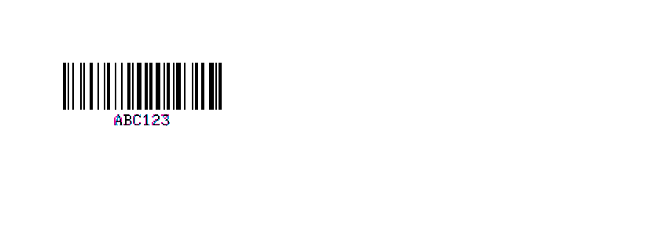
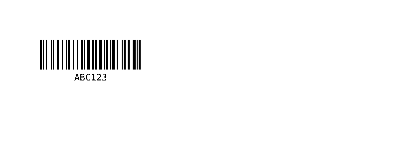
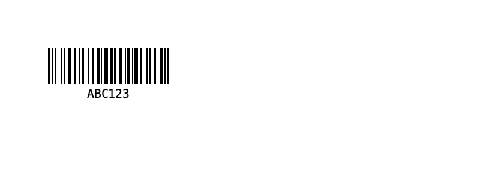
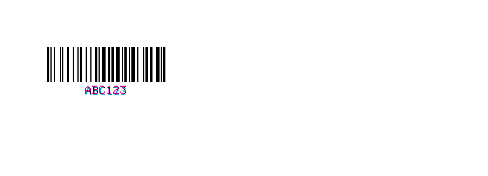
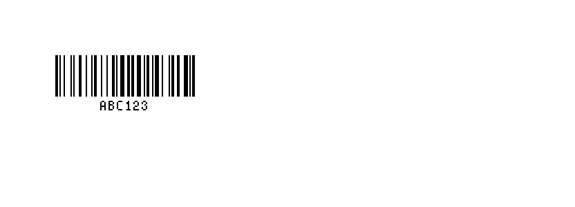

<!-- Generated by benchmarks/accuracy/gallery.py. -->

# code128-text-YN

[All comparisons](../README.md) · [Accuracy scores](../../README.md)

**^BC** · h=60,interpretation=Y,above=N · [ZPL input](../../../../../benchmarks/accuracy/reference/code128-text-YN.zpl) · [Printer preview](../../../../../benchmarks/accuracy/reference/code128-text-YN.png)

Measured 2026-09-19T02:26:50Z. Printer capture metadata is recorded in [results.json](../../results.json).

Black = matching ink; magenta = printer only; cyan = library only. Images retain their original pixels; click an image to inspect it at full size.

[codyps/zpl (Rust)](#codyps-zpl) · [labelize (Rust)](#labelize) · [zpl-forge (Rust)](#forge) · [go-zpl (Go)](#go) · [zpl-rs (Rust → Go)](#ffi) · [BinaryKits.Zpl (.NET)](#binarykits) · [ZPLr (TypeScript)](#zplr)

## codyps-zpl

**codyps/zpl (Rust): 79.8% IoU** · [All cases for this library](../libraries/codyps-zpl.md)

Printer: 832 × 300 dots; library: 832 × 300 dots. Missing ink: 280 pixels; extra ink: 1138 pixels.

| Printer preview | Library render | Difference |
| --- | --- | --- |
|  |  |  |

## labelize

**labelize (Rust): 94.3% IoU** · [All cases for this library](../libraries/labelize.md)

Printer: 832 × 300 dots; library: 832 × 300 dots. Missing ink: 199 pixels; extra ink: 145 pixels.

| Printer preview | Library render | Difference |
| --- | --- | --- |
|  |  |  |

## forge

**zpl-forge (Rust): 95.7% IoU** · [All cases for this library](../libraries/forge.md)

Printer: 832 × 300 dots; library: 832 × 300 dots. Missing ink: 147 pixels; extra ink: 109 pixels.

| Printer preview | Library render | Difference |
| --- | --- | --- |
|  |  |  |

## go

**go-zpl (Go): 91.7% IoU** · [All cases for this library](../libraries/go.md)

Printer: 832 × 300 dots; library: 832 × 300 dots. Missing ink: 286 pixels; extra ink: 218 pixels.

| Printer preview | Library render | Difference |
| --- | --- | --- |
|  |  |  |

## ffi

**zpl-rs (Rust → Go): 91.7% IoU** · [All cases for this library](../libraries/ffi.md)

Printer: 832 × 300 dots; library: 832 × 300 dots. Missing ink: 286 pixels; extra ink: 218 pixels.

| Printer preview | Library render | Difference |
| --- | --- | --- |
|  |  |  |

## binarykits

**BinaryKits.Zpl (.NET): 92.7% IoU** · [All cases for this library](../libraries/binarykits.md)

Printer: 832 × 300 dots; library: 832 × 300 dots. Missing ink: 245 pixels; extra ink: 196 pixels.

| Printer preview | Library render | Difference |
| --- | --- | --- |
|  |  |  |

## zplr

**ZPLr (TypeScript): 96.1% IoU** · [All cases for this library](../libraries/zplr.md)

Printer: 832 × 300 dots; library: 832 × 300 dots. Missing ink: 130 pixels; extra ink: 102 pixels.

| Printer preview | Library render | Difference |
| --- | --- | --- |
|  |  |  |

