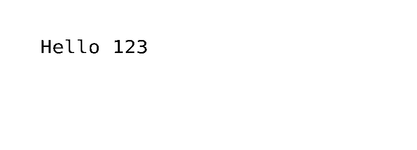
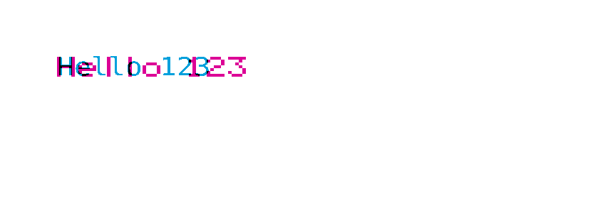
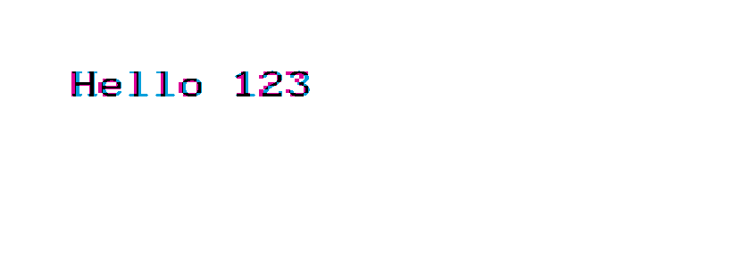
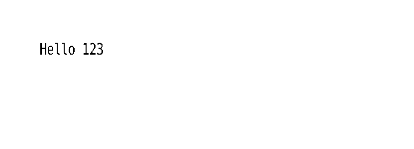
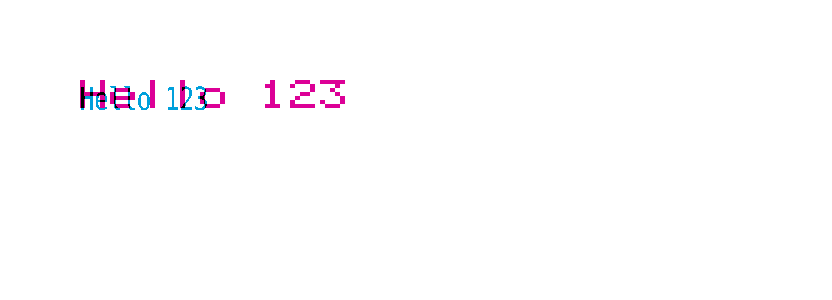
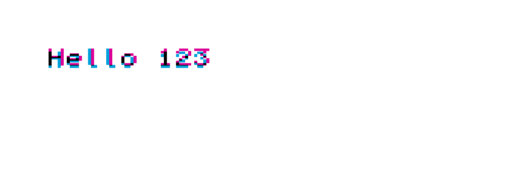
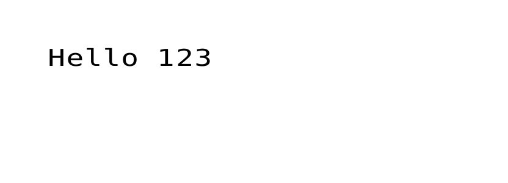
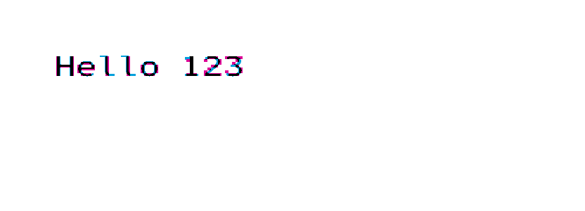

<!-- Generated by benchmarks/accuracy/gallery.py. -->

# font-A

[All comparisons](../README.md) · [Accuracy scores](../../README.md)

**^A** · font=A,o=N,h=32,w=24 · [ZPL input](../../../../../benchmarks/accuracy/reference/font-A.zpl) · [Printer preview](../../../../../benchmarks/accuracy/reference/font-A.png)

Measured 2026-09-19T03:33:57Z. Printer capture metadata is recorded in [results.json](../../results.json).

Black = matching ink; magenta = printer only; cyan = library only. Images retain their original pixels; click an image to inspect it at full size.

[codyps/zpl (Rust)](#codyps-zpl) · [labelize (Rust)](#labelize) · [zpl-forge (Rust)](#forge) · [go-zpl (Go)](#go) · [zpl-rs (Rust → Go)](#ffi) · [BinaryKits.Zpl (.NET)](#binarykits) · [ZPLr (TypeScript)](#zplr) · [Labelary (captured service)](#labelary)

## codyps-zpl

**codyps/zpl (Rust): 100.0% IoU · exact** · [All cases for this library](../libraries/codyps-zpl.md)

Printer: 832 × 300 dots; library: 832 × 300 dots. Missing ink: 0 pixels; extra ink: 0 pixels.

| Printer preview | Library render | Difference |
| --- | --- | --- |
|  |  |  |

## labelize

**labelize (Rust): 10.2% IoU** · [All cases for this library](../libraries/labelize.md)

Printer: 832 × 300 dots; library: 832 × 300 dots. Missing ink: 1618 pixels; extra ink: 1042 pixels.

| Printer preview | Library render | Difference |
| --- | --- | --- |
|  |  |  |

## forge

**zpl-forge (Rust): 38.6% IoU** · [All cases for this library](../libraries/forge.md)

Printer: 832 × 300 dots; library: 832 × 300 dots. Missing ink: 844 pixels; extra ink: 867 pixels.

| Printer preview | Library render | Difference |
| --- | --- | --- |
|  |  |  |

## go

**go-zpl (Go): 8.6% IoU** · [All cases for this library](../libraries/go.md)

Printer: 832 × 300 dots; library: 832 × 300 dots. Missing ink: 1707 pixels; extra ink: 558 pixels.

| Printer preview | Library render | Difference |
| --- | --- | --- |
|  |  |  |

## ffi

**zpl-rs (Rust → Go): 8.6% IoU** · [All cases for this library](../libraries/ffi.md)

Printer: 832 × 300 dots; library: 832 × 300 dots. Missing ink: 1707 pixels; extra ink: 558 pixels.

| Printer preview | Library render | Difference |
| --- | --- | --- |
|  |  |  |

## binarykits

**BinaryKits.Zpl (.NET): 37.6% IoU** · [All cases for this library](../libraries/binarykits.md)

Printer: 832 × 300 dots; library: 832 × 300 dots. Missing ink: 939 pixels; extra ink: 692 pixels.

| Printer preview | Library render | Difference |
| --- | --- | --- |
|  |  |  |

## zplr

**ZPLr (TypeScript): 20.7% IoU** · [All cases for this library](../libraries/zplr.md)

Printer: 832 × 300 dots; library: 832 × 300 dots. Missing ink: 1260 pixels; extra ink: 1275 pixels.

| Printer preview | Library render | Difference |
| --- | --- | --- |
|  |  |  |

## labelary

**Labelary (captured service): 53.1% IoU** · [All cases for this library](../libraries/labelary.md)

[Labelary capture timestamps, HTTP metadata and original responses](../../../labelary/README.md). This row is scored against the printer, like every other renderer.

Printer: 832 × 300 dots; library: 832 × 300 dots. Missing ink: 645 pixels; extra ink: 480 pixels.

| Printer preview | Library render | Difference |
| --- | --- | --- |
|  |  |  |

