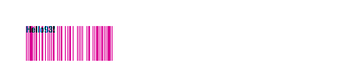

<!-- Generated by benchmarks/accuracy/gallery.py. -->

# code93

[All comparisons](../README.md) · [Accuracy scores](../../README.md)

**^BA** · See exact archived ZPL · [ZPL input](../../../../../references/barcodes-zd621-v1/code93.zpl) · [Printer preview](../../../../../references/barcodes-zd621-v1/code93.png)

Measured 2026-09-20T18:04:26Z. Printer capture metadata is recorded in [results.json](../../results.json).

Black = matching ink; magenta = printer only; cyan = library only. Compact previews share a common origin and crop only trailing blank space; click for the full-resolution image. Scores always use uncropped original pixels.

[codyps/zpl (Rust)](#codyps-zpl) · [labelize (Rust)](#labelize) · [zpl-forge (Rust)](#forge) · [go-zpl (Go)](#go) · [zpl-rs (Rust → Go)](#ffi) · [BinaryKits.Zpl (.NET)](#binarykits) · [ZPLr (TypeScript)](#zplr) · [Labelary (SaaS)](#labelary)

## codyps-zpl

**codyps/zpl (Rust): 100.0% IoU · exact** · [All cases for this library](../libraries/codyps-zpl.md)

Printer: 832 × 1218 dots; library: 832 × 1218 dots. Missing ink: 0 pixels; extra ink: 0 pixels.

| Printer preview | Library render | Difference |
| --- | --- | --- |
|  |  |  |

## labelize

**labelize (Rust): 3.8% IoU** · [All cases for this library](../libraries/labelize.md)

Printer: 832 × 1218 dots; library: 832 × 1218 dots. Missing ink: 7532 pixels; extra ink: 234 pixels.

| Printer preview | Library render | Difference |
| --- | --- | --- |
|  |  |  |

## forge

**zpl-forge (Rust): 34.4% IoU** · [All cases for this library](../libraries/forge.md)

Printer: 832 × 1218 dots; library: 832 × 1218 dots. Missing ink: 2880 pixels; extra ink: 6560 pixels.

| Printer preview | Library render | Difference |
| --- | --- | --- |
|  |  |  |

## go

**go-zpl (Go): 4.2% IoU** · [All cases for this library](../libraries/go.md)

Printer: 832 × 1218 dots; library: 832 × 1218 dots. Missing ink: 7504 pixels; extra ink: 226 pixels.

| Printer preview | Library render | Difference |
| --- | --- | --- |
|  |  |  |

## ffi

**zpl-rs (Rust → Go): 4.2% IoU** · [All cases for this library](../libraries/ffi.md)

Printer: 832 × 1218 dots; library: 832 × 1218 dots. Missing ink: 7504 pixels; extra ink: 226 pixels.

| Printer preview | Library render | Difference |
| --- | --- | --- |
|  |  |  |

## binarykits

**BinaryKits.Zpl (.NET): 34.4% IoU** · [All cases for this library](../libraries/binarykits.md)

Printer: 832 × 1218 dots; library: 832 × 1218 dots. Missing ink: 2880 pixels; extra ink: 6560 pixels.

| Printer preview | Library render | Difference |
| --- | --- | --- |
|  |  |  |

## zplr

**ZPLr (TypeScript): 34.4% IoU** · [All cases for this library](../libraries/zplr.md)

Printer: 832 × 1218 dots; library: 832 × 1218 dots. Missing ink: 2880 pixels; extra ink: 6560 pixels.

| Printer preview | Library render | Difference |
| --- | --- | --- |
|  |  |  |

## labelary

**Labelary (SaaS): 100.0% IoU · exact** · [All cases for this library](../libraries/labelary.md)

[Labelary capture timestamps, HTTP metadata and original responses](../../../labelary/README.md). This row is scored against the printer, like every other renderer.

Printer: 832 × 1218 dots; library: 832 × 1218 dots. Missing ink: 0 pixels; extra ink: 0 pixels.

| Printer preview | Library render | Difference |
| --- | --- | --- |
|  |  |  |

