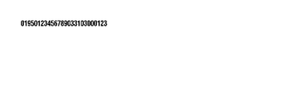
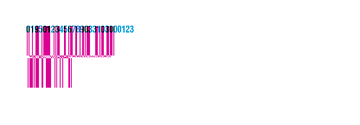
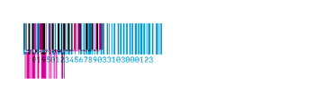

<!-- Generated by Bazel from cached render/comparison actions. -->

# databar_expanded_stacked

Black = matching ink; magenta = printer only; cyan = library only. Compact previews share a common origin and crop only trailing blank space; click for the full-resolution image. Scores always use uncropped original pixels.

Printer and Labelary captures retain their original capture dates. Local renders are cached independently; execution timestamps are recorded per result in results.json.

[All comparisons](../README.md) · [Accuracy summary](../../README.md)

See exact archived ZPL

[ZPL source](../../../../../references/barcodes-zd621-v1/databar_expanded_stacked.zpl)

Validity: captured printer case. 

Source: archived barcode development corpus

## codyps-zpl

**codyps/zpl (Rust)**

rendered · 100.00% IoU · exact · [All cases for this library](../libraries/codyps-zpl.md)

| Printer preview | Library render | Difference |
|---|---|---|
|  |  |  |

Library dimensions: [832, 1218]; missing ink: 0; extra ink: 0 pixels.

## labelize

**labelize (Rust)**

rendered · 7.26% IoU · [All cases for this library](../libraries/labelize.md)

| Printer preview | Library render | Difference |
|---|---|---|
|  |  |  |

Library dimensions: [832, 1218]; missing ink: 9910; extra ink: 1211 pixels.

## forge

**zpl-forge (Rust)**

rendered · 22.23% IoU · [All cases for this library](../libraries/forge.md)

| Printer preview | Library render | Difference |
|---|---|---|
|  |  |  |

Library dimensions: [832, 1218]; missing ink: 5716; extra ink: 11998 pixels.

## go

**go-zpl (Go)**

rendered · 8.25% IoU · [All cases for this library](../libraries/go.md)

| Printer preview | Library render | Difference |
|---|---|---|
|  |  |  |

Library dimensions: [832, 1218]; missing ink: 9783; extra ink: 1309 pixels.

## ffi

**zpl-rs (Rust → Go)**

rendered · 8.25% IoU · [All cases for this library](../libraries/ffi.md)

| Printer preview | Library render | Difference |
|---|---|---|
|  |  |  |

Library dimensions: [832, 1218]; missing ink: 9783; extra ink: 1309 pixels.

## binarykits

**BinaryKits.Zpl (.NET)**

rendered · 3.91% IoU · [All cases for this library](../libraries/binarykits.md)

| Printer preview | Library render | Difference |
|---|---|---|
|  |  |  |

Library dimensions: [832, 1218]; missing ink: 10309; extra ink: 1259 pixels.

## zplr

**ZPLr (TypeScript)**

rendered · 21.69% IoU · [All cases for this library](../libraries/zplr.md)

| Printer preview | Library render | Difference |
|---|---|---|
|  |  |  |

Library dimensions: [832, 1218]; missing ink: 5752; extra ink: 12400 pixels.

## labelary

**Labelary (SaaS)**

rendered · 100.00% IoU · exact · [All cases for this library](../libraries/labelary.md)

[Labelary capture timestamps, HTTP metadata, and original responses](../../../labelary/README.md)

| Printer preview | Library render | Difference |
|---|---|---|
|  |  |  |

Library dimensions: [832, 1218]; missing ink: 0; extra ink: 0 pixels.
