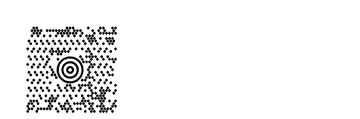
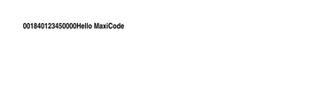
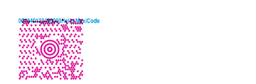
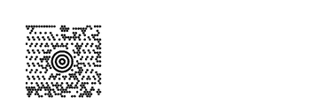
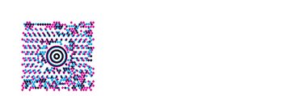
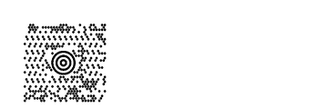
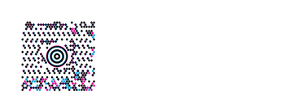
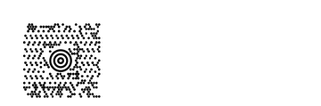

<!-- Generated by benchmarks/accuracy/gallery.py. -->

# maxicode2

[All comparisons](../README.md) · [Accuracy scores](../../README.md)

**^BD** · See exact archived ZPL · [ZPL input](../../../../../references/barcodes-zd621-v1/maxicode2.zpl) · [Printer preview](../../../../../references/barcodes-zd621-v1/maxicode2.png)

Measured 2026-09-20T04:43:33Z. Printer capture metadata is recorded in [results.json](../../results.json).

Black = matching ink; magenta = printer only; cyan = library only. Compact previews share a common origin and crop only trailing blank space; click for the full-resolution image. Scores always use uncropped original pixels.

[codyps/zpl (Rust)](#codyps-zpl) · [labelize (Rust)](#labelize) · [zpl-forge (Rust)](#forge) · [go-zpl (Go)](#go) · [zpl-rs (Rust → Go)](#ffi) · [BinaryKits.Zpl (.NET)](#binarykits) · [ZPLr (TypeScript)](#zplr) · [Labelary (SaaS)](#labelary)

## codyps-zpl

**codyps/zpl (Rust): 48.9% IoU** · [All cases for this library](../libraries/codyps-zpl.md)

Printer: 832 × 1218 dots; library: 832 × 1218 dots. Missing ink: 3847 pixels; extra ink: 5245 pixels.

| Printer preview | Library render | Difference |
| --- | --- | --- |
|  |  |  |

## labelize

**labelize (Rust): Render error** · [All cases for this library](../libraries/labelize.md)

| Printer preview | Library render | Difference |
| --- | --- | --- |
|  | Render failed; no image | Unavailable |

Error diagnostic:

~~~text

thread 'main' (44605726) panicked at src/main.rs:63:14:
PNG: "MaxiCode mode 2 postal code must contain 1 to 9 digits"
note: run with `RUST_BACKTRACE=1` environment variable to display a backtrace

~~~

## forge

**zpl-forge (Rust): 3.0% IoU** · [All cases for this library](../libraries/forge.md)

Printer: 832 × 1218 dots; library: 832 × 1218 dots. Missing ink: 12120 pixels; extra ink: 1362 pixels.

| Printer preview | Library render | Difference |
| --- | --- | --- |
|  |  |  |

## go

**go-zpl (Go): 22.1% IoU** · [All cases for this library](../libraries/go.md)

Printer: 832 × 1218 dots; library: 832 × 1218 dots. Missing ink: 8041 pixels; extra ink: 7796 pixels.

| Printer preview | Library render | Difference |
| --- | --- | --- |
|  |  |  |

## ffi

**zpl-rs (Rust → Go): 22.1% IoU** · [All cases for this library](../libraries/ffi.md)

Printer: 832 × 1218 dots; library: 832 × 1218 dots. Missing ink: 8041 pixels; extra ink: 7796 pixels.

| Printer preview | Library render | Difference |
| --- | --- | --- |
|  |  |  |

## binarykits

**BinaryKits.Zpl (.NET): 54.7% IoU** · [All cases for this library](../libraries/binarykits.md)

Printer: 832 × 1218 dots; library: 832 × 1218 dots. Missing ink: 3661 pixels; extra ink: 3697 pixels.

| Printer preview | Library render | Difference |
| --- | --- | --- |
|  |  |  |

## zplr

**ZPLr (TypeScript): 69.3% IoU** · [All cases for this library](../libraries/zplr.md)

Printer: 832 × 1218 dots; library: 832 × 1218 dots. Missing ink: 2280 pixels; extra ink: 2274 pixels.

| Printer preview | Library render | Difference |
| --- | --- | --- |
|  |  |  |

## labelary

**Labelary (SaaS): 18.7% IoU** · [All cases for this library](../libraries/labelary.md)

[Labelary capture timestamps, HTTP metadata and original responses](../../../labelary/README.md). This row is scored against the printer, like every other renderer.

Printer: 832 × 1218 dots; library: 832 × 1218 dots. Missing ink: 8680 pixels; extra ink: 8056 pixels.

| Printer preview | Library render | Difference |
| --- | --- | --- |
|  |  |  |

