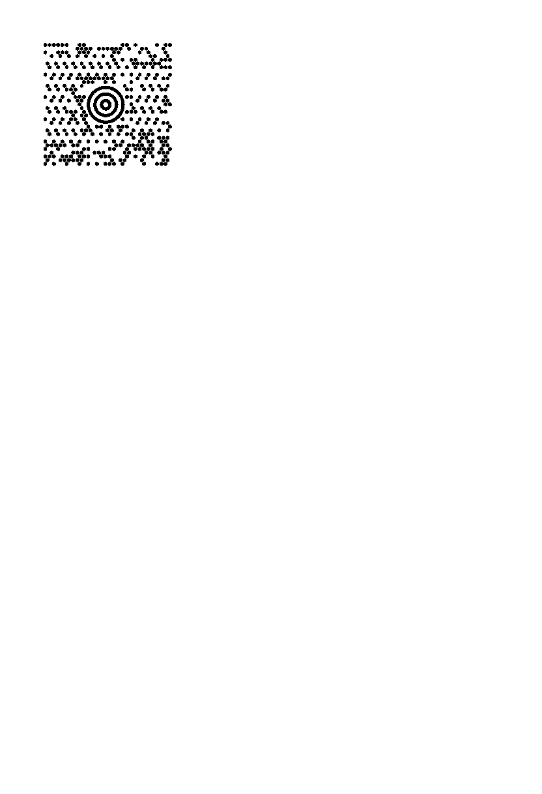

<!-- Generated by benchmarks/accuracy/gallery.py. -->

# maxicode3

[All comparisons](../README.md) · [Accuracy scores](../../README.md)

**^BD** · See exact archived ZPL · [ZPL input](../../../../../../../../../Volumes/dev/p/zpl-comparison/references/barcodes-zd621-v1/maxicode3.zpl) · [Printer preview](../../../../../../../../../Volumes/dev/p/zpl-comparison/references/barcodes-zd621-v1/maxicode3.png)

Measured 2026-09-18T23:52:17Z. Printer capture metadata is recorded in [results.json](../../results.json).

Black = matching ink; magenta = printer only; cyan = library only. Images retain their original pixels; click an image to inspect it at full size.

[codyps/zpl (Rust)](#codyps-zpl) · [labelize (Rust)](#labelize) · [zpl-forge (Rust)](#forge) · [go-zpl (Go)](#go) · [zpl-rs (Rust → Go)](#ffi) · [BinaryKits.Zpl (.NET)](#binarykits) · [ZPLr (TypeScript)](#zplr)

## codyps-zpl

**codyps/zpl (Rust): 49.4% IoU** · [All cases for this library](../libraries/codyps-zpl.md)

Printer: 832 × 1218 dots; library: 832 × 1218 dots. Missing ink: 3882 pixels; extra ink: 5308 pixels.

| Printer preview | Library render | Difference |
| --- | --- | --- |
|  |  |  |

## labelize

**labelize (Rust): Render error** · [All cases for this library](../libraries/labelize.md)

| Printer preview | Library render | Difference |
| --- | --- | --- |
|  | Render failed; no image | Unavailable |

Error diagnostic:

~~~text

thread 'main' (41349680) panicked at src/main.rs:62:14:
PNG: "MaxiCode mode 3 postal code must contain exactly 6 alphanumeric characters"
note: run with `RUST_BACKTRACE=1` environment variable to display a backtrace

~~~

## forge

**zpl-forge (Rust): 3.2% IoU** · [All cases for this library](../libraries/forge.md)

Printer: 832 × 1218 dots; library: 832 × 1218 dots. Missing ink: 12386 pixels; extra ink: 1219 pixels.

| Printer preview | Library render | Difference |
| --- | --- | --- |
|  |  |  |

## go

**go-zpl (Go): 21.3% IoU** · [All cases for this library](../libraries/go.md)

Printer: 832 × 1218 dots; library: 832 × 1218 dots. Missing ink: 8499 pixels; extra ink: 7536 pixels.

| Printer preview | Library render | Difference |
| --- | --- | --- |
|  |  |  |

## ffi

**zpl-rs (Rust → Go): 21.3% IoU** · [All cases for this library](../libraries/ffi.md)

Printer: 832 × 1218 dots; library: 832 × 1218 dots. Missing ink: 8499 pixels; extra ink: 7536 pixels.

| Printer preview | Library render | Difference |
| --- | --- | --- |
|  |  |  |

## binarykits

**BinaryKits.Zpl (.NET): 54.9% IoU** · [All cases for this library](../libraries/binarykits.md)

Printer: 832 × 1218 dots; library: 832 × 1218 dots. Missing ink: 3721 pixels; extra ink: 3757 pixels.

| Printer preview | Library render | Difference |
| --- | --- | --- |
|  |  |  |

## zplr

**ZPLr (TypeScript): 69.1% IoU** · [All cases for this library](../libraries/zplr.md)

Printer: 832 × 1218 dots; library: 832 × 1218 dots. Missing ink: 2350 pixels; extra ink: 2344 pixels.

| Printer preview | Library render | Difference |
| --- | --- | --- |
|  |  |  |

