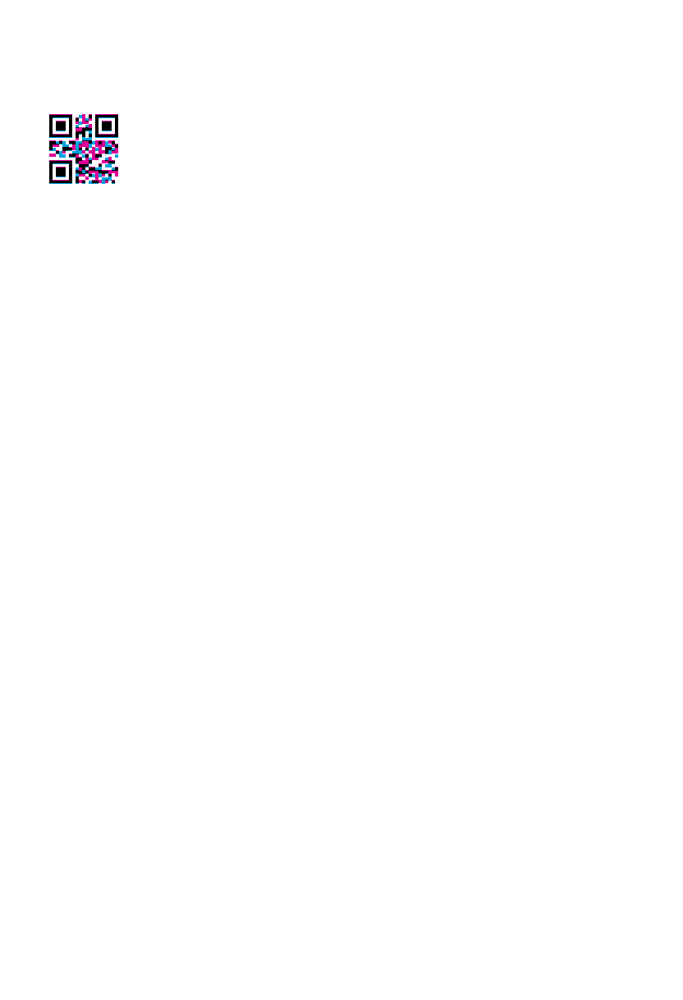

<!-- Generated by benchmarks/accuracy/gallery.py. -->

# qr

[All comparisons](../README.md) · [Accuracy scores](../../README.md)

**^BQ** · See exact archived ZPL · [ZPL input](../../../../../references/barcodes-zd621-v1/qr.zpl) · [Printer preview](../../../../../references/barcodes-zd621-v1/qr.png)

Measured 2026-09-18T23:14:28Z. Printer capture metadata is recorded in [results.json](../../results.json).

Black = matching ink; magenta = printer only; cyan = library only. Images retain their original pixels; click an image to inspect it at full size.

[codyps/zpl (Rust)](#codyps-zpl) · [labelize (Rust)](#labelize) · [zpl-forge (Rust)](#forge) · [go-zpl (Go)](#go) · [zpl-rs (Rust → Go)](#ffi) · [BinaryKits.Zpl (.NET)](#binarykits) · [ZPLr (TypeScript)](#zplr)

## codyps-zpl

**codyps/zpl (Rust): 2.0% IoU** · [All cases for this library](../libraries/codyps-zpl.md)

Printer: 832 × 1218 dots; library: 812 × 1218 dots. Missing ink: 3534 pixels; extra ink: 3502 pixels.

| Printer preview | Library render | Difference |
| --- | --- | --- |
|  |  |  |

## labelize

**labelize (Rust): 31.0% IoU** · [All cases for this library](../libraries/labelize.md)

Printer: 832 × 1218 dots; library: 812 × 1218 dots. Missing ink: 1998 pixels; extra ink: 1742 pixels.

| Printer preview | Library render | Difference |
| --- | --- | --- |
|  |  |  |

## forge

**zpl-forge (Rust): 4.9% IoU** · [All cases for this library](../libraries/forge.md)

Printer: 832 × 1218 dots; library: 812 × 1218 dots. Missing ink: 3346 pixels; extra ink: 3122 pixels.

| Printer preview | Library render | Difference |
| --- | --- | --- |
|  |  |  |

## go

**go-zpl (Go): 7.2% IoU** · [All cases for this library](../libraries/go.md)

Printer: 832 × 1218 dots; library: 812 × 1218 dots. Missing ink: 3202 pixels; extra ink: 2946 pixels.

| Printer preview | Library render | Difference |
| --- | --- | --- |
|  |  |  |

## ffi

**zpl-rs (Rust → Go): 7.2% IoU** · [All cases for this library](../libraries/ffi.md)

Printer: 832 × 1218 dots; library: 812 × 1218 dots. Missing ink: 3202 pixels; extra ink: 2946 pixels.

| Printer preview | Library render | Difference |
| --- | --- | --- |
|  |  |  |

## binarykits

**BinaryKits.Zpl (.NET): 4.9% IoU** · [All cases for this library](../libraries/binarykits.md)

Printer: 832 × 1218 dots; library: 812 × 1218 dots. Missing ink: 3342 pixels; extra ink: 3278 pixels.

| Printer preview | Library render | Difference |
| --- | --- | --- |
|  |  |  |

## zplr

**ZPLr (TypeScript): 34.1% IoU** · [All cases for this library](../libraries/zplr.md)

Printer: 832 × 1218 dots; library: 812 × 1218 dots. Missing ink: 1800 pixels; extra ink: 1832 pixels.

| Printer preview | Library render | Difference |
| --- | --- | --- |
|  |  |  |

