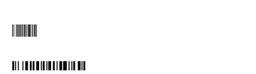

<!-- Generated by Bazel from cached render/comparison actions. -->

# barcode-default-scope

Black = matching ink; magenta = printer only; cyan = library only. Compact previews share a common origin and crop only trailing blank space; click for the full-resolution image. Scores always use uncropped original pixels.

Printer and Labelary captures retain their original capture dates. Local renders are cached independently; execution timestamps are recorded per result in results.json.

[Corpus comparisons](../features/README.md) · [All accuracy comparisons](../../README.md)

BY height/width defaults followed by per-symbol override

[ZPL source](../../../../../test-data/render-conformance/cases/state/barcode-default-scope.zpl)

Validity: valid. 

Zebra programming guide: [^BC](../../../../zpl-zbi2-pg-en.pdf#page=94) · [^BY](../../../../zpl-zbi2-pg-en.pdf#page=148) · [^CF](../../../../zpl-zbi2-pg-en.pdf#page=154) · [^CI](../../../../zpl-zbi2-pg-en.pdf#page=155) · [^FD](../../../../zpl-zbi2-pg-en.pdf#page=190) · [^FO](../../../../zpl-zbi2-pg-en.pdf#page=201) · [^FS](../../../../zpl-zbi2-pg-en.pdf#page=204) · [^FW](../../../../zpl-zbi2-pg-en.pdf#page=208) · [^LH](../../../../zpl-zbi2-pg-en.pdf#page=293) · [^LL](../../../../zpl-zbi2-pg-en.pdf#page=294) · [^LR](../../../../zpl-zbi2-pg-en.pdf#page=295) · [^LS](../../../../zpl-zbi2-pg-en.pdf#page=296) · [^LT](../../../../zpl-zbi2-pg-en.pdf#page=297) · [^PO](../../../../zpl-zbi2-pg-en.pdf#page=322) · [^PW](../../../../zpl-zbi2-pg-en.pdf#page=329) · [^XA](../../../../zpl-zbi2-pg-en.pdf#page=370) · [^XZ](../../../../zpl-zbi2-pg-en.pdf#page=375)

## codyps-zpl

**codyps/zpl (Rust)**

rendered · 100.00% IoU · exact · [All cases for this library](../features/libraries/codyps-zpl.md)

| Printer preview | Library render | Difference |
|---|---|---|
|  |  |  |

Library dimensions: [832, 1218]; missing ink: 0; extra ink: 0 pixels.

## labelize

**labelize (Rust)**

rendered · 100.00% IoU · exact · [All cases for this library](../features/libraries/labelize.md)

| Printer preview | Library render | Difference |
|---|---|---|
|  |  |  |

Library dimensions: [832, 1218]; missing ink: 0; extra ink: 0 pixels.

## forge

**zpl-forge (Rust)**

rendered · 100.00% IoU · exact · [All cases for this library](../features/libraries/forge.md)

| Printer preview | Library render | Difference |
|---|---|---|
|  |  |  |

Library dimensions: [832, 1218]; missing ink: 0; extra ink: 0 pixels.

## go

**go-zpl (Go)**

rendered · 100.00% IoU · exact · [All cases for this library](../features/libraries/go.md)

| Printer preview | Library render | Difference |
|---|---|---|
|  |  |  |

Library dimensions: [832, 1218]; missing ink: 0; extra ink: 0 pixels.

## ffi

**zpl-rs (Rust → Go)**

rendered · 100.00% IoU · exact · [All cases for this library](../features/libraries/ffi.md)

| Printer preview | Library render | Difference |
|---|---|---|
|  |  |  |

Library dimensions: [832, 1218]; missing ink: 0; extra ink: 0 pixels.

## binarykits

**BinaryKits.Zpl (.NET)**

rendered · 100.00% IoU · exact · [All cases for this library](../features/libraries/binarykits.md)

| Printer preview | Library render | Difference |
|---|---|---|
|  |  |  |

Library dimensions: [832, 1218]; missing ink: 0; extra ink: 0 pixels.

## zplr

**ZPLr (TypeScript)**

rendered · 100.00% IoU · exact · [All cases for this library](../features/libraries/zplr.md)

| Printer preview | Library render | Difference |
|---|---|---|
|  |  |  |

Library dimensions: [832, 1218]; missing ink: 0; extra ink: 0 pixels.

## labelary

**Labelary (SaaS)**

rendered · 100.00% IoU · exact · [All cases for this library](../features/libraries/labelary.md)

[Labelary capture timestamps, HTTP metadata, and original responses](../../../labelary/README.md)

| Printer preview | Library render | Difference |
|---|---|---|
|  |  |  |

Library dimensions: [832, 1218]; missing ink: 0; extra ink: 0 pixels.
