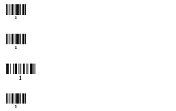
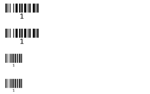
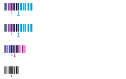
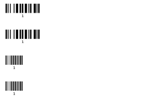
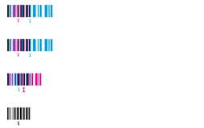
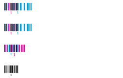

<!-- Generated by Bazel from cached render/comparison actions. -->

# printer-qr-module-state-holdouts-basic

Black = matching ink; magenta = printer only; cyan = library only. Compact previews share a common origin and crop only trailing blank space; click for the full-resolution image. Scores always use uncropped original pixels.

Printer and Labelary captures retain their original capture dates. Local renders are cached independently; execution timestamps are recorded per result in results.json.

[All comparisons](../features/README.md) · [Accuracy summary](../../README.md)

qr module state: holdouts-basic

[ZPL source](../../../../../test-data/render-conformance/cases/printer-qr-module-state/printer-qr-module-state-holdouts-basic.zpl)

Validity: boundary. 

Source: references/upstream-zd621/qr-module-state-zd621-v1/holdouts-basic.zpl

Zebra programming guide: [^BC](../../../../zpl-zbi2-pg-en.pdf#page=94) · [^BQ](../../../../zpl-zbi2-pg-en.pdf#page=128) · [^BY](../../../../zpl-zbi2-pg-en.pdf#page=148) · [^CF](../../../../zpl-zbi2-pg-en.pdf#page=154) · [^CI](../../../../zpl-zbi2-pg-en.pdf#page=155) · [^FD](../../../../zpl-zbi2-pg-en.pdf#page=190) · [^FO](../../../../zpl-zbi2-pg-en.pdf#page=201) · [^FS](../../../../zpl-zbi2-pg-en.pdf#page=204) · [^FW](../../../../zpl-zbi2-pg-en.pdf#page=208) · [^LH](../../../../zpl-zbi2-pg-en.pdf#page=293) · [^LL](../../../../zpl-zbi2-pg-en.pdf#page=294) · [^LR](../../../../zpl-zbi2-pg-en.pdf#page=295) · [^LS](../../../../zpl-zbi2-pg-en.pdf#page=296) · [^LT](../../../../zpl-zbi2-pg-en.pdf#page=297) · [^PA](../../../../zpl-zbi2-pg-en.pdf#page=315) · [^PM](../../../../zpl-zbi2-pg-en.pdf#page=319) · [^PO](../../../../zpl-zbi2-pg-en.pdf#page=322) · [^PW](../../../../zpl-zbi2-pg-en.pdf#page=329) · [^XA](../../../../zpl-zbi2-pg-en.pdf#page=370) · [^XZ](../../../../zpl-zbi2-pg-en.pdf#page=375)

## codyps-zpl

**codyps/zpl (Rust)**

rendered · 32.22% IoU · [All cases for this library](../features/libraries/codyps-zpl.md)

| Printer preview | Library render | Difference |
|---|---|---|
|  |  |  |

Library dimensions: [832, 900]; missing ink: 4720; extra ink: 8510 pixels.

## labelize

**labelize (Rust)**

rendered · 32.18% IoU · [All cases for this library](../features/libraries/labelize.md)

| Printer preview | Library render | Difference |
|---|---|---|
|  |  |  |

Library dimensions: [832, 900]; missing ink: 4735; extra ink: 8487 pixels.

## forge

**zpl-forge (Rust)**

rendered · 32.14% IoU · [All cases for this library](../features/libraries/forge.md)

| Printer preview | Library render | Difference |
|---|---|---|
|  |  |  |

Library dimensions: [832, 900]; missing ink: 4736; extra ink: 8508 pixels.

## go

**go-zpl (Go)**

rendered · 32.40% IoU · [All cases for this library](../features/libraries/go.md)

| Printer preview | Library render | Difference |
|---|---|---|
|  |  |  |

Library dimensions: [832, 900]; missing ink: 4752; extra ink: 8306 pixels.

## ffi

**zpl-rs (Rust → Go)**

rendered · 32.40% IoU · [All cases for this library](../features/libraries/ffi.md)

| Printer preview | Library render | Difference |
|---|---|---|
|  |  |  |

Library dimensions: [832, 900]; missing ink: 4752; extra ink: 8306 pixels.

## binarykits

**BinaryKits.Zpl (.NET)**

rendered · 32.07% IoU · [All cases for this library](../features/libraries/binarykits.md)

| Printer preview | Library render | Difference |
|---|---|---|
|  |  |  |

Library dimensions: [832, 900]; missing ink: 4753; extra ink: 8499 pixels.

## zplr

**ZPLr (TypeScript)**

rendered · 32.61% IoU · [All cases for this library](../features/libraries/zplr.md)

| Printer preview | Library render | Difference |
|---|---|---|
|  |  |  |

Library dimensions: [832, 900]; missing ink: 4720; extra ink: 8278 pixels.

## labelary

**Labelary (SaaS)**

rendered · 99.41% IoU · [All cases for this library](../features/libraries/labelary.md)

[Labelary capture timestamps, HTTP metadata, and original responses](../../../labelary/README.md)

| Printer preview | Library render | Difference |
|---|---|---|
|  |  |  |

Library dimensions: [832, 900]; missing ink: 27; extra ink: 38 pixels.
