<!-- Generated by Bazel from cached render/comparison actions. -->

# printer-qr-module-state-next-field

Black = matching ink; magenta = printer only; cyan = library only. Compact previews share a common origin and crop only trailing blank space; click for the full-resolution image. Scores always use uncropped original pixels.

Printer and Labelary captures retain their original capture dates. Local renders are cached independently; execution timestamps are recorded per result in results.json.

[Corpus comparisons](../features/README.md) · [All accuracy comparisons](../../README.md)

qr module state: next-field

[ZPL source](../../../../../test-data/render-conformance/cases/printer-qr-module-state/printer-qr-module-state-next-field.zpl)

Validity: boundary. 

Source: references/upstream-zd621/qr-module-state-zd621-v1/next-field.zpl

Zebra programming guide: [^BC](../../../../zpl-zbi2-pg-en.pdf#page=94) · [^BQ](../../../../zpl-zbi2-pg-en.pdf#page=128) · [^BY](../../../../zpl-zbi2-pg-en.pdf#page=148) · [^CF](../../../../zpl-zbi2-pg-en.pdf#page=154) · [^CI](../../../../zpl-zbi2-pg-en.pdf#page=155) · [^FD](../../../../zpl-zbi2-pg-en.pdf#page=190) · [^FO](../../../../zpl-zbi2-pg-en.pdf#page=201) · [^FS](../../../../zpl-zbi2-pg-en.pdf#page=204) · [^FW](../../../../zpl-zbi2-pg-en.pdf#page=208) · [^LH](../../../../zpl-zbi2-pg-en.pdf#page=293) · [^LL](../../../../zpl-zbi2-pg-en.pdf#page=294) · [^LR](../../../../zpl-zbi2-pg-en.pdf#page=295) · [^LS](../../../../zpl-zbi2-pg-en.pdf#page=296) · [^LT](../../../../zpl-zbi2-pg-en.pdf#page=297) · [^PA](../../../../zpl-zbi2-pg-en.pdf#page=315) · [^PM](../../../../zpl-zbi2-pg-en.pdf#page=319) · [^PO](../../../../zpl-zbi2-pg-en.pdf#page=322) · [^PW](../../../../zpl-zbi2-pg-en.pdf#page=329) · [^XA](../../../../zpl-zbi2-pg-en.pdf#page=370) · [^XZ](../../../../zpl-zbi2-pg-en.pdf#page=375)

## codyps-zpl

**codyps/zpl (Rust)**

rendered · 100.00% IoU · exact · [All cases for this library](../features/libraries/codyps-zpl.md)

| Printer preview | Library render | Difference |
|---|---|---|
| [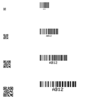](../../../../../benchmarks/accuracy/conformance-reference/printer-qr-module-state-next-field.png) |  | [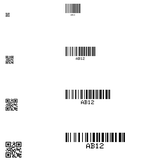](../features/images/printer-qr-module-state-next-field-codyps-zpl-diff.png) |

Library dimensions: [832, 1000]; missing ink: 0; extra ink: 0 pixels.

## labelize

**labelize (Rust)**

rendered · 39.77% IoU · [All cases for this library](../features/libraries/labelize.md)

| Printer preview | Library render | Difference |
|---|---|---|
|  |  | [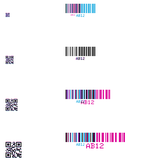](../features/images/printer-qr-module-state-next-field-labelize-diff.png) |

Library dimensions: [832, 1000]; missing ink: 13104; extra ink: 8368 pixels.

## forge

**zpl-forge (Rust)**

rendered · 25.68% IoU · [All cases for this library](../features/libraries/forge.md)

| Printer preview | Library render | Difference |
|---|---|---|
|  | [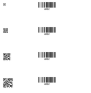](../../../conformance/images/printer-qr-module-state-next-field-forge.png) | [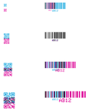](../features/images/printer-qr-module-state-next-field-forge-diff.png) |

Library dimensions: [832, 1000]; missing ink: 17099; extra ink: 12363 pixels.

## go

**go-zpl (Go)**

rendered · 24.64% IoU · [All cases for this library](../features/libraries/go.md)

| Printer preview | Library render | Difference |
|---|---|---|
|  |  | [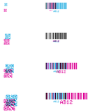](../features/images/printer-qr-module-state-next-field-go-diff.png) |

Library dimensions: [832, 1000]; missing ink: 17439; extra ink: 12655 pixels.

## ffi

**zpl-rs (Rust → Go)**

rendered · 24.64% IoU · [All cases for this library](../features/libraries/ffi.md)

| Printer preview | Library render | Difference |
|---|---|---|
|  | [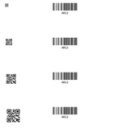](../../../conformance/images/printer-qr-module-state-next-field-ffi.png) |  |

Library dimensions: [832, 1000]; missing ink: 17439; extra ink: 12655 pixels.

## binarykits

**BinaryKits.Zpl (.NET)**

rendered · 25.80% IoU · [All cases for this library](../features/libraries/binarykits.md)

| Printer preview | Library render | Difference |
|---|---|---|
|  | [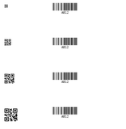](../../../conformance/images/printer-qr-module-state-next-field-binarykits.png) |  |

Library dimensions: [832, 1000]; missing ink: 17009; extra ink: 12537 pixels.

## zplr

**ZPLr (TypeScript)**

rendered · 37.34% IoU · [All cases for this library](../features/libraries/zplr.md)

| Printer preview | Library render | Difference |
|---|---|---|
|  | [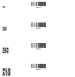](../../../conformance/images/printer-qr-module-state-next-field-zplr.png) | [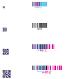](../features/images/printer-qr-module-state-next-field-zplr-diff.png) |

Library dimensions: [832, 1000]; missing ink: 13640; extra ink: 9252 pixels.

## labelary

**Labelary (SaaS)**

rendered · 87.97% IoU · [All cases for this library](../features/libraries/labelary.md)

[Labelary capture timestamps, HTTP metadata, and original responses](../../../labelary/README.md)

| Printer preview | Library render | Difference |
|---|---|---|
|  |  | [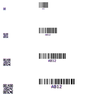](../features/images/printer-qr-module-state-next-field-labelary-diff.png) |

Library dimensions: [832, 1000]; missing ink: 1837; extra ink: 1641 pixels.
