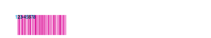

<!-- Generated by Bazel from cached render/comparison actions. -->

# symbol-code11

Black = matching ink; magenta = printer only; cyan = library only. Compact previews share a common origin and crop only trailing blank space; click for the full-resolution image. Scores always use uncropped original pixels.

Printer and Labelary captures retain their original capture dates. Local renders are cached independently; execution timestamps are recorded per result in results.json.

[All comparisons](../features/README.md) · [Accuracy summary](../../README.md)

Reference symbol variant: code11

[ZPL source](../../../../../test-data/render-conformance/cases/barcode-families/symbol-code11.zpl)

Validity: valid. 

Source: references/barcodes-zd621-v1/code11.zpl

Zebra programming guide: [^B1](../../../../zpl-zbi2-pg-en.pdf#page=66) · [^BY](../../../../zpl-zbi2-pg-en.pdf#page=148) · [^CF](../../../../zpl-zbi2-pg-en.pdf#page=154) · [^CI](../../../../zpl-zbi2-pg-en.pdf#page=155) · [^FD](../../../../zpl-zbi2-pg-en.pdf#page=190) · [^FO](../../../../zpl-zbi2-pg-en.pdf#page=201) · [^FS](../../../../zpl-zbi2-pg-en.pdf#page=204) · [^FW](../../../../zpl-zbi2-pg-en.pdf#page=208) · [^LH](../../../../zpl-zbi2-pg-en.pdf#page=293) · [^LL](../../../../zpl-zbi2-pg-en.pdf#page=294) · [^LR](../../../../zpl-zbi2-pg-en.pdf#page=295) · [^LS](../../../../zpl-zbi2-pg-en.pdf#page=296) · [^LT](../../../../zpl-zbi2-pg-en.pdf#page=297) · [^PO](../../../../zpl-zbi2-pg-en.pdf#page=322) · [^PW](../../../../zpl-zbi2-pg-en.pdf#page=329) · [^XA](../../../../zpl-zbi2-pg-en.pdf#page=370) · [^XZ](../../../../zpl-zbi2-pg-en.pdf#page=375)

## codyps-zpl

**codyps/zpl (Rust)**

rendered · 32.50% IoU · [All cases for this library](../features/libraries/codyps-zpl.md)

| Printer preview | Library render | Difference |
|---|---|---|
|  |  |  |

Library dimensions: [812, 1218]; missing ink: 4320; extra ink: 4320 pixels.

## labelize

**labelize (Rust)**

rendered · 3.50% IoU · [All cases for this library](../features/libraries/labelize.md)

| Printer preview | Library render | Difference |
|---|---|---|
|  |  |  |

Library dimensions: [812, 1218]; missing ink: 8172; extra ink: 330 pixels.

## forge

**zpl-forge (Rust)**

rendered · 2.68% IoU · [All cases for this library](../features/libraries/forge.md)

| Printer preview | Library render | Difference |
|---|---|---|
|  |  |  |

Library dimensions: [812, 1218]; missing ink: 8245; extra ink: 276 pixels.

## go

**go-zpl (Go)**

rendered · 4.47% IoU · [All cases for this library](../features/libraries/go.md)

| Printer preview | Library render | Difference |
|---|---|---|
|  |  |  |

Library dimensions: [812, 1218]; missing ink: 8088; extra ink: 286 pixels.

## ffi

**zpl-rs (Rust → Go)**

rendered · 4.47% IoU · [All cases for this library](../features/libraries/ffi.md)

| Printer preview | Library render | Difference |
|---|---|---|
|  |  |  |

Library dimensions: [812, 1218]; missing ink: 8088; extra ink: 286 pixels.

## binarykits

**BinaryKits.Zpl (.NET)**

rendered · 3.11% IoU · [All cases for this library](../features/libraries/binarykits.md)

| Printer preview | Library render | Difference |
|---|---|---|
|  |  |  |

Library dimensions: [812, 1218]; missing ink: 8209; extra ink: 240 pixels.

## zplr

**ZPLr (TypeScript)**

rendered · 36.84% IoU · [All cases for this library](../features/libraries/zplr.md)

| Printer preview | Library render | Difference |
|---|---|---|
|  |  |  |

Library dimensions: [812, 1218]; missing ink: 4000; extra ink: 3680 pixels.

## labelary

**Labelary (SaaS)**

rendered · 36.84% IoU · [All cases for this library](../features/libraries/labelary.md)

[Labelary capture timestamps, HTTP metadata, and original responses](../../../labelary/README.md)

| Printer preview | Library render | Difference |
|---|---|---|
|  |  |  |

Library dimensions: [812, 1218]; missing ink: 4000; extra ink: 3680 pixels.
