<!-- Generated by Bazel from cached render/comparison actions. -->

# text-block-R-40

Black = matching ink; magenta = printer only; cyan = library only. Compact previews share a common origin and crop only trailing blank space; click for the full-resolution image. Scores always use uncropped original pixels.

Printer and Labelary captures retain their original capture dates. Local renders are cached independently; execution timestamps are recorded per result in results.json.

[Corpus comparisons](../features/README.md) · [All accuracy comparisons](../../README.md)

TB R, 220x40; height truncation, word wrap and angle escape

[ZPL source](../../../../../test-data/render-conformance/cases/text-layout/text-block-R-40.zpl)

Validity: valid. 

Zebra programming guide: [^A](../../../../zpl-zbi2-pg-en.pdf#page=60) · [^BY](../../../../zpl-zbi2-pg-en.pdf#page=148) · [^CF](../../../../zpl-zbi2-pg-en.pdf#page=154) · [^CI](../../../../zpl-zbi2-pg-en.pdf#page=155) · [^FD](../../../../zpl-zbi2-pg-en.pdf#page=190) · [^FO](../../../../zpl-zbi2-pg-en.pdf#page=201) · [^FS](../../../../zpl-zbi2-pg-en.pdf#page=204) · [^FW](../../../../zpl-zbi2-pg-en.pdf#page=208) · [^LH](../../../../zpl-zbi2-pg-en.pdf#page=293) · [^LL](../../../../zpl-zbi2-pg-en.pdf#page=294) · [^LR](../../../../zpl-zbi2-pg-en.pdf#page=295) · [^LS](../../../../zpl-zbi2-pg-en.pdf#page=296) · [^LT](../../../../zpl-zbi2-pg-en.pdf#page=297) · [^PO](../../../../zpl-zbi2-pg-en.pdf#page=322) · [^PW](../../../../zpl-zbi2-pg-en.pdf#page=329) · [^TB](../../../../zpl-zbi2-pg-en.pdf#page=356) · [^XA](../../../../zpl-zbi2-pg-en.pdf#page=370) · [^XZ](../../../../zpl-zbi2-pg-en.pdf#page=375)

## codyps-zpl

**codyps/zpl (Rust)**

rendered · 99.28% IoU · [All cases for this library](../features/libraries/codyps-zpl.md)

| Printer preview | Library render | Difference |
|---|---|---|
| [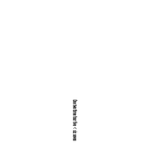](../../../../../benchmarks/accuracy/conformance-reference/text-block-R-40.png) | [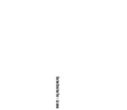](../../../conformance/images/text-block-R-40-codyps-zpl.png) |  |

Library dimensions: [832, 1218]; missing ink: 10; extra ink: 2 pixels.

## labelize

**labelize (Rust)**

rendered · 2.48% IoU · [All cases for this library](../features/libraries/labelize.md)

| Printer preview | Library render | Difference |
|---|---|---|
|  |  | [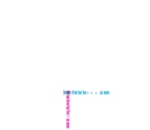](../features/images/text-block-R-40-labelize-diff.png) |

Library dimensions: [832, 1218]; missing ink: 1578; extra ink: 1688 pixels.

## forge

**zpl-forge (Rust)**

rendered · 2.69% IoU · [All cases for this library](../features/libraries/forge.md)

| Printer preview | Library render | Difference |
|---|---|---|
|  |  | [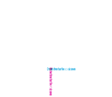](../features/images/text-block-R-40-forge-diff.png) |

Library dimensions: [832, 1218]; missing ink: 1577; extra ink: 1463 pixels.

## go

**go-zpl (Go)**

rendered · 2.62% IoU · [All cases for this library](../features/libraries/go.md)

| Printer preview | Library render | Difference |
|---|---|---|
|  |  | [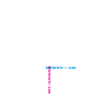](../features/images/text-block-R-40-go-diff.png) |

Library dimensions: [832, 1218]; missing ink: 1571; extra ink: 1774 pixels.

## ffi

**zpl-rs (Rust → Go)**

rendered · 2.62% IoU · [All cases for this library](../features/libraries/ffi.md)

| Printer preview | Library render | Difference |
|---|---|---|
|  |  |  |

Library dimensions: [832, 1218]; missing ink: 1571; extra ink: 1774 pixels.

## binarykits

**BinaryKits.Zpl (.NET)**

rendered · 1.73% IoU · [All cases for this library](../features/libraries/binarykits.md)

| Printer preview | Library render | Difference |
|---|---|---|
|  | [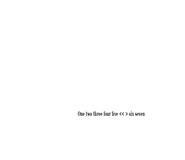](../../../conformance/images/text-block-R-40-binarykits.png) | [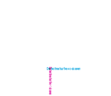](../features/images/text-block-R-40-binarykits-diff.png) |

Library dimensions: [832, 1218]; missing ink: 1609; extra ink: 1345 pixels.

## zplr

**ZPLr (TypeScript)**

rendered · 17.72% IoU · [All cases for this library](../features/libraries/zplr.md)

| Printer preview | Library render | Difference |
|---|---|---|
|  | [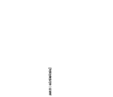](../../../conformance/images/text-block-R-40-zplr.png) | [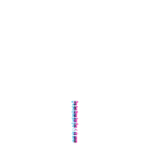](../features/images/text-block-R-40-zplr-diff.png) |

Library dimensions: [832, 1218]; missing ink: 1183; extra ink: 1037 pixels.

## labelary

**Labelary (SaaS)**

rendered · 38.43% IoU · [All cases for this library](../features/libraries/labelary.md)

[Labelary capture timestamps, HTTP metadata, and original responses](../../../labelary/README.md)

| Printer preview | Library render | Difference |
|---|---|---|
|  | [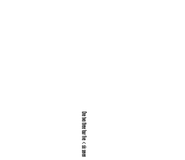](../../../conformance/images/text-block-R-40-labelary.png) | [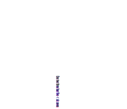](../features/images/text-block-R-40-labelary-diff.png) |

Library dimensions: [832, 1218]; missing ink: 754; extra ink: 699 pixels.
