<!-- Generated by Bazel from cached render/comparison actions. -->

# zpl-toolchain-product_label

Black = matching ink; magenta = printer only; cyan = library only. Compact previews share a common origin and crop only trailing blank space; click for the full-resolution image. Scores always use uncropped original pixels.

Printer and Labelary captures retain their original capture dates. Local renders are cached independently; execution timestamps are recorded per result in results.json.

[Corpus comparisons](../external/README.md) · [All accuracy comparisons](../../README.md)

External product label; unchanged upstream bytes

[ZPL source](../../../../../test-data/external-zpl/cases/zpl-toolchain-product_label.zpl)

Validity: boundary. Not certified for validity or printer fidelity. Canvas supplied by harness when omitted by source.

Source: https://github.com/trevordcampbell/zpl-toolchain/blob/3da58518c1013fffd46d2147b0927a1d5b4aeab5/samples/product_label.zpl

## codyps-zpl

**codyps/zpl (Rust)**

rendered · 29.34% IoU · [All cases for this library](../external/libraries/codyps-zpl.md)

| Printer preview | Library render | Difference |
|---|---|---|
| [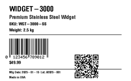](../../../../../benchmarks/accuracy/external-reference/zpl-toolchain-product_label.png) | [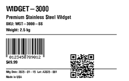](../../../external-zpl/images/zpl-toolchain-product_label-codyps-zpl.png) | [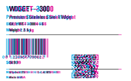](../external/images/zpl-toolchain-product_label-codyps-zpl-diff.png) |

Library dimensions: [609, 406]; missing ink: 14489; extra ink: 14435 pixels.

## labelize

**labelize (Rust)**

rendered · 29.82% IoU · [All cases for this library](../external/libraries/labelize.md)

| Printer preview | Library render | Difference |
|---|---|---|
|  | [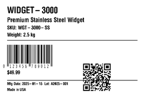](../../../external-zpl/images/zpl-toolchain-product_label-labelize.png) | [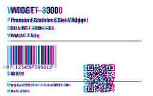](../external/images/zpl-toolchain-product_label-labelize-diff.png) |

Library dimensions: [609, 406]; missing ink: 14234; extra ink: 14639 pixels.

## forge

**zpl-forge (Rust)**

rendered · 23.26% IoU · [All cases for this library](../external/libraries/forge.md)

| Printer preview | Library render | Difference |
|---|---|---|
|  | [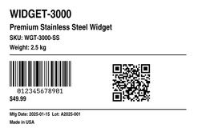](../../../external-zpl/images/zpl-toolchain-product_label-forge.png) | [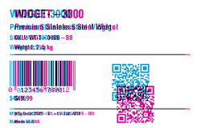](../external/images/zpl-toolchain-product_label-forge-diff.png) |

Library dimensions: [609, 406]; missing ink: 16682; extra ink: 15705 pixels.

## go

**go-zpl (Go)**

rendered · 20.23% IoU · [All cases for this library](../external/libraries/go.md)

| Printer preview | Library render | Difference |
|---|---|---|
|  |  | [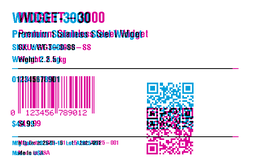](../external/images/zpl-toolchain-product_label-go-diff.png) |

Library dimensions: [609, 406]; missing ink: 18598; extra ink: 12560 pixels.

## ffi

**zpl-rs (Rust → Go)**

rendered · 20.23% IoU · [All cases for this library](../external/libraries/ffi.md)

| Printer preview | Library render | Difference |
|---|---|---|
|  | [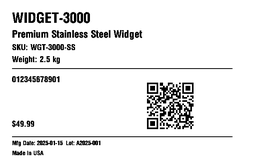](../../../external-zpl/images/zpl-toolchain-product_label-ffi.png) |  |

Library dimensions: [609, 406]; missing ink: 18598; extra ink: 12560 pixels.

## binarykits

**BinaryKits.Zpl (.NET)**

rendered · 23.40% IoU · [All cases for this library](../external/libraries/binarykits.md)

| Printer preview | Library render | Difference |
|---|---|---|
|  | [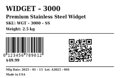](../../../external-zpl/images/zpl-toolchain-product_label-binarykits.png) |  |

Library dimensions: [609, 406]; missing ink: 16591; extra ink: 15841 pixels.

## zplr

**ZPLr (TypeScript)**

rendered · 28.70% IoU · [All cases for this library](../external/libraries/zplr.md)

| Printer preview | Library render | Difference |
|---|---|---|
|  | [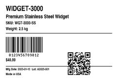](../../../external-zpl/images/zpl-toolchain-product_label-zplr.png) | [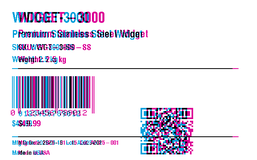](../external/images/zpl-toolchain-product_label-zplr-diff.png) |

Library dimensions: [609, 406]; missing ink: 14840; extra ink: 14132 pixels.

## labelary

**Labelary (SaaS)**

rendered · 30.27% IoU · [All cases for this library](../external/libraries/labelary.md)

[Labelary capture timestamps, HTTP metadata, and original responses](../../../labelary/README.md)

| Printer preview | Library render | Difference |
|---|---|---|
|  |  | [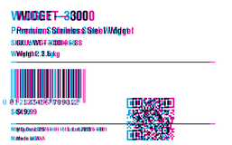](../external/images/zpl-toolchain-product_label-labelary-diff.png) |

Library dimensions: [609, 406]; missing ink: 14180; extra ink: 14199 pixels.
