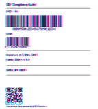
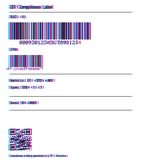
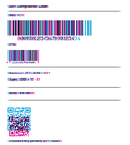
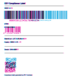
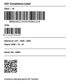
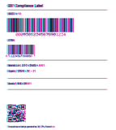
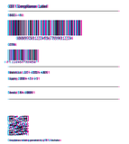

<!-- Generated by benchmarks/accuracy/features.py. -->

# zpl-toolchain-compliance_label

[Feature comparisons](../README.md) · [All accuracy comparisons](../../README.md)

External compliance label; unchanged upstream bytes

boundary / printer · [ZPL input](../../../../../../test-data/external-zpl/cases/zpl-toolchain-compliance_label.zpl)

Black = matching ink; magenta = printer only; cyan = library only. Compact previews share a common origin and crop only trailing blank space; click for the full-resolution image. Scores always use uncropped original pixels. Blank printer references and invalid inputs are unscored; renderer failures score zero against nonblank printer references.

[Source / inspiration](https://github.com/trevordcampbell/zpl-toolchain/blob/3da58518c1013fffd46d2147b0927a1d5b4aeab5/samples/compliance_label.zpl)

Not certified for validity or printer fidelity. Canvas supplied by harness when omitted by source.

## codyps-zpl

**codyps/zpl (Rust): rendered; 33.64% IoU** · [All tests for this library](../libraries/codyps-zpl.md)

| Printer preview | Library render | Difference |
| --- | --- | --- |
|  |  |  |

## labelize

**labelize (Rust): rendered; 34.32% IoU** · [All tests for this library](../libraries/labelize.md)

| Printer preview | Library render | Difference |
| --- | --- | --- |
|  |  |  |

## forge

**zpl-forge (Rust): rendered; 30.25% IoU** · [All tests for this library](../libraries/forge.md)

| Printer preview | Library render | Difference |
| --- | --- | --- |
|  |  |  |

## go

**go-zpl (Go): rendered; 26.35% IoU** · [All tests for this library](../libraries/go.md)

| Printer preview | Library render | Difference |
| --- | --- | --- |
|  |  |  |

## ffi

**zpl-rs (Rust → Go): rendered; 26.35% IoU** · [All tests for this library](../libraries/ffi.md)

| Printer preview | Library render | Difference |
| --- | --- | --- |
|  |  |  |

## binarykits

**BinaryKits.Zpl (.NET): rendered; 30.30% IoU** · [All tests for this library](../libraries/binarykits.md)

| Printer preview | Library render | Difference |
| --- | --- | --- |
|  |  |  |

## zplr

**ZPLr (TypeScript): rendered; 34.85% IoU** · [All tests for this library](../libraries/zplr.md)

| Printer preview | Library render | Difference |
| --- | --- | --- |
|  |  |  |

## labelary

**Labelary (SaaS): rendered; 34.51% IoU** · [All tests for this library](../libraries/labelary.md)

| Printer preview | Library render | Difference |
| --- | --- | --- |
|  |  |  |

