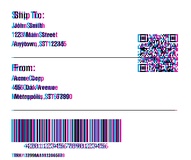
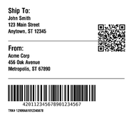
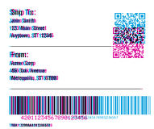
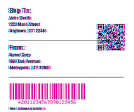
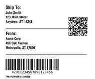

<!-- Generated by Bazel from cached render/comparison actions. -->

# zpl-toolchain-shipping_label

Black = matching ink; magenta = printer only; cyan = library only. Compact previews share a common origin and crop only trailing blank space; click for the full-resolution image. Scores always use uncropped original pixels.

Printer and Labelary captures retain their original capture dates. Local renders are cached independently; execution timestamps are recorded per result in results.json.

[All comparisons](../README.md) · [Accuracy summary](../../../README.md)

External shipping label; unchanged upstream bytes

[ZPL source](../../../../../../test-data/external-zpl/cases/zpl-toolchain-shipping_label.zpl)

Validity: boundary. Not certified for validity or printer fidelity. Canvas supplied by harness when omitted by source.

Source: https://github.com/trevordcampbell/zpl-toolchain/blob/3da58518c1013fffd46d2147b0927a1d5b4aeab5/samples/shipping_label.zpl

## codyps-zpl

**codyps/zpl (Rust)**

rendered · 31.70% IoU · [All cases for this library](../libraries/codyps-zpl.md)

| Printer preview | Library render | Difference |
|---|---|---|
|  |  |  |

Library dimensions: [812, 1218]; missing ink: 30564; extra ink: 30820 pixels.

## labelize

**labelize (Rust)**

rendered · 32.25% IoU · [All cases for this library](../libraries/labelize.md)

| Printer preview | Library render | Difference |
|---|---|---|
|  |  |  |

Library dimensions: [812, 1218]; missing ink: 28776; extra ink: 34836 pixels.

## forge

**zpl-forge (Rust)**

rendered · 27.76% IoU · [All cases for this library](../libraries/forge.md)

| Printer preview | Library render | Difference |
|---|---|---|
|  |  |  |

Library dimensions: [812, 1218]; missing ink: 32766; extra ink: 35655 pixels.

## go

**go-zpl (Go)**

rendered · 25.77% IoU · [All cases for this library](../libraries/go.md)

| Printer preview | Library render | Difference |
|---|---|---|
|  |  |  |

Library dimensions: [812, 1218]; missing ink: 31120; extra ink: 49341 pixels.

## ffi

**zpl-rs (Rust → Go)**

rendered · 25.77% IoU · [All cases for this library](../libraries/ffi.md)

| Printer preview | Library render | Difference |
|---|---|---|
|  |  |  |

Library dimensions: [812, 1218]; missing ink: 31120; extra ink: 49341 pixels.

## binarykits

**BinaryKits.Zpl (.NET)**

rendered · 25.92% IoU · [All cases for this library](../libraries/binarykits.md)

| Printer preview | Library render | Difference |
|---|---|---|
|  |  |  |

Library dimensions: [812, 1218]; missing ink: 33608; extra ink: 39120 pixels.

## zplr

**ZPLr (TypeScript)**

rendered · 21.01% IoU · [All cases for this library](../libraries/zplr.md)

| Printer preview | Library render | Difference |
|---|---|---|
|  |  |  |

Library dimensions: [812, 1218]; missing ink: 43526; extra ink: 14855 pixels.

## labelary

**Labelary (SaaS)**

rendered · 32.48% IoU · [All cases for this library](../libraries/labelary.md)

[Labelary capture timestamps, HTTP metadata, and original responses](../../../../labelary/README.md)

| Printer preview | Library render | Difference |
|---|---|---|
|  |  |  |

Library dimensions: [812, 1218]; missing ink: 29969; extra ink: 30487 pixels.
