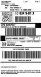
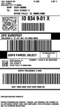
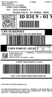
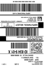
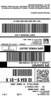

<!-- Generated by Bazel from cached render/comparison actions. -->

# zpl-toolchain-usps_surepost_sample

Black = matching ink; magenta = printer only; cyan = library only. Compact previews share a common origin and crop only trailing blank space; click for the full-resolution image. Scores always use uncropped original pixels.

Printer and Labelary captures retain their original capture dates. Local renders are cached independently; execution timestamps are recorded per result in results.json.

[All comparisons](../README.md) · [Accuracy summary](../../../README.md)

External printer-configuration label; unchanged upstream bytes

[ZPL source](../../../../../../test-data/external-zpl/cases/zpl-toolchain-usps_surepost_sample.zpl)

Validity: boundary. Not certified for validity or printer fidelity. Canvas supplied by harness when omitted by source.

Source: https://github.com/trevordcampbell/zpl-toolchain/blob/3da58518c1013fffd46d2147b0927a1d5b4aeab5/samples/usps_surepost_sample.zpl

Printer capture excluded: invalid or stateful/device-dependent operations. Local renders remain visible and unscored.

## codyps-zpl

**codyps/zpl (Rust)**

error · unscored · [All cases for this library](../libraries/codyps-zpl.md)

| Printer preview | Library render | Difference |
|---|---|---|
| No scored printer capture | Render failed; no image | Unavailable |

~~~text

thread 'main' (19855) panicked at src/main.rs:27:10:
render: RenderError { offset: 9, message: "unsupported command MN" }
note: run with `RUST_BACKTRACE=1` environment variable to display a backtrace

~~~

## labelize

**labelize (Rust)**

rendered · unscored · [All cases for this library](../libraries/labelize.md)

| Printer preview | Library render | Difference |
|---|---|---|
| No scored printer capture |  | Unavailable |

## forge

**zpl-forge (Rust)**

error · unscored · [All cases for this library](../libraries/forge.md)

| Printer preview | Library render | Difference |
|---|---|---|
| No scored printer capture | Render failed; no image | Unavailable |

~~~text

thread 'main' (25861) panicked at src/main.rs:79:32:
PNG: BackendError("Barcode Generation Error: IllegalArgumentException - Found empty contents")
note: run with `RUST_BACKTRACE=1` environment variable to display a backtrace

~~~

## go

**go-zpl (Go)**

rendered · unscored · [All cases for this library](../libraries/go.md)

| Printer preview | Library render | Difference |
|---|---|---|
| No scored printer capture |  | Unavailable |

## ffi

**zpl-rs (Rust → Go)**

rendered · unscored · [All cases for this library](../libraries/ffi.md)

| Printer preview | Library render | Difference |
|---|---|---|
| No scored printer capture |  | Unavailable |

## binarykits

**BinaryKits.Zpl (.NET)**

rendered · unscored · [All cases for this library](../libraries/binarykits.md)

| Printer preview | Library render | Difference |
|---|---|---|
| No scored printer capture |  | Unavailable |

## zplr

**ZPLr (TypeScript)**

rendered · unscored · [All cases for this library](../libraries/zplr.md)

| Printer preview | Library render | Difference |
|---|---|---|
| No scored printer capture |  | Unavailable |

## labelary

**Labelary (SaaS)**

rendered · unscored · [All cases for this library](../libraries/labelary.md)

[Labelary capture timestamps, HTTP metadata, and original responses](../../../../labelary/README.md)

| Printer preview | Library render | Difference |
|---|---|---|
| No scored printer capture |  | Unavailable |
