<!-- Generated by Bazel from cached render/comparison actions. -->

# zpl-toolchain-warehouse_label

Black = matching ink; magenta = printer only; cyan = library only. Compact previews share a common origin and crop only trailing blank space; click for the full-resolution image. Scores always use uncropped original pixels.

Printer and Labelary captures retain their original capture dates. Local renders are cached independently; execution timestamps are recorded per result in results.json.

[Corpus comparisons](../README.md) · [All accuracy comparisons](../../../README.md)

External warehouse label; unchanged upstream bytes

[ZPL source](../../../../../../test-data/external-zpl/cases/zpl-toolchain-warehouse_label.zpl)

Validity: boundary. Not certified for validity or printer fidelity. Canvas supplied by harness when omitted by source.

Source: https://github.com/trevordcampbell/zpl-toolchain/blob/3da58518c1013fffd46d2147b0927a1d5b4aeab5/samples/warehouse_label.zpl

## codyps-zpl

**codyps/zpl (Rust)**

rendered · 45.07% IoU · [All cases for this library](../libraries/codyps-zpl.md)

| Printer preview | Library render | Difference |
|---|---|---|
| [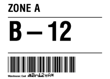](../../../../../../benchmarks/accuracy/external-reference/zpl-toolchain-warehouse_label.png) | [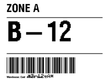](../../../../external-zpl/images/zpl-toolchain-warehouse_label-codyps-zpl.png) | [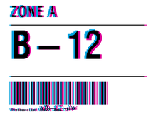](../images/zpl-toolchain-warehouse_label-codyps-zpl-diff.png) |

Library dimensions: [812, 609]; missing ink: 27990; extra ink: 28851 pixels.

## labelize

**labelize (Rust)**

rendered · 43.57% IoU · [All cases for this library](../libraries/labelize.md)

| Printer preview | Library render | Difference |
|---|---|---|
|  | [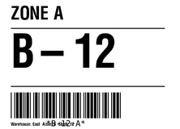](../../../../external-zpl/images/zpl-toolchain-warehouse_label-labelize.png) | [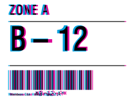](../images/zpl-toolchain-warehouse_label-labelize-diff.png) |

Library dimensions: [812, 609]; missing ink: 28754; extra ink: 30648 pixels.

## forge

**zpl-forge (Rust)**

rendered · 37.76% IoU · [All cases for this library](../libraries/forge.md)

| Printer preview | Library render | Difference |
|---|---|---|
|  | [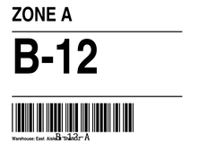](../../../../external-zpl/images/zpl-toolchain-warehouse_label-forge.png) |  |

Library dimensions: [812, 609]; missing ink: 34596; extra ink: 31389 pixels.

## go

**go-zpl (Go)**

rendered · 30.07% IoU · [All cases for this library](../libraries/go.md)

| Printer preview | Library render | Difference |
|---|---|---|
|  |  |  |

Library dimensions: [812, 609]; missing ink: 40740; extra ink: 38042 pixels.

## ffi

**zpl-rs (Rust → Go)**

rendered · 30.07% IoU · [All cases for this library](../libraries/ffi.md)

| Printer preview | Library render | Difference |
|---|---|---|
|  | [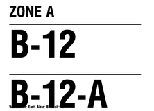](../../../../external-zpl/images/zpl-toolchain-warehouse_label-ffi.png) | [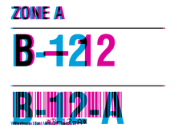](../images/zpl-toolchain-warehouse_label-ffi-diff.png) |

Library dimensions: [812, 609]; missing ink: 40740; extra ink: 38042 pixels.

## binarykits

**BinaryKits.Zpl (.NET)**

rendered · 31.94% IoU · [All cases for this library](../libraries/binarykits.md)

| Printer preview | Library render | Difference |
|---|---|---|
|  | [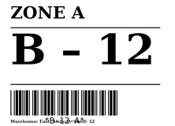](../../../../external-zpl/images/zpl-toolchain-warehouse_label-binarykits.png) |  |

Library dimensions: [812, 609]; missing ink: 37302; extra ink: 42232 pixels.

## zplr

**ZPLr (TypeScript)**

rendered · 38.10% IoU · [All cases for this library](../libraries/zplr.md)

| Printer preview | Library render | Difference |
|---|---|---|
|  |  | [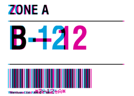](../images/zpl-toolchain-warehouse_label-zplr-diff.png) |

Library dimensions: [812, 609]; missing ink: 34233; extra ink: 31396 pixels.

## labelary

**Labelary (SaaS)**

rendered · 45.36% IoU · [All cases for this library](../libraries/labelary.md)

[Labelary capture timestamps, HTTP metadata, and original responses](../../../../labelary/README.md)

| Printer preview | Library render | Difference |
|---|---|---|
|  | [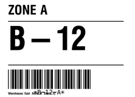](../../../../external-zpl/images/zpl-toolchain-warehouse_label-labelary.png) |  |

Library dimensions: [812, 609]; missing ink: 28110; extra ink: 27929 pixels.
