<!-- Generated by Bazel from cached render/comparison actions. -->

# zplr-retail-upc-ean

Black = matching ink; magenta = printer only; cyan = library only. Compact previews share a common origin and crop only trailing blank space; click for the full-resolution image. Scores always use uncropped original pixels.

Printer and Labelary captures retain their original capture dates. Local renders are cached independently; execution timestamps are recorded per result in results.json.

[Corpus comparisons](../README.md) · [All accuracy comparisons](../../../README.md)

External retail label; unchanged upstream bytes

[ZPL source](../../../../../../test-data/external-zpl/cases/zplr-retail-upc-ean.zpl)

Validity: boundary. Not certified for validity or printer fidelity. Canvas supplied by harness when omitted by source.

Source: https://github.com/le2ni/zplr/blob/1c94eadfc5afb494b4c92dd10ad4808bd3d19529/fixtures/retail-upc-ean.zpl

## codyps-zpl

**codyps/zpl (Rust)**

error · 0.00% IoU · [All cases for this library](../libraries/codyps-zpl.md)

| Printer preview | Library render | Difference |
|---|---|---|
| [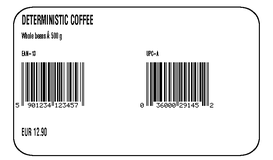](../../../../../../benchmarks/accuracy/external-reference/zplr-retail-upc-ean.png) | Render failed; no image | Unavailable |

~~~text

thread 'main' (27241) panicked at src/main.rs:27:10:
render: RenderError { offset: 110, message: "unsupported legacy text byte; select ^CI28 for UTF-8" }
note: run with `RUST_BACKTRACE=1` environment variable to display a backtrace

~~~

## labelize

**labelize (Rust)**

rendered · 28.34% IoU · [All cases for this library](../libraries/labelize.md)

| Printer preview | Library render | Difference |
|---|---|---|
|  | [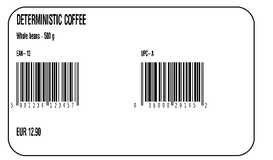](../../../../external-zpl/images/zplr-retail-upc-ean-labelize.png) | [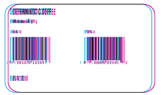](../images/zplr-retail-upc-ean-labelize-diff.png) |

Library dimensions: [800, 500]; missing ink: 21872; extra ink: 21016 pixels.

## forge

**zpl-forge (Rust)**

rendered · 28.09% IoU · [All cases for this library](../libraries/forge.md)

| Printer preview | Library render | Difference |
|---|---|---|
|  | [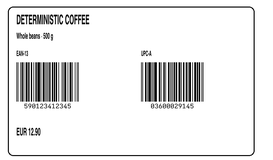](../../../../external-zpl/images/zplr-retail-upc-ean-forge.png) | [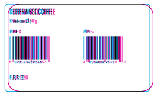](../images/zplr-retail-upc-ean-forge-diff.png) |

Library dimensions: [800, 500]; missing ink: 22061; extra ink: 20882 pixels.

## go

**go-zpl (Go)**

rendered · 13.79% IoU · [All cases for this library](../libraries/go.md)

| Printer preview | Library render | Difference |
|---|---|---|
|  |  |  |

Library dimensions: [800, 500]; missing ink: 32373; extra ink: 8017 pixels.

## ffi

**zpl-rs (Rust → Go)**

rendered · 13.79% IoU · [All cases for this library](../libraries/ffi.md)

| Printer preview | Library render | Difference |
|---|---|---|
|  | [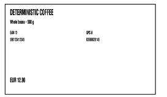](../../../../external-zpl/images/zplr-retail-upc-ean-ffi.png) | [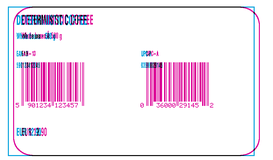](../images/zplr-retail-upc-ean-ffi-diff.png) |

Library dimensions: [800, 500]; missing ink: 32373; extra ink: 8017 pixels.

## binarykits

**BinaryKits.Zpl (.NET)**

rendered · 27.35% IoU · [All cases for this library](../libraries/binarykits.md)

| Printer preview | Library render | Difference |
|---|---|---|
|  | [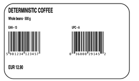](../../../../external-zpl/images/zplr-retail-upc-ean-binarykits.png) | [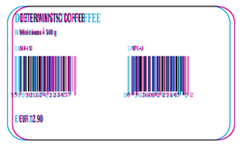](../images/zplr-retail-upc-ean-binarykits-diff.png) |

Library dimensions: [800, 500]; missing ink: 22374; extra ink: 21333 pixels.

## zplr

**ZPLr (TypeScript)**

rendered · 28.08% IoU · [All cases for this library](../libraries/zplr.md)

| Printer preview | Library render | Difference |
|---|---|---|
|  | [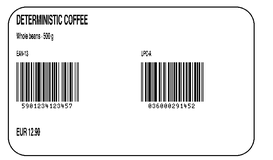](../../../../external-zpl/images/zplr-retail-upc-ean-zplr.png) |  |

Library dimensions: [800, 500]; missing ink: 22048; extra ink: 20944 pixels.

## labelary

**Labelary (SaaS)**

rendered · 27.90% IoU · [All cases for this library](../libraries/labelary.md)

[Labelary capture timestamps, HTTP metadata, and original responses](../../../../labelary/README.md)

| Printer preview | Library render | Difference |
|---|---|---|
|  |  | [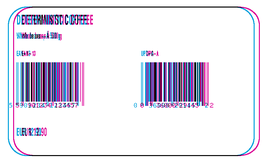](../images/zplr-retail-upc-ean-labelary-diff.png) |

Library dimensions: [800, 500]; missing ink: 21917; extra ink: 21785 pixels.
