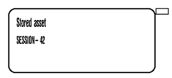
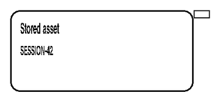
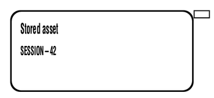

<!-- Generated by benchmarks/accuracy/features.py. -->

# zplr-stored-resources

[Feature comparisons](../README.md) · [All accuracy comparisons](../../README.md)

External stateful label; unchanged upstream bytes

boundary / printer · [ZPL input](../../../../../../test-data/external-zpl/cases/zplr-stored-resources.zpl)

Black = matching ink; magenta = printer only; cyan = library only. Compact previews share a common origin and crop only trailing blank space; click for the full-resolution image. Scores always use uncropped original pixels. Blank printer references and invalid inputs are unscored; renderer failures score zero against nonblank printer references.

[Source / inspiration](https://github.com/le2ni/zplr/blob/1c94eadfc5afb494b4c92dd10ad4808bd3d19529/fixtures/stored-resources.zpl)

Not certified for validity or printer fidelity. Canvas supplied by harness when omitted by source.

Printer capture excluded: invalid input or stateful/device-dependent operations. Offline renders remain visible and unscored.

## codyps-zpl

**codyps/zpl (Rust): error; unscored** · [All tests for this library](../libraries/codyps-zpl.md)

| Printer preview | Library render | Difference |
| --- | --- | --- |
| No printer preview; unscored | Unavailable | Unavailable |

~~~text

thread 'main' (46424860) panicked at src/main.rs:27:10:
render: RenderError { offset: 56, message: "unsupported command DF" }
note: run with `RUST_BACKTRACE=1` environment variable to display a backtrace

~~~

## labelize

**labelize (Rust): rendered; unscored** · [All tests for this library](../libraries/labelize.md)

| Printer preview | Library render | Difference |
| --- | --- | --- |
| No printer preview; unscored |  | Unavailable |

## forge

**zpl-forge (Rust): error; unscored** · [All tests for this library](../libraries/forge.md)

| Printer preview | Library render | Difference |
| --- | --- | --- |
| No printer preview; unscored | Unavailable | Unavailable |

~~~text

thread 'main' (46424870) panicked at src/main.rs:74:10:
parse: ParseError { line: 1, message: "Invalid or malformed ZPL command (Error code: Eof)" }
note: run with `RUST_BACKTRACE=1` environment variable to display a backtrace

~~~

## go

**go-zpl (Go): rendered; unscored** · [All tests for this library](../libraries/go.md)

| Printer preview | Library render | Difference |
| --- | --- | --- |
| No printer preview; unscored |  | Unavailable |

## ffi

**zpl-rs (Rust → Go): rendered; unscored** · [All tests for this library](../libraries/ffi.md)

| Printer preview | Library render | Difference |
| --- | --- | --- |
| No printer preview; unscored |  | Unavailable |

## binarykits

**BinaryKits.Zpl (.NET): crashed; unscored** · [All tests for this library](../libraries/binarykits.md)

| Printer preview | Library render | Difference |
| --- | --- | --- |
| No printer preview; unscored | Unavailable | Unavailable |

~~~text
Unhandled exception. System.InvalidOperationException: Could not find format R:ASSET.ZPL
   at BinaryKits.Zpl.Viewer.FormatMerger.GetFormatLabelInfo(ZplRecallFormat recallFormat, Dictionary`2 templateFormats)
   at BinaryKits.Zpl.Viewer.FormatMerger.GetMergedElements(LabelInfo rawLabelInfo, Dictionary`2 templateFormats)
   at BinaryKits.Zpl.Viewer.FormatMerger.MergeFormats(List`1 rawLabelInfos)
   at BinaryKits.Zpl.Viewer.ZplAnalyzer.Analyze(String zplData)
   at Program.<<Main>$>g__Operation|0_0(<>c__DisplayClass0_0&) in /Volumes/dev/p/zpl-comparison/benchmarks/adapters/dotnet/Program.cs:line 14
   at Program.<Main>$(String[] args) in /Volumes/dev/p/zpl-comparison/benchmarks/adapters/dotnet/Program.cs:line 40

~~~

## zplr

**ZPLr (TypeScript): rendered; unscored** · [All tests for this library](../libraries/zplr.md)

| Printer preview | Library render | Difference |
| --- | --- | --- |
| No printer preview; unscored |  | Unavailable |

## labelary

**Labelary (SaaS): rendered; unscored** · [All tests for this library](../libraries/labelary.md)

| Printer preview | Library render | Difference |
| --- | --- | --- |
| No printer preview; unscored |  | Unavailable |

