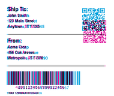
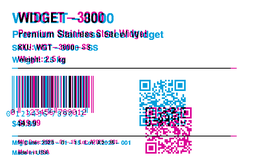
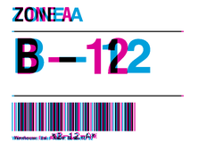
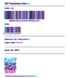
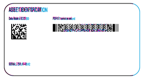

<!-- Generated by benchmarks/accuracy/features.py. -->

# BinaryKits.Zpl (.NET) versus printer previews

[All fixtures](../README.md)

Black = matching ink; magenta = printer only; cyan = library only. Compact previews share a common origin and crop only trailing blank space; click for the full-resolution image. Scores always use uncropped original pixels. Blank printer references and invalid inputs are unscored; renderer failures score zero against nonblank printer references.

| Test | Result | Difference |
| --- | --- | --- |
| [zpl-toolchain-shipping_label](../cases/zpl-toolchain-shipping_label.md#binarykits) | 26.05% IoU |  |
| [zpl-toolchain-product_label](../cases/zpl-toolchain-product_label.md#binarykits) | 24.30% IoU |  |
| [zpl-toolchain-warehouse_label](../cases/zpl-toolchain-warehouse_label.md#binarykits) | 36.56% IoU |  |
| [zpl-toolchain-compliance_label](../cases/zpl-toolchain-compliance_label.md#binarykits) | 30.30% IoU |  |
| [zpl-toolchain-usps_surepost_sample](../cases/zpl-toolchain-usps_surepost_sample.md#binarykits) | Unscored | No printer reference |
| [zplr-asset-matrix-pdf417](../cases/zplr-asset-matrix-pdf417.md#binarykits) | 67.23% IoU |  |
| [zplr-retail-upc-ean](../cases/zplr-retail-upc-ean.md#binarykits) | 27.88% IoU |  |
| [zplr-stored-resources](../cases/zplr-stored-resources.md#binarykits) | Unscored | Unavailable: crashed |

