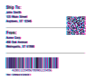
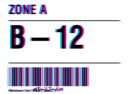
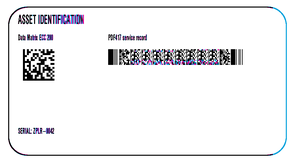

<!-- Generated by Bazel from cached render/comparison actions. -->

# labelary versus printer

Black = matching ink; magenta = printer only; cyan = library only. Compact previews share a common origin and crop only trailing blank space; click for the full-resolution image. Scores always use uncropped original pixels.

Printer and Labelary captures retain their original capture dates. Local renders are cached independently; execution timestamps are recorded per result in results.json.

[Corpus comparisons](../README.md) · [All accuracy comparisons](../../../README.md)

| Case | Group | Result | Difference |
|---|---|---|---|
| [zpl-toolchain-shipping_label](../../cases/external-zpl-zpl-toolchain-shipping_label.md) | shipping | rendered · 32.48% IoU |  |
| [zpl-toolchain-product_label](../../cases/external-zpl-zpl-toolchain-product_label.md) | product | rendered · 30.27% IoU |  |
| [zpl-toolchain-warehouse_label](../../cases/external-zpl-zpl-toolchain-warehouse_label.md) | warehouse | rendered · 45.36% IoU |  |
| [zpl-toolchain-compliance_label](../../cases/external-zpl-zpl-toolchain-compliance_label.md) | compliance | rendered · 34.51% IoU |  |
| [zpl-toolchain-usps_surepost_sample](../../cases/external-zpl-zpl-toolchain-usps_surepost_sample.md) | printer-configuration | rendered · unscored | Unavailable |
| [zplr-asset-matrix-pdf417](../../cases/external-zpl-zplr-asset-matrix-pdf417.md) | asset | rendered · 75.83% IoU |  |
| [zplr-retail-upc-ean](../../cases/external-zpl-zplr-retail-upc-ean.md) | retail | rendered · 27.90% IoU |  |
| [zplr-stored-resources](../../cases/external-zpl-zplr-stored-resources.md) | stateful | rendered · unscored | Unavailable |
