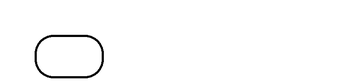
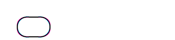
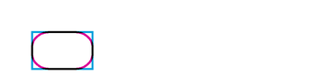
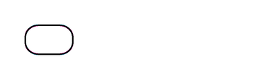

<!-- Generated by Bazel from cached render/comparison actions. -->

# box-rounding-7

Black = matching ink; magenta = printer only; cyan = library only. Compact previews share a common origin and crop only trailing blank space; click for the full-resolution image. Scores always use uncropped original pixels.

Printer and Labelary captures retain their original capture dates. Local renders are cached independently; execution timestamps are recorded per result in results.json.

[Corpus comparisons](../README.md) · [All accuracy comparisons](../../../README.md)

GB corner rounding 7 of 0..8

[ZPL source](../../../../../../test-data/render-conformance/cases/shapes/box-rounding-7.zpl)

Validity: valid. 

Zebra programming guide: [^BY](../../../../../zpl-zbi2-pg-en.pdf#page=148) · [^CF](../../../../../zpl-zbi2-pg-en.pdf#page=154) · [^CI](../../../../../zpl-zbi2-pg-en.pdf#page=155) · [^FO](../../../../../zpl-zbi2-pg-en.pdf#page=201) · [^FS](../../../../../zpl-zbi2-pg-en.pdf#page=204) · [^FW](../../../../../zpl-zbi2-pg-en.pdf#page=208) · [^GB](../../../../../zpl-zbi2-pg-en.pdf#page=210) · [^LH](../../../../../zpl-zbi2-pg-en.pdf#page=293) · [^LL](../../../../../zpl-zbi2-pg-en.pdf#page=294) · [^LR](../../../../../zpl-zbi2-pg-en.pdf#page=295) · [^LS](../../../../../zpl-zbi2-pg-en.pdf#page=296) · [^LT](../../../../../zpl-zbi2-pg-en.pdf#page=297) · [^PO](../../../../../zpl-zbi2-pg-en.pdf#page=322) · [^PW](../../../../../zpl-zbi2-pg-en.pdf#page=329) · [^XA](../../../../../zpl-zbi2-pg-en.pdf#page=370) · [^XZ](../../../../../zpl-zbi2-pg-en.pdf#page=375)

## codyps-zpl

**codyps/zpl (Rust)**

rendered · 100.00% IoU · exact · [All cases for this library](../libraries/codyps-zpl.md)

| Printer preview | Library render | Difference |
|---|---|---|
|  |  |  |

Library dimensions: [832, 1218]; missing ink: 0; extra ink: 0 pixels.

## labelize

**labelize (Rust)**

rendered · 83.58% IoU · [All cases for this library](../libraries/labelize.md)

| Printer preview | Library render | Difference |
|---|---|---|
|  |  |  |

Library dimensions: [832, 1218]; missing ink: 228; extra ink: 164 pixels.

## forge

**zpl-forge (Rust)**

rendered · 68.22% IoU · [All cases for this library](../libraries/forge.md)

| Printer preview | Library render | Difference |
|---|---|---|
|  |  |  |

Library dimensions: [832, 1218]; missing ink: 464; extra ink: 356 pixels.

## go

**go-zpl (Go)**

rendered · 40.76% IoU · [All cases for this library](../libraries/go.md)

| Printer preview | Library render | Difference |
|---|---|---|
|  |  |  |

Library dimensions: [832, 1218]; missing ink: 856; extra ink: 1132 pixels.

## ffi

**zpl-rs (Rust → Go)**

rendered · 40.76% IoU · [All cases for this library](../libraries/ffi.md)

| Printer preview | Library render | Difference |
|---|---|---|
|  |  |  |

Library dimensions: [832, 1218]; missing ink: 856; extra ink: 1132 pixels.

## binarykits

**BinaryKits.Zpl (.NET)**

rendered · 88.90% IoU · [All cases for this library](../libraries/binarykits.md)

| Printer preview | Library render | Difference |
|---|---|---|
|  |  |  |

Library dimensions: [832, 1218]; missing ink: 94; extra ink: 172 pixels.

## zplr

**ZPLr (TypeScript)**

rendered · 90.10% IoU · [All cases for this library](../libraries/zplr.md)

| Printer preview | Library render | Difference |
|---|---|---|
|  |  |  |

Library dimensions: [832, 1218]; missing ink: 148; extra ink: 80 pixels.

## labelary

**Labelary (SaaS)**

rendered · 90.50% IoU · [All cases for this library](../libraries/labelary.md)

[Labelary capture timestamps, HTTP metadata, and original responses](../../../../labelary/README.md)

| Printer preview | Library render | Difference |
|---|---|---|
|  |  |  |

Library dimensions: [832, 1218]; missing ink: 128; extra ink: 92 pixels.
