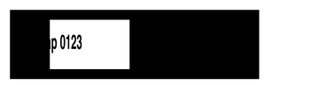
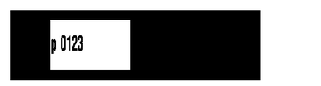
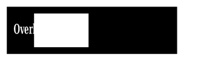

<!-- Generated by benchmarks/accuracy/features.py. -->

# compact-overlap-LR

[Feature comparisons](../README.md) · [All accuracy comparisons](../../README.md)

Reversed text overlapping black and white primitives

valid / printer · [ZPL input](../../../../../../test-data/render-conformance/cases/compact-compositing/compact-overlap-LR.zpl)

Black = matching ink; magenta = printer only; cyan = library only. Compact previews share a common origin and crop only trailing blank space; click for the full-resolution image. Scores always use uncropped original pixels. Blank printer references and invalid inputs are unscored; renderer failures score zero against nonblank printer references.

[Local source provenance and inspiration](../../../../../../test-data/render-conformance/INSPIRATION.md)

## codyps-zpl

**codyps/zpl (Rust): rendered; 100.00% IoU** · [All tests for this library](../libraries/codyps-zpl.md)

| Printer preview | Library render | Difference |
| --- | --- | --- |
|  |  |  |

## labelize

**labelize (Rust): rendered; 96.45% IoU** · [All tests for this library](../libraries/labelize.md)

| Printer preview | Library render | Difference |
| --- | --- | --- |
|  |  |  |

## forge

**zpl-forge (Rust): rendered; 97.31% IoU** · [All tests for this library](../libraries/forge.md)

| Printer preview | Library render | Difference |
| --- | --- | --- |
|  |  |  |

## go

**go-zpl (Go): rendered; 97.44% IoU** · [All tests for this library](../libraries/go.md)

| Printer preview | Library render | Difference |
| --- | --- | --- |
|  |  |  |

## ffi

**zpl-rs (Rust → Go): rendered; 97.44% IoU** · [All tests for this library](../libraries/ffi.md)

| Printer preview | Library render | Difference |
| --- | --- | --- |
|  |  |  |

## binarykits

**BinaryKits.Zpl (.NET): rendered; 97.16% IoU** · [All tests for this library](../libraries/binarykits.md)

| Printer preview | Library render | Difference |
| --- | --- | --- |
|  |  |  |

## zplr

**ZPLr (TypeScript): rendered; 97.88% IoU** · [All tests for this library](../libraries/zplr.md)

| Printer preview | Library render | Difference |
| --- | --- | --- |
|  |  |  |

## labelary

**Labelary (SaaS): rendered; 98.05% IoU** · [All tests for this library](../libraries/labelary.md)

| Printer preview | Library render | Difference |
| --- | --- | --- |
|  |  |  |

