<!-- Generated by benchmarks/accuracy/features.py. -->

# font-H-R

[Feature comparisons](../README.md) · [All accuracy comparisons](../../README.md)

Resident font H, rotation R, punctuation, ascenders and descenders

valid / font-dependent · [ZPL input](../../../../../../test-data/render-conformance/cases/fonts/font-H-R.zpl)

Black = matching ink; magenta = printer only; cyan = library only. Compact previews share a common origin and crop only trailing blank space; click for the full-resolution image. Scores always use uncropped original pixels. Blank printer references and invalid inputs are unscored; renderer failures score zero against nonblank printer references.

## codyps-zpl

**codyps/zpl (Rust): error; 0.00% IoU** · [All tests for this library](../libraries/codyps-zpl.md)

| Printer preview | Library render | Difference |
| --- | --- | --- |
|  | Unavailable | Unavailable |

~~~text

thread 'main' (44630457) panicked at src/main.rs:27:10:
render: RenderError { offset: 75, message: "unsupported resident font" }
note: run with `RUST_BACKTRACE=1` environment variable to display a backtrace

~~~

## labelize

**labelize (Rust): rendered; 9.11% IoU** · [All tests for this library](../libraries/labelize.md)

| Printer preview | Library render | Difference |
| --- | --- | --- |
|  |  | [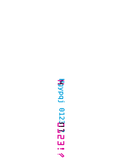](../images/font-H-R-labelize-diff.png) |

## forge

**zpl-forge (Rust): rendered; 19.46% IoU** · [All tests for this library](../libraries/forge.md)

| Printer preview | Library render | Difference |
| --- | --- | --- |
|  | [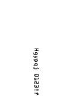](../../../../conformance/images/font-H-R-forge.png) | [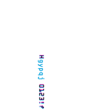](../images/font-H-R-forge-diff.png) |

## go

**go-zpl (Go): rendered; 4.40% IoU** · [All tests for this library](../libraries/go.md)

| Printer preview | Library render | Difference |
| --- | --- | --- |
|  | [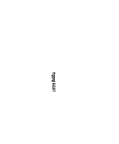](../../../../conformance/images/font-H-R-go.png) |  |

## ffi

**zpl-rs (Rust → Go): rendered; 4.40% IoU** · [All tests for this library](../libraries/ffi.md)

| Printer preview | Library render | Difference |
| --- | --- | --- |
|  |  | [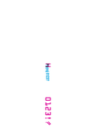](../images/font-H-R-ffi-diff.png) |

## binarykits

**BinaryKits.Zpl (.NET): rendered; 7.49% IoU** · [All tests for this library](../libraries/binarykits.md)

| Printer preview | Library render | Difference |
| --- | --- | --- |
|  | [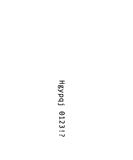](../../../../conformance/images/font-H-R-binarykits.png) | [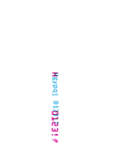](../images/font-H-R-binarykits-diff.png) |

## zplr

**ZPLr (TypeScript): rendered; 20.63% IoU** · [All tests for this library](../libraries/zplr.md)

| Printer preview | Library render | Difference |
| --- | --- | --- |
|  | [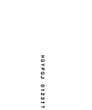](../../../../conformance/images/font-H-R-zplr.png) | [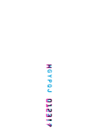](../images/font-H-R-zplr-diff.png) |

## labelary

**Labelary (SaaS): rendered; 80.40% IoU** · [All tests for this library](../libraries/labelary.md)

| Printer preview | Library render | Difference |
| --- | --- | --- |
|  | [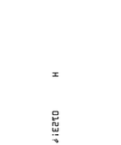](../../../../conformance/images/font-H-R-labelary.png) | [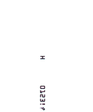](../images/font-H-R-labelary-diff.png) |

