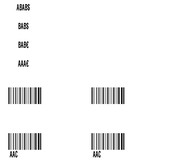
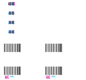
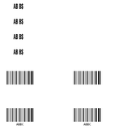
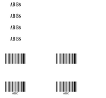
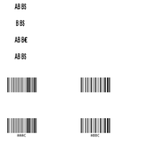
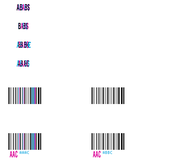

<!-- Generated by Bazel from cached render/comparison actions. -->

# printer-character-remap-space-barcode-clean

Black = matching ink; magenta = printer only; cyan = library only. Compact previews share a common origin and crop only trailing blank space; click for the full-resolution image. Scores always use uncropped original pixels.

Printer and Labelary captures retain their original capture dates. Local renders are cached independently; execution timestamps are recorded per result in results.json.

[Corpus comparisons](../README.md) · [All accuracy comparisons](../../../README.md)

character remap: space-barcode-clean

[ZPL source](../../../../../../test-data/render-conformance/cases/printer-character-remap/printer-character-remap-space-barcode-clean.zpl)

Validity: boundary. 

Source: references/upstream-zd621/character-remap-zd621-v1/space-barcode-clean.zpl

Zebra programming guide: [^A](../../../../../zpl-zbi2-pg-en.pdf#page=60) · [^BC](../../../../../zpl-zbi2-pg-en.pdf#page=94) · [^BY](../../../../../zpl-zbi2-pg-en.pdf#page=148) · [^CI](../../../../../zpl-zbi2-pg-en.pdf#page=155) · [^FD](../../../../../zpl-zbi2-pg-en.pdf#page=190) · [^FO](../../../../../zpl-zbi2-pg-en.pdf#page=201) · [^FP](../../../../../zpl-zbi2-pg-en.pdf#page=202) · [^FS](../../../../../zpl-zbi2-pg-en.pdf#page=204) · [^FW](../../../../../zpl-zbi2-pg-en.pdf#page=208) · [^LH](../../../../../zpl-zbi2-pg-en.pdf#page=293) · [^LL](../../../../../zpl-zbi2-pg-en.pdf#page=294) · [^LR](../../../../../zpl-zbi2-pg-en.pdf#page=295) · [^LS](../../../../../zpl-zbi2-pg-en.pdf#page=296) · [^LT](../../../../../zpl-zbi2-pg-en.pdf#page=297) · [^PA](../../../../../zpl-zbi2-pg-en.pdf#page=315) · [^PM](../../../../../zpl-zbi2-pg-en.pdf#page=319) · [^PO](../../../../../zpl-zbi2-pg-en.pdf#page=322) · [^PW](../../../../../zpl-zbi2-pg-en.pdf#page=329) · [^XA](../../../../../zpl-zbi2-pg-en.pdf#page=370) · [^XZ](../../../../../zpl-zbi2-pg-en.pdf#page=375)

## codyps-zpl

**codyps/zpl (Rust)**

rendered · 100.00% IoU · exact · [All cases for this library](../libraries/codyps-zpl.md)

| Printer preview | Library render | Difference |
|---|---|---|
|  |  |  |

Library dimensions: [832, 1000]; missing ink: 0; extra ink: 0 pixels.

## labelize

**labelize (Rust)**

rendered · 82.71% IoU · [All cases for this library](../libraries/labelize.md)

| Printer preview | Library render | Difference |
|---|---|---|
|  |  |  |

Library dimensions: [832, 1000]; missing ink: 2523; extra ink: 2180 pixels.

## forge

**zpl-forge (Rust)**

error · 0.00% IoU · [All cases for this library](../libraries/forge.md)

| Printer preview | Library render | Difference |
|---|---|---|
|  | Render failed; no image | Unavailable |

~~~text

thread 'main' (19154) panicked at src/main.rs:74:10:
parse: ParseError { line: 1, message: "Invalid or malformed ZPL command (Error code: Eof)" }
note: run with `RUST_BACKTRACE=1` environment variable to display a backtrace

~~~

## go

**go-zpl (Go)**

rendered · 82.93% IoU · [All cases for this library](../libraries/go.md)

| Printer preview | Library render | Difference |
|---|---|---|
|  |  |  |

Library dimensions: [832, 1000]; missing ink: 2470; extra ink: 2171 pixels.

## ffi

**zpl-rs (Rust → Go)**

rendered · 82.93% IoU · [All cases for this library](../libraries/ffi.md)

| Printer preview | Library render | Difference |
|---|---|---|
|  |  |  |

Library dimensions: [832, 1000]; missing ink: 2470; extra ink: 2171 pixels.

## binarykits

**BinaryKits.Zpl (.NET)**

rendered · 78.97% IoU · [All cases for this library](../libraries/binarykits.md)

| Printer preview | Library render | Difference |
|---|---|---|
|  |  |  |

Library dimensions: [832, 1000]; missing ink: 3237; extra ink: 2564 pixels.

## zplr

**ZPLr (TypeScript)**

rendered · 71.01% IoU · [All cases for this library](../libraries/zplr.md)

| Printer preview | Library render | Difference |
|---|---|---|
|  |  |  |

Library dimensions: [832, 1000]; missing ink: 4251; extra ink: 4230 pixels.

## labelary

**Labelary (SaaS)**

rendered · 92.69% IoU · [All cases for this library](../libraries/labelary.md)

[Labelary capture timestamps, HTTP metadata, and original responses](../../../../labelary/README.md)

| Printer preview | Library render | Difference |
|---|---|---|
|  |  |  |

Library dimensions: [832, 1000]; missing ink: 852; extra ink: 1055 pixels.
