<!-- Generated by Bazel from cached render/comparison actions. -->

# printer-code93-controls-combined-checks

Black = matching ink; magenta = printer only; cyan = library only. Compact previews share a common origin and crop only trailing blank space; click for the full-resolution image. Scores always use uncropped original pixels.

Printer and Labelary captures retain their original capture dates. Local renders are cached independently; execution timestamps are recorded per result in results.json.

[Corpus comparisons](../README.md) · [All accuracy comparisons](../../../README.md)

code93 controls: combined-checks

[ZPL source](../../../../../../test-data/render-conformance/cases/printer-code93-controls/printer-code93-controls-combined-checks.zpl)

Validity: boundary. 

Source: references/upstream-zd621/code93-controls-zd621-v1/combined-checks.zpl

Zebra programming guide: [^BA](../../../../../zpl-zbi2-pg-en.pdf#page=87) · [^BY](../../../../../zpl-zbi2-pg-en.pdf#page=148) · [^CI](../../../../../zpl-zbi2-pg-en.pdf#page=155) · [^FD](../../../../../zpl-zbi2-pg-en.pdf#page=190) · [^FH](../../../../../zpl-zbi2-pg-en.pdf#page=193) · [^FO](../../../../../zpl-zbi2-pg-en.pdf#page=201) · [^FS](../../../../../zpl-zbi2-pg-en.pdf#page=204) · [^FW](../../../../../zpl-zbi2-pg-en.pdf#page=208) · [^LH](../../../../../zpl-zbi2-pg-en.pdf#page=293) · [^LL](../../../../../zpl-zbi2-pg-en.pdf#page=294) · [^LR](../../../../../zpl-zbi2-pg-en.pdf#page=295) · [^LS](../../../../../zpl-zbi2-pg-en.pdf#page=296) · [^LT](../../../../../zpl-zbi2-pg-en.pdf#page=297) · [^PA](../../../../../zpl-zbi2-pg-en.pdf#page=315) · [^PM](../../../../../zpl-zbi2-pg-en.pdf#page=319) · [^PO](../../../../../zpl-zbi2-pg-en.pdf#page=322) · [^PW](../../../../../zpl-zbi2-pg-en.pdf#page=329) · [^XA](../../../../../zpl-zbi2-pg-en.pdf#page=370) · [^XZ](../../../../../zpl-zbi2-pg-en.pdf#page=375)

## codyps-zpl

**codyps/zpl (Rust)**

error · 0.00% IoU · [All cases for this library](../libraries/codyps-zpl.md)

| Printer preview | Library render | Difference |
|---|---|---|
| [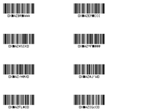](../../../../../../benchmarks/accuracy/conformance-reference/printer-code93-controls-combined-checks.png) | Render failed; no image | Unavailable |

~~~text

thread 'main' (24161) panicked at src/main.rs:27:10:
render: RenderError { offset: 88, message: "unsupported embedded font glyph '\\u{1}'" }
note: run with `RUST_BACKTRACE=1` environment variable to display a backtrace

~~~

## labelize

**labelize (Rust)**

rendered · 0.60% IoU · [All cases for this library](../libraries/labelize.md)

| Printer preview | Library render | Difference |
|---|---|---|
|  |  | [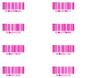](../images/printer-code93-controls-combined-checks-labelize-diff.png) |

Library dimensions: [832, 800]; missing ink: 53405; extra ink: 232 pixels.

## forge

**zpl-forge (Rust)**

rendered · 46.69% IoU · [All cases for this library](../libraries/forge.md)

| Printer preview | Library render | Difference |
|---|---|---|
|  | [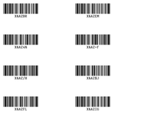](../../../../conformance/images/printer-code93-controls-combined-checks-forge.png) | [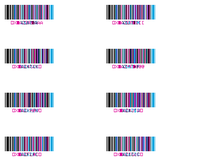](../images/printer-code93-controls-combined-checks-forge-diff.png) |

Library dimensions: [832, 800]; missing ink: 19042; extra ink: 20563 pixels.

## go

**go-zpl (Go)**

rendered · 8.92% IoU · [All cases for this library](../libraries/go.md)

| Printer preview | Library render | Difference |
|---|---|---|
|  |  |  |

Library dimensions: [832, 800]; missing ink: 48521; extra ink: 4633 pixels.

## ffi

**zpl-rs (Rust → Go)**

rendered · 8.92% IoU · [All cases for this library](../libraries/ffi.md)

| Printer preview | Library render | Difference |
|---|---|---|
|  | [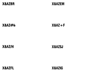](../../../../conformance/images/printer-code93-controls-combined-checks-ffi.png) | [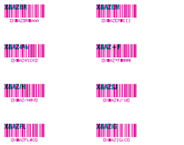](../images/printer-code93-controls-combined-checks-ffi-diff.png) |

Library dimensions: [832, 800]; missing ink: 48521; extra ink: 4633 pixels.

## binarykits

**BinaryKits.Zpl (.NET)**

rendered · 46.58% IoU · [All cases for this library](../libraries/binarykits.md)

| Printer preview | Library render | Difference |
|---|---|---|
|  | [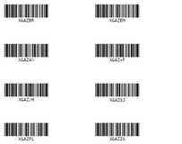](../../../../conformance/images/printer-code93-controls-combined-checks-binarykits.png) | [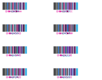](../images/printer-code93-controls-combined-checks-binarykits-diff.png) |

Library dimensions: [832, 800]; missing ink: 19151; extra ink: 20501 pixels.

## zplr

**ZPLr (TypeScript)**

rendered · 88.62% IoU · [All cases for this library](../libraries/zplr.md)

| Printer preview | Library render | Difference |
|---|---|---|
|  | [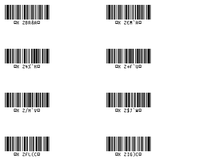](../../../../conformance/images/printer-code93-controls-combined-checks-zplr.png) | [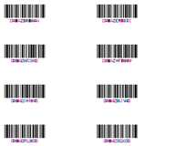](../images/printer-code93-controls-combined-checks-zplr-diff.png) |

Library dimensions: [832, 800]; missing ink: 4340; extra ink: 2002 pixels.

## labelary

**Labelary (SaaS)**

rendered · 89.44% IoU · [All cases for this library](../libraries/labelary.md)

[Labelary capture timestamps, HTTP metadata, and original responses](../../../../labelary/README.md)

| Printer preview | Library render | Difference |
|---|---|---|
|  | [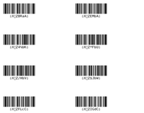](../../../../conformance/images/printer-code93-controls-combined-checks-labelary.png) | [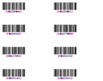](../images/printer-code93-controls-combined-checks-labelary-diff.png) |

Library dimensions: [832, 800]; missing ink: 4216; extra ink: 1630 pixels.
