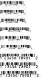
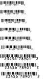
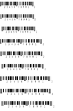
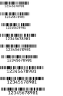
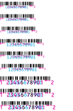
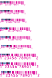
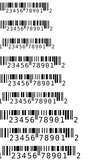
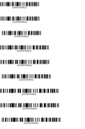
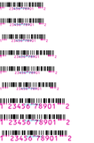
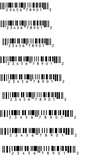

<!-- Generated by Bazel from cached render/comparison actions. -->

# printer-retail-caption-edges-large

Black = matching ink; magenta = printer only; cyan = library only. Compact previews share a common origin and crop only trailing blank space; click for the full-resolution image. Scores always use uncropped original pixels.

Printer and Labelary captures retain their original capture dates. Local renders are cached independently; execution timestamps are recorded per result in results.json.

[Corpus comparisons](../README.md) · [All accuracy comparisons](../../../README.md)

retail caption edges: large

[ZPL source](../../../../../../test-data/render-conformance/cases/printer-retail-caption-edges/printer-retail-caption-edges-large.zpl)

Validity: boundary. 

Source: references/upstream-zd621/retail-caption-edges-zd621-v1/large.zpl

Zebra programming guide: [^BU](../../../../../zpl-zbi2-pg-en.pdf#page=142) · [^BY](../../../../../zpl-zbi2-pg-en.pdf#page=148) · [^CI](../../../../../zpl-zbi2-pg-en.pdf#page=155) · [^FD](../../../../../zpl-zbi2-pg-en.pdf#page=190) · [^FO](../../../../../zpl-zbi2-pg-en.pdf#page=201) · [^FS](../../../../../zpl-zbi2-pg-en.pdf#page=204) · [^FW](../../../../../zpl-zbi2-pg-en.pdf#page=208) · [^LH](../../../../../zpl-zbi2-pg-en.pdf#page=293) · [^LL](../../../../../zpl-zbi2-pg-en.pdf#page=294) · [^LR](../../../../../zpl-zbi2-pg-en.pdf#page=295) · [^LS](../../../../../zpl-zbi2-pg-en.pdf#page=296) · [^LT](../../../../../zpl-zbi2-pg-en.pdf#page=297) · [^PA](../../../../../zpl-zbi2-pg-en.pdf#page=315) · [^PM](../../../../../zpl-zbi2-pg-en.pdf#page=319) · [^PO](../../../../../zpl-zbi2-pg-en.pdf#page=322) · [^PW](../../../../../zpl-zbi2-pg-en.pdf#page=329) · [^XA](../../../../../zpl-zbi2-pg-en.pdf#page=370) · [^XZ](../../../../../zpl-zbi2-pg-en.pdf#page=375)

## codyps-zpl

**codyps/zpl (Rust)**

rendered · 98.88% IoU · [All cases for this library](../libraries/codyps-zpl.md)

| Printer preview | Library render | Difference |
|---|---|---|
|  |  |  |

Library dimensions: [832, 1300]; missing ink: 1364; extra ink: 0 pixels.

## labelize

**labelize (Rust)**

rendered · 72.45% IoU · [All cases for this library](../libraries/labelize.md)

| Printer preview | Library render | Difference |
|---|---|---|
|  |  |  |

Library dimensions: [832, 1300]; missing ink: 30110; extra ink: 4662 pixels.

## forge

**zpl-forge (Rust)**

rendered · 64.39% IoU · [All cases for this library](../libraries/forge.md)

| Printer preview | Library render | Difference |
|---|---|---|
|  |  |  |

Library dimensions: [832, 1300]; missing ink: 27668; extra ink: 24261 pixels.

## go

**go-zpl (Go)**

rendered · 7.23% IoU · [All cases for this library](../libraries/go.md)

| Printer preview | Library render | Difference |
|---|---|---|
|  |  |  |

Library dimensions: [832, 1300]; missing ink: 112145; extra ink: 8721 pixels.

## ffi

**zpl-rs (Rust → Go)**

rendered · 7.23% IoU · [All cases for this library](../libraries/ffi.md)

| Printer preview | Library render | Difference |
|---|---|---|
|  |  |  |

Library dimensions: [832, 1300]; missing ink: 112145; extra ink: 8721 pixels.

## binarykits

**BinaryKits.Zpl (.NET)**

rendered · 62.56% IoU · [All cases for this library](../libraries/binarykits.md)

| Printer preview | Library render | Difference |
|---|---|---|
|  |  |  |

Library dimensions: [832, 1300]; missing ink: 21989; extra ink: 37604 pixels.

## zplr

**ZPLr (TypeScript)**

rendered · 70.22% IoU · [All cases for this library](../libraries/zplr.md)

| Printer preview | Library render | Difference |
|---|---|---|
|  |  |  |

Library dimensions: [832, 1300]; missing ink: 33467; extra ink: 3888 pixels.

## labelary

**Labelary (SaaS)**

rendered · 75.40% IoU · [All cases for this library](../libraries/labelary.md)

[Labelary capture timestamps, HTTP metadata, and original responses](../../../../labelary/README.md)

| Printer preview | Library render | Difference |
|---|---|---|
|  |  |  |

Library dimensions: [832, 1300]; missing ink: 23990; extra ink: 7839 pixels.
