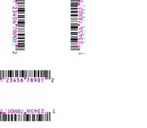
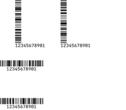
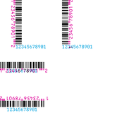
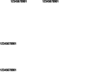
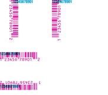
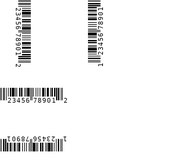
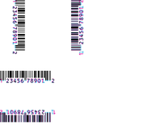
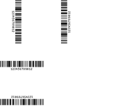
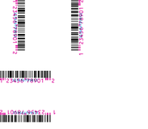
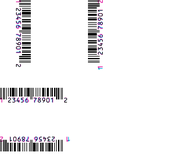

<!-- Generated by Bazel from cached render/comparison actions. -->

# printer-retail-caption-edges-rotations

Black = matching ink; magenta = printer only; cyan = library only. Compact previews share a common origin and crop only trailing blank space; click for the full-resolution image. Scores always use uncropped original pixels.

Printer and Labelary captures retain their original capture dates. Local renders are cached independently; execution timestamps are recorded per result in results.json.

[Corpus comparisons](../README.md) · [All accuracy comparisons](../../../README.md)

retail caption edges: rotations

[ZPL source](../../../../../../test-data/render-conformance/cases/printer-retail-caption-edges/printer-retail-caption-edges-rotations.zpl)

Validity: boundary. 

Source: references/upstream-zd621/retail-caption-edges-zd621-v1/rotations.zpl

Zebra programming guide: [^BU](../../../../../zpl-zbi2-pg-en.pdf#page=142) · [^BY](../../../../../zpl-zbi2-pg-en.pdf#page=148) · [^CI](../../../../../zpl-zbi2-pg-en.pdf#page=155) · [^FD](../../../../../zpl-zbi2-pg-en.pdf#page=190) · [^FO](../../../../../zpl-zbi2-pg-en.pdf#page=201) · [^FS](../../../../../zpl-zbi2-pg-en.pdf#page=204) · [^FW](../../../../../zpl-zbi2-pg-en.pdf#page=208) · [^LH](../../../../../zpl-zbi2-pg-en.pdf#page=293) · [^LL](../../../../../zpl-zbi2-pg-en.pdf#page=294) · [^LR](../../../../../zpl-zbi2-pg-en.pdf#page=295) · [^LS](../../../../../zpl-zbi2-pg-en.pdf#page=296) · [^LT](../../../../../zpl-zbi2-pg-en.pdf#page=297) · [^PA](../../../../../zpl-zbi2-pg-en.pdf#page=315) · [^PM](../../../../../zpl-zbi2-pg-en.pdf#page=319) · [^PO](../../../../../zpl-zbi2-pg-en.pdf#page=322) · [^PW](../../../../../zpl-zbi2-pg-en.pdf#page=329) · [^XA](../../../../../zpl-zbi2-pg-en.pdf#page=370) · [^XZ](../../../../../zpl-zbi2-pg-en.pdf#page=375)

## codyps-zpl

**codyps/zpl (Rust)**

rendered · 98.95% IoU · [All cases for this library](../libraries/codyps-zpl.md)

| Printer preview | Library render | Difference |
|---|---|---|
|  |  |  |

Library dimensions: [832, 1100]; missing ink: 328; extra ink: 0 pixels.

## labelize

**labelize (Rust)**

rendered · 73.12% IoU · [All cases for this library](../libraries/labelize.md)

| Printer preview | Library render | Difference |
|---|---|---|
|  |  |  |

Library dimensions: [832, 1100]; missing ink: 6685; extra ink: 2303 pixels.

## forge

**zpl-forge (Rust)**

rendered · 65.91% IoU · [All cases for this library](../libraries/forge.md)

| Printer preview | Library render | Difference |
|---|---|---|
|  |  |  |

Library dimensions: [832, 1100]; missing ink: 7613; extra ink: 4551 pixels.

## go

**go-zpl (Go)**

rendered · 6.89% IoU · [All cases for this library](../libraries/go.md)

| Printer preview | Library render | Difference |
|---|---|---|
|  |  |  |

Library dimensions: [832, 1100]; missing ink: 28605; extra ink: 5535 pixels.

## ffi

**zpl-rs (Rust → Go)**

rendered · 6.89% IoU · [All cases for this library](../libraries/ffi.md)

| Printer preview | Library render | Difference |
|---|---|---|
|  |  |  |

Library dimensions: [832, 1100]; missing ink: 28605; extra ink: 5535 pixels.

## binarykits

**BinaryKits.Zpl (.NET)**

rendered · 65.30% IoU · [All cases for this library](../libraries/binarykits.md)

| Printer preview | Library render | Difference |
|---|---|---|
|  |  |  |

Library dimensions: [832, 1100]; missing ink: 6596; extra ink: 6440 pixels.

## zplr

**ZPLr (TypeScript)**

rendered · 71.96% IoU · [All cases for this library](../libraries/zplr.md)

| Printer preview | Library render | Difference |
|---|---|---|
|  |  |  |

Library dimensions: [832, 1100]; missing ink: 7424; extra ink: 1814 pixels.

## labelary

**Labelary (SaaS)**

rendered · 86.13% IoU · [All cases for this library](../libraries/labelary.md)

[Labelary capture timestamps, HTTP metadata, and original responses](../../../../labelary/README.md)

| Printer preview | Library render | Difference |
|---|---|---|
|  |  |  |

Library dimensions: [832, 1100]; missing ink: 2818; extra ink: 1742 pixels.
