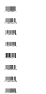
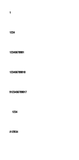
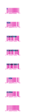
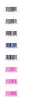
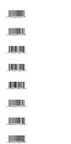
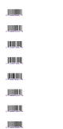

<!-- Generated by Bazel from cached render/comparison actions. -->

# printer-retail-data-length-BU

Black = matching ink; magenta = printer only; cyan = library only. Compact previews share a common origin and crop only trailing blank space; click for the full-resolution image. Scores always use uncropped original pixels.

Printer and Labelary captures retain their original capture dates. Local renders are cached independently; execution timestamps are recorded per result in results.json.

[Corpus comparisons](../README.md) · [All accuracy comparisons](../../../README.md)

retail data: length-BU

[ZPL source](../../../../../../test-data/render-conformance/cases/printer-retail-data/printer-retail-data-length-BU.zpl)

Validity: boundary. 

Source: references/upstream-zd621/retail-data-zd621-v1/length-BU.zpl

Zebra programming guide: [^BU](../../../../../zpl-zbi2-pg-en.pdf#page=142) · [^BY](../../../../../zpl-zbi2-pg-en.pdf#page=148) · [^CI](../../../../../zpl-zbi2-pg-en.pdf#page=155) · [^CV](../../../../../zpl-zbi2-pg-en.pdf#page=167) · [^FD](../../../../../zpl-zbi2-pg-en.pdf#page=190) · [^FO](../../../../../zpl-zbi2-pg-en.pdf#page=201) · [^FP](../../../../../zpl-zbi2-pg-en.pdf#page=202) · [^FS](../../../../../zpl-zbi2-pg-en.pdf#page=204) · [^FW](../../../../../zpl-zbi2-pg-en.pdf#page=208) · [^LH](../../../../../zpl-zbi2-pg-en.pdf#page=293) · [^LL](../../../../../zpl-zbi2-pg-en.pdf#page=294) · [^LR](../../../../../zpl-zbi2-pg-en.pdf#page=295) · [^LS](../../../../../zpl-zbi2-pg-en.pdf#page=296) · [^LT](../../../../../zpl-zbi2-pg-en.pdf#page=297) · [^PM](../../../../../zpl-zbi2-pg-en.pdf#page=319) · [^PO](../../../../../zpl-zbi2-pg-en.pdf#page=322) · [^PW](../../../../../zpl-zbi2-pg-en.pdf#page=329) · [^XA](../../../../../zpl-zbi2-pg-en.pdf#page=370) · [^XZ](../../../../../zpl-zbi2-pg-en.pdf#page=375)

## codyps-zpl

**codyps/zpl (Rust)**

rendered · 100.00% IoU · exact · [All cases for this library](../libraries/codyps-zpl.md)

| Printer preview | Library render | Difference |
|---|---|---|
|  |  |  |

Library dimensions: [832, 1920]; missing ink: 0; extra ink: 0 pixels.

## labelize

**labelize (Rust)**

error · 0.00% IoU · [All cases for this library](../libraries/labelize.md)

| Printer preview | Library render | Difference |
|---|---|---|
|  | Render failed; no image | Unavailable |

~~~text

thread 'main' (35452) panicked at src/main.rs:63:14:
PNG: "UPC-A: expected 11 or 12 digits, got 1"
note: run with `RUST_BACKTRACE=1` environment variable to display a backtrace

~~~

## forge

**zpl-forge (Rust)**

error · 0.00% IoU · [All cases for this library](../libraries/forge.md)

| Printer preview | Library render | Difference |
|---|---|---|
|  | Render failed; no image | Unavailable |

~~~text

thread 'main' (35463) panicked at src/main.rs:79:32:
PNG: BackendError("Barcode Generation Error: IllegalArgumentException - Requested contents should be 12 or 13 digits long, but got 2")
note: run with `RUST_BACKTRACE=1` environment variable to display a backtrace

~~~

## go

**go-zpl (Go)**

rendered · 6.69% IoU · [All cases for this library](../libraries/go.md)

| Printer preview | Library render | Difference |
|---|---|---|
|  |  |  |

Library dimensions: [832, 1920]; missing ink: 56758; extra ink: 4783 pixels.

## ffi

**zpl-rs (Rust → Go)**

rendered · 6.69% IoU · [All cases for this library](../libraries/ffi.md)

| Printer preview | Library render | Difference |
|---|---|---|
|  |  |  |

Library dimensions: [832, 1920]; missing ink: 56758; extra ink: 4783 pixels.

## binarykits

**BinaryKits.Zpl (.NET)**

crashed · 0.00% IoU · [All cases for this library](../libraries/binarykits.md)

| Printer preview | Library render | Difference |
|---|---|---|
|  | Render failed; no image | Unavailable |

~~~text
Unhandled exception. System.Exception: Error on zpl element "   1234": Contents should only contain digits, but got ' '
 ---> System.ArgumentException: Contents should only contain digits, but got ' '
   at ZXing.OneD.UPCEANReader.getStandardUPCEANChecksum(String s)
   at ZXing.OneD.EAN13Writer.encode(String contents)
   at BinaryKits.Zpl.Viewer.ElementDrawers.BarcodeUpcAElementDrawer.Draw(ZplElementBase element, DrawerOptions options, SKPoint currentPosition, InternationalFont internationalFont, Int32 printDensityDpmm)
   at BinaryKits.Zpl.Viewer.ZplElementDrawer.DrawMulti(IEnumerable`1 elements, Double labelWidth, Double labelHeight, Int32 printDensityDpmm)
   --- End of inner exception stack trace ---
   at BinaryKits.Zpl.Viewer.ZplElementDrawer.DrawMulti(IEnumerable`1 elements, Double labelWidth, Double labelHeight, Int32 printDensityDpmm)
   at BinaryKits.Zpl.Viewer.ZplElementDrawer.Draw(IEnumerable`1 elements, Double labelWidth, Double labelHeight, Int32 printDensityDpmm)
   at Program.<<Main>$>g__Operation|0_0(<>c__DisplayClass0_0&) in /tmp/zpl-build-gljd0b_k/benchmarks/adapters/dotnet/Program.cs:line 17
   at Program.<Main>$(String[] args) in /tmp/zpl-build-gljd0b_k/benchmarks/adapters/dotnet/Program.cs:line 40

~~~

## zplr

**ZPLr (TypeScript)**

rendered · 48.06% IoU · [All cases for this library](../libraries/zplr.md)

| Printer preview | Library render | Difference |
|---|---|---|
|  |  |  |

Library dimensions: [832, 1920]; missing ink: 29333; extra ink: 5071 pixels.

## labelary

**Labelary (SaaS)**

rendered · 88.24% IoU · [All cases for this library](../libraries/labelary.md)

[Labelary capture timestamps, HTTP metadata, and original responses](../../../../labelary/README.md)

| Printer preview | Library render | Difference |
|---|---|---|
|  |  |  |

Library dimensions: [832, 1920]; missing ink: 4357; extra ink: 3212 pixels.
