<!-- Generated by benchmarks/accuracy/features.py. -->

# torture-geometry

[Feature comparisons](../README.md) · [All accuracy comparisons](../../README.md)

36 panels combine odd/even shapes, rounding, line direction, thickness and rotated labels

valid / printer · [ZPL input](../../../../../../test-data/render-conformance/cases/torture/torture-geometry.zpl)

Black = matching ink; magenta = printer only; cyan = library only. Compact previews share a common origin and crop only trailing blank space; click for the full-resolution image. Scores always use uncropped original pixels. Blank printer references and invalid inputs are unscored; renderer failures score zero against nonblank printer references.

## codyps-zpl

**codyps/zpl (Rust): rendered; 99.98% IoU** · [All tests for this library](../libraries/codyps-zpl.md)

| Printer preview | Library render | Difference |
| --- | --- | --- |
| [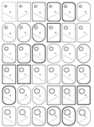](../../../../../../benchmarks/accuracy/conformance-reference/torture-geometry.png) | [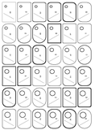](../../../../conformance/images/torture-geometry-codyps-zpl.png) |  |

## labelize

**labelize (Rust): rendered; 68.19% IoU** · [All tests for this library](../libraries/labelize.md)

| Printer preview | Library render | Difference |
| --- | --- | --- |
|  | [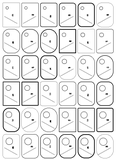](../../../../conformance/images/torture-geometry-labelize.png) | [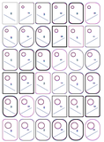](../images/torture-geometry-labelize-diff.png) |

## forge

**zpl-forge (Rust): rendered; 70.11% IoU** · [All tests for this library](../libraries/forge.md)

| Printer preview | Library render | Difference |
| --- | --- | --- |
|  | [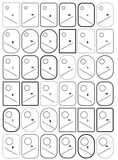](../../../../conformance/images/torture-geometry-forge.png) | [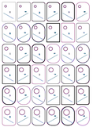](../images/torture-geometry-forge-diff.png) |

## go

**go-zpl (Go): rendered; 50.86% IoU** · [All tests for this library](../libraries/go.md)

| Printer preview | Library render | Difference |
| --- | --- | --- |
|  |  |  |

## ffi

**zpl-rs (Rust → Go): rendered; 50.86% IoU** · [All tests for this library](../libraries/ffi.md)

| Printer preview | Library render | Difference |
| --- | --- | --- |
|  |  | [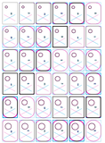](../images/torture-geometry-ffi-diff.png) |

## binarykits

**BinaryKits.Zpl (.NET): rendered; 76.39% IoU** · [All tests for this library](../libraries/binarykits.md)

| Printer preview | Library render | Difference |
| --- | --- | --- |
|  | [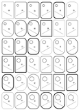](../../../../conformance/images/torture-geometry-binarykits.png) |  |

## zplr

**ZPLr (TypeScript): rendered; 80.70% IoU** · [All tests for this library](../libraries/zplr.md)

| Printer preview | Library render | Difference |
| --- | --- | --- |
|  |  | [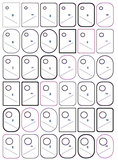](../images/torture-geometry-zplr-diff.png) |

## labelary

**Labelary (SaaS): rendered; 78.45% IoU** · [All tests for this library](../libraries/labelary.md)

| Printer preview | Library render | Difference |
| --- | --- | --- |
|  | [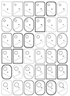](../../../../conformance/images/torture-geometry-labelary.png) | [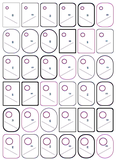](../images/torture-geometry-labelary-diff.png) |

