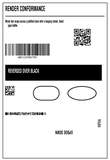
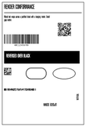
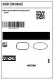
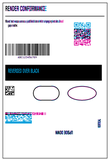
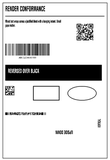
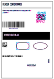
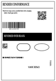
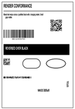
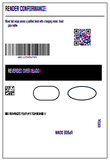

<!-- Generated by Bazel from cached render/comparison actions. -->

# torture-shipping-label

Black = matching ink; magenta = printer only; cyan = library only. Compact previews share a common origin and crop only trailing blank space; click for the full-resolution image. Scores always use uncropped original pixels.

Printer and Labelary captures retain their original capture dates. Local renders are cached independently; execution timestamps are recorded per result in results.json.

[Corpus comparisons](../README.md) · [All accuracy comparisons](../../../README.md)

Dense mixed label: text wrapping, QR, Code128, DataMatrix, PDF417, reversal and rotation

[ZPL source](../../../../../../test-data/render-conformance/cases/torture/torture-shipping-label.zpl)

Validity: valid. 

Zebra programming guide: [^A](../../../../../zpl-zbi2-pg-en.pdf#page=60) · [^B7](../../../../../zpl-zbi2-pg-en.pdf#page=79) · [^BC](../../../../../zpl-zbi2-pg-en.pdf#page=94) · [^BQ](../../../../../zpl-zbi2-pg-en.pdf#page=128) · [^BX](../../../../../zpl-zbi2-pg-en.pdf#page=144) · [^BY](../../../../../zpl-zbi2-pg-en.pdf#page=148) · [^CF](../../../../../zpl-zbi2-pg-en.pdf#page=154) · [^CI](../../../../../zpl-zbi2-pg-en.pdf#page=155) · [^FB](../../../../../zpl-zbi2-pg-en.pdf#page=186) · [^FD](../../../../../zpl-zbi2-pg-en.pdf#page=190) · [^FO](../../../../../zpl-zbi2-pg-en.pdf#page=201) · [^FR](../../../../../zpl-zbi2-pg-en.pdf#page=203) · [^FS](../../../../../zpl-zbi2-pg-en.pdf#page=204) · [^FW](../../../../../zpl-zbi2-pg-en.pdf#page=208) · [^GB](../../../../../zpl-zbi2-pg-en.pdf#page=210) · [^GE](../../../../../zpl-zbi2-pg-en.pdf#page=214) · [^LH](../../../../../zpl-zbi2-pg-en.pdf#page=293) · [^LL](../../../../../zpl-zbi2-pg-en.pdf#page=294) · [^LR](../../../../../zpl-zbi2-pg-en.pdf#page=295) · [^LS](../../../../../zpl-zbi2-pg-en.pdf#page=296) · [^LT](../../../../../zpl-zbi2-pg-en.pdf#page=297) · [^PO](../../../../../zpl-zbi2-pg-en.pdf#page=322) · [^PW](../../../../../zpl-zbi2-pg-en.pdf#page=329) · [^XA](../../../../../zpl-zbi2-pg-en.pdf#page=370) · [^XZ](../../../../../zpl-zbi2-pg-en.pdf#page=375)

## codyps-zpl

**codyps/zpl (Rust)**

rendered · 99.99% IoU · [All cases for this library](../libraries/codyps-zpl.md)

| Printer preview | Library render | Difference |
|---|---|---|
|  |  |  |

Library dimensions: [832, 1218]; missing ink: 6; extra ink: 9 pixels.

## labelize

**labelize (Rust)**

rendered · 84.75% IoU · [All cases for this library](../libraries/labelize.md)

| Printer preview | Library render | Difference |
|---|---|---|
|  |  |  |

Library dimensions: [832, 1218]; missing ink: 12374; extra ink: 11923 pixels.

## forge

**zpl-forge (Rust)**

rendered · 76.68% IoU · [All cases for this library](../libraries/forge.md)

| Printer preview | Library render | Difference |
|---|---|---|
|  |  |  |

Library dimensions: [832, 1218]; missing ink: 15088; extra ink: 25129 pixels.

## go

**go-zpl (Go)**

rendered · 83.95% IoU · [All cases for this library](../libraries/go.md)

| Printer preview | Library render | Difference |
|---|---|---|
|  |  |  |

Library dimensions: [832, 1218]; missing ink: 12687; extra ink: 13067 pixels.

## ffi

**zpl-rs (Rust → Go)**

rendered · 83.95% IoU · [All cases for this library](../libraries/ffi.md)

| Printer preview | Library render | Difference |
|---|---|---|
|  |  |  |

Library dimensions: [832, 1218]; missing ink: 12687; extra ink: 13067 pixels.

## binarykits

**BinaryKits.Zpl (.NET)**

rendered · 79.53% IoU · [All cases for this library](../libraries/binarykits.md)

| Printer preview | Library render | Difference |
|---|---|---|
|  |  |  |

Library dimensions: [832, 1218]; missing ink: 17484; extra ink: 15937 pixels.

## zplr

**ZPLr (TypeScript)**

rendered · 87.38% IoU · [All cases for this library](../libraries/zplr.md)

| Printer preview | Library render | Difference |
|---|---|---|
|  |  |  |

Library dimensions: [832, 1218]; missing ink: 10059; extra ink: 9772 pixels.

## labelary

**Labelary (SaaS)**

rendered · 91.18% IoU · [All cases for this library](../libraries/labelary.md)

[Labelary capture timestamps, HTTP metadata, and original responses](../../../../labelary/README.md)

| Printer preview | Library render | Difference |
|---|---|---|
|  |  |  |

Library dimensions: [832, 1218]; missing ink: 7741; extra ink: 5764 pixels.
