<!-- Generated by Bazel from cached render/comparison actions. -->

# labelary versus printer

Black = matching ink; magenta = printer only; cyan = library only. Compact previews share a common origin and crop only trailing blank space; click for the full-resolution image. Scores always use uncropped original pixels.

Printer and Labelary captures retain their original capture dates. Local renders are cached independently; execution timestamps are recorded per result in results.json.

[Corpus comparisons](../README.md) · [All accuracy comparisons](../../../README.md)

| Case | Group | Result | Difference |
|---|---|---|---|
| [probe-font0-height-16](../../cases/conformance-probe-font0-height-16.md) | baseline-text | rendered · 64.47% IoU |  |
| [probe-font0-height-32](../../cases/conformance-probe-font0-height-32.md) | baseline-text | rendered · 73.93% IoU |  |
| [probe-font0-height-64](../../cases/conformance-probe-font0-height-64.md) | baseline-text | rendered · 80.41% IoU |  |
| [probe-font0-width-16](../../cases/conformance-probe-font0-width-16.md) | baseline-text | rendered · 65.46% IoU |  |
| [probe-font0-width-32](../../cases/conformance-probe-font0-width-32.md) | baseline-text | rendered · 73.93% IoU |  |
| [probe-font0-width-64](../../cases/conformance-probe-font0-width-64.md) | baseline-text | rendered · 79.08% IoU |  |
| [probe-font0-rotation-N](../../cases/conformance-probe-font0-rotation-N.md) | baseline-text | rendered · 83.42% IoU |  |
| [probe-font0-rotation-R](../../cases/conformance-probe-font0-rotation-R.md) | baseline-text | rendered · 76.58% IoU |  |
| [probe-font0-rotation-I](../../cases/conformance-probe-font0-rotation-I.md) | baseline-text | rendered · 76.58% IoU |  |
| [probe-font0-rotation-B](../../cases/conformance-probe-font0-rotation-B.md) | baseline-text | rendered · 83.42% IoU |  |
| [probe-font-A](../../cases/conformance-probe-font-A.md) | baseline-text | rendered · 53.12% IoU |  |
| [probe-font-D](../../cases/conformance-probe-font-D.md) | baseline-text | rendered · 55.96% IoU |  |
| [probe-fo-justify-0](../../cases/conformance-probe-fo-justify-0.md) | baseline-layout | rendered · 73.93% IoU |  |
| [probe-fo-justify-1](../../cases/conformance-probe-fo-justify-1.md) | baseline-layout | rendered · 37.90% IoU |  |
| [probe-fo-justify-2](../../cases/conformance-probe-fo-justify-2.md) | baseline-layout | rendered · 73.93% IoU |  |
| [probe-ft-baseline](../../cases/conformance-probe-ft-baseline.md) | baseline-layout | rendered · 73.93% IoU |  |
| [probe-layout-LH](../../cases/conformance-probe-layout-LH.md) | baseline-layout | rendered · 83.42% IoU |  |
| [probe-layout-LS](../../cases/conformance-probe-layout-LS.md) | baseline-layout | rendered · 83.42% IoU |  |
| [probe-layout-LT](../../cases/conformance-probe-layout-LT.md) | baseline-layout | rendered · 6.49% IoU |  |
| [probe-layout-PO](../../cases/conformance-probe-layout-PO.md) | baseline-layout | rendered · 0.00% IoU |  |
| [probe-layout-LR](../../cases/conformance-probe-layout-LR.md) | baseline-layout | rendered · 82.89% IoU |  |
| [probe-layout-FW](../../cases/conformance-probe-layout-FW.md) | baseline-layout | rendered · 76.58% IoU |  |
| [probe-field-reverse](../../cases/conformance-probe-field-reverse.md) | baseline-layout | rendered · 97.84% IoU |  |
| [probe-block-L](../../cases/conformance-probe-block-L.md) | baseline-text | rendered · 67.48% IoU |  |
| [probe-block-C](../../cases/conformance-probe-block-C.md) | baseline-text | rendered · 72.67% IoU |  |
| [probe-block-R](../../cases/conformance-probe-block-R.md) | baseline-text | rendered · 41.03% IoU |  |
| [probe-block-J](../../cases/conformance-probe-block-J.md) | baseline-text | rendered · 82.39% IoU |  |
| [probe-block-indent](../../cases/conformance-probe-block-indent.md) | baseline-text | rendered · 67.48% IoU |  |
| [probe-block-explicit-break](../../cases/conformance-probe-block-explicit-break.md) | baseline-text | rendered · 77.91% IoU |  |
| [probe-field-hex](../../cases/conformance-probe-field-hex.md) | baseline-text | rendered · 83.42% IoU |  |
| [probe-variable-data](../../cases/conformance-probe-variable-data.md) | baseline-text | rendered · 83.42% IoU |  |
| [probe-encoding-0](../../cases/conformance-probe-encoding-0.md) | baseline-text | rendered · 83.72% IoU |  |
| [probe-encoding-27](../../cases/conformance-probe-encoding-27.md) | baseline-text | rendered · 83.72% IoU |  |
| [probe-encoding-28](../../cases/conformance-probe-encoding-28.md) | baseline-text | rendered · 83.72% IoU |  |
| [probe-utf8-accent](../../cases/conformance-probe-utf8-accent.md) | baseline-text | rendered · 82.34% IoU |  |
| [probe-box-thickness-1](../../cases/conformance-probe-box-thickness-1.md) | baseline-shapes | rendered · 100.00% IoU · exact |  |
| [probe-box-thickness-4](../../cases/conformance-probe-box-thickness-4.md) | baseline-shapes | rendered · 100.00% IoU · exact |  |
| [probe-box-thickness-60](../../cases/conformance-probe-box-thickness-60.md) | baseline-shapes | rendered · 100.00% IoU · exact |  |
| [probe-box-round](../../cases/conformance-probe-box-round.md) | baseline-shapes | rendered · 93.05% IoU |  |
| [probe-box-white](../../cases/conformance-probe-box-white.md) | baseline-shapes | rendered · 100.00% IoU · exact |  |
| [probe-shape-GC-B](../../cases/conformance-probe-shape-GC-B.md) | baseline-shapes | rendered · 63.31% IoU |  |
| [probe-shape-GE-B](../../cases/conformance-probe-shape-GE-B.md) | baseline-shapes | rendered · 50.45% IoU |  |
| [probe-shape-GD-R](../../cases/conformance-probe-shape-GD-R.md) | baseline-shapes | rendered · 50.00% IoU |  |
| [probe-shape-GD-L](../../cases/conformance-probe-shape-GD-L.md) | baseline-shapes | rendered · 50.00% IoU |  |
| [probe-graphic-hex](../../cases/conformance-probe-graphic-hex.md) | baseline-graphics | rendered · 100.00% IoU · exact |  |
| [probe-graphic-binary](../../cases/conformance-probe-graphic-binary.md) | baseline-graphics | rendered · 100.00% IoU · exact |  |
| [probe-graphic-B64](../../cases/conformance-probe-graphic-B64.md) | baseline-graphics | rendered · 100.00% IoU · exact |  |
| [probe-graphic-Z64](../../cases/conformance-probe-graphic-Z64.md) | baseline-graphics | rendered · 100.00% IoU · exact |  |
| [probe-code39-ratio-2](../../cases/conformance-probe-code39-ratio-2.md) | baseline-barcode-arguments | rendered · 100.00% IoU · exact |  |
| [probe-code39-ratio-3](../../cases/conformance-probe-code39-ratio-3.md) | baseline-barcode-arguments | rendered · 100.00% IoU · exact |  |
| [probe-code39-check-N](../../cases/conformance-probe-code39-check-N.md) | baseline-barcode-arguments | rendered · 100.00% IoU · exact |  |
| [probe-code39-check-Y](../../cases/conformance-probe-code39-check-Y.md) | baseline-barcode-arguments | rendered · 100.00% IoU · exact |  |
| [probe-code128-text-NN](../../cases/conformance-probe-code128-text-NN.md) | baseline-barcode-arguments | rendered · 100.00% IoU · exact |  |
| [probe-code128-text-YN](../../cases/conformance-probe-code128-text-YN.md) | baseline-barcode-arguments | rendered · 95.99% IoU |  |
| [probe-code128-text-YY](../../cases/conformance-probe-code128-text-YY.md) | baseline-barcode-arguments | rendered · 95.99% IoU |  |
| [probe-code128-rotation-R](../../cases/conformance-probe-code128-rotation-R.md) | baseline-barcode-arguments | rendered · 100.00% IoU · exact |  |
| [probe-code128-rotation-I](../../cases/conformance-probe-code128-rotation-I.md) | baseline-barcode-arguments | rendered · 100.00% IoU · exact |  |
| [probe-code128-rotation-B](../../cases/conformance-probe-code128-rotation-B.md) | baseline-barcode-arguments | rendered · 100.00% IoU · exact |  |
| [probe-code128-mode-N](../../cases/conformance-probe-code128-mode-N.md) | baseline-barcode-arguments | rendered · 100.00% IoU · exact |  |
| [probe-code128-mode-A](../../cases/conformance-probe-code128-mode-A.md) | baseline-barcode-arguments | rendered · 100.00% IoU · exact |  |
| [probe-qr-model-1](../../cases/conformance-probe-qr-model-1.md) | baseline-barcode-arguments | blank · 0.00% IoU |  |
| [probe-qr-model-2](../../cases/conformance-probe-qr-model-2.md) | baseline-barcode-arguments | rendered · 52.46% IoU |  |
| [probe-qr-ec-L](../../cases/conformance-probe-qr-ec-L.md) | baseline-barcode-arguments | rendered · 52.46% IoU |  |
| [probe-qr-ec-M](../../cases/conformance-probe-qr-ec-M.md) | baseline-barcode-arguments | rendered · 49.17% IoU |  |
| [probe-qr-ec-Q](../../cases/conformance-probe-qr-ec-Q.md) | baseline-barcode-arguments | rendered · 51.17% IoU |  |
| [probe-qr-ec-H](../../cases/conformance-probe-qr-ec-H.md) | baseline-barcode-arguments | rendered · 70.56% IoU |  |
| [probe-qr-module-2](../../cases/conformance-probe-qr-module-2.md) | baseline-barcode-arguments | rendered · 48.01% IoU |  |
| [probe-qr-module-5](../../cases/conformance-probe-qr-module-5.md) | baseline-barcode-arguments | rendered · 56.23% IoU |  |
| [probe-qr-mask-0](../../cases/conformance-probe-qr-mask-0.md) | baseline-barcode-arguments | rendered · 52.46% IoU |  |
| [probe-qr-mask-3](../../cases/conformance-probe-qr-mask-3.md) | baseline-barcode-arguments | rendered · 52.46% IoU |  |
| [probe-qr-mask-7](../../cases/conformance-probe-qr-mask-7.md) | baseline-barcode-arguments | rendered · 52.46% IoU |  |
| [probe-datamatrix-module-2](../../cases/conformance-probe-datamatrix-module-2.md) | baseline-barcode-arguments | rendered · 100.00% IoU · exact |  |
| [probe-datamatrix-module-4](../../cases/conformance-probe-datamatrix-module-4.md) | baseline-barcode-arguments | rendered · 100.00% IoU · exact |  |
| [symbol-aztec](../../cases/conformance-symbol-aztec.md) | barcode-families | rendered · 31.51% IoU |  |
| [symbol-aztec_alias](../../cases/conformance-symbol-aztec_alias.md) | barcode-families | rendered · 31.51% IoU |  |
| [symbol-aztec_rune](../../cases/conformance-symbol-aztec_rune.md) | barcode-families | rendered · 32.67% IoU |  |
| [symbol-codabar](../../cases/conformance-symbol-codabar.md) | barcode-families | rendered · 35.59% IoU |  |
| [symbol-codablock_a](../../cases/conformance-symbol-codablock_a.md) | barcode-families | rendered · 3.98% IoU |  |
| [symbol-codablock_e](../../cases/conformance-symbol-codablock_e.md) | barcode-families | rendered · 10.93% IoU |  |
| [symbol-codablock_f](../../cases/conformance-symbol-codablock_f.md) | barcode-families | rendered · 9.49% IoU |  |
| [symbol-code11](../../cases/conformance-symbol-code11.md) | barcode-families | rendered · 36.84% IoU |  |
| [symbol-code128](../../cases/conformance-symbol-code128.md) | barcode-families | rendered · 28.40% IoU |  |
| [symbol-code39](../../cases/conformance-symbol-code39.md) | barcode-families | rendered · 43.59% IoU |  |
| [symbol-code49](../../cases/conformance-symbol-code49.md) | barcode-families | rendered · 5.23% IoU |  |
| [symbol-code93](../../cases/conformance-symbol-code93.md) | barcode-families | rendered · 28.95% IoU |  |
| [symbol-composite_a](../../cases/conformance-symbol-composite_a.md) | barcode-families | rendered · 35.34% IoU |  |
| [symbol-composite_b](../../cases/conformance-symbol-composite_b.md) | barcode-families | rendered · 34.82% IoU |  |
| [symbol-composite_c](../../cases/conformance-symbol-composite_c.md) | barcode-families | rendered · 31.95% IoU |  |
| [symbol-data_matrix](../../cases/conformance-symbol-data_matrix.md) | barcode-families | rendered · 27.72% IoU |  |
| [symbol-data_matrix_rectangular](../../cases/conformance-symbol-data_matrix_rectangular.md) | barcode-families | rendered · 37.80% IoU |  |
| [symbol-databar_ean13](../../cases/conformance-symbol-databar_ean13.md) | barcode-families | rendered · 24.05% IoU |  |
| [symbol-databar_ean8](../../cases/conformance-symbol-databar_ean8.md) | barcode-families | rendered · 28.00% IoU |  |
| [symbol-databar_expanded](../../cases/conformance-symbol-databar_expanded.md) | barcode-families | rendered · 37.86% IoU |  |
| [symbol-databar_expanded_stacked](../../cases/conformance-symbol-databar_expanded_stacked.md) | barcode-families | rendered · 26.14% IoU |  |
| [symbol-databar_limited](../../cases/conformance-symbol-databar_limited.md) | barcode-families | rendered · 25.42% IoU |  |
| [symbol-databar_omni](../../cases/conformance-symbol-databar_omni.md) | barcode-families | rendered · 26.76% IoU |  |
| [symbol-databar_stacked](../../cases/conformance-symbol-databar_stacked.md) | barcode-families | rendered · 24.32% IoU |  |
| [symbol-databar_stacked_omni](../../cases/conformance-symbol-databar_stacked_omni.md) | barcode-families | rendered · 23.34% IoU |  |
| [symbol-databar_truncated](../../cases/conformance-symbol-databar_truncated.md) | barcode-families | rendered · 26.76% IoU |  |
| [symbol-databar_upca](../../cases/conformance-symbol-databar_upca.md) | barcode-families | rendered · 33.33% IoU |  |
| [symbol-databar_upce](../../cases/conformance-symbol-databar_upce.md) | barcode-families | blank · 0.00% IoU |  |
| [symbol-ean13](../../cases/conformance-symbol-ean13.md) | barcode-families | rendered · 23.47% IoU |  |
| [symbol-ean8](../../cases/conformance-symbol-ean8.md) | barcode-families | rendered · 26.95% IoU |  |
| [symbol-extension2](../../cases/conformance-symbol-extension2.md) | barcode-families | rendered · 17.65% IoU |  |
| [symbol-extension5](../../cases/conformance-symbol-extension5.md) | barcode-families | rendered · 33.33% IoU |  |
| [symbol-industrial2of5](../../cases/conformance-symbol-industrial2of5.md) | barcode-families | rendered · 46.67% IoU |  |
| [symbol-intelligent_mail](../../cases/conformance-symbol-intelligent_mail.md) | barcode-families | rendered · 60.01% IoU |  |
| [symbol-interleaved2of5](../../cases/conformance-symbol-interleaved2of5.md) | barcode-families | rendered · 34.69% IoU |  |
| [symbol-logmars](../../cases/conformance-symbol-logmars.md) | barcode-families | rendered · 41.48% IoU |  |
| [symbol-maxicode2](../../cases/conformance-symbol-maxicode2.md) | barcode-families | rendered · 18.78% IoU |  |
| [symbol-maxicode3](../../cases/conformance-symbol-maxicode3.md) | barcode-families | rendered · 18.71% IoU |  |
| [symbol-maxicode4](../../cases/conformance-symbol-maxicode4.md) | barcode-families | rendered · 19.06% IoU |  |
| [symbol-maxicode5](../../cases/conformance-symbol-maxicode5.md) | barcode-families | rendered · 6.55% IoU |  |
| [symbol-maxicode6](../../cases/conformance-symbol-maxicode6.md) | barcode-families | rendered · 18.40% IoU |  |
| [symbol-micropdf417_1](../../cases/conformance-symbol-micropdf417_1.md) | barcode-families | rendered · 36.05% IoU |  |
| [symbol-micropdf417_3](../../cases/conformance-symbol-micropdf417_3.md) | barcode-families | rendered · 30.58% IoU |  |
| [symbol-micropdf417_4](../../cases/conformance-symbol-micropdf417_4.md) | barcode-families | rendered · 34.69% IoU |  |
| [symbol-msi_a](../../cases/conformance-symbol-msi_a.md) | barcode-families | rendered · 17.33% IoU |  |
| [symbol-msi_b](../../cases/conformance-symbol-msi_b.md) | barcode-families | rendered · 16.67% IoU |  |
| [symbol-msi_c](../../cases/conformance-symbol-msi_c.md) | barcode-families | rendered · 16.13% IoU |  |
| [symbol-msi_d](../../cases/conformance-symbol-msi_d.md) | barcode-families | rendered · 16.13% IoU |  |
| [symbol-pdf417](../../cases/conformance-symbol-pdf417.md) | barcode-families | rendered · 34.95% IoU |  |
| [symbol-pdf417_truncated](../../cases/conformance-symbol-pdf417_truncated.md) | barcode-families | rendered · 34.06% IoU |  |
| [symbol-planet](../../cases/conformance-symbol-planet.md) | barcode-families | rendered · 59.20% IoU |  |
| [symbol-plessey](../../cases/conformance-symbol-plessey.md) | barcode-families | rendered · 19.23% IoU |  |
| [symbol-postal_planet](../../cases/conformance-symbol-postal_planet.md) | barcode-families | rendered · 59.20% IoU |  |
| [symbol-postnet](../../cases/conformance-symbol-postnet.md) | barcode-families | rendered · 55.25% IoU |  |
| [symbol-qr](../../cases/conformance-symbol-qr.md) | barcode-families | rendered · 32.81% IoU |  |
| [symbol-standard2of5](../../cases/conformance-symbol-standard2of5.md) | barcode-families | rendered · 45.24% IoU |  |
| [symbol-tlc39_linear](../../cases/conformance-symbol-tlc39_linear.md) | barcode-families | rendered · 1.83% IoU |  |
| [symbol-tlc39_linked](../../cases/conformance-symbol-tlc39_linked.md) | barcode-families | rendered · 4.68% IoU |  |
| [symbol-upca](../../cases/conformance-symbol-upca.md) | barcode-families | rendered · 32.14% IoU |  |
| [symbol-upce](../../cases/conformance-symbol-upce.md) | barcode-families | rendered · 29.13% IoU |  |
| [printer-databar-retail-retail-10-1](../../cases/conformance-printer-databar-retail-retail-10-1.md) | printer-databar-retail | rendered · 100.00% IoU · exact |  |
| [printer-databar-retail-retail-10-3](../../cases/conformance-printer-databar-retail-retail-10-3.md) | printer-databar-retail | rendered · 100.00% IoU · exact |  |
| [printer-databar-retail-retail-7-1](../../cases/conformance-printer-databar-retail-retail-7-1.md) | printer-databar-retail | rendered · 100.00% IoU · exact |  |
| [printer-databar-retail-retail-7-3](../../cases/conformance-printer-databar-retail-retail-7-3.md) | printer-databar-retail | rendered · 100.00% IoU · exact |  |
| [printer-databar-retail-retail-9-1](../../cases/conformance-printer-databar-retail-retail-9-1.md) | printer-databar-retail | rendered · 100.00% IoU · exact |  |
| [printer-databar-retail-retail-9-3](../../cases/conformance-printer-databar-retail-retail-9-3.md) | printer-databar-retail | rendered · 100.00% IoU · exact |  |
| [printer-databar-retail-upce-00425261](../../cases/conformance-printer-databar-retail-upce-00425261.md) | printer-databar-retail | blank · unscored | Unavailable |
| [printer-databar-retail-upce-01230000045](../../cases/conformance-printer-databar-retail-upce-01230000045.md) | printer-databar-retail | blank · 0.00% IoU |  |
| [printer-databar-retail-upce-01234000005](../../cases/conformance-printer-databar-retail-upce-01234000005.md) | printer-databar-retail | blank · 0.00% IoU |  |
| [printer-databar-retail-upce-01234500006](../../cases/conformance-printer-databar-retail-upce-01234500006.md) | printer-databar-retail | blank · 0.00% IoU |  |
| [printer-databar-retail-upce-04210000526](../../cases/conformance-printer-databar-retail-upce-04210000526.md) | printer-databar-retail | blank · 0.00% IoU |  |
| [printer-databar-retail-upce-042100005264](../../cases/conformance-printer-databar-retail-upce-042100005264.md) | printer-databar-retail | blank · unscored | Unavailable |
| [printer-databar-retail-upce-042526](../../cases/conformance-printer-databar-retail-upce-042526.md) | printer-databar-retail | blank · unscored | Unavailable |
| [printer-databar-retail-upce-0425261](../../cases/conformance-printer-databar-retail-upce-0425261.md) | printer-databar-retail | blank · unscored | Unavailable |
| [printer-databar-retail-upce-original-invalid](../../cases/conformance-printer-databar-retail-upce-original-invalid.md) | printer-databar-retail | blank · unscored | Unavailable |
| [printer-barcode-defaults-code128-64-then-empty](../../cases/conformance-printer-barcode-defaults-code128-64-then-empty.md) | printer-barcode-defaults | rendered · 100.00% IoU · exact |  |
| [printer-barcode-defaults-code128-64-then-module](../../cases/conformance-printer-barcode-defaults-code128-64-then-module.md) | printer-barcode-defaults | rendered · 100.00% IoU · exact |  |
| [printer-barcode-defaults-code128-64-then-ratio](../../cases/conformance-printer-barcode-defaults-code128-64-then-ratio.md) | printer-barcode-defaults | rendered · 100.00% IoU · exact |  |
| [printer-barcode-defaults-code128-all-retained](../../cases/conformance-printer-barcode-defaults-code128-all-retained.md) | printer-barcode-defaults | rendered · 100.00% IoU · exact |  |
| [printer-barcode-defaults-code128-empty](../../cases/conformance-printer-barcode-defaults-code128-empty.md) | printer-barcode-defaults | rendered · 100.00% IoU · exact |  |
| [printer-barcode-defaults-code128-explicit-10](../../cases/conformance-printer-barcode-defaults-code128-explicit-10.md) | printer-barcode-defaults | rendered · 100.00% IoU · exact |  |
| [printer-barcode-defaults-code128-explicit-64](../../cases/conformance-printer-barcode-defaults-code128-explicit-64.md) | printer-barcode-defaults | rendered · 100.00% IoU · exact |  |
| [printer-barcode-defaults-code128-module-only](../../cases/conformance-printer-barcode-defaults-code128-module-only.md) | printer-barcode-defaults | rendered · 100.00% IoU · exact |  |
| [printer-barcode-defaults-code128-module-ratio-retained](../../cases/conformance-printer-barcode-defaults-code128-module-ratio-retained.md) | printer-barcode-defaults | rendered · 100.00% IoU · exact |  |
| [printer-barcode-defaults-code128-none](../../cases/conformance-printer-barcode-defaults-code128-none.md) | printer-barcode-defaults | rendered · 100.00% IoU · exact |  |
| [printer-barcode-defaults-code39-64-then-empty](../../cases/conformance-printer-barcode-defaults-code39-64-then-empty.md) | printer-barcode-defaults | rendered · 100.00% IoU · exact |  |
| [printer-barcode-defaults-code39-64-then-module](../../cases/conformance-printer-barcode-defaults-code39-64-then-module.md) | printer-barcode-defaults | rendered · 100.00% IoU · exact |  |
| [printer-barcode-defaults-code39-64-then-ratio](../../cases/conformance-printer-barcode-defaults-code39-64-then-ratio.md) | printer-barcode-defaults | rendered · 100.00% IoU · exact |  |
| [printer-barcode-defaults-code39-all-retained](../../cases/conformance-printer-barcode-defaults-code39-all-retained.md) | printer-barcode-defaults | rendered · 100.00% IoU · exact |  |
| [printer-barcode-defaults-code39-empty](../../cases/conformance-printer-barcode-defaults-code39-empty.md) | printer-barcode-defaults | rendered · 100.00% IoU · exact |  |
| [printer-barcode-defaults-code39-explicit-10](../../cases/conformance-printer-barcode-defaults-code39-explicit-10.md) | printer-barcode-defaults | rendered · 100.00% IoU · exact |  |
| [printer-barcode-defaults-code39-explicit-64](../../cases/conformance-printer-barcode-defaults-code39-explicit-64.md) | printer-barcode-defaults | rendered · 100.00% IoU · exact |  |
| [printer-barcode-defaults-code39-module-only](../../cases/conformance-printer-barcode-defaults-code39-module-only.md) | printer-barcode-defaults | rendered · 100.00% IoU · exact |  |
| [printer-barcode-defaults-code39-module-ratio-retained](../../cases/conformance-printer-barcode-defaults-code39-module-ratio-retained.md) | printer-barcode-defaults | rendered · 100.00% IoU · exact |  |
| [printer-barcode-defaults-code39-none](../../cases/conformance-printer-barcode-defaults-code39-none.md) | printer-barcode-defaults | rendered · 100.00% IoU · exact |  |
| [printer-retail-data-length-B8](../../cases/conformance-printer-retail-data-length-B8.md) | printer-retail-data | rendered · 88.71% IoU |  |
| [printer-retail-data-length-BE](../../cases/conformance-printer-retail-data-length-BE.md) | printer-retail-data | rendered · 86.26% IoU |  |
| [printer-retail-data-length-BU](../../cases/conformance-printer-retail-data-length-BU.md) | printer-retail-data | rendered · 88.24% IoU |  |
| [printer-retail-data-sweep-B8](../../cases/conformance-printer-retail-data-sweep-B8.md) | printer-retail-data | rendered · 89.58% IoU |  |
| [printer-retail-data-sweep-BE](../../cases/conformance-printer-retail-data-sweep-BE.md) | printer-retail-data | rendered · 86.47% IoU |  |
| [printer-retail-data-sweep-BU](../../cases/conformance-printer-retail-data-sweep-BU.md) | printer-retail-data | rendered · 88.40% IoU | [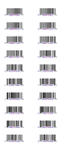](../images/printer-retail-data-sweep-BU-labelary-diff.png) |
| [printer-retail-data-validation-B8](../../cases/conformance-printer-retail-data-validation-B8.md) | printer-retail-data | rendered · 50.81% IoU |  |
| [printer-retail-data-validation-BE](../../cases/conformance-printer-retail-data-validation-BE.md) | printer-retail-data | rendered · 51.48% IoU |  |
| [printer-retail-data-validation-BU](../../cases/conformance-printer-retail-data-validation-BU.md) | printer-retail-data | rendered · 52.28% IoU |  |
| [printer-retail-caption-edges-small](../../cases/conformance-printer-retail-caption-edges-small.md) | printer-retail-caption-edges | rendered · 86.16% IoU | [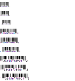](../images/printer-retail-caption-edges-small-labelary-diff.png) |
| [printer-retail-caption-edges-large](../../cases/conformance-printer-retail-caption-edges-large.md) | printer-retail-caption-edges | rendered · 75.40% IoU | [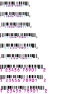](../images/printer-retail-caption-edges-large-labelary-diff.png) |
| [printer-retail-caption-edges-rotations](../../cases/conformance-printer-retail-caption-edges-rotations.md) | printer-retail-caption-edges | rendered · 86.13% IoU |  |
| [printer-retail-caption-edges-holdouts](../../cases/conformance-printer-retail-caption-edges-holdouts.md) | printer-retail-caption-edges | rendered · 84.76% IoU | [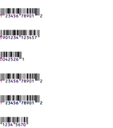](../images/printer-retail-caption-edges-holdouts-labelary-diff.png) |
| [printer-retail-caption-edges-discovery](../../cases/conformance-printer-retail-caption-edges-discovery.md) | printer-retail-caption-edges | rendered · 91.09% IoU |  |
| [printer-code93-controls-pairs](../../cases/conformance-printer-code93-controls-pairs.md) | printer-code93-controls | rendered · 86.70% IoU | [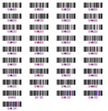](../images/printer-code93-controls-pairs-labelary-diff.png) |
| [printer-code93-controls-holdouts](../../cases/conformance-printer-code93-controls-holdouts.md) | printer-code93-controls | rendered · 84.35% IoU |  |
| [printer-code93-controls-combined-checks](../../cases/conformance-printer-code93-controls-combined-checks.md) | printer-code93-controls | rendered · 89.44% IoU |  |
| [printer-qr-module-state-same-field](../../cases/conformance-printer-qr-module-state-same-field.md) | printer-qr-module-state | rendered · 94.28% IoU |  |
| [printer-qr-module-state-next-field](../../cases/conformance-printer-qr-module-state-next-field.md) | printer-qr-module-state | rendered · 87.97% IoU |  |
| [printer-qr-module-state-holdouts-basic](../../cases/conformance-printer-qr-module-state-holdouts-basic.md) | printer-qr-module-state | rendered · 99.41% IoU | [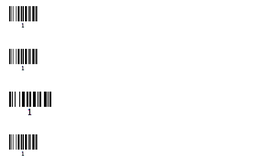](../images/printer-qr-module-state-holdouts-basic-labelary-diff.png) |
| [printer-character-remap-scope-clean](../../cases/conformance-printer-character-remap-scope-clean.md) | printer-character-remap | rendered · 79.52% IoU | [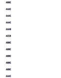](../images/printer-character-remap-scope-clean-labelary-diff.png) |
| [printer-character-remap-space-barcode-clean](../../cases/conformance-printer-character-remap-space-barcode-clean.md) | printer-character-remap | rendered · 92.69% IoU | [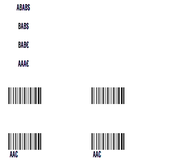](../images/printer-character-remap-space-barcode-clean-labelary-diff.png) |
| [printer-character-remap-retail-positive](../../cases/conformance-printer-character-remap-retail-positive.md) | printer-character-remap | rendered · 90.93% IoU |  |
| [printer-box-minimum-round-0](../../cases/conformance-printer-box-minimum-round-0.md) | printer-box-minimum | rendered · 100.00% IoU · exact |  |
| [printer-box-minimum-round-1](../../cases/conformance-printer-box-minimum-round-1.md) | printer-box-minimum | rendered · 99.44% IoU |  |
| [printer-box-minimum-round-8](../../cases/conformance-printer-box-minimum-round-8.md) | printer-box-minimum | rendered · 96.64% IoU | [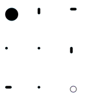](../images/printer-box-minimum-round-8-labelary-diff.png) |
| [printer-field-block-rounding-0-1-gaps](../../cases/conformance-printer-field-block-rounding-0-1-gaps.md) | printer-field-block-rounding | rendered · 83.86% IoU | [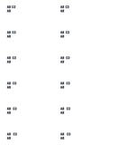](../images/printer-field-block-rounding-0-1-gaps-labelary-diff.png) |
| [printer-field-block-rounding-0-2-gaps](../../cases/conformance-printer-field-block-rounding-0-2-gaps.md) | printer-field-block-rounding | rendered · 80.65% IoU | [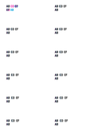](../images/printer-field-block-rounding-0-2-gaps-labelary-diff.png) |
| [printer-field-block-rounding-0-3-gaps](../../cases/conformance-printer-field-block-rounding-0-3-gaps.md) | printer-field-block-rounding | rendered · 79.15% IoU | [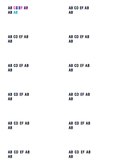](../images/printer-field-block-rounding-0-3-gaps-labelary-diff.png) |
| [printer-field-block-rounding-A-1-gaps](../../cases/conformance-printer-field-block-rounding-A-1-gaps.md) | printer-field-block-rounding | rendered · 47.06% IoU | [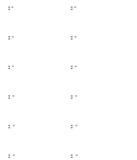](../images/printer-field-block-rounding-A-1-gaps-labelary-diff.png) |
| [printer-field-block-rounding-A-2-gaps](../../cases/conformance-printer-field-block-rounding-A-2-gaps.md) | printer-field-block-rounding | rendered · 54.17% IoU |  |
| [printer-field-block-rounding-A-3-gaps](../../cases/conformance-printer-field-block-rounding-A-3-gaps.md) | printer-field-block-rounding | rendered · 49.09% IoU | [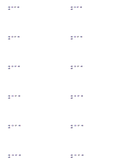](../images/printer-field-block-rounding-A-3-gaps-labelary-diff.png) |
| [font-0-N](../../cases/conformance-font-0-N.md) | fonts | rendered · 53.98% IoU |  |
| [font-0-R](../../cases/conformance-font-0-R.md) | fonts | rendered · 49.38% IoU |  |
| [font-0-I](../../cases/conformance-font-0-I.md) | fonts | rendered · 44.23% IoU |  |
| [font-0-B](../../cases/conformance-font-0-B.md) | fonts | rendered · 47.54% IoU |  |
| [font-A-N](../../cases/conformance-font-A-N.md) | fonts | rendered · 50.84% IoU |  |
| [font-A-R](../../cases/conformance-font-A-R.md) | fonts | rendered · 50.85% IoU | [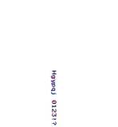](../images/font-A-R-labelary-diff.png) |
| [font-A-I](../../cases/conformance-font-A-I.md) | fonts | rendered · 47.62% IoU | [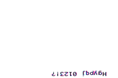](../images/font-A-I-labelary-diff.png) |
| [font-A-B](../../cases/conformance-font-A-B.md) | fonts | rendered · 47.62% IoU |  |
| [font-B-N](../../cases/conformance-font-B-N.md) | fonts | rendered · 72.16% IoU |  |
| [font-B-R](../../cases/conformance-font-B-R.md) | fonts | rendered · 72.12% IoU |  |
| [font-B-I](../../cases/conformance-font-B-I.md) | fonts | rendered · 62.86% IoU | [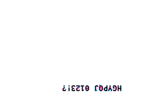](../images/font-B-I-labelary-diff.png) |
| [font-B-B](../../cases/conformance-font-B-B.md) | fonts | rendered · 62.95% IoU |  |
| [font-C-N](../../cases/conformance-font-C-N.md) | fonts | rendered · 54.76% IoU | [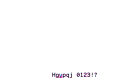](../images/font-C-N-labelary-diff.png) |
| [font-C-R](../../cases/conformance-font-C-R.md) | fonts | rendered · 54.82% IoU |  |
| [font-C-I](../../cases/conformance-font-C-I.md) | fonts | rendered · 51.02% IoU |  |
| [font-C-B](../../cases/conformance-font-C-B.md) | fonts | rendered · 50.95% IoU |  |
| [font-D-N](../../cases/conformance-font-D-N.md) | fonts | rendered · 54.76% IoU |  |
| [font-D-R](../../cases/conformance-font-D-R.md) | fonts | rendered · 54.82% IoU |  |
| [font-D-I](../../cases/conformance-font-D-I.md) | fonts | rendered · 51.02% IoU |  |
| [font-D-B](../../cases/conformance-font-D-B.md) | fonts | rendered · 50.95% IoU |  |
| [font-E-N](../../cases/conformance-font-E-N.md) | fonts | rendered · 73.85% IoU |  |
| [font-E-R](../../cases/conformance-font-E-R.md) | fonts | rendered · 72.76% IoU | [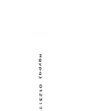](../images/font-E-R-labelary-diff.png) |
| [font-E-I](../../cases/conformance-font-E-I.md) | fonts | rendered · 68.98% IoU |  |
| [font-E-B](../../cases/conformance-font-E-B.md) | fonts | rendered · 68.89% IoU |  |
| [font-F-N](../../cases/conformance-font-F-N.md) | fonts | rendered · 53.37% IoU |  |
| [font-F-R](../../cases/conformance-font-F-R.md) | fonts | rendered · 53.37% IoU | [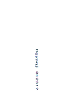](../images/font-F-R-labelary-diff.png) |
| [font-F-I](../../cases/conformance-font-F-I.md) | fonts | rendered · 48.86% IoU |  |
| [font-F-B](../../cases/conformance-font-F-B.md) | fonts | rendered · 48.92% IoU | [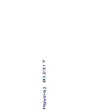](../images/font-F-B-labelary-diff.png) |
| [font-G-N](../../cases/conformance-font-G-N.md) | fonts | rendered · 54.49% IoU | [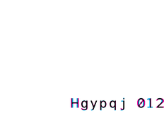](../images/font-G-N-labelary-diff.png) |
| [font-G-R](../../cases/conformance-font-G-R.md) | fonts | rendered · 54.05% IoU | [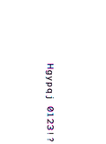](../images/font-G-R-labelary-diff.png) |
| [font-G-I](../../cases/conformance-font-G-I.md) | fonts | rendered · 55.25% IoU | [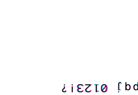](../images/font-G-I-labelary-diff.png) |
| [font-G-B](../../cases/conformance-font-G-B.md) | fonts | rendered · 53.58% IoU | [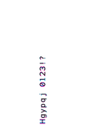](../images/font-G-B-labelary-diff.png) |
| [font-H-N](../../cases/conformance-font-H-N.md) | fonts | rendered · 80.36% IoU |  |
| [font-H-R](../../cases/conformance-font-H-R.md) | fonts | rendered · 80.40% IoU |  |
| [font-H-I](../../cases/conformance-font-H-I.md) | fonts | rendered · 70.34% IoU | [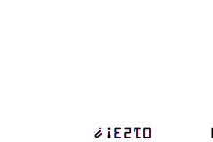](../images/font-H-I-labelary-diff.png) |
| [font-H-B](../../cases/conformance-font-H-B.md) | fonts | rendered · 70.56% IoU |  |
| [font-id-1](../../cases/conformance-font-id-1.md) | fonts | rendered · 62.52% IoU |  |
| [font-id-2](../../cases/conformance-font-id-2.md) | fonts | rendered · 62.52% IoU |  |
| [font-id-3](../../cases/conformance-font-id-3.md) | fonts | rendered · 62.52% IoU |  |
| [font-id-4](../../cases/conformance-font-id-4.md) | fonts | rendered · 62.52% IoU |  |
| [font-id-5](../../cases/conformance-font-id-5.md) | fonts | rendered · 62.52% IoU |  |
| [font-id-6](../../cases/conformance-font-id-6.md) | fonts | rendered · 62.52% IoU |  |
| [font-id-7](../../cases/conformance-font-id-7.md) | fonts | rendered · 62.52% IoU |  |
| [font-id-8](../../cases/conformance-font-id-8.md) | fonts | rendered · 62.52% IoU |  |
| [font-id-9](../../cases/conformance-font-id-9.md) | fonts | rendered · 62.52% IoU |  |
| [font-id-I](../../cases/conformance-font-id-I.md) | fonts | rendered · 62.52% IoU |  |
| [font-id-J](../../cases/conformance-font-id-J.md) | fonts | rendered · 19.31% IoU |  |
| [font-id-K](../../cases/conformance-font-id-K.md) | fonts | rendered · 62.52% IoU |  |
| [font-id-L](../../cases/conformance-font-id-L.md) | fonts | rendered · 55.94% IoU |  |
| [font-id-M](../../cases/conformance-font-id-M.md) | fonts | rendered · 62.52% IoU |  |
| [font-id-N](../../cases/conformance-font-id-N.md) | fonts | rendered · 19.72% IoU |  |
| [font-id-O](../../cases/conformance-font-id-O.md) | fonts | rendered · 62.52% IoU |  |
| [font-id-P](../../cases/conformance-font-id-P.md) | fonts | rendered · 81.94% IoU |  |
| [font-id-Q](../../cases/conformance-font-id-Q.md) | fonts | rendered · 37.58% IoU |  |
| [font-id-R](../../cases/conformance-font-id-R.md) | fonts | rendered · 54.98% IoU |  |
| [font-id-S](../../cases/conformance-font-id-S.md) | fonts | rendered · 71.18% IoU |  |
| [font-id-T](../../cases/conformance-font-id-T.md) | fonts | rendered · 82.72% IoU |  |
| [font-id-U](../../cases/conformance-font-id-U.md) | fonts | rendered · 88.80% IoU |  |
| [font-id-V](../../cases/conformance-font-id-V.md) | fonts | rendered · 70.84% IoU |  |
| [font-id-W](../../cases/conformance-font-id-W.md) | fonts | rendered · 62.52% IoU |  |
| [font-id-X](../../cases/conformance-font-id-X.md) | fonts | rendered · 62.52% IoU |  |
| [font-id-Y](../../cases/conformance-font-id-Y.md) | fonts | rendered · 62.52% IoU |  |
| [font-id-Z](../../cases/conformance-font-id-Z.md) | fonts | rendered · 62.52% IoU |  |
| [font-dim-0-0](../../cases/conformance-font-dim-0-0.md) | fonts | rendered · 75.91% IoU |  |
| [font-dim-1-1](../../cases/conformance-font-dim-1-1.md) | fonts | rendered · 37.84% IoU |  |
| [font-dim-2-2](../../cases/conformance-font-dim-2-2.md) | fonts | rendered · 37.84% IoU |  |
| [font-dim-7-0](../../cases/conformance-font-dim-7-0.md) | fonts | rendered · 37.84% IoU |  |
| [font-dim-15-0](../../cases/conformance-font-dim-15-0.md) | fonts | rendered · 62.41% IoU |  |
| [font-dim-17-0](../../cases/conformance-font-dim-17-0.md) | fonts | rendered · 71.52% IoU |  |
| [font-dim-31-0](../../cases/conformance-font-dim-31-0.md) | fonts | rendered · 75.43% IoU |  |
| [font-dim-33-0](../../cases/conformance-font-dim-33-0.md) | fonts | rendered · 64.75% IoU |  |
| [font-dim-63-0](../../cases/conformance-font-dim-63-0.md) | fonts | rendered · 93.10% IoU |  |
| [font-dim-65-0](../../cases/conformance-font-dim-65-0.md) | fonts | rendered · 86.80% IoU |  |
| [font-dim-32-1](../../cases/conformance-font-dim-32-1.md) | fonts | rendered · 39.80% IoU |  |
| [font-dim-1-32](../../cases/conformance-font-dim-1-32.md) | fonts | rendered · 70.97% IoU |  |
| [font-dim-64-16](../../cases/conformance-font-dim-64-16.md) | fonts | rendered · 76.12% IoU |  |
| [font-dim-16-64](../../cases/conformance-font-dim-16-64.md) | fonts | rendered · 85.55% IoU |  |
| [font-dim-96-96](../../cases/conformance-font-dim-96-96.md) | fonts | rendered · 92.01% IoU |  |
| [text-digits](../../cases/conformance-text-digits.md) | text-data | rendered · 43.07% IoU |  |
| [text-case](../../cases/conformance-text-case.md) | text-data | rendered · 57.13% IoU |  |
| [text-punctuation](../../cases/conformance-text-punctuation.md) | text-data | rendered · 21.85% IoU |  |
| [text-spacing](../../cases/conformance-text-spacing.md) | text-data | rendered · 22.13% IoU |  |
| [text-empty](../../cases/conformance-text-empty.md) | text-data | blank · unscored | Unavailable |
| [fields-1](../../cases/conformance-fields-1.md) | stress | rendered · 69.57% IoU |  |
| [fields-48](../../cases/conformance-fields-48.md) | stress | rendered · 66.86% IoU | [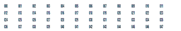](../images/fields-48-labelary-diff.png) |
| [fields-400](../../cases/conformance-fields-400.md) | stress | rendered · 64.05% IoU |  |
| [field-data-3072-bytes](../../cases/conformance-field-data-3072-bytes.md) | stress | rendered · 24.41% IoU | [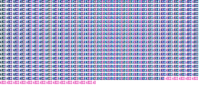](../images/field-data-3072-bytes-labelary-diff.png) |
| [field-defaults](../../cases/conformance-field-defaults.md) | state | rendered · 69.05% IoU |  |
| [anchor-FO-N-0](../../cases/conformance-anchor-FO-N-0.md) | position | rendered · 84.30% IoU |  |
| [anchor-FO-N-1](../../cases/conformance-anchor-FO-N-1.md) | position | rendered · 66.89% IoU |  |
| [anchor-FO-N-2](../../cases/conformance-anchor-FO-N-2.md) | position | rendered · 84.30% IoU |  |
| [anchor-FT-N-0](../../cases/conformance-anchor-FT-N-0.md) | position | rendered · 84.13% IoU |  |
| [anchor-FT-N-1](../../cases/conformance-anchor-FT-N-1.md) | position | rendered · 66.97% IoU |  |
| [anchor-FT-N-2](../../cases/conformance-anchor-FT-N-2.md) | position | rendered · 84.13% IoU |  |
| [anchor-FO-R-0](../../cases/conformance-anchor-FO-R-0.md) | position | rendered · 76.36% IoU |  |
| [anchor-FO-R-1](../../cases/conformance-anchor-FO-R-1.md) | position | rendered · 47.67% IoU |  |
| [anchor-FO-R-2](../../cases/conformance-anchor-FO-R-2.md) | position | rendered · 76.36% IoU |  |
| [anchor-FT-R-0](../../cases/conformance-anchor-FT-R-0.md) | position | rendered · 84.18% IoU |  |
| [anchor-FT-R-1](../../cases/conformance-anchor-FT-R-1.md) | position | rendered · 66.93% IoU |  |
| [anchor-FT-R-2](../../cases/conformance-anchor-FT-R-2.md) | position | rendered · 84.18% IoU |  |
| [anchor-FO-I-0](../../cases/conformance-anchor-FO-I-0.md) | position | rendered · 62.81% IoU |  |
| [anchor-FO-I-1](../../cases/conformance-anchor-FO-I-1.md) | position | rendered · 26.14% IoU |  |
| [anchor-FO-I-2](../../cases/conformance-anchor-FO-I-2.md) | position | rendered · 62.81% IoU |  |
| [anchor-FT-I-0](../../cases/conformance-anchor-FT-I-0.md) | position | rendered · 84.07% IoU |  |
| [anchor-FT-I-1](../../cases/conformance-anchor-FT-I-1.md) | position | rendered · 84.07% IoU |  |
| [anchor-FT-I-2](../../cases/conformance-anchor-FT-I-2.md) | position | rendered · 84.07% IoU |  |
| [anchor-FO-B-0](../../cases/conformance-anchor-FO-B-0.md) | position | rendered · 66.89% IoU |  |
| [anchor-FO-B-1](../../cases/conformance-anchor-FO-B-1.md) | position | rendered · 66.89% IoU |  |
| [anchor-FO-B-2](../../cases/conformance-anchor-FO-B-2.md) | position | rendered · 66.89% IoU |  |
| [anchor-FT-B-0](../../cases/conformance-anchor-FT-B-0.md) | position | rendered · 84.13% IoU |  |
| [anchor-FT-B-1](../../cases/conformance-anchor-FT-B-1.md) | position | rendered · 84.22% IoU |  |
| [anchor-FT-B-2](../../cases/conformance-anchor-FT-B-2.md) | position | rendered · 84.13% IoU |  |
| [offset-LS--80](../../cases/conformance-offset-LS--80.md) | position | rendered · 98.08% IoU |  |
| [offset-LS-80](../../cases/conformance-offset-LS-80.md) | position | rendered · 98.30% IoU |  |
| [offset-LT--50](../../cases/conformance-offset-LT--50.md) | position | rendered · 52.47% IoU |  |
| [offset-LT-50](../../cases/conformance-offset-LT-50.md) | position | rendered · 8.02% IoU |  |
| [offset-LH-100-200](../../cases/conformance-offset-LH-100-200.md) | position | rendered · 98.08% IoU |  |
| [clip-0-0](../../cases/conformance-clip-0-0.md) | clipping | rendered · 100.00% IoU · exact |  |
| [clip-831-1217](../../cases/conformance-clip-831-1217.md) | clipping | rendered · 100.00% IoU · exact |  |
| [clip-832-1218](../../cases/conformance-clip-832-1218.md) | clipping | blank · unscored · exact |  |
| [clip-800-1180](../../cases/conformance-clip-800-1180.md) | clipping | rendered · 100.00% IoU · exact |  |
| [clip-32000-32000](../../cases/conformance-clip-32000-32000.md) | clipping | blank · unscored · exact |  |
| [page-transform-N-N](../../cases/conformance-page-transform-N-N.md) | transforms | rendered · 84.61% IoU |  |
| [page-transform-Y-N](../../cases/conformance-page-transform-Y-N.md) | transforms | rendered · 0.00% IoU |  |
| [page-transform-N-I](../../cases/conformance-page-transform-N-I.md) | transforms | rendered · 2.49% IoU |  |
| [page-transform-Y-I](../../cases/conformance-page-transform-Y-I.md) | transforms | rendered · 0.00% IoU |  |
| [label-reverse](../../cases/conformance-label-reverse.md) | compositing | rendered · 91.92% IoU |  |
| [field-direction-H-0](../../cases/conformance-field-direction-H-0.md) | text-layout | rendered · 73.37% IoU |  |
| [field-direction-H-1](../../cases/conformance-field-direction-H-1.md) | text-layout | rendered · 73.37% IoU |  |
| [field-direction-H-8](../../cases/conformance-field-direction-H-8.md) | text-layout | rendered · 73.37% IoU |  |
| [field-direction-V-0](../../cases/conformance-field-direction-V-0.md) | text-layout | rendered · 79.91% IoU | [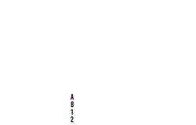](../images/field-direction-V-0-labelary-diff.png) |
| [field-direction-V-1](../../cases/conformance-field-direction-V-1.md) | text-layout | rendered · 79.91% IoU |  |
| [field-direction-V-8](../../cases/conformance-field-direction-V-8.md) | text-layout | rendered · 79.91% IoU | [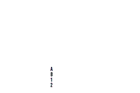](../images/field-direction-V-8-labelary-diff.png) |
| [field-direction-R-0](../../cases/conformance-field-direction-R-0.md) | text-layout | rendered · 16.94% IoU |  |
| [field-direction-R-1](../../cases/conformance-field-direction-R-1.md) | text-layout | rendered · 17.18% IoU |  |
| [field-direction-R-8](../../cases/conformance-field-direction-R-8.md) | text-layout | rendered · 24.43% IoU |  |
| [block-1-L](../../cases/conformance-block-1-L.md) | text-layout | rendered · 81.56% IoU |  |
| [block-1-C](../../cases/conformance-block-1-C.md) | text-layout | rendered · 81.56% IoU |  |
| [block-1-R](../../cases/conformance-block-1-R.md) | text-layout | rendered · 81.56% IoU |  |
| [block-1-J](../../cases/conformance-block-1-J.md) | text-layout | rendered · 81.56% IoU |  |
| [block-20-L](../../cases/conformance-block-20-L.md) | text-layout | rendered · 68.90% IoU |  |
| [block-20-C](../../cases/conformance-block-20-C.md) | text-layout | rendered · 57.67% IoU |  |
| [block-20-R](../../cases/conformance-block-20-R.md) | text-layout | rendered · 54.33% IoU |  |
| [block-20-J](../../cases/conformance-block-20-J.md) | text-layout | rendered · 68.90% IoU |  |
| [block-120-L](../../cases/conformance-block-120-L.md) | text-layout | rendered · 30.57% IoU |  |
| [block-120-C](../../cases/conformance-block-120-C.md) | text-layout | rendered · 22.29% IoU |  |
| [block-120-R](../../cases/conformance-block-120-R.md) | text-layout | rendered · 29.07% IoU |  |
| [block-120-J](../../cases/conformance-block-120-J.md) | text-layout | rendered · 27.86% IoU |  |
| [block-300-L](../../cases/conformance-block-300-L.md) | text-layout | rendered · 34.43% IoU |  |
| [block-300-C](../../cases/conformance-block-300-C.md) | text-layout | rendered · 44.38% IoU |  |
| [block-300-R](../../cases/conformance-block-300-R.md) | text-layout | rendered · 45.67% IoU |  |
| [block-300-J](../../cases/conformance-block-300-J.md) | text-layout | rendered · 49.07% IoU |  |
| [block-spacing--12-indent-0](../../cases/conformance-block-spacing--12-indent-0.md) | text-layout | rendered · 45.23% IoU |  |
| [block-spacing-12-indent-0](../../cases/conformance-block-spacing-12-indent-0.md) | text-layout | rendered · 45.16% IoU |  |
| [block-spacing-0-indent-40](../../cases/conformance-block-spacing-0-indent-40.md) | text-layout | rendered · 45.16% IoU |  |
| [block-spacing-8-indent-80](../../cases/conformance-block-spacing-8-indent-80.md) | text-layout | rendered · 45.16% IoU |  |
| [block-content-breaks](../../cases/conformance-block-content-breaks.md) | text-layout | rendered · 74.01% IoU |  |
| [block-content-long-word](../../cases/conformance-block-content-long-word.md) | text-layout | rendered · 35.90% IoU |  |
| [block-content-spaces](../../cases/conformance-block-content-spaces.md) | text-layout | rendered · 63.74% IoU |  |
| [block-content-empty](../../cases/conformance-block-content-empty.md) | text-layout | blank · unscored | Unavailable |
| [text-block-N-1](../../cases/conformance-text-block-N-1.md) | text-layout | rendered · 35.00% IoU |  |
| [text-block-N-40](../../cases/conformance-text-block-N-40.md) | text-layout | rendered · 41.17% IoU |  |
| [text-block-N-120](../../cases/conformance-text-block-N-120.md) | text-layout | rendered · 41.17% IoU |  |
| [text-block-R-1](../../cases/conformance-text-block-R-1.md) | text-layout | rendered · unscored |  |
| [text-block-R-40](../../cases/conformance-text-block-R-40.md) | text-layout | rendered · 38.43% IoU |  |
| [text-block-R-120](../../cases/conformance-text-block-R-120.md) | text-layout | rendered · 38.43% IoU |  |
| [text-block-I-1](../../cases/conformance-text-block-I-1.md) | text-layout | rendered · unscored |  |
| [text-block-I-40](../../cases/conformance-text-block-I-40.md) | text-layout | rendered · 38.79% IoU |  |
| [text-block-I-120](../../cases/conformance-text-block-I-120.md) | text-layout | rendered · 38.79% IoU |  |
| [text-block-B-1](../../cases/conformance-text-block-B-1.md) | text-layout | rendered · 35.00% IoU |  |
| [text-block-B-40](../../cases/conformance-text-block-B-40.md) | text-layout | rendered · 41.36% IoU |  |
| [text-block-B-120](../../cases/conformance-text-block-B-120.md) | text-layout | rendered · 41.36% IoU |  |
| [unicode-latin](../../cases/conformance-unicode-latin.md) | encoding | rendered · 65.47% IoU |  |
| [unicode-combining](../../cases/conformance-unicode-combining.md) | encoding | rendered · 33.27% IoU |  |
| [unicode-greek](../../cases/conformance-unicode-greek.md) | encoding | rendered · 87.14% IoU |  |
| [unicode-cyrillic](../../cases/conformance-unicode-cyrillic.md) | encoding | rendered · 84.29% IoU |  |
| [unicode-hebrew](../../cases/conformance-unicode-hebrew.md) | encoding | rendered · 50.64% IoU |  |
| [unicode-arabic](../../cases/conformance-unicode-arabic.md) | encoding | rendered · 70.27% IoU |  |
| [unicode-cjk](../../cases/conformance-unicode-cjk.md) | encoding | blank · unscored · exact |  |
| [unicode-supplementary](../../cases/conformance-unicode-supplementary.md) | encoding | rendered · 37.44% IoU |  |
| [unicode-controls](../../cases/conformance-unicode-controls.md) | encoding | rendered · 29.48% IoU |  |
| [unicode-missing](../../cases/conformance-unicode-missing.md) | encoding | rendered · 81.58% IoU |  |
| [encoding-0](../../cases/conformance-encoding-0.md) | encoding | rendered · 80.75% IoU |  |
| [encoding-13](../../cases/conformance-encoding-13.md) | encoding | rendered · 80.75% IoU |  |
| [encoding-27](../../cases/conformance-encoding-27.md) | encoding | rendered · 80.75% IoU |  |
| [encoding-28](../../cases/conformance-encoding-28.md) | encoding | rendered · 80.75% IoU |  |
| [encoding-29](../../cases/conformance-encoding-29.md) | encoding | blank · unscored | Unavailable |
| [encoding-30](../../cases/conformance-encoding-30.md) | encoding | rendered · unscored | Unavailable |
| [encoding-31](../../cases/conformance-encoding-31.md) | encoding | rendered · 80.75% IoU |  |
| [encoding-33](../../cases/conformance-encoding-33.md) | encoding | rendered · 80.75% IoU |  |
| [encoding-34](../../cases/conformance-encoding-34.md) | encoding | rendered · 80.75% IoU |  |
| [encoding-35](../../cases/conformance-encoding-35.md) | encoding | rendered · 80.75% IoU |  |
| [encoding-36](../../cases/conformance-encoding-36.md) | encoding | rendered · 80.75% IoU |  |
| [encoding-remap](../../cases/conformance-encoding-remap.md) | encoding | rendered · 77.42% IoU |  |
| [advanced-text-0000](../../cases/conformance-advanced-text-0000.md) | encoding | rendered · 76.25% IoU |  |
| [advanced-text-1000](../../cases/conformance-advanced-text-1000.md) | encoding | rendered · 71.81% IoU |  |
| [advanced-text-0100](../../cases/conformance-advanced-text-0100.md) | encoding | rendered · 28.36% IoU |  |
| [advanced-text-0010](../../cases/conformance-advanced-text-0010.md) | encoding | rendered · 76.25% IoU |  |
| [advanced-text-0001](../../cases/conformance-advanced-text-0001.md) | encoding | rendered · 76.25% IoU |  |
| [advanced-text-1111](../../cases/conformance-advanced-text-1111.md) | encoding | rendered · 82.80% IoU |  |
| [hex-underscore](../../cases/conformance-hex-underscore.md) | lexical | rendered · 83.36% IoU |  |
| [hex-hash](../../cases/conformance-hex-hash.md) | lexical | rendered · 83.36% IoU |  |
| [hex-scope](../../cases/conformance-hex-scope.md) | state | rendered · 87.52% IoU |  |
| [variable-field](../../cases/conformance-variable-field.md) | text-data | rendered · 80.32% IoU |  |
| [numbered-fields-inline](../../cases/conformance-numbered-fields-inline.md) | state | rendered · 87.90% IoU |  |
| [field-concat-whole](../../cases/conformance-field-concat-whole.md) | text-data | rendered · 75.80% IoU |  |
| [field-concat-forward](../../cases/conformance-field-concat-forward.md) | text-data | rendered · 79.93% IoU |  |
| [field-concat-backward](../../cases/conformance-field-concat-backward.md) | text-data | rendered · 76.81% IoU |  |
| [field-concat-past-end](../../cases/conformance-field-concat-past-end.md) | text-data | rendered · 80.89% IoU |  |
| [field-concat-scope](../../cases/conformance-field-concat-scope.md) | state | rendered · 80.46% IoU |  |
| [interleaved-odd-digits](../../cases/conformance-interleaved-odd-digits.md) | barcode-arguments | rendered · 100.00% IoU · exact |  |
| [serial-000009-Y](../../cases/conformance-serial-000009-Y.md) | serialization | rendered · 54.98% IoU |  |
| [serial-000009-N](../../cases/conformance-serial-000009-N.md) | serialization | rendered · 43.43% IoU |  |
| [serial-A009Z-Y](../../cases/conformance-serial-A009Z-Y.md) | serialization | rendered · 77.79% IoU |  |
| [serial-mask](../../cases/conformance-serial-mask.md) | serialization | rendered · 70.08% IoU |  |
| [comments-and-line-endings](../../cases/conformance-comments-and-line-endings.md) | lexical | rendered · 87.10% IoU |  |
| [box-rounding-0](../../cases/conformance-box-rounding-0.md) | shapes | rendered · 100.00% IoU · exact |  |
| [box-rounding-1](../../cases/conformance-box-rounding-1.md) | shapes | rendered · 99.04% IoU |  |
| [box-rounding-2](../../cases/conformance-box-rounding-2.md) | shapes | rendered · 97.60% IoU |  |
| [box-rounding-3](../../cases/conformance-box-rounding-3.md) | shapes | rendered · 96.62% IoU |  |
| [box-rounding-4](../../cases/conformance-box-rounding-4.md) | shapes | rendered · 94.76% IoU |  |
| [box-rounding-5](../../cases/conformance-box-rounding-5.md) | shapes | rendered · 93.54% IoU |  |
| [box-rounding-6](../../cases/conformance-box-rounding-6.md) | shapes | rendered · 92.62% IoU |  |
| [box-rounding-7](../../cases/conformance-box-rounding-7.md) | shapes | rendered · 90.50% IoU |  |
| [box-rounding-8](../../cases/conformance-box-rounding-8.md) | shapes | rendered · 88.81% IoU |  |
| [box-0-80-1](../../cases/conformance-box-0-80-1.md) | shapes | rendered · 100.00% IoU · exact |  |
| [box-80-0-1](../../cases/conformance-box-80-0-1.md) | shapes | rendered · 100.00% IoU · exact |  |
| [box-1-1-1](../../cases/conformance-box-1-1-1.md) | shapes | rendered · 100.00% IoU · exact |  |
| [box-2-2-1](../../cases/conformance-box-2-2-1.md) | shapes | rendered · 100.00% IoU · exact |  |
| [box-31-31-1](../../cases/conformance-box-31-31-1.md) | shapes | rendered · 100.00% IoU · exact |  |
| [box-32-32-1](../../cases/conformance-box-32-32-1.md) | shapes | rendered · 100.00% IoU · exact |  |
| [box-33-33-1](../../cases/conformance-box-33-33-1.md) | shapes | rendered · 100.00% IoU · exact |  |
| [box-100-60-30](../../cases/conformance-box-100-60-30.md) | shapes | rendered · 100.00% IoU · exact |  |
| [box-100-60-100](../../cases/conformance-box-100-60-100.md) | shapes | rendered · 100.00% IoU · exact |  |
| [shape-GC-B-plain](../../cases/conformance-shape-GC-B-plain.md) | shapes | rendered · 100.00% IoU · exact |  |
| [shape-GC-W-plain](../../cases/conformance-shape-GC-W-plain.md) | shapes | rendered · 97.96% IoU |  |
| [shape-GE-B-plain](../../cases/conformance-shape-GE-B-plain.md) | shapes | rendered · 100.00% IoU · exact |  |
| [shape-GE-W-plain](../../cases/conformance-shape-GE-W-plain.md) | shapes | rendered · 95.02% IoU |  |
| [shape-GD-B-L](../../cases/conformance-shape-GD-B-L.md) | shapes | rendered · 100.00% IoU · exact |  |
| [shape-GD-B-R](../../cases/conformance-shape-GD-B-R.md) | shapes | rendered · 100.00% IoU · exact |  |
| [shape-GD-W-L](../../cases/conformance-shape-GD-W-L.md) | shapes | rendered · 99.76% IoU |  |
| [shape-GD-W-R](../../cases/conformance-shape-GD-W-R.md) | shapes | rendered · 99.76% IoU |  |
| [symbol-graphic-A-N](../../cases/conformance-symbol-graphic-A-N.md) | shapes | rendered · 57.40% IoU |  |
| [symbol-graphic-A-R](../../cases/conformance-symbol-graphic-A-R.md) | shapes | rendered · 57.40% IoU |  |
| [symbol-graphic-A-I](../../cases/conformance-symbol-graphic-A-I.md) | shapes | rendered · 56.77% IoU |  |
| [symbol-graphic-A-B](../../cases/conformance-symbol-graphic-A-B.md) | shapes | rendered · 56.77% IoU |  |
| [symbol-graphic-B-N](../../cases/conformance-symbol-graphic-B-N.md) | shapes | rendered · 44.80% IoU |  |
| [symbol-graphic-B-R](../../cases/conformance-symbol-graphic-B-R.md) | shapes | rendered · 44.80% IoU |  |
| [symbol-graphic-B-I](../../cases/conformance-symbol-graphic-B-I.md) | shapes | rendered · 44.51% IoU |  |
| [symbol-graphic-B-B](../../cases/conformance-symbol-graphic-B-B.md) | shapes | rendered · 44.51% IoU |  |
| [symbol-graphic-C-N](../../cases/conformance-symbol-graphic-C-N.md) | shapes | rendered · 60.42% IoU |  |
| [symbol-graphic-C-R](../../cases/conformance-symbol-graphic-C-R.md) | shapes | rendered · 60.42% IoU |  |
| [symbol-graphic-C-I](../../cases/conformance-symbol-graphic-C-I.md) | shapes | rendered · 67.89% IoU |  |
| [symbol-graphic-C-B](../../cases/conformance-symbol-graphic-C-B.md) | shapes | rendered · 67.89% IoU |  |
| [symbol-graphic-D-N](../../cases/conformance-symbol-graphic-D-N.md) | shapes | rendered · 59.72% IoU |  |
| [symbol-graphic-D-R](../../cases/conformance-symbol-graphic-D-R.md) | shapes | rendered · 59.86% IoU |  |
| [symbol-graphic-D-I](../../cases/conformance-symbol-graphic-D-I.md) | shapes | rendered · 52.19% IoU |  |
| [symbol-graphic-D-B](../../cases/conformance-symbol-graphic-D-B.md) | shapes | rendered · 52.32% IoU |  |
| [symbol-graphic-E-N](../../cases/conformance-symbol-graphic-E-N.md) | shapes | rendered · 68.83% IoU |  |
| [symbol-graphic-E-R](../../cases/conformance-symbol-graphic-E-R.md) | shapes | rendered · 68.83% IoU |  |
| [symbol-graphic-E-I](../../cases/conformance-symbol-graphic-E-I.md) | shapes | rendered · 59.43% IoU |  |
| [symbol-graphic-E-B](../../cases/conformance-symbol-graphic-E-B.md) | shapes | rendered · 59.60% IoU |  |
| [paint-black-white](../../cases/conformance-paint-black-white.md) | compositing | rendered · 100.00% IoU · exact |  |
| [paint-white-black](../../cases/conformance-paint-white-black.md) | compositing | rendered · 100.00% IoU · exact |  |
| [paint-reverse-overlap](../../cases/conformance-paint-reverse-overlap.md) | compositing | rendered · 100.00% IoU · exact |  |
| [paint-reverse-twice](../../cases/conformance-paint-reverse-twice.md) | compositing | rendered · 100.00% IoU · exact |  |
| [reverse-field-scope](../../cases/conformance-reverse-field-scope.md) | state | rendered · 99.82% IoU | [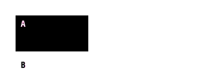](../images/reverse-field-scope-labelary-diff.png) |
| [raster-equivalent-hex](../../cases/conformance-raster-equivalent-hex.md) | graphics | rendered · 100.00% IoU · exact |  |
| [raster-equivalent-B64](../../cases/conformance-raster-equivalent-B64.md) | graphics | rendered · 100.00% IoU · exact |  |
| [raster-equivalent-Z64](../../cases/conformance-raster-equivalent-Z64.md) | graphics | rendered · 100.00% IoU · exact |  |
| [raster-equivalent-binary](../../cases/conformance-raster-equivalent-binary.md) | graphics | rendered · unscored | Unavailable |
| [raster-fill-hex](../../cases/conformance-raster-fill-hex.md) | graphics | rendered · 100.00% IoU · exact |  |
| [raster-fill-rle](../../cases/conformance-raster-fill-rle.md) | graphics | rendered · 100.00% IoU · exact |  |
| [raster-repeat-hex](../../cases/conformance-raster-repeat-hex.md) | graphics | rendered · 100.00% IoU · exact |  |
| [raster-repeat-rle](../../cases/conformance-raster-repeat-rle.md) | graphics | rendered · 100.00% IoU · exact |  |
| [raster-binary-command-bytes](../../cases/conformance-raster-binary-command-bytes.md) | graphics | rendered · unscored | Unavailable |
| [raster-stride-1](../../cases/conformance-raster-stride-1.md) | graphics | rendered · 100.00% IoU · exact |  |
| [raster-stride-2](../../cases/conformance-raster-stride-2.md) | graphics | rendered · 100.00% IoU · exact |  |
| [raster-stride-3](../../cases/conformance-raster-stride-3.md) | graphics | rendered · 100.00% IoU · exact |  |
| [raster-stride-17](../../cases/conformance-raster-stride-17.md) | graphics | rendered · 100.00% IoU · exact |  |
| [raster-clipped](../../cases/conformance-raster-clipped.md) | graphics | rendered · 100.00% IoU · exact |  |
| [barcode-module-1-ratio-2.0](../../cases/conformance-barcode-module-1-ratio-2.0.md) | barcode-arguments | rendered · 100.00% IoU · exact |  |
| [barcode-module-1-ratio-2.5](../../cases/conformance-barcode-module-1-ratio-2.5.md) | barcode-arguments | rendered · 100.00% IoU · exact |  |
| [barcode-module-1-ratio-3.0](../../cases/conformance-barcode-module-1-ratio-3.0.md) | barcode-arguments | rendered · 100.00% IoU · exact |  |
| [barcode-module-2-ratio-2.0](../../cases/conformance-barcode-module-2-ratio-2.0.md) | barcode-arguments | rendered · 100.00% IoU · exact |  |
| [barcode-module-2-ratio-2.5](../../cases/conformance-barcode-module-2-ratio-2.5.md) | barcode-arguments | rendered · 100.00% IoU · exact |  |
| [barcode-module-2-ratio-3.0](../../cases/conformance-barcode-module-2-ratio-3.0.md) | barcode-arguments | rendered · 100.00% IoU · exact |  |
| [barcode-module-3-ratio-2.0](../../cases/conformance-barcode-module-3-ratio-2.0.md) | barcode-arguments | rendered · 100.00% IoU · exact |  |
| [barcode-module-3-ratio-2.5](../../cases/conformance-barcode-module-3-ratio-2.5.md) | barcode-arguments | rendered · 100.00% IoU · exact |  |
| [barcode-module-3-ratio-3.0](../../cases/conformance-barcode-module-3-ratio-3.0.md) | barcode-arguments | rendered · 100.00% IoU · exact |  |
| [barcode-module-10-ratio-2.0](../../cases/conformance-barcode-module-10-ratio-2.0.md) | barcode-arguments | rendered · 100.00% IoU · exact |  |
| [barcode-module-10-ratio-2.5](../../cases/conformance-barcode-module-10-ratio-2.5.md) | barcode-arguments | rendered · 100.00% IoU · exact |  |
| [barcode-module-10-ratio-3.0](../../cases/conformance-barcode-module-10-ratio-3.0.md) | barcode-arguments | rendered · 100.00% IoU · exact |  |
| [code128-mode-N](../../cases/conformance-code128-mode-N.md) | barcode-arguments | rendered · 100.00% IoU · exact |  |
| [code128-mode-U](../../cases/conformance-code128-mode-U.md) | barcode-arguments | rendered · 100.00% IoU · exact |  |
| [code128-mode-A](../../cases/conformance-code128-mode-A.md) | barcode-arguments | rendered · 100.00% IoU · exact |  |
| [code128-mode-D](../../cases/conformance-code128-mode-D.md) | barcode-arguments | rendered · 100.00% IoU · exact |  |
| [code128-subset-b](../../cases/conformance-code128-subset-b.md) | barcode-arguments | rendered · 100.00% IoU · exact |  |
| [code128-subset-c](../../cases/conformance-code128-subset-c.md) | barcode-arguments | rendered · 100.00% IoU · exact |  |
| [code128-switch](../../cases/conformance-code128-switch.md) | barcode-arguments | rendered · 100.00% IoU · exact |  |
| [code128-fnc1](../../cases/conformance-code128-fnc1.md) | barcode-arguments | rendered · 100.00% IoU · exact |  |
| [readable-B2-N](../../cases/conformance-readable-B2-N.md) | barcode-arguments | rendered · 95.77% IoU |  |
| [readable-B2-R](../../cases/conformance-readable-B2-R.md) | barcode-arguments | rendered · 95.78% IoU | [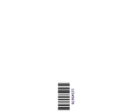](../images/readable-B2-R-labelary-diff.png) |
| [readable-B2-I](../../cases/conformance-readable-B2-I.md) | barcode-arguments | rendered · 95.30% IoU |  |
| [readable-B2-B](../../cases/conformance-readable-B2-B.md) | barcode-arguments | rendered · 95.28% IoU | [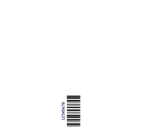](../images/readable-B2-B-labelary-diff.png) |
| [readable-B3-N](../../cases/conformance-readable-B3-N.md) | barcode-arguments | rendered · 96.79% IoU |  |
| [readable-B3-R](../../cases/conformance-readable-B3-R.md) | barcode-arguments | rendered · 96.81% IoU | [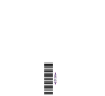](../images/readable-B3-R-labelary-diff.png) |
| [readable-B3-I](../../cases/conformance-readable-B3-I.md) | barcode-arguments | rendered · 96.43% IoU |  |
| [readable-B3-B](../../cases/conformance-readable-B3-B.md) | barcode-arguments | rendered · 96.42% IoU | [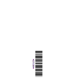](../images/readable-B3-B-labelary-diff.png) |
| [readable-BC-N](../../cases/conformance-readable-BC-N.md) | barcode-arguments | rendered · 96.53% IoU | [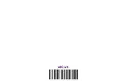](../images/readable-BC-N-labelary-diff.png) |
| [readable-BC-R](../../cases/conformance-readable-BC-R.md) | barcode-arguments | rendered · 96.56% IoU |  |
| [readable-BC-I](../../cases/conformance-readable-BC-I.md) | barcode-arguments | rendered · 96.20% IoU | [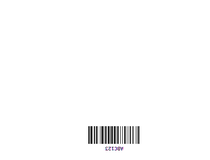](../images/readable-BC-I-labelary-diff.png) |
| [readable-BC-B](../../cases/conformance-readable-BC-B.md) | barcode-arguments | rendered · 96.19% IoU |  |
| [readable-BE-N](../../cases/conformance-readable-BE-N.md) | barcode-arguments | rendered · 91.58% IoU |  |
| [readable-BE-R](../../cases/conformance-readable-BE-R.md) | barcode-arguments | rendered · 91.55% IoU |  |
| [readable-BE-I](../../cases/conformance-readable-BE-I.md) | barcode-arguments | rendered · 93.89% IoU |  |
| [readable-BE-B](../../cases/conformance-readable-BE-B.md) | barcode-arguments | rendered · 93.86% IoU |  |
| [readable-BU-N](../../cases/conformance-readable-BU-N.md) | barcode-arguments | rendered · 91.76% IoU |  |
| [readable-BU-R](../../cases/conformance-readable-BU-R.md) | barcode-arguments | rendered · 91.75% IoU |  |
| [readable-BU-I](../../cases/conformance-readable-BU-I.md) | barcode-arguments | rendered · 94.05% IoU |  |
| [readable-BU-B](../../cases/conformance-readable-BU-B.md) | barcode-arguments | rendered · 94.04% IoU |  |
| [qr-mask-full-0](../../cases/conformance-qr-mask-full-0.md) | barcode-arguments | rendered · 47.87% IoU |  |
| [qr-mask-full-1](../../cases/conformance-qr-mask-full-1.md) | barcode-arguments | rendered · 47.87% IoU |  |
| [qr-mask-full-2](../../cases/conformance-qr-mask-full-2.md) | barcode-arguments | rendered · 47.87% IoU |  |
| [qr-mask-full-3](../../cases/conformance-qr-mask-full-3.md) | barcode-arguments | rendered · 47.87% IoU |  |
| [qr-mask-full-4](../../cases/conformance-qr-mask-full-4.md) | barcode-arguments | rendered · 47.87% IoU |  |
| [qr-mask-full-5](../../cases/conformance-qr-mask-full-5.md) | barcode-arguments | rendered · 47.87% IoU |  |
| [qr-mask-full-6](../../cases/conformance-qr-mask-full-6.md) | barcode-arguments | rendered · 47.87% IoU |  |
| [qr-mask-full-7](../../cases/conformance-qr-mask-full-7.md) | barcode-arguments | rendered · 47.87% IoU |  |
| [datamatrix-quality-0](../../cases/conformance-datamatrix-quality-0.md) | barcode-arguments | blank · 0.00% IoU |  |
| [datamatrix-quality-50](../../cases/conformance-datamatrix-quality-50.md) | barcode-arguments | blank · 0.00% IoU |  |
| [datamatrix-quality-80](../../cases/conformance-datamatrix-quality-80.md) | barcode-arguments | blank · 0.00% IoU |  |
| [datamatrix-quality-100](../../cases/conformance-datamatrix-quality-100.md) | barcode-arguments | blank · 0.00% IoU |  |
| [datamatrix-quality-140](../../cases/conformance-datamatrix-quality-140.md) | barcode-arguments | blank · 0.00% IoU |  |
| [datamatrix-quality-200](../../cases/conformance-datamatrix-quality-200.md) | barcode-arguments | rendered · 100.00% IoU · exact |  |
| [datamatrix-size-10-10](../../cases/conformance-datamatrix-size-10-10.md) | barcode-arguments | rendered · 100.00% IoU · exact |  |
| [datamatrix-size-16-16](../../cases/conformance-datamatrix-size-16-16.md) | barcode-arguments | rendered · 100.00% IoU · exact |  |
| [datamatrix-size-18-8](../../cases/conformance-datamatrix-size-18-8.md) | barcode-arguments | rendered · 100.00% IoU · exact |  |
| [datamatrix-size-32-8](../../cases/conformance-datamatrix-size-32-8.md) | barcode-arguments | rendered · 100.00% IoU · exact |  |
| [pdf417-security-0-N](../../cases/conformance-pdf417-security-0-N.md) | barcode-arguments | rendered · 84.36% IoU |  |
| [pdf417-security-0-Y](../../cases/conformance-pdf417-security-0-Y.md) | barcode-arguments | rendered · 80.32% IoU |  |
| [pdf417-security-2-N](../../cases/conformance-pdf417-security-2-N.md) | barcode-arguments | rendered · 79.45% IoU |  |
| [pdf417-security-2-Y](../../cases/conformance-pdf417-security-2-Y.md) | barcode-arguments | rendered · 74.39% IoU |  |
| [pdf417-security-8-N](../../cases/conformance-pdf417-security-8-N.md) | barcode-arguments | rendered · 61.88% IoU |  |
| [pdf417-security-8-Y](../../cases/conformance-pdf417-security-8-Y.md) | barcode-arguments | rendered · 54.28% IoU |  |
| [pdf417-structured-origins-1](../../cases/conformance-pdf417-structured-origins-1.md) | barcode-arguments | blank · unscored · exact |  |
| [pdf417-structured-origins-3](../../cases/conformance-pdf417-structured-origins-3.md) | barcode-arguments | blank · unscored · exact |  |
| [structured-exclude-B7](../../cases/conformance-structured-exclude-B7.md) | barcode-arguments | blank · unscored · exact |  |
| [structured-exclude-BF](../../cases/conformance-structured-exclude-BF.md) | barcode-arguments | blank · unscored · exact |  |
| [barcode-validation](../../cases/conformance-barcode-validation.md) | barcode-arguments | rendered · 100.00% IoU · exact |  |
| [barcode-default-scope](../../cases/conformance-barcode-default-scope.md) | state | rendered · 100.00% IoU · exact |  |
| [equivalent-text-plain](../../cases/conformance-equivalent-text-plain.md) | metamorphic | rendered · 70.24% IoU |  |
| [equivalent-text-hex](../../cases/conformance-equivalent-text-hex.md) | metamorphic | rendered · 70.24% IoU |  |
| [equivalent-home-direct](../../cases/conformance-equivalent-home-direct.md) | metamorphic | rendered · 100.00% IoU · exact |  |
| [equivalent-home-offset](../../cases/conformance-equivalent-home-offset.md) | metamorphic | rendered · 100.00% IoU · exact |  |
| [equivalent-comment](../../cases/conformance-equivalent-comment.md) | metamorphic | rendered · 70.24% IoU |  |
| [torture-typography](../../cases/conformance-torture-typography.md) | torture | rendered · 68.81% IoU | [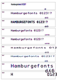](../images/torture-typography-labelary-diff.png) |
| [torture-geometry](../../cases/conformance-torture-geometry.md) | torture | rendered · 78.45% IoU |  |
| [torture-shipping-label](../../cases/conformance-torture-shipping-label.md) | torture | rendered · 91.18% IoU | [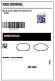](../images/torture-shipping-label-labelary-diff.png) |
| [torture-overlap](../../cases/conformance-torture-overlap.md) | torture | rendered · 98.78% IoU |  |
| [compact-baseline-0](../../cases/conformance-compact-baseline-0.md) | compact-fonts | rendered · 73.28% IoU |  |
| [compact-baseline-A](../../cases/conformance-compact-baseline-A.md) | compact-fonts | rendered · 53.42% IoU |  |
| [compact-baseline-B](../../cases/conformance-compact-baseline-B.md) | compact-fonts | rendered · 71.34% IoU |  |
| [compact-baseline-C](../../cases/conformance-compact-baseline-C.md) | compact-fonts | rendered · 52.53% IoU | [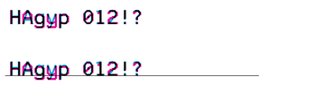](../images/compact-baseline-C-labelary-diff.png) |
| [compact-baseline-F](../../cases/conformance-compact-baseline-F.md) | compact-fonts | rendered · 54.10% IoU |  |
| [compact-wrap-L](../../cases/conformance-compact-wrap-L.md) | compact-layout | rendered · 54.35% IoU |  |
| [compact-wrap-C](../../cases/conformance-compact-wrap-C.md) | compact-layout | rendered · 49.77% IoU |  |
| [compact-wrap-R](../../cases/conformance-compact-wrap-R.md) | compact-layout | rendered · 43.18% IoU |  |
| [compact-wrap-J](../../cases/conformance-compact-wrap-J.md) | compact-layout | rendered · 41.71% IoU |  |
| [compact-circle-4](../../cases/conformance-compact-circle-4.md) | compact-shapes | rendered · 61.90% IoU |  |
| [compact-circle-28](../../cases/conformance-compact-circle-28.md) | compact-shapes | rendered · 59.92% IoU |  |
| [compact-circle-127](../../cases/conformance-compact-circle-127.md) | compact-shapes | rendered · 55.17% IoU |  |
| [compact-rounded-1](../../cases/conformance-compact-rounded-1.md) | compact-shapes | rendered · 99.82% IoU |  |
| [compact-rounded-4](../../cases/conformance-compact-rounded-4.md) | compact-shapes | rendered · 99.17% IoU |  |
| [compact-rounded-8](../../cases/conformance-compact-rounded-8.md) | compact-shapes | rendered · 98.37% IoU |  |
| [compact-state-qr-code128](../../cases/conformance-compact-state-qr-code128.md) | compact-barcodes | rendered · 95.21% IoU |  |
| [compact-state-code128-dm](../../cases/conformance-compact-state-code128-dm.md) | compact-barcodes | rendered · 100.00% IoU · exact |  |
| [compact-code93-substitutes](../../cases/conformance-compact-code93-substitutes.md) | compact-barcodes | rendered · 93.26% IoU |  |
| [compact-qr-field-hex](../../cases/conformance-compact-qr-field-hex.md) | compact-barcodes | rendered · 52.38% IoU |  |
| [compact-pdf417-numeric](../../cases/conformance-compact-pdf417-numeric.md) | compact-barcodes | rendered · 71.01% IoU |  |
| [compact-caption-N](../../cases/conformance-compact-caption-N.md) | compact-barcodes | rendered · 89.38% IoU |  |
| [compact-caption-Y](../../cases/conformance-compact-caption-Y.md) | compact-barcodes | rendered · 93.16% IoU |  |
| [compact-overlap-FR](../../cases/conformance-compact-overlap-FR.md) | compact-compositing | rendered · 98.05% IoU |  |
| [compact-overlap-LR](../../cases/conformance-compact-overlap-LR.md) | compact-compositing | rendered · 98.05% IoU |  |
| [invalid-bad-orientation](../../cases/conformance-invalid-bad-orientation.md) | negative | rendered · unscored | Unavailable |
| [invalid-negative-width](../../cases/conformance-invalid-negative-width.md) | negative | rendered · unscored | Unavailable |
| [invalid-bad-alignment](../../cases/conformance-invalid-bad-alignment.md) | negative | rendered · unscored | Unavailable |
| [invalid-bad-hex](../../cases/conformance-invalid-bad-hex.md) | negative | rendered · unscored | Unavailable |
| [invalid-truncated-hex](../../cases/conformance-invalid-truncated-hex.md) | negative | rendered · unscored | Unavailable |
| [invalid-bad-raster-count](../../cases/conformance-invalid-bad-raster-count.md) | negative | error · unscored | Unavailable |
| [invalid-zero-raster-stride](../../cases/conformance-invalid-zero-raster-stride.md) | negative | rendered · unscored | Unavailable |
| [invalid-bad-base64](../../cases/conformance-invalid-bad-base64.md) | negative | error · unscored | Unavailable |
| [invalid-bad-crc](../../cases/conformance-invalid-bad-crc.md) | negative | rendered · unscored | Unavailable |
| [invalid-qr-model-invalid](../../cases/conformance-invalid-qr-model-invalid.md) | negative | rendered · unscored | Unavailable |
| [invalid-qr-mask-invalid](../../cases/conformance-invalid-qr-mask-invalid.md) | negative | rendered · unscored | Unavailable |
| [invalid-ean-nonnumeric](../../cases/conformance-invalid-ean-nonnumeric.md) | negative | rendered · unscored | Unavailable |
| [invalid-code39-empty](../../cases/conformance-invalid-code39-empty.md) | negative | rendered · unscored | Unavailable |
| [invalid-unknown-encoding](../../cases/conformance-invalid-unknown-encoding.md) | negative | rendered · unscored | Unavailable |
