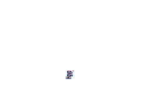
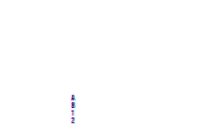
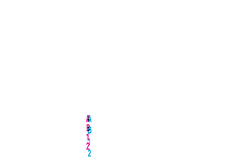

<!-- Generated by benchmarks/accuracy/features.py. -->

# ZPLr (TypeScript) versus printer previews

[All fixtures](../README.md)

Black = matching ink; magenta = printer only; cyan = library only. Compact previews share a common origin and crop only trailing blank space; click for the full-resolution image. Scores always use uncropped original pixels. Blank printer references and invalid inputs are unscored; renderer failures score zero against nonblank printer references.

| Test | Result | Difference |
| --- | --- | --- |
| [probe-font0-height-16](../cases/probe-font0-height-16.md#zplr) | 17.91% IoU |  |
| [probe-font0-height-32](../cases/probe-font0-height-32.md#zplr) | 21.00% IoU |  |
| [probe-font0-height-64](../cases/probe-font0-height-64.md#zplr) | 22.36% IoU |  |
| [probe-font0-width-16](../cases/probe-font0-width-16.md#zplr) | 35.96% IoU |  |
| [probe-font0-width-32](../cases/probe-font0-width-32.md#zplr) | 39.06% IoU |  |
| [probe-font0-width-64](../cases/probe-font0-width-64.md#zplr) | 41.50% IoU |  |
| [probe-font0-rotation-N](../cases/probe-font0-rotation-N.md#zplr) | 37.09% IoU |  |
| [probe-font0-rotation-R](../cases/probe-font0-rotation-R.md#zplr) | 35.31% IoU |  |
| [probe-font0-rotation-I](../cases/probe-font0-rotation-I.md#zplr) | 48.46% IoU |  |
| [probe-font0-rotation-B](../cases/probe-font0-rotation-B.md#zplr) | 55.07% IoU |  |
| [probe-font-A](../cases/probe-font-A.md#zplr) | 20.66% IoU |  |
| [probe-font-D](../cases/probe-font-D.md#zplr) | 23.47% IoU |  |
| [probe-fo-justify-0](../cases/probe-fo-justify-0.md#zplr) | 21.00% IoU |  |
| [probe-fo-justify-1](../cases/probe-fo-justify-1.md#zplr) | 23.61% IoU |  |
| [probe-fo-justify-2](../cases/probe-fo-justify-2.md#zplr) | 21.00% IoU |  |
| [probe-ft-baseline](../cases/probe-ft-baseline.md#zplr) | 12.44% IoU |  |
| [probe-layout-LH](../cases/probe-layout-LH.md#zplr) | 37.09% IoU |  |
| [probe-layout-LS](../cases/probe-layout-LS.md#zplr) | 37.09% IoU |  |
| [probe-layout-LT](../cases/probe-layout-LT.md#zplr) | 5.12% IoU |  |
| [probe-layout-PO](../cases/probe-layout-PO.md#zplr) | 0.00% IoU |  |
| [probe-layout-LR](../cases/probe-layout-LR.md#zplr) | 37.09% IoU |  |
| [probe-layout-FW](../cases/probe-layout-FW.md#zplr) | 35.31% IoU |  |
| [probe-field-reverse](../cases/probe-field-reverse.md#zplr) | 93.80% IoU |  |
| [probe-block-L](../cases/probe-block-L.md#zplr) | 28.26% IoU |  |
| [probe-block-C](../cases/probe-block-C.md#zplr) | 23.20% IoU |  |
| [probe-block-R](../cases/probe-block-R.md#zplr) | 26.32% IoU |  |
| [probe-block-J](../cases/probe-block-J.md#zplr) | 26.68% IoU |  |
| [probe-block-indent](../cases/probe-block-indent.md#zplr) | 28.26% IoU |  |
| [probe-block-explicit-break](../cases/probe-block-explicit-break.md#zplr) | 37.86% IoU |  |
| [probe-field-hex](../cases/probe-field-hex.md#zplr) | 37.09% IoU |  |
| [probe-variable-data](../cases/probe-variable-data.md#zplr) | 37.09% IoU |  |
| [probe-encoding-0](../cases/probe-encoding-0.md#zplr) | 26.55% IoU |  |
| [probe-encoding-27](../cases/probe-encoding-27.md#zplr) | 26.55% IoU |  |
| [probe-encoding-28](../cases/probe-encoding-28.md#zplr) | 26.55% IoU |  |
| [probe-utf8-accent](../cases/probe-utf8-accent.md#zplr) | 37.88% IoU |  |
| [probe-box-thickness-1](../cases/probe-box-thickness-1.md#zplr) | 100.00% IoU |  |
| [probe-box-thickness-4](../cases/probe-box-thickness-4.md#zplr) | 100.00% IoU |  |
| [probe-box-thickness-60](../cases/probe-box-thickness-60.md#zplr) | 100.00% IoU |  |
| [probe-box-round](../cases/probe-box-round.md#zplr) | 90.07% IoU |  |
| [probe-box-white](../cases/probe-box-white.md#zplr) | 100.00% IoU |  |
| [probe-shape-GC-B](../cases/probe-shape-GC-B.md#zplr) | 91.71% IoU |  |
| [probe-shape-GE-B](../cases/probe-shape-GE-B.md#zplr) | 76.60% IoU |  |
| [probe-shape-GD-R](../cases/probe-shape-GD-R.md#zplr) | 100.00% IoU |  |
| [probe-shape-GD-L](../cases/probe-shape-GD-L.md#zplr) | 100.00% IoU |  |
| [probe-graphic-hex](../cases/probe-graphic-hex.md#zplr) | 100.00% IoU |  |
| [probe-graphic-binary](../cases/probe-graphic-binary.md#zplr) | 100.00% IoU |  |
| [probe-graphic-B64](../cases/probe-graphic-B64.md#zplr) | 100.00% IoU |  |
| [probe-graphic-Z64](../cases/probe-graphic-Z64.md#zplr) | 100.00% IoU |  |
| [probe-code39-ratio-2](../cases/probe-code39-ratio-2.md#zplr) | 100.00% IoU |  |
| [probe-code39-ratio-3](../cases/probe-code39-ratio-3.md#zplr) | 100.00% IoU |  |
| [probe-code39-check-N](../cases/probe-code39-check-N.md#zplr) | 100.00% IoU |  |
| [probe-code39-check-Y](../cases/probe-code39-check-Y.md#zplr) | 100.00% IoU |  |
| [probe-code128-text-NN](../cases/probe-code128-text-NN.md#zplr) | 100.00% IoU |  |
| [probe-code128-text-YN](../cases/probe-code128-text-YN.md#zplr) | 96.11% IoU |  |
| [probe-code128-text-YY](../cases/probe-code128-text-YY.md#zplr) | 96.11% IoU |  |
| [probe-code128-rotation-R](../cases/probe-code128-rotation-R.md#zplr) | 100.00% IoU |  |
| [probe-code128-rotation-I](../cases/probe-code128-rotation-I.md#zplr) | 100.00% IoU |  |
| [probe-code128-rotation-B](../cases/probe-code128-rotation-B.md#zplr) | 100.00% IoU |  |
| [probe-code128-mode-N](../cases/probe-code128-mode-N.md#zplr) | 100.00% IoU |  |
| [probe-code128-mode-A](../cases/probe-code128-mode-A.md#zplr) | 100.00% IoU |  |
| [probe-qr-model-1](../cases/probe-qr-model-1.md#zplr) | 0.00% IoU |  |
| [probe-qr-model-2](../cases/probe-qr-model-2.md#zplr) | 0.00% IoU |  |
| [probe-qr-ec-L](../cases/probe-qr-ec-L.md#zplr) | 0.00% IoU |  |
| [probe-qr-ec-M](../cases/probe-qr-ec-M.md#zplr) | 0.00% IoU |  |
| [probe-qr-ec-Q](../cases/probe-qr-ec-Q.md#zplr) | 0.00% IoU |  |
| [probe-qr-ec-H](../cases/probe-qr-ec-H.md#zplr) | 0.00% IoU |  |
| [probe-qr-module-2](../cases/probe-qr-module-2.md#zplr) | 0.00% IoU |  |
| [probe-qr-module-5](../cases/probe-qr-module-5.md#zplr) | 5.26% IoU |  |
| [probe-qr-mask-0](../cases/probe-qr-mask-0.md#zplr) | 0.00% IoU |  |
| [probe-qr-mask-3](../cases/probe-qr-mask-3.md#zplr) | 0.00% IoU |  |
| [probe-qr-mask-7](../cases/probe-qr-mask-7.md#zplr) | 0.00% IoU |  |
| [probe-datamatrix-module-2](../cases/probe-datamatrix-module-2.md#zplr) | 100.00% IoU |  |
| [probe-datamatrix-module-4](../cases/probe-datamatrix-module-4.md#zplr) | 100.00% IoU |  |
| [symbol-aztec](../cases/symbol-aztec.md#zplr) | 31.51% IoU |  |
| [symbol-aztec_alias](../cases/symbol-aztec_alias.md#zplr) | 31.51% IoU |  |
| [symbol-aztec_rune](../cases/symbol-aztec_rune.md#zplr) | 32.67% IoU |  |
| [symbol-codabar](../cases/symbol-codabar.md#zplr) | 35.59% IoU |  |
| [symbol-codablock_a](../cases/symbol-codablock_a.md#zplr) | 64.68% IoU |  |
| [symbol-codablock_e](../cases/symbol-codablock_e.md#zplr) | 51.54% IoU |  |
| [symbol-codablock_f](../cases/symbol-codablock_f.md#zplr) | 51.40% IoU |  |
| [symbol-code11](../cases/symbol-code11.md#zplr) | 36.84% IoU |  |
| [symbol-code128](../cases/symbol-code128.md#zplr) | 28.40% IoU |  |
| [symbol-code39](../cases/symbol-code39.md#zplr) | 43.59% IoU |  |
| [symbol-code49](../cases/symbol-code49.md#zplr) | 38.22% IoU |  |
| [symbol-code93](../cases/symbol-code93.md#zplr) | 21.00% IoU |  |
| [symbol-composite_a](../cases/symbol-composite_a.md#zplr) | 34.95% IoU |  |
| [symbol-composite_b](../cases/symbol-composite_b.md#zplr) | 34.50% IoU |  |
| [symbol-composite_c](../cases/symbol-composite_c.md#zplr) | 31.95% IoU |  |
| [symbol-data_matrix](../cases/symbol-data_matrix.md#zplr) | 29.20% IoU |  |
| [symbol-data_matrix_rectangular](../cases/symbol-data_matrix_rectangular.md#zplr) | 37.80% IoU |  |
| [symbol-databar_ean13](../cases/symbol-databar_ean13.md#zplr) | 24.05% IoU |  |
| [symbol-databar_ean8](../cases/symbol-databar_ean8.md#zplr) | 28.00% IoU |  |
| [symbol-databar_expanded](../cases/symbol-databar_expanded.md#zplr) | 37.48% IoU |  |
| [symbol-databar_expanded_stacked](../cases/symbol-databar_expanded_stacked.md#zplr) | 22.49% IoU |  |
| [symbol-databar_limited](../cases/symbol-databar_limited.md#zplr) | 25.42% IoU |  |
| [symbol-databar_omni](../cases/symbol-databar_omni.md#zplr) | 26.76% IoU |  |
| [symbol-databar_stacked](../cases/symbol-databar_stacked.md#zplr) | 24.32% IoU |  |
| [symbol-databar_stacked_omni](../cases/symbol-databar_stacked_omni.md#zplr) | 23.34% IoU |  |
| [symbol-databar_truncated](../cases/symbol-databar_truncated.md#zplr) | 26.76% IoU |  |
| [symbol-databar_upca](../cases/symbol-databar_upca.md#zplr) | 33.33% IoU |  |
| [symbol-databar_upce](../cases/symbol-databar_upce.md#zplr) | Unscored |  |
| [symbol-ean13](../cases/symbol-ean13.md#zplr) | 23.76% IoU |  |
| [symbol-ean8](../cases/symbol-ean8.md#zplr) | 27.46% IoU |  |
| [symbol-extension2](../cases/symbol-extension2.md#zplr) | 14.09% IoU |  |
| [symbol-extension5](../cases/symbol-extension5.md#zplr) | 25.93% IoU |  |
| [symbol-industrial2of5](../cases/symbol-industrial2of5.md#zplr) | 46.67% IoU |  |
| [symbol-intelligent_mail](../cases/symbol-intelligent_mail.md#zplr) | 3.20% IoU |  |
| [symbol-interleaved2of5](../cases/symbol-interleaved2of5.md#zplr) | 34.69% IoU |  |
| [symbol-logmars](../cases/symbol-logmars.md#zplr) | 41.50% IoU |  |
| [symbol-maxicode2](../cases/symbol-maxicode2.md#zplr) | 16.65% IoU |  |
| [symbol-maxicode3](../cases/symbol-maxicode3.md#zplr) | 16.82% IoU |  |
| [symbol-maxicode4](../cases/symbol-maxicode4.md#zplr) | 16.45% IoU |  |
| [symbol-maxicode5](../cases/symbol-maxicode5.md#zplr) | 6.14% IoU |  |
| [symbol-maxicode6](../cases/symbol-maxicode6.md#zplr) | 16.41% IoU |  |
| [symbol-micropdf417_1](../cases/symbol-micropdf417_1.md#zplr) | 33.33% IoU |  |
| [symbol-micropdf417_3](../cases/symbol-micropdf417_3.md#zplr) | 30.17% IoU |  |
| [symbol-micropdf417_4](../cases/symbol-micropdf417_4.md#zplr) | 31.38% IoU |  |
| [symbol-msi_a](../cases/symbol-msi_a.md#zplr) | 17.33% IoU |  |
| [symbol-msi_b](../cases/symbol-msi_b.md#zplr) | 16.67% IoU |  |
| [symbol-msi_c](../cases/symbol-msi_c.md#zplr) | 16.13% IoU |  |
| [symbol-msi_d](../cases/symbol-msi_d.md#zplr) | 16.13% IoU |  |
| [symbol-pdf417](../cases/symbol-pdf417.md#zplr) | 33.99% IoU |  |
| [symbol-pdf417_truncated](../cases/symbol-pdf417_truncated.md#zplr) | 32.77% IoU |  |
| [symbol-planet](../cases/symbol-planet.md#zplr) | 59.20% IoU |  |
| [symbol-plessey](../cases/symbol-plessey.md#zplr) | 35.16% IoU |  |
| [symbol-postal_planet](../cases/symbol-postal_planet.md#zplr) | 59.20% IoU |  |
| [symbol-postnet](../cases/symbol-postnet.md#zplr) | 55.25% IoU |  |
| [symbol-qr](../cases/symbol-qr.md#zplr) | 34.11% IoU |  |
| [symbol-standard2of5](../cases/symbol-standard2of5.md#zplr) | 15.45% IoU |  |
| [symbol-tlc39_linear](../cases/symbol-tlc39_linear.md#zplr) | 38.27% IoU |  |
| [symbol-tlc39_linked](../cases/symbol-tlc39_linked.md#zplr) | 32.71% IoU |  |
| [symbol-upca](../cases/symbol-upca.md#zplr) | 32.45% IoU |  |
| [symbol-upce](../cases/symbol-upce.md#zplr) | 29.67% IoU |  |
| [font-0-N](../cases/font-0-N.md#zplr) | 48.10% IoU |  |
| [font-0-R](../cases/font-0-R.md#zplr) | 44.37% IoU |  |
| [font-0-I](../cases/font-0-I.md#zplr) | 28.11% IoU |  |
| [font-0-B](../cases/font-0-B.md#zplr) | 29.83% IoU |  |
| [font-A-N](../cases/font-A-N.md#zplr) | 31.84% IoU |  |
| [font-A-R](../cases/font-A-R.md#zplr) | 31.84% IoU |  |
| [font-A-I](../cases/font-A-I.md#zplr) | 31.84% IoU |  |
| [font-A-B](../cases/font-A-B.md#zplr) | 31.84% IoU |  |
| [font-B-N](../cases/font-B-N.md#zplr) | 38.69% IoU |  |
| [font-B-R](../cases/font-B-R.md#zplr) | 38.69% IoU |  |
| [font-B-I](../cases/font-B-I.md#zplr) | 38.69% IoU |  |
| [font-B-B](../cases/font-B-B.md#zplr) | 38.69% IoU |  |
| [font-C-N](../cases/font-C-N.md#zplr) | 32.42% IoU |  |
| [font-C-R](../cases/font-C-R.md#zplr) | 32.42% IoU |  |
| [font-C-I](../cases/font-C-I.md#zplr) | 32.42% IoU |  |
| [font-C-B](../cases/font-C-B.md#zplr) | 32.42% IoU |  |
| [font-D-N](../cases/font-D-N.md#zplr) | 32.42% IoU |  |
| [font-D-R](../cases/font-D-R.md#zplr) | 32.42% IoU |  |
| [font-D-I](../cases/font-D-I.md#zplr) | 32.42% IoU |  |
| [font-D-B](../cases/font-D-B.md#zplr) | 32.42% IoU |  |
| [font-E-N](../cases/font-E-N.md#zplr) | 45.01% IoU |  |
| [font-E-R](../cases/font-E-R.md#zplr) | 44.49% IoU |  |
| [font-E-I](../cases/font-E-I.md#zplr) | 43.94% IoU |  |
| [font-E-B](../cases/font-E-B.md#zplr) | 44.49% IoU |  |
| [font-F-N](../cases/font-F-N.md#zplr) | 29.05% IoU |  |
| [font-F-R](../cases/font-F-R.md#zplr) | 29.05% IoU |  |
| [font-F-I](../cases/font-F-I.md#zplr) | 29.05% IoU |  |
| [font-F-B](../cases/font-F-B.md#zplr) | 29.05% IoU |  |
| [font-G-N](../cases/font-G-N.md#zplr) | 27.61% IoU |  |
| [font-G-R](../cases/font-G-R.md#zplr) | 27.67% IoU |  |
| [font-G-I](../cases/font-G-I.md#zplr) | 25.85% IoU |  |
| [font-G-B](../cases/font-G-B.md#zplr) | 27.67% IoU |  |
| [font-H-N](../cases/font-H-N.md#zplr) | 19.81% IoU |  |
| [font-H-R](../cases/font-H-R.md#zplr) | 20.63% IoU |  |
| [font-H-I](../cases/font-H-I.md#zplr) | 19.69% IoU |  |
| [font-H-B](../cases/font-H-B.md#zplr) | 20.63% IoU |  |
| [font-id-1](../cases/font-id-1.md#zplr) | 13.13% IoU |  |
| [font-id-2](../cases/font-id-2.md#zplr) | 13.13% IoU |  |
| [font-id-3](../cases/font-id-3.md#zplr) | 13.13% IoU |  |
| [font-id-4](../cases/font-id-4.md#zplr) | 13.13% IoU |  |
| [font-id-5](../cases/font-id-5.md#zplr) | 13.13% IoU |  |
| [font-id-6](../cases/font-id-6.md#zplr) | 13.13% IoU |  |
| [font-id-7](../cases/font-id-7.md#zplr) | 13.13% IoU |  |
| [font-id-8](../cases/font-id-8.md#zplr) | 13.13% IoU |  |
| [font-id-9](../cases/font-id-9.md#zplr) | 13.13% IoU |  |
| [font-id-I](../cases/font-id-I.md#zplr) | 13.13% IoU |  |
| [font-id-J](../cases/font-id-J.md#zplr) | 13.13% IoU |  |
| [font-id-K](../cases/font-id-K.md#zplr) | 13.13% IoU |  |
| [font-id-L](../cases/font-id-L.md#zplr) | 13.13% IoU |  |
| [font-id-M](../cases/font-id-M.md#zplr) | 13.13% IoU |  |
| [font-id-N](../cases/font-id-N.md#zplr) | 13.13% IoU |  |
| [font-id-O](../cases/font-id-O.md#zplr) | 13.13% IoU |  |
| [font-id-P](../cases/font-id-P.md#zplr) | 11.74% IoU |  |
| [font-id-Q](../cases/font-id-Q.md#zplr) | 12.70% IoU |  |
| [font-id-R](../cases/font-id-R.md#zplr) | 12.89% IoU |  |
| [font-id-S](../cases/font-id-S.md#zplr) | 12.67% IoU |  |
| [font-id-T](../cases/font-id-T.md#zplr) | 12.61% IoU |  |
| [font-id-U](../cases/font-id-U.md#zplr) | 12.79% IoU |  |
| [font-id-V](../cases/font-id-V.md#zplr) | 14.02% IoU |  |
| [font-id-W](../cases/font-id-W.md#zplr) | 13.13% IoU |  |
| [font-id-X](../cases/font-id-X.md#zplr) | 13.13% IoU |  |
| [font-id-Y](../cases/font-id-Y.md#zplr) | 13.13% IoU |  |
| [font-id-Z](../cases/font-id-Z.md#zplr) | 13.13% IoU |  |
| [font-dim-0-0](../cases/font-dim-0-0.md#zplr) | 25.67% IoU |  |
| [font-dim-1-1](../cases/font-dim-1-1.md#zplr) | 0.00% IoU |  |
| [font-dim-2-2](../cases/font-dim-2-2.md#zplr) | 1.67% IoU |  |
| [font-dim-7-0](../cases/font-dim-7-0.md#zplr) | 14.65% IoU |  |
| [font-dim-15-0](../cases/font-dim-15-0.md#zplr) | 22.84% IoU |  |
| [font-dim-17-0](../cases/font-dim-17-0.md#zplr) | 23.89% IoU |  |
| [font-dim-31-0](../cases/font-dim-31-0.md#zplr) | 25.39% IoU |  |
| [font-dim-33-0](../cases/font-dim-33-0.md#zplr) | 21.79% IoU |  |
| [font-dim-63-0](../cases/font-dim-63-0.md#zplr) | 24.23% IoU |  |
| [font-dim-65-0](../cases/font-dim-65-0.md#zplr) | 24.29% IoU |  |
| [font-dim-32-1](../cases/font-dim-32-1.md#zplr) | 9.13% IoU |  |
| [font-dim-1-32](../cases/font-dim-1-32.md#zplr) | 3.19% IoU |  |
| [font-dim-64-16](../cases/font-dim-64-16.md#zplr) | 51.46% IoU |  |
| [font-dim-16-64](../cases/font-dim-16-64.md#zplr) | 36.72% IoU |  |
| [font-dim-96-96](../cases/font-dim-96-96.md#zplr) | 31.91% IoU |  |
| [text-digits](../cases/text-digits.md#zplr) | 60.89% IoU |  |
| [text-case](../cases/text-case.md#zplr) | 33.79% IoU |  |
| [text-punctuation](../cases/text-punctuation.md#zplr) | 14.04% IoU |  |
| [text-spacing](../cases/text-spacing.md#zplr) | 7.72% IoU |  |
| [text-empty](../cases/text-empty.md#zplr) | Unscored | No printer reference |
| [fields-1](../cases/fields-1.md#zplr) | 53.57% IoU |  |
| [fields-48](../cases/fields-48.md#zplr) | 58.97% IoU |  |
| [fields-400](../cases/fields-400.md#zplr) | 60.88% IoU |  |
| [field-data-3072-bytes](../cases/field-data-3072-bytes.md#zplr) | 22.63% IoU |  |
| [field-defaults](../cases/field-defaults.md#zplr) | 47.17% IoU |  |
| [anchor-FO-N-0](../cases/anchor-FO-N-0.md#zplr) | 78.59% IoU |  |
| [anchor-FO-N-1](../cases/anchor-FO-N-1.md#zplr) | 78.67% IoU |  |
| [anchor-FO-N-2](../cases/anchor-FO-N-2.md#zplr) | 78.59% IoU |  |
| [anchor-FT-N-0](../cases/anchor-FT-N-0.md#zplr) | 33.55% IoU |  |
| [anchor-FT-N-1](../cases/anchor-FT-N-1.md#zplr) | 13.93% IoU |  |
| [anchor-FT-N-2](../cases/anchor-FT-N-2.md#zplr) | 33.55% IoU |  |
| [anchor-FO-R-0](../cases/anchor-FO-R-0.md#zplr) | 73.74% IoU |  |
| [anchor-FO-R-1](../cases/anchor-FO-R-1.md#zplr) | 46.65% IoU |  |
| [anchor-FO-R-2](../cases/anchor-FO-R-2.md#zplr) | 73.74% IoU |  |
| [anchor-FT-R-0](../cases/anchor-FT-R-0.md#zplr) | 4.63% IoU |  |
| [anchor-FT-R-1](../cases/anchor-FT-R-1.md#zplr) | 2.12% IoU |  |
| [anchor-FT-R-2](../cases/anchor-FT-R-2.md#zplr) | 4.63% IoU |  |
| [anchor-FO-I-0](../cases/anchor-FO-I-0.md#zplr) | 57.67% IoU |  |
| [anchor-FO-I-1](../cases/anchor-FO-I-1.md#zplr) | 25.13% IoU |  |
| [anchor-FO-I-2](../cases/anchor-FO-I-2.md#zplr) | 57.67% IoU |  |
| [anchor-FT-I-0](../cases/anchor-FT-I-0.md#zplr) | 1.19% IoU |  |
| [anchor-FT-I-1](../cases/anchor-FT-I-1.md#zplr) | 1.19% IoU |  |
| [anchor-FT-I-2](../cases/anchor-FT-I-2.md#zplr) | 1.19% IoU |  |
| [anchor-FO-B-0](../cases/anchor-FO-B-0.md#zplr) | 61.00% IoU |  |
| [anchor-FO-B-1](../cases/anchor-FO-B-1.md#zplr) | 61.00% IoU |  |
| [anchor-FO-B-2](../cases/anchor-FO-B-2.md#zplr) | 61.00% IoU |  |
| [anchor-FT-B-0](../cases/anchor-FT-B-0.md#zplr) | 1.26% IoU |  |
| [anchor-FT-B-1](../cases/anchor-FT-B-1.md#zplr) | 3.73% IoU |  |
| [anchor-FT-B-2](../cases/anchor-FT-B-2.md#zplr) | 1.26% IoU |  |
| [offset-LS--80](../cases/offset-LS--80.md#zplr) | 73.26% IoU |  |
| [offset-LS-80](../cases/offset-LS-80.md#zplr) | 23.92% IoU |  |
| [offset-LT--50](../cases/offset-LT--50.md#zplr) | 11.54% IoU |  |
| [offset-LT-50](../cases/offset-LT-50.md#zplr) | 8.22% IoU |  |
| [offset-LH-100-200](../cases/offset-LH-100-200.md#zplr) | 73.26% IoU |  |
| [clip-0-0](../cases/clip-0-0.md#zplr) | 100.00% IoU |  |
| [clip-831-1217](../cases/clip-831-1217.md#zplr) | 100.00% IoU |  |
| [clip-832-1218](../cases/clip-832-1218.md#zplr) | Unscored |  |
| [clip-800-1180](../cases/clip-800-1180.md#zplr) | 100.00% IoU |  |
| [clip-32000-32000](../cases/clip-32000-32000.md#zplr) | Unscored |  |
| [page-transform-N-N](../cases/page-transform-N-N.md#zplr) | 72.93% IoU |  |
| [page-transform-Y-N](../cases/page-transform-Y-N.md#zplr) | 0.00% IoU |  |
| [page-transform-N-I](../cases/page-transform-N-I.md#zplr) | 2.70% IoU |  |
| [page-transform-Y-I](../cases/page-transform-Y-I.md#zplr) | 0.00% IoU |  |
| [label-reverse](../cases/label-reverse.md#zplr) | 79.54% IoU |  |
| [field-direction-H-0](../cases/field-direction-H-0.md#zplr) | 30.95% IoU |  |
| [field-direction-H-1](../cases/field-direction-H-1.md#zplr) | 30.34% IoU |  |
| [field-direction-H-8](../cases/field-direction-H-8.md#zplr) | 30.34% IoU |  |
| [field-direction-V-0](../cases/field-direction-V-0.md#zplr) | 13.52% IoU |  |
| [field-direction-V-1](../cases/field-direction-V-1.md#zplr) | 13.52% IoU |  |
| [field-direction-V-8](../cases/field-direction-V-8.md#zplr) | 8.55% IoU |  |
| [field-direction-R-0](../cases/field-direction-R-0.md#zplr) | 22.48% IoU |  |
| [field-direction-R-1](../cases/field-direction-R-1.md#zplr) | 21.28% IoU |  |
| [field-direction-R-8](../cases/field-direction-R-8.md#zplr) | 15.63% IoU |  |
| [block-1-L](../cases/block-1-L.md#zplr) | 56.65% IoU |  |
| [block-1-C](../cases/block-1-C.md#zplr) | 40.31% IoU |  |
| [block-1-R](../cases/block-1-R.md#zplr) | 41.81% IoU |  |
| [block-1-J](../cases/block-1-J.md#zplr) | 56.65% IoU |  |
| [block-20-L](../cases/block-20-L.md#zplr) | 62.92% IoU |  |
| [block-20-C](../cases/block-20-C.md#zplr) | 54.06% IoU |  |
| [block-20-R](../cases/block-20-R.md#zplr) | 59.35% IoU |  |
| [block-20-J](../cases/block-20-J.md#zplr) | 62.92% IoU |  |
| [block-120-L](../cases/block-120-L.md#zplr) | 27.96% IoU |  |
| [block-120-C](../cases/block-120-C.md#zplr) | 23.08% IoU |  |
| [block-120-R](../cases/block-120-R.md#zplr) | 24.80% IoU |  |
| [block-120-J](../cases/block-120-J.md#zplr) | 26.27% IoU |  |
| [block-300-L](../cases/block-300-L.md#zplr) | 31.06% IoU |  |
| [block-300-C](../cases/block-300-C.md#zplr) | 27.72% IoU |  |
| [block-300-R](../cases/block-300-R.md#zplr) | 34.96% IoU |  |
| [block-300-J](../cases/block-300-J.md#zplr) | 43.33% IoU |  |
| [block-spacing--12-indent-0](../cases/block-spacing--12-indent-0.md#zplr) | 34.17% IoU |  |
| [block-spacing-12-indent-0](../cases/block-spacing-12-indent-0.md#zplr) | 34.01% IoU |  |
| [block-spacing-0-indent-40](../cases/block-spacing-0-indent-40.md#zplr) | 34.01% IoU |  |
| [block-spacing-8-indent-80](../cases/block-spacing-8-indent-80.md#zplr) | 34.01% IoU |  |
| [block-content-breaks](../cases/block-content-breaks.md#zplr) | 64.82% IoU |  |
| [block-content-long-word](../cases/block-content-long-word.md#zplr) | 47.50% IoU |  |
| [block-content-spaces](../cases/block-content-spaces.md#zplr) | 37.64% IoU |  |
| [block-content-empty](../cases/block-content-empty.md#zplr) | Unscored | No printer reference |
| [text-block-N-1](../cases/text-block-N-1.md#zplr) | 9.23% IoU |  |
| [text-block-N-40](../cases/text-block-N-40.md#zplr) | 25.37% IoU |  |
| [text-block-N-120](../cases/text-block-N-120.md#zplr) | 25.37% IoU |  |
| [text-block-R-1](../cases/text-block-R-1.md#zplr) | Unscored |  |
| [text-block-R-40](../cases/text-block-R-40.md#zplr) | 17.72% IoU |  |
| [text-block-R-120](../cases/text-block-R-120.md#zplr) | 0.00% IoU |  |
| [text-block-I-1](../cases/text-block-I-1.md#zplr) | Unscored |  |
| [text-block-I-40](../cases/text-block-I-40.md#zplr) | 17.93% IoU |  |
| [text-block-I-120](../cases/text-block-I-120.md#zplr) | 0.00% IoU |  |
| [text-block-B-1](../cases/text-block-B-1.md#zplr) | 9.23% IoU |  |
| [text-block-B-40](../cases/text-block-B-40.md#zplr) | 25.32% IoU |  |
| [text-block-B-120](../cases/text-block-B-120.md#zplr) | 25.32% IoU |  |
| [unicode-latin](../cases/unicode-latin.md#zplr) | 31.23% IoU |  |
| [unicode-combining](../cases/unicode-combining.md#zplr) | 23.31% IoU |  |
| [unicode-greek](../cases/unicode-greek.md#zplr) | 26.11% IoU |  |
| [unicode-cyrillic](../cases/unicode-cyrillic.md#zplr) | 12.36% IoU |  |
| [unicode-hebrew](../cases/unicode-hebrew.md#zplr) | 15.13% IoU |  |
| [unicode-arabic](../cases/unicode-arabic.md#zplr) | 11.02% IoU |  |
| [unicode-cjk](../cases/unicode-cjk.md#zplr) | Unscored |  |
| [unicode-supplementary](../cases/unicode-supplementary.md#zplr) | 22.36% IoU |  |
| [unicode-controls](../cases/unicode-controls.md#zplr) | 23.81% IoU |  |
| [unicode-missing](../cases/unicode-missing.md#zplr) | 22.36% IoU |  |
| [encoding-0](../cases/encoding-0.md#zplr) | 31.59% IoU |  |
| [encoding-13](../cases/encoding-13.md#zplr) | 31.59% IoU |  |
| [encoding-27](../cases/encoding-27.md#zplr) | 31.59% IoU |  |
| [encoding-28](../cases/encoding-28.md#zplr) | 31.59% IoU |  |
| [encoding-29](../cases/encoding-29.md#zplr) | Unscored | No printer reference |
| [encoding-30](../cases/encoding-30.md#zplr) | Unscored | No printer reference |
| [encoding-31](../cases/encoding-31.md#zplr) | 31.59% IoU |  |
| [encoding-33](../cases/encoding-33.md#zplr) | 31.59% IoU |  |
| [encoding-34](../cases/encoding-34.md#zplr) | 31.59% IoU |  |
| [encoding-35](../cases/encoding-35.md#zplr) | 31.59% IoU |  |
| [encoding-36](../cases/encoding-36.md#zplr) | 31.59% IoU |  |
| [encoding-remap](../cases/encoding-remap.md#zplr) | 32.20% IoU |  |
| [advanced-text-0000](../cases/advanced-text-0000.md#zplr) | 14.05% IoU |  |
| [advanced-text-1000](../cases/advanced-text-1000.md#zplr) | 15.63% IoU |  |
| [advanced-text-0100](../cases/advanced-text-0100.md#zplr) | 14.64% IoU |  |
| [advanced-text-0010](../cases/advanced-text-0010.md#zplr) | 14.05% IoU |  |
| [advanced-text-0001](../cases/advanced-text-0001.md#zplr) | 14.05% IoU |  |
| [advanced-text-1111](../cases/advanced-text-1111.md#zplr) | 15.69% IoU |  |
| [hex-underscore](../cases/hex-underscore.md#zplr) | 18.80% IoU |  |
| [hex-hash](../cases/hex-hash.md#zplr) | 18.80% IoU |  |
| [hex-scope](../cases/hex-scope.md#zplr) | 27.88% IoU |  |
| [variable-field](../cases/variable-field.md#zplr) | 31.87% IoU |  |
| [numbered-fields-inline](../cases/numbered-fields-inline.md#zplr) | 18.25% IoU |  |
| [field-concat-whole](../cases/field-concat-whole.md#zplr) | 27.63% IoU |  |
| [field-concat-forward](../cases/field-concat-forward.md#zplr) | 30.94% IoU |  |
| [field-concat-backward](../cases/field-concat-backward.md#zplr) | 28.24% IoU |  |
| [field-concat-past-end](../cases/field-concat-past-end.md#zplr) | 30.85% IoU |  |
| [field-concat-scope](../cases/field-concat-scope.md#zplr) | 31.21% IoU |  |
| [interleaved-odd-digits](../cases/interleaved-odd-digits.md#zplr) | 100.00% IoU |  |
| [serial-000009-Y](../cases/serial-000009-Y.md#zplr) | 33.76% IoU |  |
| [serial-000009-N](../cases/serial-000009-N.md#zplr) | 0.00% IoU |  |
| [serial-A009Z-Y](../cases/serial-A009Z-Y.md#zplr) | 33.19% IoU |  |
| [serial-mask](../cases/serial-mask.md#zplr) | 36.18% IoU |  |
| [comments-and-line-endings](../cases/comments-and-line-endings.md#zplr) | 32.08% IoU |  |
| [box-rounding-0](../cases/box-rounding-0.md#zplr) | 100.00% IoU |  |
| [box-rounding-1](../cases/box-rounding-1.md#zplr) | 98.08% IoU |  |
| [box-rounding-2](../cases/box-rounding-2.md#zplr) | 95.83% IoU |  |
| [box-rounding-3](../cases/box-rounding-3.md#zplr) | 94.82% IoU |  |
| [box-rounding-4](../cases/box-rounding-4.md#zplr) | 91.64% IoU |  |
| [box-rounding-5](../cases/box-rounding-5.md#zplr) | 91.33% IoU |  |
| [box-rounding-6](../cases/box-rounding-6.md#zplr) | 92.23% IoU |  |
| [box-rounding-7](../cases/box-rounding-7.md#zplr) | 90.10% IoU |  |
| [box-rounding-8](../cases/box-rounding-8.md#zplr) | 88.77% IoU |  |
| [box-0-80-1](../cases/box-0-80-1.md#zplr) | 100.00% IoU |  |
| [box-80-0-1](../cases/box-80-0-1.md#zplr) | 100.00% IoU |  |
| [box-1-1-1](../cases/box-1-1-1.md#zplr) | 100.00% IoU |  |
| [box-2-2-1](../cases/box-2-2-1.md#zplr) | 100.00% IoU |  |
| [box-31-31-1](../cases/box-31-31-1.md#zplr) | 100.00% IoU |  |
| [box-32-32-1](../cases/box-32-32-1.md#zplr) | 100.00% IoU |  |
| [box-33-33-1](../cases/box-33-33-1.md#zplr) | 100.00% IoU |  |
| [box-100-60-30](../cases/box-100-60-30.md#zplr) | 100.00% IoU |  |
| [box-100-60-100](../cases/box-100-60-100.md#zplr) | 60.00% IoU |  |
| [shape-GC-B-plain](../cases/shape-GC-B-plain.md#zplr) | 100.00% IoU |  |
| [shape-GC-W-plain](../cases/shape-GC-W-plain.md#zplr) | 98.74% IoU |  |
| [shape-GE-B-plain](../cases/shape-GE-B-plain.md#zplr) | 100.00% IoU |  |
| [shape-GE-W-plain](../cases/shape-GE-W-plain.md#zplr) | 98.79% IoU |  |
| [shape-GD-B-L](../cases/shape-GD-B-L.md#zplr) | 100.00% IoU |  |
| [shape-GD-B-R](../cases/shape-GD-B-R.md#zplr) | 100.00% IoU |  |
| [shape-GD-W-L](../cases/shape-GD-W-L.md#zplr) | 99.49% IoU |  |
| [shape-GD-W-R](../cases/shape-GD-W-R.md#zplr) | 99.49% IoU |  |
| [symbol-graphic-A-N](../cases/symbol-graphic-A-N.md#zplr) | 30.15% IoU |  |
| [symbol-graphic-A-R](../cases/symbol-graphic-A-R.md#zplr) | 30.15% IoU |  |
| [symbol-graphic-A-I](../cases/symbol-graphic-A-I.md#zplr) | 19.84% IoU |  |
| [symbol-graphic-A-B](../cases/symbol-graphic-A-B.md#zplr) | 19.84% IoU |  |
| [symbol-graphic-B-N](../cases/symbol-graphic-B-N.md#zplr) | 23.66% IoU |  |
| [symbol-graphic-B-R](../cases/symbol-graphic-B-R.md#zplr) | 23.66% IoU |  |
| [symbol-graphic-B-I](../cases/symbol-graphic-B-I.md#zplr) | 16.41% IoU |  |
| [symbol-graphic-B-B](../cases/symbol-graphic-B-B.md#zplr) | 16.41% IoU |  |
| [symbol-graphic-C-N](../cases/symbol-graphic-C-N.md#zplr) | 26.57% IoU |  |
| [symbol-graphic-C-R](../cases/symbol-graphic-C-R.md#zplr) | 26.57% IoU |  |
| [symbol-graphic-C-I](../cases/symbol-graphic-C-I.md#zplr) | 17.94% IoU |  |
| [symbol-graphic-C-B](../cases/symbol-graphic-C-B.md#zplr) | 17.94% IoU |  |
| [symbol-graphic-D-N](../cases/symbol-graphic-D-N.md#zplr) | 25.27% IoU |  |
| [symbol-graphic-D-R](../cases/symbol-graphic-D-R.md#zplr) | 25.27% IoU |  |
| [symbol-graphic-D-I](../cases/symbol-graphic-D-I.md#zplr) | 24.21% IoU |  |
| [symbol-graphic-D-B](../cases/symbol-graphic-D-B.md#zplr) | 24.21% IoU |  |
| [symbol-graphic-E-N](../cases/symbol-graphic-E-N.md#zplr) | 29.74% IoU |  |
| [symbol-graphic-E-R](../cases/symbol-graphic-E-R.md#zplr) | 29.74% IoU |  |
| [symbol-graphic-E-I](../cases/symbol-graphic-E-I.md#zplr) | 24.16% IoU |  |
| [symbol-graphic-E-B](../cases/symbol-graphic-E-B.md#zplr) | 24.16% IoU |  |
| [paint-black-white](../cases/paint-black-white.md#zplr) | 100.00% IoU |  |
| [paint-white-black](../cases/paint-white-black.md#zplr) | 100.00% IoU |  |
| [paint-reverse-overlap](../cases/paint-reverse-overlap.md#zplr) | 100.00% IoU |  |
| [paint-reverse-twice](../cases/paint-reverse-twice.md#zplr) | 100.00% IoU |  |
| [reverse-field-scope](../cases/reverse-field-scope.md#zplr) | 99.56% IoU |  |
| [raster-equivalent-hex](../cases/raster-equivalent-hex.md#zplr) | 100.00% IoU |  |
| [raster-equivalent-B64](../cases/raster-equivalent-B64.md#zplr) | 100.00% IoU |  |
| [raster-equivalent-Z64](../cases/raster-equivalent-Z64.md#zplr) | 100.00% IoU |  |
| [raster-equivalent-binary](../cases/raster-equivalent-binary.md#zplr) | Unscored | No printer reference |
| [raster-fill-hex](../cases/raster-fill-hex.md#zplr) | 100.00% IoU |  |
| [raster-fill-rle](../cases/raster-fill-rle.md#zplr) | 100.00% IoU |  |
| [raster-repeat-hex](../cases/raster-repeat-hex.md#zplr) | 100.00% IoU |  |
| [raster-repeat-rle](../cases/raster-repeat-rle.md#zplr) | 100.00% IoU |  |
| [raster-binary-command-bytes](../cases/raster-binary-command-bytes.md#zplr) | Unscored | No printer reference |
| [raster-stride-1](../cases/raster-stride-1.md#zplr) | 100.00% IoU |  |
| [raster-stride-2](../cases/raster-stride-2.md#zplr) | 100.00% IoU |  |
| [raster-stride-3](../cases/raster-stride-3.md#zplr) | 100.00% IoU |  |
| [raster-stride-17](../cases/raster-stride-17.md#zplr) | 100.00% IoU |  |
| [raster-clipped](../cases/raster-clipped.md#zplr) | 100.00% IoU |  |
| [barcode-module-1-ratio-2.0](../cases/barcode-module-1-ratio-2.0.md#zplr) | 100.00% IoU |  |
| [barcode-module-1-ratio-2.5](../cases/barcode-module-1-ratio-2.5.md#zplr) | 29.03% IoU |  |
| [barcode-module-1-ratio-3.0](../cases/barcode-module-1-ratio-3.0.md#zplr) | 100.00% IoU |  |
| [barcode-module-2-ratio-2.0](../cases/barcode-module-2-ratio-2.0.md#zplr) | 100.00% IoU |  |
| [barcode-module-2-ratio-2.5](../cases/barcode-module-2-ratio-2.5.md#zplr) | 100.00% IoU |  |
| [barcode-module-2-ratio-3.0](../cases/barcode-module-2-ratio-3.0.md#zplr) | 100.00% IoU |  |
| [barcode-module-3-ratio-2.0](../cases/barcode-module-3-ratio-2.0.md#zplr) | 100.00% IoU |  |
| [barcode-module-3-ratio-2.5](../cases/barcode-module-3-ratio-2.5.md#zplr) | 37.93% IoU |  |
| [barcode-module-3-ratio-3.0](../cases/barcode-module-3-ratio-3.0.md#zplr) | 100.00% IoU |  |
| [barcode-module-10-ratio-2.0](../cases/barcode-module-10-ratio-2.0.md#zplr) | 100.00% IoU |  |
| [barcode-module-10-ratio-2.5](../cases/barcode-module-10-ratio-2.5.md#zplr) | 100.00% IoU |  |
| [barcode-module-10-ratio-3.0](../cases/barcode-module-10-ratio-3.0.md#zplr) | 100.00% IoU |  |
| [code128-mode-N](../cases/code128-mode-N.md#zplr) | 100.00% IoU |  |
| [code128-mode-U](../cases/code128-mode-U.md#zplr) | 100.00% IoU |  |
| [code128-mode-A](../cases/code128-mode-A.md#zplr) | 100.00% IoU |  |
| [code128-mode-D](../cases/code128-mode-D.md#zplr) | 50.00% IoU |  |
| [code128-subset-b](../cases/code128-subset-b.md#zplr) | 100.00% IoU |  |
| [code128-subset-c](../cases/code128-subset-c.md#zplr) | 100.00% IoU |  |
| [code128-switch](../cases/code128-switch.md#zplr) | 100.00% IoU |  |
| [code128-fnc1](../cases/code128-fnc1.md#zplr) | 100.00% IoU |  |
| [readable-B2-N](../cases/readable-B2-N.md#zplr) | 94.75% IoU |  |
| [readable-B2-R](../cases/readable-B2-R.md#zplr) | 94.75% IoU |  |
| [readable-B2-I](../cases/readable-B2-I.md#zplr) | 28.15% IoU |  |
| [readable-B2-B](../cases/readable-B2-B.md#zplr) | 28.15% IoU |  |
| [readable-B3-N](../cases/readable-B3-N.md#zplr) | 96.55% IoU |  |
| [readable-B3-R](../cases/readable-B3-R.md#zplr) | 96.55% IoU |  |
| [readable-B3-I](../cases/readable-B3-I.md#zplr) | 29.20% IoU |  |
| [readable-B3-B](../cases/readable-B3-B.md#zplr) | 29.20% IoU |  |
| [readable-BC-N](../cases/readable-BC-N.md#zplr) | 96.63% IoU |  |
| [readable-BC-R](../cases/readable-BC-R.md#zplr) | 96.63% IoU |  |
| [readable-BC-I](../cases/readable-BC-I.md#zplr) | 96.26% IoU |  |
| [readable-BC-B](../cases/readable-BC-B.md#zplr) | 96.26% IoU |  |
| [readable-BE-N](../cases/readable-BE-N.md#zplr) | 90.65% IoU |  |
| [readable-BE-R](../cases/readable-BE-R.md#zplr) | 90.65% IoU |  |
| [readable-BE-I](../cases/readable-BE-I.md#zplr) | 90.47% IoU |  |
| [readable-BE-B](../cases/readable-BE-B.md#zplr) | 90.47% IoU |  |
| [readable-BU-N](../cases/readable-BU-N.md#zplr) | 88.07% IoU |  |
| [readable-BU-R](../cases/readable-BU-R.md#zplr) | 88.07% IoU |  |
| [readable-BU-I](../cases/readable-BU-I.md#zplr) | 88.35% IoU |  |
| [readable-BU-B](../cases/readable-BU-B.md#zplr) | 88.35% IoU |  |
| [qr-mask-full-0](../cases/qr-mask-full-0.md#zplr) | 51.01% IoU |  |
| [qr-mask-full-1](../cases/qr-mask-full-1.md#zplr) | 67.53% IoU |  |
| [qr-mask-full-2](../cases/qr-mask-full-2.md#zplr) | 60.28% IoU |  |
| [qr-mask-full-3](../cases/qr-mask-full-3.md#zplr) | 60.55% IoU |  |
| [qr-mask-full-4](../cases/qr-mask-full-4.md#zplr) | 61.59% IoU |  |
| [qr-mask-full-5](../cases/qr-mask-full-5.md#zplr) | 77.69% IoU |  |
| [qr-mask-full-6](../cases/qr-mask-full-6.md#zplr) | 100.00% IoU |  |
| [qr-mask-full-7](../cases/qr-mask-full-7.md#zplr) | 45.34% IoU |  |
| [datamatrix-quality-0](../cases/datamatrix-quality-0.md#zplr) | 100.00% IoU |  |
| [datamatrix-quality-50](../cases/datamatrix-quality-50.md#zplr) | 100.00% IoU |  |
| [datamatrix-quality-80](../cases/datamatrix-quality-80.md#zplr) | 100.00% IoU |  |
| [datamatrix-quality-100](../cases/datamatrix-quality-100.md#zplr) | 100.00% IoU |  |
| [datamatrix-quality-140](../cases/datamatrix-quality-140.md#zplr) | 100.00% IoU |  |
| [datamatrix-quality-200](../cases/datamatrix-quality-200.md#zplr) | 100.00% IoU |  |
| [datamatrix-size-10-10](../cases/datamatrix-size-10-10.md#zplr) | 100.00% IoU |  |
| [datamatrix-size-16-16](../cases/datamatrix-size-16-16.md#zplr) | 100.00% IoU |  |
| [datamatrix-size-18-8](../cases/datamatrix-size-18-8.md#zplr) | 100.00% IoU |  |
| [datamatrix-size-32-8](../cases/datamatrix-size-32-8.md#zplr) | 100.00% IoU |  |
| [pdf417-security-0-N](../cases/pdf417-security-0-N.md#zplr) | 92.25% IoU |  |
| [pdf417-security-0-Y](../cases/pdf417-security-0-Y.md#zplr) | 90.14% IoU |  |
| [pdf417-security-2-N](../cases/pdf417-security-2-N.md#zplr) | 86.56% IoU |  |
| [pdf417-security-2-Y](../cases/pdf417-security-2-Y.md#zplr) | 83.08% IoU |  |
| [pdf417-security-8-N](../cases/pdf417-security-8-N.md#zplr) | 62.76% IoU |  |
| [pdf417-security-8-Y](../cases/pdf417-security-8-Y.md#zplr) | 55.30% IoU |  |
| [pdf417-structured-origins-1](../cases/pdf417-structured-origins-1.md#zplr) | Unscored |  |
| [pdf417-structured-origins-3](../cases/pdf417-structured-origins-3.md#zplr) | Unscored |  |
| [structured-exclude-B7](../cases/structured-exclude-B7.md#zplr) | Unscored |  |
| [structured-exclude-BF](../cases/structured-exclude-BF.md#zplr) | Unscored |  |
| [barcode-validation](../cases/barcode-validation.md#zplr) | 100.00% IoU |  |
| [barcode-default-scope](../cases/barcode-default-scope.md#zplr) | 100.00% IoU |  |
| [equivalent-text-plain](../cases/equivalent-text-plain.md#zplr) | 45.28% IoU |  |
| [equivalent-text-hex](../cases/equivalent-text-hex.md#zplr) | 45.28% IoU |  |
| [equivalent-home-direct](../cases/equivalent-home-direct.md#zplr) | 100.00% IoU |  |
| [equivalent-home-offset](../cases/equivalent-home-offset.md#zplr) | 100.00% IoU |  |
| [equivalent-comment](../cases/equivalent-comment.md#zplr) | 45.28% IoU |  |
| [torture-typography](../cases/torture-typography.md#zplr) | 44.50% IoU |  |
| [torture-geometry](../cases/torture-geometry.md#zplr) | 80.70% IoU |  |
| [torture-shipping-label](../cases/torture-shipping-label.md#zplr) | 87.38% IoU |  |
| [torture-overlap](../cases/torture-overlap.md#zplr) | 97.93% IoU |  |
| [compact-baseline-0](../cases/compact-baseline-0.md#zplr) | 41.79% IoU |  |
| [compact-baseline-A](../cases/compact-baseline-A.md#zplr) | 30.09% IoU |  |
| [compact-baseline-B](../cases/compact-baseline-B.md#zplr) | 42.55% IoU |  |
| [compact-baseline-C](../cases/compact-baseline-C.md#zplr) | 31.62% IoU |  |
| [compact-baseline-F](../cases/compact-baseline-F.md#zplr) | 31.52% IoU |  |
| [compact-wrap-L](../cases/compact-wrap-L.md#zplr) | 28.45% IoU |  |
| [compact-wrap-C](../cases/compact-wrap-C.md#zplr) | 33.54% IoU |  |
| [compact-wrap-R](../cases/compact-wrap-R.md#zplr) | 37.52% IoU |  |
| [compact-wrap-J](../cases/compact-wrap-J.md#zplr) | 47.57% IoU |  |
| [compact-circle-4](../cases/compact-circle-4.md#zplr) | 83.33% IoU |  |
| [compact-circle-28](../cases/compact-circle-28.md#zplr) | 81.36% IoU |  |
| [compact-circle-127](../cases/compact-circle-127.md#zplr) | 75.87% IoU |  |
| [compact-rounded-1](../cases/compact-rounded-1.md#zplr) | 99.75% IoU |  |
| [compact-rounded-4](../cases/compact-rounded-4.md#zplr) | 98.22% IoU |  |
| [compact-rounded-8](../cases/compact-rounded-8.md#zplr) | 98.37% IoU |  |
| [compact-state-qr-code128](../cases/compact-state-qr-code128.md#zplr) | 25.10% IoU |  |
| [compact-state-code128-dm](../cases/compact-state-code128-dm.md#zplr) | 100.00% IoU |  |
| [compact-code93-substitutes](../cases/compact-code93-substitutes.md#zplr) | 92.38% IoU |  |
| [compact-qr-field-hex](../cases/compact-qr-field-hex.md#zplr) | 100.00% IoU |  |
| [compact-pdf417-numeric](../cases/compact-pdf417-numeric.md#zplr) | 100.00% IoU |  |
| [compact-caption-N](../cases/compact-caption-N.md#zplr) | 86.52% IoU |  |
| [compact-caption-Y](../cases/compact-caption-Y.md#zplr) | 92.07% IoU |  |
| [compact-overlap-FR](../cases/compact-overlap-FR.md#zplr) | 97.88% IoU |  |
| [compact-overlap-LR](../cases/compact-overlap-LR.md#zplr) | 97.88% IoU |  |
| [invalid-bad-orientation](../cases/invalid-bad-orientation.md#zplr) | Unscored | No printer reference |
| [invalid-negative-width](../cases/invalid-negative-width.md#zplr) | Unscored | No printer reference |
| [invalid-bad-alignment](../cases/invalid-bad-alignment.md#zplr) | Unscored | No printer reference |
| [invalid-bad-hex](../cases/invalid-bad-hex.md#zplr) | Unscored | No printer reference |
| [invalid-truncated-hex](../cases/invalid-truncated-hex.md#zplr) | Unscored | No printer reference |
| [invalid-bad-raster-count](../cases/invalid-bad-raster-count.md#zplr) | Unscored | No printer reference |
| [invalid-zero-raster-stride](../cases/invalid-zero-raster-stride.md#zplr) | Unscored | No printer reference |
| [invalid-bad-base64](../cases/invalid-bad-base64.md#zplr) | Unscored | No printer reference |
| [invalid-bad-crc](../cases/invalid-bad-crc.md#zplr) | Unscored | No printer reference |
| [invalid-qr-model-invalid](../cases/invalid-qr-model-invalid.md#zplr) | Unscored | No printer reference |
| [invalid-qr-mask-invalid](../cases/invalid-qr-mask-invalid.md#zplr) | Unscored | No printer reference |
| [invalid-ean-nonnumeric](../cases/invalid-ean-nonnumeric.md#zplr) | Unscored | No printer reference |
| [invalid-code39-empty](../cases/invalid-code39-empty.md#zplr) | Unscored | No printer reference |
| [invalid-unknown-encoding](../cases/invalid-unknown-encoding.md#zplr) | Unscored | No printer reference |

