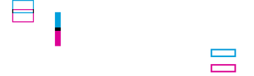
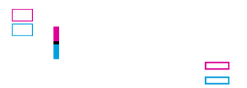
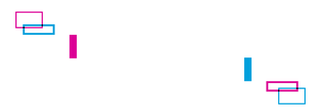
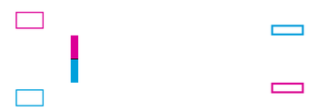

<!-- Generated by Bazel from cached render/comparison actions. -->

# labelary versus printer

Black = matching ink; magenta = printer only; cyan = library only. Compact previews share a common origin and crop only trailing blank space; click for the full-resolution image. Scores always use uncropped original pixels.

Printer and Labelary captures retain their original capture dates. Local renders are cached independently; execution timestamps are recorded per result in results.json.

[Corpus comparisons](../README.md) · [All accuracy comparisons](../../../README.md)

| Case | Group | Result | Difference |
|---|---|---|---|
| [layout-control](../../cases/layout-accuracy-layout-control.md) | font-free-layout | rendered · 100.00% IoU · exact |  |
| [layout-home](../../cases/layout-accuracy-layout-home.md) | font-free-layout | rendered · 100.00% IoU · exact |  |
| [layout-home-direct](../../cases/layout-accuracy-layout-home-direct.md) | font-free-layout | rendered · 100.00% IoU · exact |  |
| [layout-LS--80](../../cases/layout-accuracy-layout-LS--80.md) | font-free-layout | rendered · 100.00% IoU · exact |  |
| [layout-LS-80](../../cases/layout-accuracy-layout-LS-80.md) | font-free-layout | rendered · 100.00% IoU · exact |  |
| [layout-LT--50](../../cases/layout-accuracy-layout-LT--50.md) | font-free-layout | rendered · 5.39% IoU |  |
| [layout-LT-50](../../cases/layout-accuracy-layout-LT-50.md) | font-free-layout | rendered · 3.87% IoU |  |
| [layout-offset-combined](../../cases/layout-accuracy-layout-offset-combined.md) | font-free-layout | rendered · 31.26% IoU |  |
| [layout-transform-Y-N](../../cases/layout-accuracy-layout-transform-Y-N.md) | font-free-layout | rendered · 0.00% IoU |  |
| [layout-transform-N-I](../../cases/layout-accuracy-layout-transform-N-I.md) | font-free-layout | rendered · 1.08% IoU |  |
| [layout-transform-Y-I](../../cases/layout-accuracy-layout-transform-Y-I.md) | font-free-layout | rendered · 0.68% IoU |  |
| [layout-clip-last-pixel](../../cases/layout-accuracy-layout-clip-last-pixel.md) | font-free-layout | rendered · 100.00% IoU · exact |  |
| [layout-clip-partial](../../cases/layout-accuracy-layout-clip-partial.md) | font-free-layout | rendered · 100.00% IoU · exact |  |
| [layout-clip-outside](../../cases/layout-accuracy-layout-clip-outside.md) | font-free-layout | rendered · 100.00% IoU · exact |  |
| [layout-label-reverse](../../cases/layout-accuracy-layout-label-reverse.md) | font-free-layout | rendered · 100.00% IoU · exact |  |
| [layout-field-reverse](../../cases/layout-accuracy-layout-field-reverse.md) | font-free-layout | rendered · 100.00% IoU · exact |  |
| [layout-field-orientation-N](../../cases/layout-accuracy-layout-field-orientation-N.md) | font-free-layout | rendered · 100.00% IoU · exact |  |
| [layout-field-orientation-R](../../cases/layout-accuracy-layout-field-orientation-R.md) | font-free-layout | rendered · 100.00% IoU · exact |  |
| [layout-field-orientation-I](../../cases/layout-accuracy-layout-field-orientation-I.md) | font-free-layout | rendered · 100.00% IoU · exact |  |
| [layout-field-orientation-B](../../cases/layout-accuracy-layout-field-orientation-B.md) | font-free-layout | rendered · 100.00% IoU · exact |  |
