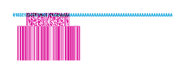

<!-- Generated by benchmarks/accuracy/gallery.py. -->

# go-zpl (Go) versus printer previews

[All comparisons](../README.md) · [Accuracy scores](../../README.md)

Black = matching ink; magenta = printer only; cyan = library only. Compact previews share a common origin and crop only trailing blank space; click for the full-resolution image. Scores always use uncropped original pixels.

[Feature fixture differences](../features/libraries/go.md) · [External example differences](../external/libraries/go.md)

All 133 cases were attempted. Select a case to compare images and inspect any error.

## barcode-arguments

| Compare images | Result | Difference | Arguments |
| --- | --- | --- | --- |
| [code39-ratio-2](../cases/argument-code39-ratio-2.md#go) | 9.0% IoU |  | w=2,ratio=2,height=60 |
| [code39-ratio-3](../cases/argument-code39-ratio-3.md#go) | 7.8% IoU |  | w=2,ratio=3,height=60 |
| [code39-check-N](../cases/argument-code39-check-N.md#go) | 7.8% IoU |  | o=N,check=N,h=60,readable=N |
| [code39-check-Y](../cases/argument-code39-check-Y.md#go) | 7.3% IoU |  | o=N,check=Y,h=60,readable=N |
| [code128-text-NN](../cases/argument-code128-text-NN.md#go) | 100.0% IoU · exact |  | h=60,interpretation=N,above=N |
| [code128-text-YN](../cases/argument-code128-text-YN.md#go) | 91.7% IoU |  | h=60,interpretation=Y,above=N |
| [code128-text-YY](../cases/argument-code128-text-YY.md#go) | 91.5% IoU |  | h=60,interpretation=Y,above=Y |
| [code128-rotation-R](../cases/argument-code128-rotation-R.md#go) | 8.7% IoU |  | o=R,h=60 |
| [code128-rotation-I](../cases/argument-code128-rotation-I.md#go) | 36.4% IoU |  | o=I,h=60 |
| [code128-rotation-B](../cases/argument-code128-rotation-B.md#go) | 11.9% IoU |  | o=B,h=60 |
| [code128-mode-N](../cases/argument-code128-mode-N.md#go) | 100.0% IoU · exact |  | mode=N |
| [code128-mode-A](../cases/argument-code128-mode-A.md#go) | 100.0% IoU · exact |  | mode=A |
| [qr-model-1](../cases/argument-qr-model-1.md#go) | 0.0% IoU |  | o=N,model=1,magnification=3,EC=L,mask=0 |
| [qr-model-2](../cases/argument-qr-model-2.md#go) | 0.0% IoU |  | o=N,model=2,magnification=3,EC=L,mask=0 |
| [qr-ec-L](../cases/argument-qr-ec-L.md#go) | 0.0% IoU |  | model=2,magnification=3,EC=L,mask=0 |
| [qr-ec-M](../cases/argument-qr-ec-M.md#go) | 0.0% IoU |  | model=2,magnification=3,EC=M,mask=0 |
| [qr-ec-Q](../cases/argument-qr-ec-Q.md#go) | 0.0% IoU |  | model=2,magnification=3,EC=Q,mask=0 |
| [qr-ec-H](../cases/argument-qr-ec-H.md#go) | 0.0% IoU |  | model=2,magnification=3,EC=H,mask=0 |
| [qr-module-2](../cases/argument-qr-module-2.md#go) | 0.0% IoU |  | magnification=2 |
| [qr-module-5](../cases/argument-qr-module-5.md#go) | 6.8% IoU |  | magnification=5 |
| [qr-mask-0](../cases/argument-qr-mask-0.md#go) | 0.0% IoU |  | mask=0 |
| [qr-mask-3](../cases/argument-qr-mask-3.md#go) | 0.0% IoU |  | mask=3 |
| [qr-mask-7](../cases/argument-qr-mask-7.md#go) | 0.0% IoU |  | mask=7 |
| [datamatrix-module-2](../cases/argument-datamatrix-module-2.md#go) | 100.0% IoU · exact |  | o=N,module=2,quality=200 |
| [datamatrix-module-4](../cases/argument-datamatrix-module-4.md#go) | 100.0% IoU · exact |  | o=N,module=4,quality=200 |

## barcode-formats

| Compare images | Result | Difference | Arguments |
| --- | --- | --- | --- |
| [aztec](../cases/barcode-aztec.md#go) | 100.0% IoU · exact |  | See exact archived ZPL |
| [aztec_alias](../cases/barcode-aztec_alias.md#go) | 13.0% IoU |  | See exact archived ZPL |
| [aztec_rune](../cases/barcode-aztec_rune.md#go) | 28.4% IoU |  | See exact archived ZPL |
| [codabar](../cases/barcode-codabar.md#go) | 4.3% IoU |  | See exact archived ZPL |
| [codablock_a](../cases/barcode-codablock_a.md#go) | 5.8% IoU |  | See exact archived ZPL |
| [codablock_e](../cases/barcode-codablock_e.md#go) | 13.9% IoU |  | See exact archived ZPL |
| [codablock_f](../cases/barcode-codablock_f.md#go) | 12.9% IoU |  | See exact archived ZPL |
| [code11](../cases/barcode-code11.md#go) | 4.6% IoU |  | See exact archived ZPL |
| [code128](../cases/barcode-code128.md#go) | 100.0% IoU · exact |  | See exact archived ZPL |
| [code39](../cases/barcode-code39.md#go) | 2.7% IoU |  | See exact archived ZPL |
| [code49](../cases/barcode-code49.md#go) | 7.1% IoU |  | See exact archived ZPL |
| [code93](../cases/barcode-code93.md#go) | 4.2% IoU |  | See exact archived ZPL |
| [composite_a](../cases/barcode-composite_a.md#go) | 2.8% IoU |  | See exact archived ZPL |
| [composite_b](../cases/barcode-composite_b.md#go) | 2.2% IoU |  | See exact archived ZPL |
| [composite_c](../cases/barcode-composite_c.md#go) | 3.2% IoU |  | See exact archived ZPL |
| [data_matrix](../cases/barcode-data_matrix.md#go) | 47.0% IoU |  | See exact archived ZPL |
| [data_matrix_rectangular](../cases/barcode-data_matrix_rectangular.md#go) | 17.3% IoU |  | See exact archived ZPL |
| [databar_ean13](../cases/barcode-databar_ean13.md#go) | 3.3% IoU |  | See exact archived ZPL |
| [databar_ean8](../cases/barcode-databar_ean8.md#go) | 3.2% IoU |  | See exact archived ZPL |
| [databar_expanded](../cases/barcode-databar_expanded.md#go) | 7.3% IoU |  | See exact archived ZPL |
| [databar_expanded_stacked](../cases/barcode-databar_expanded_stacked.md#go) | 8.2% IoU |  | See exact archived ZPL |
| [databar_limited](../cases/barcode-databar_limited.md#go) | 26.2% IoU |  | See exact archived ZPL |
| [databar_omni](../cases/barcode-databar_omni.md#go) | 8.7% IoU |  | See exact archived ZPL |
| [databar_stacked](../cases/barcode-databar_stacked.md#go) | 22.6% IoU |  | See exact archived ZPL |
| [databar_stacked_omni](../cases/barcode-databar_stacked_omni.md#go) | 6.6% IoU |  | See exact archived ZPL |
| [databar_truncated](../cases/barcode-databar_truncated.md#go) | 19.4% IoU |  | See exact archived ZPL |
| [databar_upca](../cases/barcode-databar_upca.md#go) | 2.9% IoU |  | See exact archived ZPL |
| [databar_upce](../cases/barcode-databar_upce.md#go) | Blank printer reference; unscored |  | See exact archived ZPL |
| [ean13](../cases/barcode-ean13.md#go) | 6.3% IoU |  | See exact archived ZPL |
| [ean8](../cases/barcode-ean8.md#go) | 4.8% IoU |  | See exact archived ZPL |
| [extension2](../cases/barcode-extension2.md#go) | 6.4% IoU |  | See exact archived ZPL |
| [extension5](../cases/barcode-extension5.md#go) | 3.4% IoU |  | See exact archived ZPL |
| [industrial2of5](../cases/barcode-industrial2of5.md#go) | 3.8% IoU |  | See exact archived ZPL |
| [intelligent_mail](../cases/barcode-intelligent_mail.md#go) | 5.0% IoU |  | See exact archived ZPL |
| [interleaved2of5](../cases/barcode-interleaved2of5.md#go) | 5.5% IoU |  | See exact archived ZPL |
| [logmars](../cases/barcode-logmars.md#go) | 3.2% IoU |  | See exact archived ZPL |
| [maxicode2](../cases/barcode-maxicode2.md#go) | 22.1% IoU |  | See exact archived ZPL |
| [maxicode3](../cases/barcode-maxicode3.md#go) | 21.3% IoU |  | See exact archived ZPL |
| [maxicode4](../cases/barcode-maxicode4.md#go) | 24.0% IoU |  | See exact archived ZPL |
| [maxicode5](../cases/barcode-maxicode5.md#go) | 10.5% IoU |  | See exact archived ZPL |
| [maxicode6](../cases/barcode-maxicode6.md#go) | 23.8% IoU |  | See exact archived ZPL |
| [micropdf417_1](../cases/barcode-micropdf417_1.md#go) | 3.4% IoU |  | See exact archived ZPL |
| [micropdf417_3](../cases/barcode-micropdf417_3.md#go) | 2.9% IoU |  | See exact archived ZPL |
| [micropdf417_4](../cases/barcode-micropdf417_4.md#go) | 2.4% IoU |  | See exact archived ZPL |
| [msi_a](../cases/barcode-msi_a.md#go) | 3.4% IoU |  | See exact archived ZPL |
| [msi_b](../cases/barcode-msi_b.md#go) | 3.0% IoU |  | See exact archived ZPL |
| [msi_c](../cases/barcode-msi_c.md#go) | 2.8% IoU |  | See exact archived ZPL |
| [msi_d](../cases/barcode-msi_d.md#go) | 2.8% IoU |  | See exact archived ZPL |
| [pdf417](../cases/barcode-pdf417.md#go) | 100.0% IoU · exact |  | See exact archived ZPL |
| [pdf417_truncated](../cases/barcode-pdf417_truncated.md#go) | 73.0% IoU |  | See exact archived ZPL |
| [planet](../cases/barcode-planet.md#go) | 3.2% IoU |  | See exact archived ZPL |
| [plessey](../cases/barcode-plessey.md#go) | 2.7% IoU |  | See exact archived ZPL |
| [postal_planet](../cases/barcode-postal_planet.md#go) | 3.2% IoU |  | See exact archived ZPL |
| [postnet](../cases/barcode-postnet.md#go) | 2.0% IoU |  | See exact archived ZPL |
| [qr](../cases/barcode-qr.md#go) | 8.3% IoU |  | See exact archived ZPL |
| [standard2of5](../cases/barcode-standard2of5.md#go) | 4.1% IoU |  | See exact archived ZPL |
| [tlc39_linear](../cases/barcode-tlc39_linear.md#go) | 3.3% IoU |  | See exact archived ZPL |
| [tlc39_linked](../cases/barcode-tlc39_linked.md#go) | 5.8% IoU |  | See exact archived ZPL |
| [upca](../cases/barcode-upca.md#go) | 6.1% IoU |  | See exact archived ZPL |
| [upce](../cases/barcode-upce.md#go) | 6.0% IoU |  | See exact archived ZPL |

## graphics

| Compare images | Result | Difference | Arguments |
| --- | --- | --- | --- |
| [graphic-hex](../cases/argument-graphic-hex.md#go) | 100.0% IoU · exact |  | A,8,8,1; raw hex |
| [graphic-binary](../cases/argument-graphic-binary.md#go) | 100.0% IoU · exact |  | B,8,8,1; ASCII binary bytes |
| [graphic-B64](../cases/argument-graphic-B64.md#go) | 100.0% IoU · exact |  | A,8,8,1; B64, CRC16 |
| [graphic-Z64](../cases/argument-graphic-Z64.md#go) | 100.0% IoU · exact |  | A,8,8,1; Z64, CRC16 |

## layout

| Compare images | Result | Difference | Arguments |
| --- | --- | --- | --- |
| [fo-justify-0](../cases/argument-fo-justify-0.md#go) | 85.0% IoU |  | x=220,y=80,z=0 |
| [fo-justify-1](../cases/argument-fo-justify-1.md#go) | 0.0% IoU |  | x=220,y=80,z=1 |
| [fo-justify-2](../cases/argument-fo-justify-2.md#go) | 85.0% IoU |  | x=220,y=80,z=2 |
| [ft-baseline](../cases/argument-ft-baseline.md#go) | 85.0% IoU |  | x=80,y=100 |
| [layout-LH](../cases/argument-layout-LH.md#go) | 77.2% IoU |  | 30,20 |
| [layout-LS](../cases/argument-layout-LS.md#go) | 24.5% IoU |  | 20 |
| [layout-LT](../cases/argument-layout-LT.md#go) | 77.2% IoU |  | 20 |
| [layout-PO](../cases/argument-layout-PO.md#go) | 77.2% IoU |  | I |
| [layout-LR](../cases/argument-layout-LR.md#go) | 77.2% IoU |  | Y |
| [layout-FW](../cases/argument-layout-FW.md#go) | 77.2% IoU |  | R |
| [field-reverse](../cases/argument-field-reverse.md#go) | 99.1% IoU |  | reverse current field |

## shapes

| Compare images | Result | Difference | Arguments |
| --- | --- | --- | --- |
| [box-thickness-1](../cases/argument-box-thickness-1.md#go) | 100.0% IoU · exact |  | w=100,h=60,t=1,color=B,round=0 |
| [box-thickness-4](../cases/argument-box-thickness-4.md#go) | 100.0% IoU · exact |  | w=100,h=60,t=4,color=B,round=0 |
| [box-thickness-60](../cases/argument-box-thickness-60.md#go) | 100.0% IoU · exact |  | w=100,h=60,t=60,color=B,round=0 |
| [box-round](../cases/argument-box-round.md#go) | 71.5% IoU |  | round=4 |
| [box-white](../cases/argument-box-white.md#go) | 100.0% IoU · exact |  | color=W |
| [shape-GC-B](../cases/argument-shape-GC-B.md#go) | 68.7% IoU |  | 80,3,B |
| [shape-GE-B](../cases/argument-shape-GE-B.md#go) | 53.3% IoU |  | 120,60,3,B |
| [shape-GD-R](../cases/argument-shape-GD-R.md#go) | 0.6% IoU |  | 120,60,3,B,R |
| [shape-GD-L](../cases/argument-shape-GD-L.md#go) | 0.8% IoU |  | 120,60,3,B,L |

## text

| Compare images | Result | Difference | Arguments |
| --- | --- | --- | --- |
| [font0-height-16](../cases/argument-font0-height-16.md#go) | 81.1% IoU |  | font=0,o=N,h=16,w=0 |
| [font0-height-32](../cases/argument-font0-height-32.md#go) | 85.0% IoU |  | font=0,o=N,h=32,w=0 |
| [font0-height-64](../cases/argument-font0-height-64.md#go) | 89.6% IoU |  | font=0,o=N,h=64,w=0 |
| [font0-width-16](../cases/argument-font0-width-16.md#go) | 42.3% IoU |  | font=0,o=N,h=32,w=16 |
| [font0-width-32](../cases/argument-font0-width-32.md#go) | 85.0% IoU |  | font=0,o=N,h=32,w=32 |
| [font0-width-64](../cases/argument-font0-width-64.md#go) | 62.1% IoU |  | font=0,o=N,h=32,w=64 |
| [font0-rotation-N](../cases/argument-font0-rotation-N.md#go) | 77.2% IoU |  | font=0,o=N,h=32,w=0 |
| [font0-rotation-R](../cases/argument-font0-rotation-R.md#go) | 77.2% IoU |  | font=0,o=R,h=32,w=0 |
| [font0-rotation-I](../cases/argument-font0-rotation-I.md#go) | 65.1% IoU |  | font=0,o=I,h=32,w=0 |
| [font0-rotation-B](../cases/argument-font0-rotation-B.md#go) | 65.1% IoU |  | font=0,o=B,h=32,w=0 |
| [font-A](../cases/argument-font-A.md#go) | 8.6% IoU |  | font=A,o=N,h=32,w=24 |
| [font-D](../cases/argument-font-D.md#go) | 12.6% IoU |  | font=D,o=N,h=32,w=24 |
| [block-L](../cases/argument-block-L.md#go) | 75.1% IoU |  | w=220,lines=3,space=2,align=L,indent=0 |
| [block-C](../cases/argument-block-C.md#go) | 27.5% IoU |  | w=220,lines=3,space=2,align=C,indent=0 |
| [block-R](../cases/argument-block-R.md#go) | 39.1% IoU |  | w=220,lines=3,space=2,align=R,indent=0 |
| [block-J](../cases/argument-block-J.md#go) | 47.6% IoU |  | w=220,lines=3,space=2,align=J,indent=0 |
| [block-indent](../cases/argument-block-indent.md#go) | 47.2% IoU |  | indent=20 |
| [block-explicit-break](../cases/argument-block-explicit-break.md#go) | 72.0% IoU |  | explicit \& break |
| [field-hex](../cases/argument-field-hex.md#go) | 77.2% IoU |  | indicator=_, bytes _41_42_43 |
| [variable-data](../cases/argument-variable-data.md#go) | 77.2% IoU |  | literal field value |
| [encoding-0](../cases/argument-encoding-0.md#go) | 73.5% IoU |  | encoding=0 |
| [encoding-27](../cases/argument-encoding-27.md#go) | 73.5% IoU |  | encoding=27 |
| [encoding-28](../cases/argument-encoding-28.md#go) | 73.5% IoU |  | encoding=28 |
| [utf8-accent](../cases/argument-utf8-accent.md#go) | 71.6% IoU |  | encoding=28; UTF-8 é |
