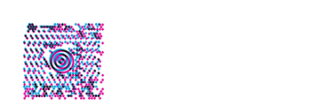
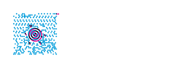

<!-- Generated by Bazel from cached render/comparison actions. -->

# labelary versus printer

Black = matching ink; magenta = printer only; cyan = library only. Compact previews share a common origin and crop only trailing blank space; click for the full-resolution image. Scores always use uncropped original pixels.

Printer and Labelary captures retain their original capture dates. Local renders are cached independently; execution timestamps are recorded per result in results.json.

[All comparisons](../README.md) · [Accuracy summary](../../README.md)

| Case | Group | Result | Difference |
|---|---|---|---|
| [argument-font0-height-16](../cases/argument-font0-height-16.md) | text | rendered · 64.47% IoU |  |
| [argument-font0-height-32](../cases/argument-font0-height-32.md) | text | rendered · 73.93% IoU |  |
| [argument-font0-height-64](../cases/argument-font0-height-64.md) | text | rendered · 80.41% IoU |  |
| [argument-font0-width-16](../cases/argument-font0-width-16.md) | text | rendered · 65.46% IoU |  |
| [argument-font0-width-32](../cases/argument-font0-width-32.md) | text | rendered · 73.93% IoU |  |
| [argument-font0-width-64](../cases/argument-font0-width-64.md) | text | rendered · 79.08% IoU |  |
| [argument-font0-rotation-N](../cases/argument-font0-rotation-N.md) | text | rendered · 83.42% IoU |  |
| [argument-font0-rotation-R](../cases/argument-font0-rotation-R.md) | text | rendered · 76.58% IoU |  |
| [argument-font0-rotation-I](../cases/argument-font0-rotation-I.md) | text | rendered · 76.58% IoU |  |
| [argument-font0-rotation-B](../cases/argument-font0-rotation-B.md) | text | rendered · 83.42% IoU |  |
| [argument-font-A](../cases/argument-font-A.md) | text | rendered · 53.12% IoU |  |
| [argument-font-D](../cases/argument-font-D.md) | text | rendered · 55.96% IoU |  |
| [argument-fo-justify-0](../cases/argument-fo-justify-0.md) | layout | rendered · 73.93% IoU |  |
| [argument-fo-justify-1](../cases/argument-fo-justify-1.md) | layout | rendered · 37.90% IoU |  |
| [argument-fo-justify-2](../cases/argument-fo-justify-2.md) | layout | rendered · 73.93% IoU |  |
| [argument-ft-baseline](../cases/argument-ft-baseline.md) | layout | rendered · 73.93% IoU |  |
| [argument-layout-LH](../cases/argument-layout-LH.md) | layout | rendered · 83.42% IoU |  |
| [argument-layout-LS](../cases/argument-layout-LS.md) | layout | rendered · 83.42% IoU |  |
| [argument-layout-LT](../cases/argument-layout-LT.md) | layout | rendered · 6.49% IoU |  |
| [argument-layout-PO](../cases/argument-layout-PO.md) | layout | rendered · 0.00% IoU |  |
| [argument-layout-LR](../cases/argument-layout-LR.md) | layout | rendered · 82.89% IoU |  |
| [argument-layout-FW](../cases/argument-layout-FW.md) | layout | rendered · 76.58% IoU |  |
| [argument-field-reverse](../cases/argument-field-reverse.md) | layout | rendered · 97.84% IoU |  |
| [argument-block-L](../cases/argument-block-L.md) | text | rendered · 67.48% IoU |  |
| [argument-block-C](../cases/argument-block-C.md) | text | rendered · 72.67% IoU |  |
| [argument-block-R](../cases/argument-block-R.md) | text | rendered · 41.03% IoU |  |
| [argument-block-J](../cases/argument-block-J.md) | text | rendered · 82.39% IoU |  |
| [argument-block-indent](../cases/argument-block-indent.md) | text | rendered · 67.48% IoU |  |
| [argument-block-explicit-break](../cases/argument-block-explicit-break.md) | text | rendered · 77.91% IoU |  |
| [argument-field-hex](../cases/argument-field-hex.md) | text | rendered · 83.42% IoU |  |
| [argument-variable-data](../cases/argument-variable-data.md) | text | rendered · 83.42% IoU |  |
| [argument-encoding-0](../cases/argument-encoding-0.md) | text | rendered · 83.72% IoU |  |
| [argument-encoding-27](../cases/argument-encoding-27.md) | text | rendered · 83.72% IoU |  |
| [argument-encoding-28](../cases/argument-encoding-28.md) | text | rendered · 83.72% IoU |  |
| [argument-utf8-accent](../cases/argument-utf8-accent.md) | text | rendered · 82.34% IoU |  |
| [argument-box-thickness-1](../cases/argument-box-thickness-1.md) | shapes | rendered · 100.00% IoU · exact |  |
| [argument-box-thickness-4](../cases/argument-box-thickness-4.md) | shapes | rendered · 100.00% IoU · exact |  |
| [argument-box-thickness-60](../cases/argument-box-thickness-60.md) | shapes | rendered · 100.00% IoU · exact |  |
| [argument-box-round](../cases/argument-box-round.md) | shapes | rendered · 93.05% IoU |  |
| [argument-box-white](../cases/argument-box-white.md) | shapes | rendered · 100.00% IoU · exact |  |
| [argument-shape-GC-B](../cases/argument-shape-GC-B.md) | shapes | rendered · 63.31% IoU |  |
| [argument-shape-GE-B](../cases/argument-shape-GE-B.md) | shapes | rendered · 50.45% IoU |  |
| [argument-shape-GD-R](../cases/argument-shape-GD-R.md) | shapes | rendered · 50.00% IoU |  |
| [argument-shape-GD-L](../cases/argument-shape-GD-L.md) | shapes | rendered · 50.00% IoU |  |
| [argument-graphic-hex](../cases/argument-graphic-hex.md) | graphics | rendered · 100.00% IoU · exact |  |
| [argument-graphic-binary](../cases/argument-graphic-binary.md) | graphics | rendered · 100.00% IoU · exact |  |
| [argument-graphic-B64](../cases/argument-graphic-B64.md) | graphics | rendered · 100.00% IoU · exact |  |
| [argument-graphic-Z64](../cases/argument-graphic-Z64.md) | graphics | rendered · 100.00% IoU · exact |  |
| [argument-code39-ratio-2](../cases/argument-code39-ratio-2.md) | barcode-arguments | rendered · 100.00% IoU · exact |  |
| [argument-code39-ratio-3](../cases/argument-code39-ratio-3.md) | barcode-arguments | rendered · 100.00% IoU · exact |  |
| [argument-code39-check-N](../cases/argument-code39-check-N.md) | barcode-arguments | rendered · 100.00% IoU · exact |  |
| [argument-code39-check-Y](../cases/argument-code39-check-Y.md) | barcode-arguments | rendered · 100.00% IoU · exact |  |
| [argument-code128-text-NN](../cases/argument-code128-text-NN.md) | barcode-arguments | rendered · 100.00% IoU · exact |  |
| [argument-code128-text-YN](../cases/argument-code128-text-YN.md) | barcode-arguments | rendered · 95.99% IoU |  |
| [argument-code128-text-YY](../cases/argument-code128-text-YY.md) | barcode-arguments | rendered · 95.99% IoU |  |
| [argument-code128-rotation-R](../cases/argument-code128-rotation-R.md) | barcode-arguments | rendered · 100.00% IoU · exact |  |
| [argument-code128-rotation-I](../cases/argument-code128-rotation-I.md) | barcode-arguments | rendered · 100.00% IoU · exact |  |
| [argument-code128-rotation-B](../cases/argument-code128-rotation-B.md) | barcode-arguments | rendered · 100.00% IoU · exact |  |
| [argument-code128-mode-N](../cases/argument-code128-mode-N.md) | barcode-arguments | rendered · 100.00% IoU · exact |  |
| [argument-code128-mode-A](../cases/argument-code128-mode-A.md) | barcode-arguments | rendered · 100.00% IoU · exact |  |
| [argument-qr-model-1](../cases/argument-qr-model-1.md) | barcode-arguments | blank · 0.00% IoU |  |
| [argument-qr-model-2](../cases/argument-qr-model-2.md) | barcode-arguments | rendered · 52.46% IoU |  |
| [argument-qr-ec-L](../cases/argument-qr-ec-L.md) | barcode-arguments | rendered · 52.46% IoU |  |
| [argument-qr-ec-M](../cases/argument-qr-ec-M.md) | barcode-arguments | rendered · 49.17% IoU |  |
| [argument-qr-ec-Q](../cases/argument-qr-ec-Q.md) | barcode-arguments | rendered · 51.17% IoU |  |
| [argument-qr-ec-H](../cases/argument-qr-ec-H.md) | barcode-arguments | rendered · 70.56% IoU |  |
| [argument-qr-module-2](../cases/argument-qr-module-2.md) | barcode-arguments | rendered · 48.01% IoU |  |
| [argument-qr-module-5](../cases/argument-qr-module-5.md) | barcode-arguments | rendered · 56.23% IoU |  |
| [argument-qr-mask-0](../cases/argument-qr-mask-0.md) | barcode-arguments | rendered · 52.46% IoU |  |
| [argument-qr-mask-3](../cases/argument-qr-mask-3.md) | barcode-arguments | rendered · 52.46% IoU |  |
| [argument-qr-mask-7](../cases/argument-qr-mask-7.md) | barcode-arguments | rendered · 52.46% IoU |  |
| [argument-datamatrix-module-2](../cases/argument-datamatrix-module-2.md) | barcode-arguments | rendered · 100.00% IoU · exact |  |
| [argument-datamatrix-module-4](../cases/argument-datamatrix-module-4.md) | barcode-arguments | rendered · 100.00% IoU · exact |  |
| [barcode-aztec](../cases/barcode-aztec.md) | barcode-formats | rendered · 100.00% IoU · exact |  |
| [barcode-aztec_alias](../cases/barcode-aztec_alias.md) | barcode-formats | rendered · 100.00% IoU · exact |  |
| [barcode-aztec_rune](../cases/barcode-aztec_rune.md) | barcode-formats | rendered · 100.00% IoU · exact |  |
| [barcode-codabar](../cases/barcode-codabar.md) | barcode-formats | rendered · 100.00% IoU · exact |  |
| [barcode-codablock_a](../cases/barcode-codablock_a.md) | barcode-formats | rendered · 5.38% IoU |  |
| [barcode-codablock_e](../cases/barcode-codablock_e.md) | barcode-formats | rendered · 11.80% IoU |  |
| [barcode-codablock_f](../cases/barcode-codablock_f.md) | barcode-formats | rendered · 11.00% IoU |  |
| [barcode-code11](../cases/barcode-code11.md) | barcode-formats | rendered · 42.47% IoU |  |
| [barcode-code128](../cases/barcode-code128.md) | barcode-formats | rendered · 100.00% IoU · exact |  |
| [barcode-code39](../cases/barcode-code39.md) | barcode-formats | rendered · 100.00% IoU · exact |  |
| [barcode-code49](../cases/barcode-code49.md) | barcode-formats | rendered · 5.84% IoU |  |
| [barcode-code93](../cases/barcode-code93.md) | barcode-formats | rendered · 100.00% IoU · exact |  |
| [barcode-composite_a](../cases/barcode-composite_a.md) | barcode-formats | rendered · 95.16% IoU |  |
| [barcode-composite_b](../cases/barcode-composite_b.md) | barcode-formats | rendered · 81.54% IoU |  |
| [barcode-composite_c](../cases/barcode-composite_c.md) | barcode-formats | rendered · 100.00% IoU · exact |  |
| [barcode-data_matrix](../cases/barcode-data_matrix.md) | barcode-formats | rendered · 64.73% IoU |  |
| [barcode-data_matrix_rectangular](../cases/barcode-data_matrix_rectangular.md) | barcode-formats | rendered · 100.00% IoU · exact |  |
| [barcode-databar_ean13](../cases/barcode-databar_ean13.md) | barcode-formats | rendered · 100.00% IoU · exact |  |
| [barcode-databar_ean8](../cases/barcode-databar_ean8.md) | barcode-formats | rendered · 100.00% IoU · exact |  |
| [barcode-databar_expanded](../cases/barcode-databar_expanded.md) | barcode-formats | rendered · 100.00% IoU · exact |  |
| [barcode-databar_expanded_stacked](../cases/barcode-databar_expanded_stacked.md) | barcode-formats | rendered · 100.00% IoU · exact |  |
| [barcode-databar_limited](../cases/barcode-databar_limited.md) | barcode-formats | rendered · 100.00% IoU · exact |  |
| [barcode-databar_omni](../cases/barcode-databar_omni.md) | barcode-formats | rendered · 100.00% IoU · exact |  |
| [barcode-databar_stacked](../cases/barcode-databar_stacked.md) | barcode-formats | rendered · 100.00% IoU · exact |  |
| [barcode-databar_stacked_omni](../cases/barcode-databar_stacked_omni.md) | barcode-formats | rendered · 100.00% IoU · exact |  |
| [barcode-databar_truncated](../cases/barcode-databar_truncated.md) | barcode-formats | rendered · 100.00% IoU · exact |  |
| [barcode-databar_upca](../cases/barcode-databar_upca.md) | barcode-formats | rendered · 100.00% IoU · exact |  |
| [barcode-databar_upce](../cases/barcode-databar_upce.md) | barcode-formats | blank · unscored · exact |  |
| [barcode-ean13](../cases/barcode-ean13.md) | barcode-formats | rendered · 100.00% IoU · exact |  |
| [barcode-ean8](../cases/barcode-ean8.md) | barcode-formats | rendered · 100.00% IoU · exact |  |
| [barcode-extension2](../cases/barcode-extension2.md) | barcode-formats | rendered · 100.00% IoU · exact |  |
| [barcode-extension5](../cases/barcode-extension5.md) | barcode-formats | rendered · 100.00% IoU · exact |  |
| [barcode-industrial2of5](../cases/barcode-industrial2of5.md) | barcode-formats | rendered · 100.00% IoU · exact |  |
| [barcode-intelligent_mail](../cases/barcode-intelligent_mail.md) | barcode-formats | rendered · 98.27% IoU |  |
| [barcode-interleaved2of5](../cases/barcode-interleaved2of5.md) | barcode-formats | rendered · 100.00% IoU · exact |  |
| [barcode-logmars](../cases/barcode-logmars.md) | barcode-formats | rendered · 97.71% IoU |  |
| [barcode-maxicode2](../cases/barcode-maxicode2.md) | barcode-formats | rendered · 18.74% IoU |  |
| [barcode-maxicode3](../cases/barcode-maxicode3.md) | barcode-formats | rendered · 19.50% IoU |  |
| [barcode-maxicode4](../cases/barcode-maxicode4.md) | barcode-formats | rendered · 18.30% IoU |  |
| [barcode-maxicode5](../cases/barcode-maxicode5.md) | barcode-formats | rendered · 5.47% IoU |  |
| [barcode-maxicode6](../cases/barcode-maxicode6.md) | barcode-formats | rendered · 18.07% IoU |  |
| [barcode-micropdf417_1](../cases/barcode-micropdf417_1.md) | barcode-formats | rendered · 77.27% IoU |  |
| [barcode-micropdf417_3](../cases/barcode-micropdf417_3.md) | barcode-formats | rendered · 67.52% IoU |  |
| [barcode-micropdf417_4](../cases/barcode-micropdf417_4.md) | barcode-formats | rendered · 65.09% IoU |  |
| [barcode-msi_a](../cases/barcode-msi_a.md) | barcode-formats | rendered · 100.00% IoU · exact |  |
| [barcode-msi_b](../cases/barcode-msi_b.md) | barcode-formats | rendered · 100.00% IoU · exact |  |
| [barcode-msi_c](../cases/barcode-msi_c.md) | barcode-formats | rendered · 100.00% IoU · exact |  |
| [barcode-msi_d](../cases/barcode-msi_d.md) | barcode-formats | rendered · 100.00% IoU · exact |  |
| [barcode-pdf417](../cases/barcode-pdf417.md) | barcode-formats | rendered · 75.93% IoU |  |
| [barcode-pdf417_truncated](../cases/barcode-pdf417_truncated.md) | barcode-formats | rendered · 68.50% IoU |  |
| [barcode-planet](../cases/barcode-planet.md) | barcode-formats | rendered · 100.00% IoU · exact |  |
| [barcode-plessey](../cases/barcode-plessey.md) | barcode-formats | rendered · 100.00% IoU · exact |  |
| [barcode-postal_planet](../cases/barcode-postal_planet.md) | barcode-formats | rendered · 100.00% IoU · exact |  |
| [barcode-postnet](../cases/barcode-postnet.md) | barcode-formats | rendered · 100.00% IoU · exact |  |
| [barcode-qr](../cases/barcode-qr.md) | barcode-formats | rendered · 58.63% IoU |  |
| [barcode-standard2of5](../cases/barcode-standard2of5.md) | barcode-formats | rendered · 100.00% IoU · exact |  |
| [barcode-tlc39_linear](../cases/barcode-tlc39_linear.md) | barcode-formats | rendered · 2.03% IoU |  |
| [barcode-tlc39_linked](../cases/barcode-tlc39_linked.md) | barcode-formats | rendered · 5.26% IoU |  |
| [barcode-upca](../cases/barcode-upca.md) | barcode-formats | rendered · 100.00% IoU · exact |  |
| [barcode-upce](../cases/barcode-upce.md) | barcode-formats | rendered · 100.00% IoU · exact |  |
